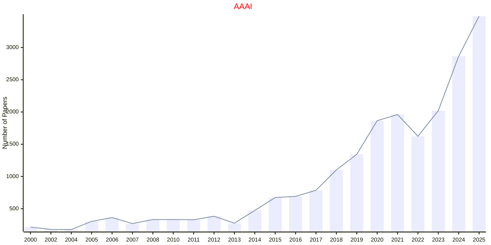
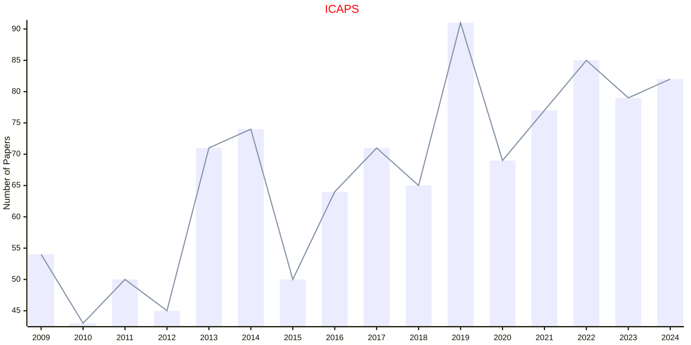
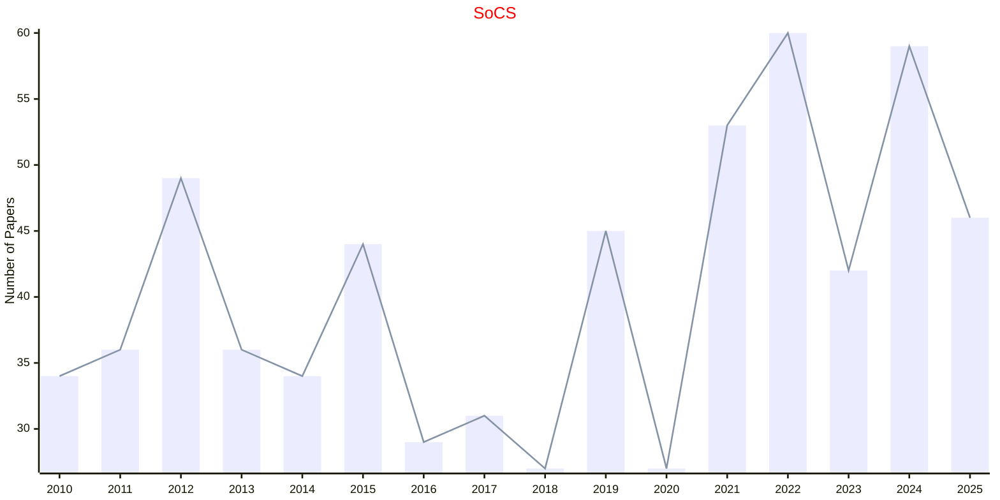

# AAAI

- The data for TOP, CCF, CAS, JCR, and IF are sourced from [easyScholar](https://www.easyscholar.cc/).

## AAAI

|Publishers|Full/Homepage|Abbr/About|Acronym/Archive|Period/DBLP|Top|CCF|Submission|Days Left|Main Conf.|Days Left|Location|Keywords/Google|
|-         |-            |-         |-              |-          |-  |-  |-         |-        |          |-        |-       |-              |
|[AAAI](https://www.aaai.org/)|[AAAI Conference on Artificial Intelligence](https://aaai.org/Conferences/conferences.php)|[Proc. AAAI Conf. Artif. Intell.](https://ojs.aaai.org/index.php/AAAI/about)|[AAAI](https://ojs.aaai.org/index.php/AAAI/issue/archive)|1980 -|True|A|25/07/2025|**{{ diffDate('2025-07-25') }}**|[20/01/2026](https://aaai.org/conference/aaai/aaai-26/)|**{{ diffDate('2026-01-20') }}**|Singapore|[Artificial Intelligence](https://www.google.com/search?q=Artificial+Intelligence)|

## ICAPS

|Publishers|Full/Homepage|Abbr/About|Acronym/Archive|Period/DBLP|Top|CCF|Submission|Days Left|Main Conf.|Days Left|Location|Keywords/Google|
|-         |-            |-         |-              |-          |-  |-  |-         |-        |          |-        |-       |-              |
|[AAAI](https://www.aaai.org/)|[International Conference on Automated Planning and Scheduling](https://www.icaps-conference.org/)|[Proc. Int. Conf. Automat. Plan. Schedul.](https://www.icaps-conference.org/)|[ICAPS](https://ojs.aaai.org/index.php/ICAPS/issue/archive)|1991 -|False|B|01/12/2025|**{{ diffDate('2025-12-01') }}**|[27/06/2026](https://icaps26.icaps-conference.org/)|**{{ diffDate('2026-06-27') }}**|Dublin, Ireland|[Planning and Scheduling](https://www.google.com/search?q=Planning+and+Scheduling)|

## SoCS

|Publishers|Full/Homepage|Abbr/About|Acronym/Archive|Period/DBLP|Top|CCF|Submission|Days Left|Main Conf.|Days Left|Location|Keywords/Google|
|-         |-            |-         |-              |-          |-  |-  |-         |-        |          |-        |-       |-              |
|[AAAI](https://www.aaai.org/)|[Symposium on Combinatorial Search](http://search-conference.org)|Proc. Symp. Comb. Search|[SoCS](https://ojs.aaai.org/index.php/SOCS/issue/archive)|2008 -|False||19/03/2025|**{{ diffDate('2025-03-19') }}**|[12/08/2025](https://socs25.search-conference.org/)|**{{ diffDate('2025-08-12') }}**|Scotland, United Kingdom|[Combinatorial Optimization](https://www.google.com/search?q=Combinatorial+Optimization); [Heuristic Search](https://www.google.com/search?q=Heuristic+Search)|

