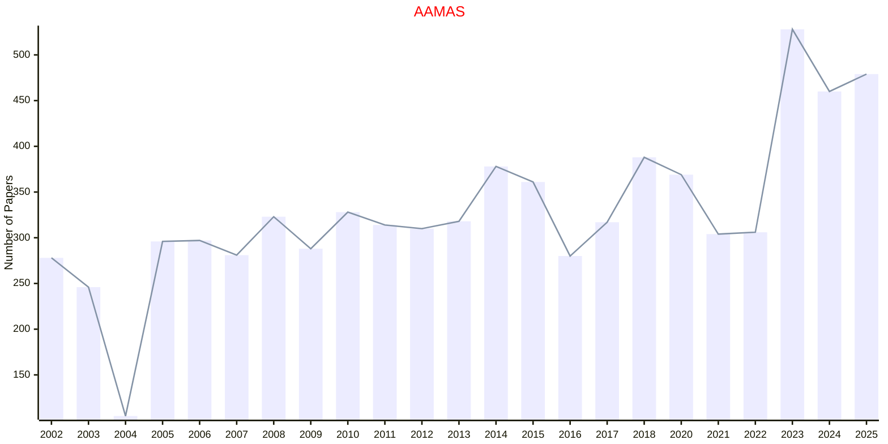
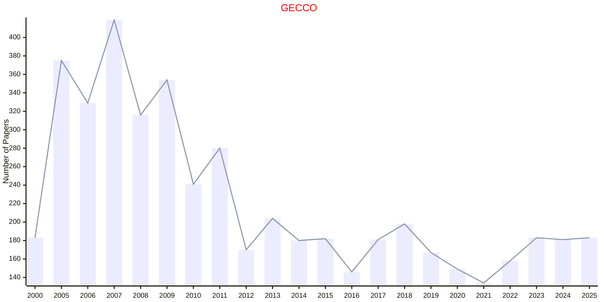
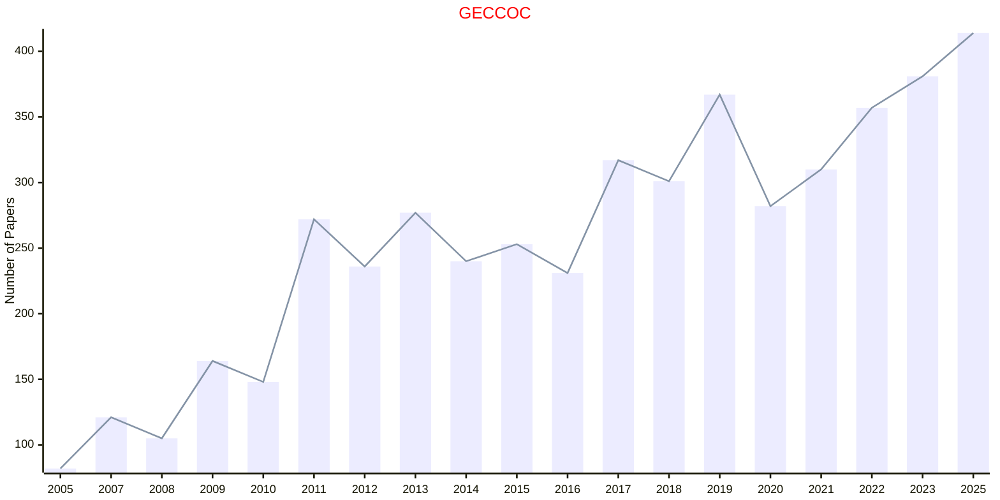
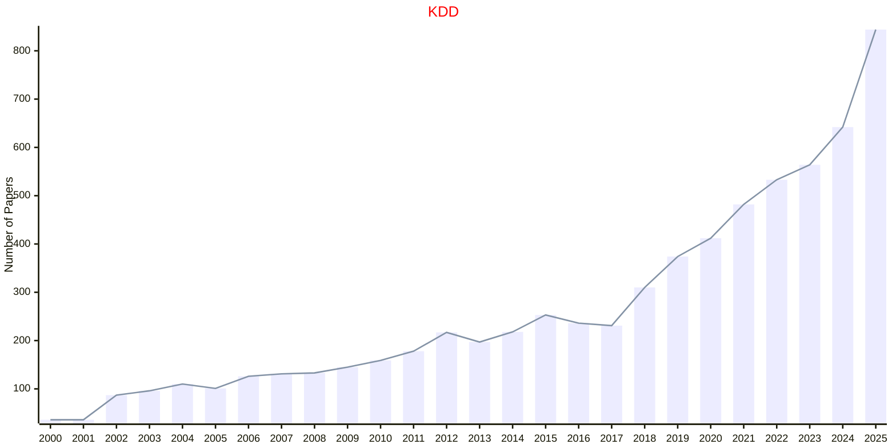

# ACM

- The data for TOP, CCF, CAS, JCR, and IF are sourced from [easyScholar](https://www.easyscholar.cc/).

## AAMAS

|Publishers|Full/Homepage|Abbr/About|Acronym/Archive|Period/DBLP|Top|CCF|Submission|Days Left|Main Conf.|Days Left|Location|Keywords/Google|
|-         |-            |-         |-              |-          |-  |-  |-         |-        |          |-        |-       |-              |
|[ACM](https://www.acm.org/)|[International Conference on Autonomous Agents and Multiagent Systems](https://www.ifaamas.org/)|[Proc. Int. Conf. Auton. Agents Multiagent Syst.](https://www.ifaamas.org/)|[AAMAS](https://dl.acm.org/conference/aamas/proceedings)|2002 -|False|B|01/10/2025|**{{ diffDate('2025-10-01') }}**|[25/05/2026](https://cyprusconferences.org/aamas2026/)|**{{ diffDate('2026-05-25') }}**|Paphos, Cyprus|[Multiagent Systems](https://www.google.com/search?q=Multiagent+Systems)|

## FOGA

|Publishers|Full/Homepage|Abbr/About|Acronym/Archive|Period/DBLP|Top|CCF|Submission|Days Left|Main Conf.|Days Left|Location|Keywords/Google|
|-         |-            |-         |-              |-          |-  |-  |-         |-        |          |-        |-       |-              |
|[ACM](https://www.acm.org/)|[ACM/SIGEVO Conference on Foundations of Genetic Algorithms](https://sig.sigevo.org/FOGAs)|Proc. ACM/SIGEVO Conf. Found. Genet. Algo.|[FOGA](https://dl.acm.org/conference/foga)|1990 -|False||02/05/2025|**{{ diffDate('2025-05-02') }}**|[27/08/2025](https://naco.liacs.nl/foga2025/)|**{{ diffDate('2025-08-27') }}**|Leiden, The Netherlands|[Evolutionary Computation](https://www.google.com/search?q=Evolutionary+Computation)|

## GECCO

|Publishers|Full/Homepage|Abbr/About|Acronym/Archive|Period/DBLP|Top|CCF|Submission|Days Left|Main Conf.|Days Left|Location|Keywords/Google|
|-         |-            |-         |-              |-          |-  |-  |-         |-        |          |-        |-       |-              |
|[ACM](https://www.acm.org/)|[Genetic and Evolutionary Computation Conference](https://dl.acm.org/conference/gecco)|Proc. Genet. Evol. Comput. Conf.|[GECCO](https://dl.acm.org/conference/gecco)|1996 -|False|C|19/01/2026|**{{ diffDate('2026-01-19') }}**|[13/07/2026](https://gecco-2026.sigevo.org/HomePage)|**{{ diffDate('2026-07-13') }}**|San Antonio, Costa Rica|[Evolutionary Computation](https://www.google.com/search?q=Evolutionary+Computation)|

## GECCOC

|Publishers|Full/Homepage|Abbr/About|Acronym/Archive|Period/DBLP|Top|CCF|Submission|Days Left|Main Conf.|Days Left|Location|Keywords/Google|
|-         |-            |-         |-              |-          |-  |-  |-         |-        |          |-        |-       |-              |
|[ACM](https://www.acm.org/)|[Genetic and Evolutionary Computation Conference Companion](https://dl.acm.org/conference/gecco)|Proc. Conf. Comp. Genet. Evol. Comput.|[GECCOC](https://dl.acm.org/conference/gecco)|1996 -|False|C|19/01/2026|**{{ diffDate('2026-01-19') }}**|[13/07/2026](https://gecco-2025.sigevo.org/HomePage)|**{{ diffDate('2026-07-13') }}**|San Antonio, Costa Rica|[Evolutionary Computation](https://www.google.com/search?q=Evolutionary+Computation)|

## KDD

|Publishers|Full/Homepage|Abbr/About|Acronym/Archive|Period/DBLP|Top|CCF|Submission|Days Left|Main Conf.|Days Left|Location|Keywords/Google|
|-         |-            |-         |-              |-          |-  |-  |-         |-        |          |-        |-       |-              |
|[ACM](https://www.acm.org/)|[ACM SIGKDD International Conference on Knowledge Discovery And Data Mining](https://kdd.org)|[Proc. ACM SIGKDD Int. Conf. Knowl. Discovery Data Mining](https://kdd.org/about)|[KDD](https://dlnext.acm.org/conference/kdd/proceedings)|1995 -|True|A|01/02/2026|**{{ diffDate('2026-02-01') }}**|[09/08/2026](https://kdd2026.kdd.org/)|**{{ diffDate('2026-08-09') }}**|Jeju, Korea|[Data Mining](https://www.google.com/search?q=Data+Mining)|

## SIGMOD

|Publishers|Full/Homepage|Abbr/About|Acronym/Archive|Period/DBLP|Top|CCF|Submission|Days Left|Main Conf.|Days Left|Location|Keywords/Google|
|-         |-            |-         |-              |-          |-  |-  |-         |-        |          |-        |-       |-              |
|[ACM](https://www.acm.org/)|[ACM SIGKDD International Conference on Management of Data](https://sigmod.org/)|[Proc. ACM SIGMOD Int. Conf. Manag. Data](https://sigmod.org/about-sigmod/)|[SIGMOD](https://dl.acm.org/conference/mod/proceedings)|1975 -|True|A|10/10/2025|**{{ diffDate('2025-10-10') }}**|[05/06/2026](https://2026.sigmod.org/)|**{{ diffDate('2026-06-05') }}**|Bengaluru, India|[Data Mining](https://www.google.com/search?q=Data+Mining)|

## SODA

|Publishers|Full/Homepage|Abbr/About|Acronym/Archive|Period/DBLP|Top|CCF|Submission|Days Left|Main Conf.|Days Left|Location|Keywords/Google|
|-         |-            |-         |-              |-          |-  |-  |-         |-        |          |-        |-       |-              |
|[ACM](https://www.acm.org/)|[ACM-SIAM Symposium on Discrete Algorithms](https://www.siam.org/conferences-events/siam-conferences)|Proc. ACM-SIAM Symp. Discret. Algo.|SODA|1990 -|True|A|14/07/2015|**{{ diffDate('2015-07-14') }}**|[11/01/2026](https://www.siam.org/conferences-events/siam-conferences/soda26/)|**{{ diffDate('2026-01-11') }}**|Vancouver, Canada|[Discrete Algorithms](https://www.google.com/search?q=Discrete+Algorithms)|

## STOC

|Publishers|Full/Homepage|Abbr/About|Acronym/Archive|Period/DBLP|Top|CCF|Submission|Days Left|Main Conf.|Days Left|Location|Keywords/Google|
|-         |-            |-         |-              |-          |-  |-  |-         |-        |          |-        |-       |-              |
|[ACM](https://www.acm.org/)|[ACM Symposium on Theory of Computing](https://sigact.org/articles/conferences.html)|[Proc. ACM Symp. Theor. Comput.](https://acm-stoc.org/)|[STOC](https://dl.acm.org/conference/stoc)|1969 -|True|A|14/12/2025|**{{ diffDate('2025-12-14') }}**|[22/06/2026](https://acm-stoc.org/stoc2026/)|**{{ diffDate('2026-06-22') }}**|Salt Lake City, Utah, USA|[Computation Theory](https://www.google.com/search?q=Computation+Theory)|

## SoCC

|Publishers|Full/Homepage|Abbr/About|Acronym/Archive|Period/DBLP|Top|CCF|Submission|Days Left|Main Conf.|Days Left|Location|Keywords/Google|
|-         |-            |-         |-              |-          |-  |-  |-         |-        |          |-        |-       |-              |
|[ACM](https://www.acm.org/)|[ACM Symposium On Cloud Computing](https://acmsocc.org/)|Proc. Symp. Cloud Comput.|SoCC|2010 -|False|B|07/07/2025|**{{ diffDate('2025-07-07') }}**|[18/11/2026](https://acmsocc.org/2026/)|**{{ diffDate('2026-11-18') }}**|Singapore|[Cloud Computing](https://www.google.com/search?q=Cloud+Computing)|

## UAI

|Publishers|Full/Homepage|Abbr/About|Acronym/Archive|Period/DBLP|Top|CCF|Submission|Days Left|Main Conf.|Days Left|Location|Keywords/Google|
|-         |-            |-         |-              |-          |-  |-  |-         |-        |          |-        |-       |-              |
|[ACM](https://www.acm.org/)|[Conference on Uncertainty in Artificial Intelligence](https://www.auai.org/)|Proc. Conf. Uncert. Artif. Intell.|[UAI](https://dl.acm.org/conference/uai)|1985 -|False|B|25/02/2026|**{{ diffDate('2026-02-25') }}**|[17/08/2026](https://www.auai.org/uai2026/)|**{{ diffDate('2026-08-17') }}**|Amsterdam, Netherlands|[Artificial Intelligence](https://www.google.com/search?q=Artificial+Intelligence); [Uncertainty](https://www.google.com/search?q=Uncertainty)|

