# IEEE

- The data for TOP, CCF, CAS, JCR, and IF are sourced from [easyScholar](https://www.easyscholar.cc/).

## CEC

|Publishers|Full/Homepage|Abbr/About|Acronym/Archive|Period/DBLP|Top|CCF|Submission|Days Left|Main Conf.|Days Left|Location|Keywords/Google|
|-         |-            |-         |-              |-          |-  |-  |-         |-        |          |-        |-       |-              |
|[IEEE](https://ieeexplore.ieee.org/)|IEEE Congress on Evolutionary Computation|Proc. IEEE Congr. Evol. Comput.|[CEC](https://ieeexplore.ieee.org/xpl/conhome/1000284/all-proceedings)|[1999 -](https://dblp.org/db/conf/cec/index.html)|False||31/01/2026|**{{ diffDate('2026-01-31') }}**|[21/06/2026](https://attend.ieee.org/wcci-2026/)|**{{ diffDate('2026-06-21') }}**|Maastricht|[Evolutionary Computation](https://www.google.com/search?q=Evolutionary+Computation)|

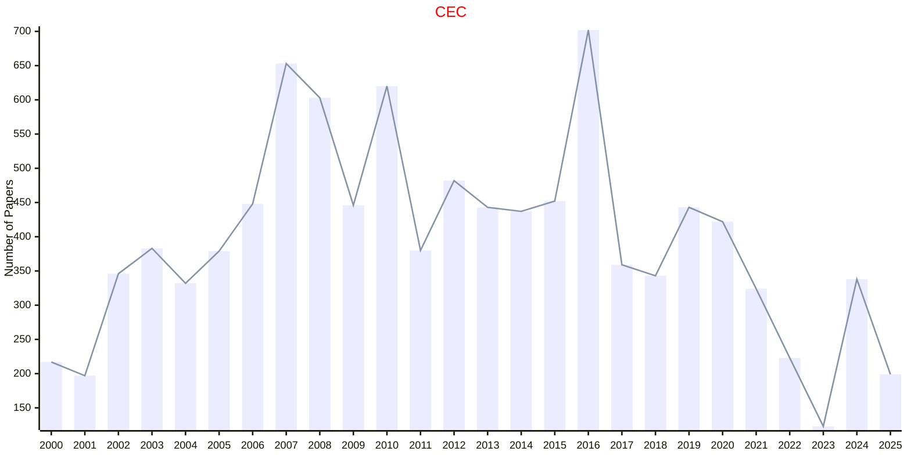

## CVPR

|Publishers|Full/Homepage|Abbr/About|Acronym/Archive|Period/DBLP|Top|CCF|Submission|Days Left|Main Conf.|Days Left|Location|Keywords/Google|
|-         |-            |-         |-              |-          |-  |-  |-         |-        |          |-        |-       |-              |
|[IEEE](https://ieeexplore.ieee.org/)|[IEEE Conference On Computer Vision And Pattern Recognition](https://cvpr.thecvf.com/)|Proc. IEEE Conf. Comput. Vis. Pattern Recognit.|[CVPR](https://ieeexplore.ieee.org/xpl/conhome/1000147/all-proceedings)|[1988 -](https://dblp.org/db/conf/cvpr/index.html)|True|A|06/11/2025|**{{ diffDate('2025-11-06') }}**|[03/06/2026](https://cvpr.thecvf.com/Conferences/2026)|**{{ diffDate('2026-06-03') }}**|Denver Convention Center, Denver, CO, USA|[Pattern Recognition](https://www.google.com/search?q=Pattern+Recognition)|

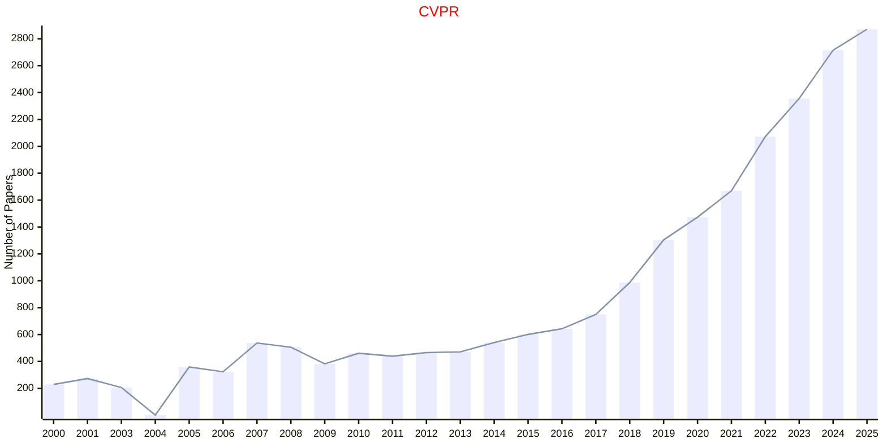

## EAIS

|Publishers|Full/Homepage|Abbr/About|Acronym/Archive|Period/DBLP|Top|CCF|Submission|Days Left|Main Conf.|Days Left|Location|Keywords/Google|
|-         |-            |-         |-              |-          |-  |-  |-         |-        |          |-        |-       |-              |
|[IEEE](https://ieeexplore.ieee.org/)|IEEE International Conference on Evolving and Adaptive Intelligent Systems|Proc. IEEE Int Conf. Evol. Adapt. Intell. Syst.|[EAIS](https://ieeexplore.ieee.org/xpl/conhome/1800397/all-proceedings)|[2011 -](https://dblp.org/db/conf/eais/index.html)|False||15/03/2026|**{{ diffDate('2026-03-15') }}**|[21/09/2026](https://ai.dii.unipi.it/eais2026/)|**{{ diffDate('2026-09-21') }}**|Pisa, Italy|[Evolutionary Computation](https://www.google.com/search?q=Evolutionary+Computation)|

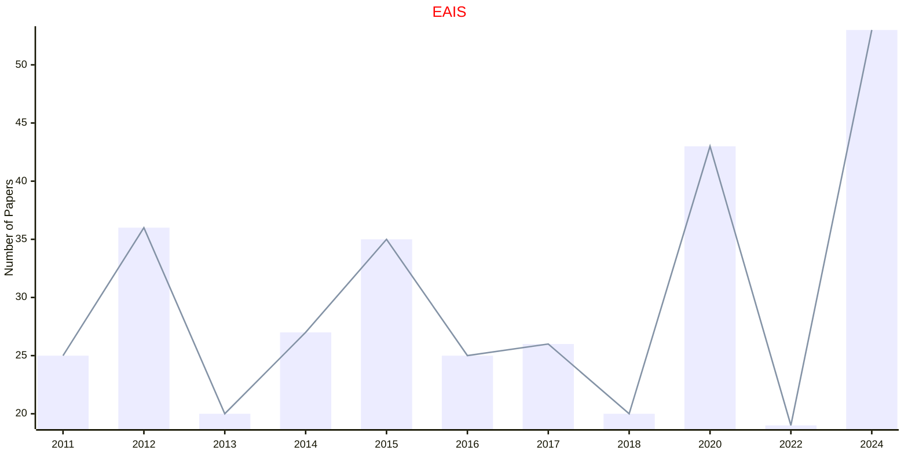

## FOCS

|Publishers|Full/Homepage|Abbr/About|Acronym/Archive|Period/DBLP|Top|CCF|Submission|Days Left|Main Conf.|Days Left|Location|Keywords/Google|
|-         |-            |-         |-              |-          |-  |-  |-         |-        |          |-        |-       |-              |
|[IEEE](https://ieeexplore.ieee.org/)|[IEEE Symposium on Foundations of Computer Science](https://ieee-focs.org/)|Proc. IEEE Annu. Symp. Found. Comput. Sci.|[FOCS](https://ieeexplore.ieee.org/xpl/conhome/1000292/all-proceedings)|[1960 -](https://dblp.org/db/conf/focs/index.html)|True|A|03/04/2025|**{{ diffDate('2025-04-03') }}**|[14/12/2025](https://focs.computer.org/2025/)|**{{ diffDate('2025-12-14') }}**|Sydney, Australia|[Computer Science](https://www.google.com/search?q=Computer+Science)|

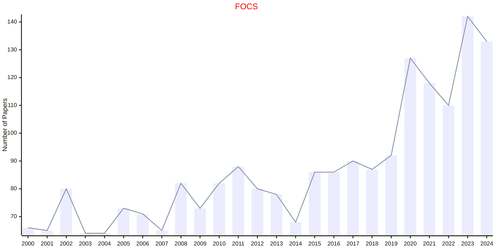

## ICCV

|Publishers|Full/Homepage|Abbr/About|Acronym/Archive|Period/DBLP|Top|CCF|Submission|Days Left|Main Conf.|Days Left|Location|Keywords/Google|
|-         |-            |-         |-              |-          |-  |-  |-         |-        |          |-        |-       |-              |
|[IEEE](https://ieeexplore.ieee.org/)|[IEEE International Conference On Computer Vision](https://iccv.thecvf.com/)|Proc. IEEE Int. Conf. Comput. Vis.|[ICCV](https://ieeexplore.ieee.org/xpl/conhome/1000149/all-proceedings)|[1963 -](https://dblp.org/db/conf/iccv/index.html)|True|A|03/03/2025|**{{ diffDate('2025-03-03') }}**|[19/10/2025](https://iccv.thecvf.com/)|**{{ diffDate('2025-10-19') }}**|Honolulu, Hawai'i|[Computer Vision](https://www.google.com/search?q=Computer+Vision)|

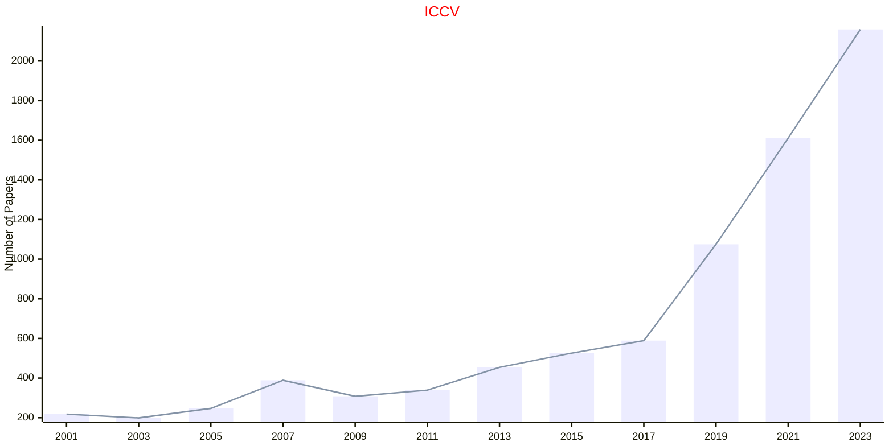

## ICDE

|Publishers|Full/Homepage|Abbr/About|Acronym/Archive|Period/DBLP|Top|CCF|Submission|Days Left|Main Conf.|Days Left|Location|Keywords/Google|
|-         |-            |-         |-              |-          |-  |-  |-         |-        |          |-        |-       |-              |
|[IEEE](https://ieeexplore.ieee.org/)|[IEEE International Conference on Data Engineering](https://ieee-icde.org/)|Proc. Int. Conf. Data. Eng.|[ICDE](https://ieeexplore.ieee.org/xpl/conhome/1000178/all-proceedings)|[1984 -](https://dblp.org/db/conf/icde/index.html)|True|A|27/10/2025|**{{ diffDate('2025-10-27') }}**|[04/05/2026](https://icde2026.github.io/)|**{{ diffDate('2026-05-04') }}**|Montréal, Canada|[Data Engineering](https://www.google.com/search?q=Data+Engineering)|

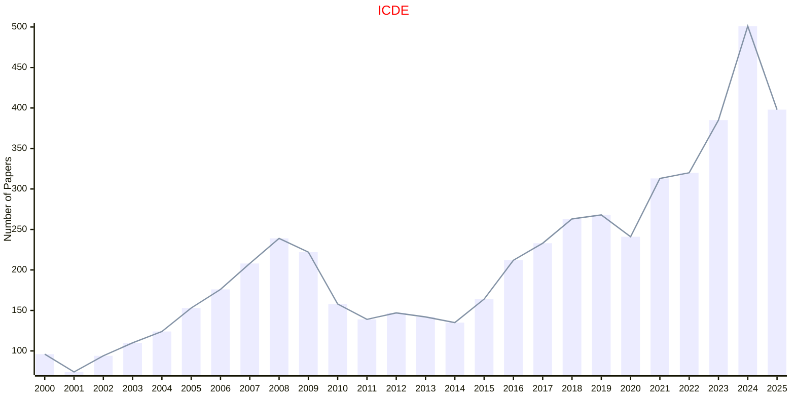

## ICMLC

|Publishers|Full/Homepage|Abbr/About|Acronym/Archive|Period/DBLP|Top|CCF|Submission|Days Left|Main Conf.|Days Left|Location|Keywords/Google|
|-         |-            |-         |-              |-          |-  |-  |-         |-        |          |-        |-       |-              |
|[IEEE](https://ieeexplore.ieee.org/)|[IEEE International Conference on Machine Learning and Cybernetics](https://www.icmlc.com/)|Proc. IEEE Int. Conf. Mach. Learn. Cybern.|[ICMLC](https://ieeexplore.ieee.org/xpl/conhome/1000424/all-proceedings)|[2005 -](https://dblp.org/db/conf/icmlc/index.html)|False|||||||[Machine Learning](https://www.google.com/search?q=Machine+Learning)|

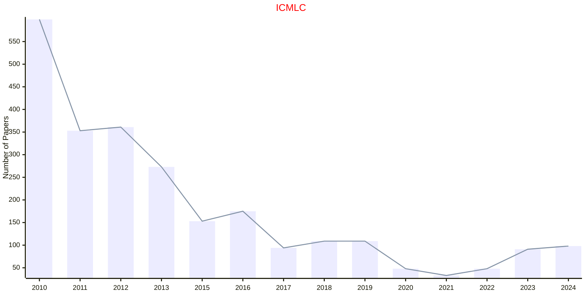

## ICRA

|Publishers|Full/Homepage|Abbr/About|Acronym/Archive|Period/DBLP|Top|CCF|Submission|Days Left|Main Conf.|Days Left|Location|Keywords/Google|
|-         |-            |-         |-              |-          |-  |-  |-         |-        |          |-        |-       |-              |
|[IEEE](https://ieeexplore.ieee.org/)|[IEEE International Conference on Robotics and Automation](https://www.ieee-ras.org/conferences-workshops/fully-sponsored/icra)|Proc. IEEE Int. Conf. Robot. Automat.|[ICRA](https://ieeexplore.ieee.org/xpl/conhome/1000639/all-proceedings)|[1984 -](https://dblp.org/db/conf/icra/index.html)|False|B|15/09/2025|**{{ diffDate('2025-09-15') }}**|[01/06/2026](https://2026.ieee-icra.org/)|**{{ diffDate('2026-06-01') }}**|Vienna, Austria|[Robotics and UAV](https://www.google.com/search?q=Robotics+and+UAV)|

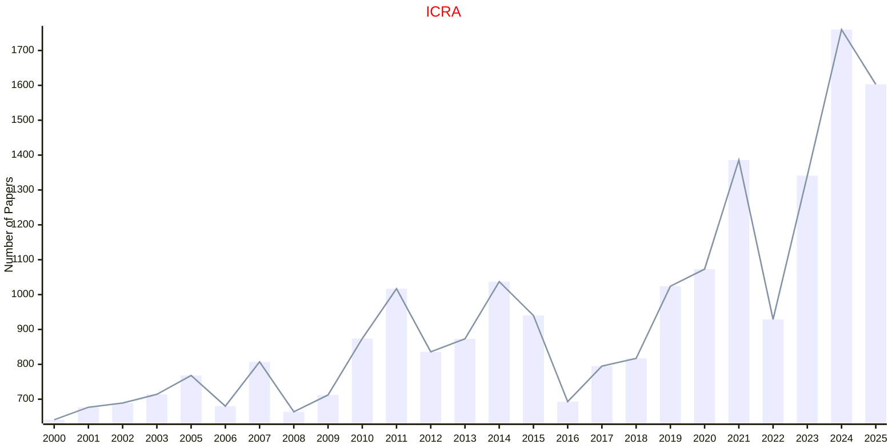

## IROS

|Publishers|Full/Homepage|Abbr/About|Acronym/Archive|Period/DBLP|Top|CCF|Submission|Days Left|Main Conf.|Days Left|Location|Keywords/Google|
|-         |-            |-         |-              |-          |-  |-  |-         |-        |          |-        |-       |-              |
|[IEEE](https://ieeexplore.ieee.org/)|[IEEE/RSJ International Conference on Intelligent Robots and Systems](https://www.ieee-ras.org/conferences-workshops/financially-co-sponsored/iros)|Proc. IEEE/RSJ Int. Conf. Intell. Robot. Syst.|[IROS](https://ieeexplore.ieee.org/xpl/conhome/1000393/all-proceedings)|[1988 -](https://dblp.org/db/conf/iros/index.html)|False|C|02/03/2025|**{{ diffDate('2025-03-02') }}**|[19/10/2025](http://www.iros25.org/)|**{{ diffDate('2025-10-19') }}**|Hangzhou, China|[Intelligent Robots](https://www.google.com/search?q=Intelligent+Robots)|

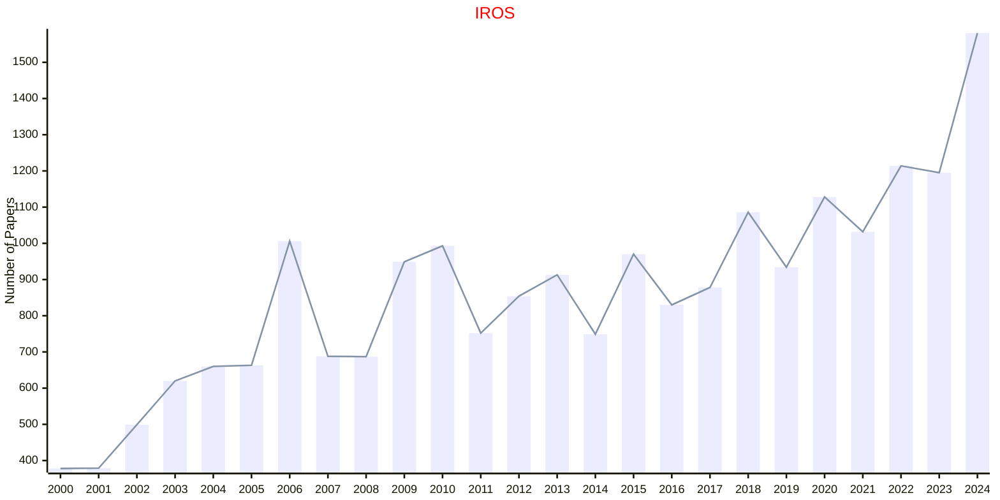

## SMC

|Publishers|Full/Homepage|Abbr/About|Acronym/Archive|Period/DBLP|Top|CCF|Submission|Days Left|Main Conf.|Days Left|Location|Keywords/Google|
|-         |-            |-         |-              |-          |-  |-  |-         |-        |          |-        |-       |-              |
|[IEEE](https://ieeexplore.ieee.org/)|IEEE International Conference on Systems, Man and Cybernetics|Proc. IEEE Int. Conf. Syst., Man, Cybern.|[SMC](https://ieeexplore.ieee.org/xpl/conhome/1000738/all-proceedings)|[1989 -](https://dblp.org/db/conf/smc/index.html)|False|C|20/04/2025|**{{ diffDate('2025-04-20') }}**|[08/10/2025](https://www.ieeesmc2025.org/)|**{{ diffDate('2025-10-08') }}**|Vienna, Austria|[Computer Science](https://www.google.com/search?q=Computer+Science)|

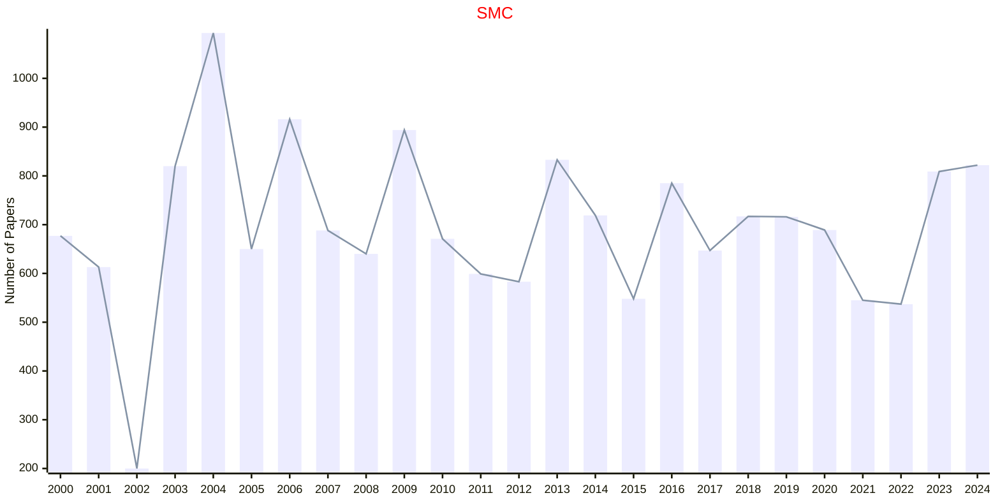

## SSCI

|Publishers|Full/Homepage|Abbr/About|Acronym/Archive|Period/DBLP|Top|CCF|Submission|Days Left|Main Conf.|Days Left|Location|Keywords/Google|
|-         |-            |-         |-              |-          |-  |-  |-         |-        |          |-        |-       |-              |
|[IEEE](https://ieeexplore.ieee.org/)|[IEEE Symposium Series on Computational Intelligence](https://ieee-ssci.org/)|Proc. IEEE Symp. Ser. Comput. Intell.|[SSCI](https://ieeexplore.ieee.org/xpl/conhome/1811304/all-proceedings)|[2007 -](https://dblp.org/db/conf/ssci/index.html)|False||||[17/03/2025](https://ieee-ssci.org/)|**{{ diffDate('2025-03-17') }}**|Trondheim, Norway|[Computational Intelligence](https://www.google.com/search?q=Computational+Intelligence)|

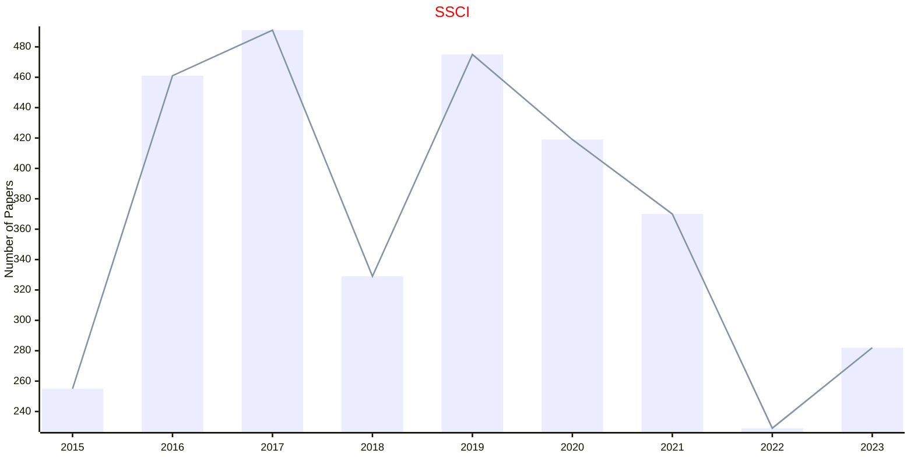

## WCCI

|Publishers|Full/Homepage|Abbr/About|Acronym/Archive|Period/DBLP|Top|CCF|Submission|Days Left|Main Conf.|Days Left|Location|Keywords/Google|
|-         |-            |-         |-              |-          |-  |-  |-         |-        |          |-        |-       |-              |
|[IEEE](https://ieeexplore.ieee.org/)|IEEE World Congress on Computational Intelligence|Proc. IEEE World Congr. Comput. Intell.|WCCI|2008 -|False||31/01/2025|**{{ diffDate('2025-01-31') }}**|[21/06/2026](https://attend.ieee.org/wcci-2026/)|**{{ diffDate('2026-06-21') }}**|Maastricht, USA|[Computational Intelligence](https://www.google.com/search?q=Computational+Intelligence)|

