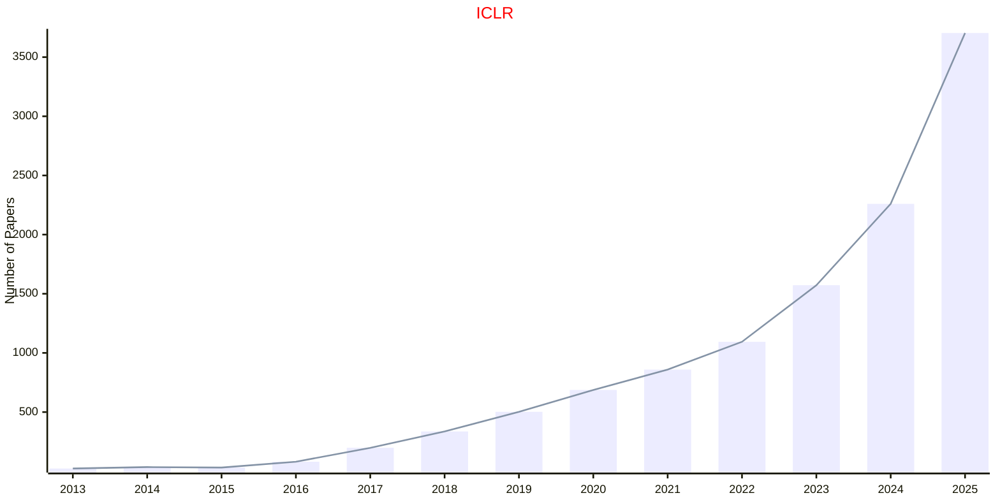
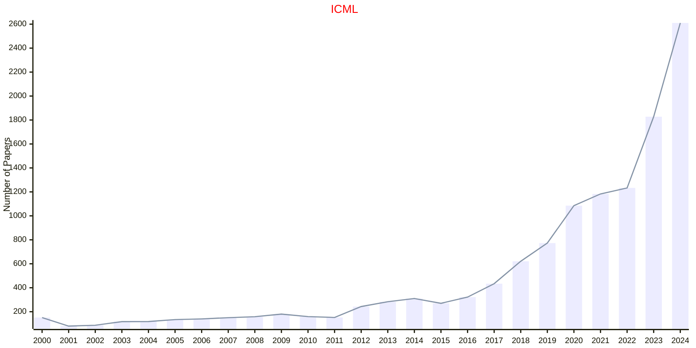
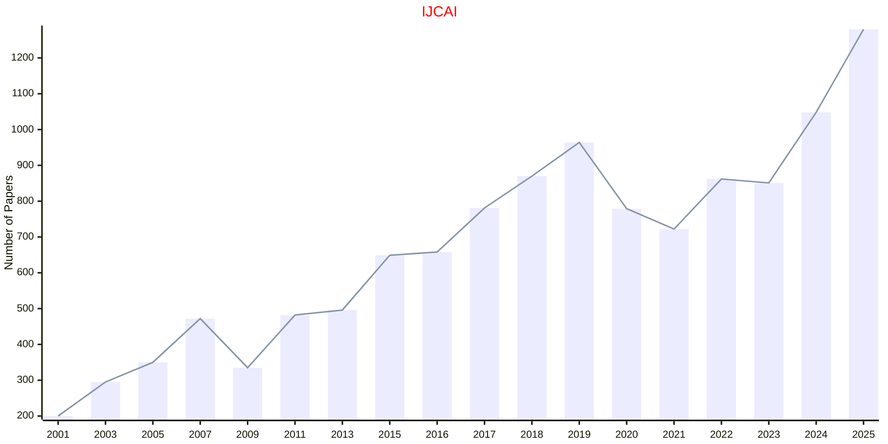
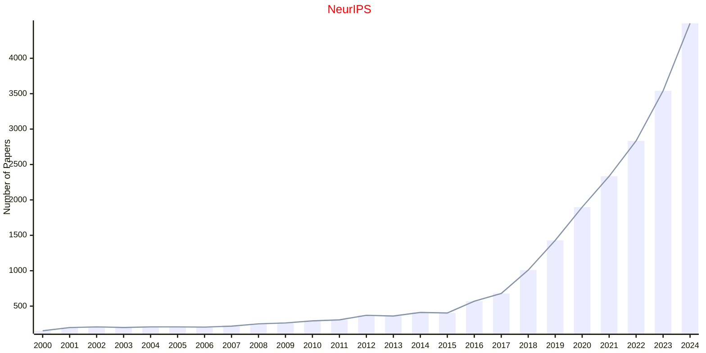
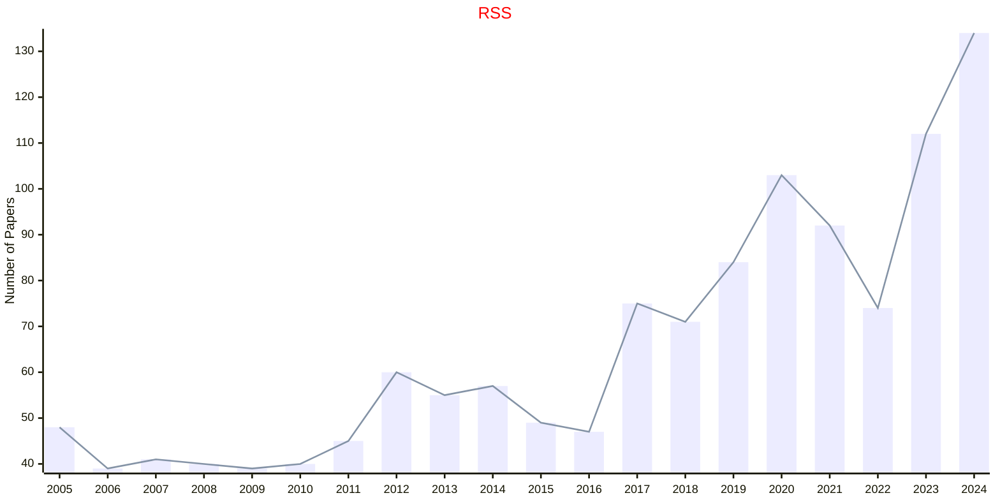

# OPEN

- The data for TOP, CCF, CAS, JCR, and IF are sourced from [easyScholar](https://www.easyscholar.cc/).

## ANTS

|Publishers|Full/Homepage|Abbr/About|Acronym/Archive|Period/DBLP|Top|CCF|Submission|Days Left|Main Conf.|Days Left|Location|Keywords/Google|
|-         |-            |-         |-              |-          |-  |-  |-         |-        |          |-        |-       |-              |
|OPEN|ANTS International Conference on Swarm Intelligence|ANTS Proc. Int. Conf. Swarm Intell.|ANTS|1998 -|False||10/11/2025|**{{ diffDate('2025-11-10') }}**|[08/06/2026](https://ants2026.org/)|**{{ diffDate('2026-06-08') }}**|Darmstadt, Germany|[Evolutionary Computation](https://www.google.com/search?q=Evolutionary+Computation); [Swarm Intelligence](https://www.google.com/search?q=Swarm+Intelligence)|

## CoRL

|Publishers|Full/Homepage|Abbr/About|Acronym/Archive|Period/DBLP|Top|CCF|Submission|Days Left|Main Conf.|Days Left|Location|Keywords/Google|
|-         |-            |-         |-              |-          |-  |-  |-         |-        |          |-        |-       |-              |
|OPEN|[Conference on Robot Learning](https://www.corl.org/)|Proc. Conf. Robot Learn.|CoRL|2017 -|False||||[09/11/2026](https://www.corl.org/)|**{{ diffDate('2026-11-09') }}**|Austin, TX, United States|[Robot Learning](https://www.google.com/search?q=Robot+Learning)|

## ECAI

|Publishers|Full/Homepage|Abbr/About|Acronym/Archive|Period/DBLP|Top|CCF|Submission|Days Left|Main Conf.|Days Left|Location|Keywords/Google|
|-         |-            |-         |-              |-          |-  |-  |-         |-        |          |-        |-       |-              |
|OPEN|European Conference on Artificial Intelligence|Proc. Eur. Conf. Artif. Intell.|ECAI|1974 -|False|B|12/01/2026|**{{ diffDate('2026-01-12') }}**|[15/08/2026](https://2026.ijcai.org/)|**{{ diffDate('2026-08-15') }}**|Bremen, Germany|[Artificial Intelligence](https://www.google.com/search?q=Artificial+Intelligence)|

### Remarks

IOS Press

## ECAL

|Publishers|Full/Homepage|Abbr/About|Acronym/Archive|Period/DBLP|Top|CCF|Submission|Days Left|Main Conf.|Days Left|Location|Keywords/Google|
|-         |-            |-         |-              |-          |-  |-  |-         |-        |          |-        |-       |-              |
|OPEN|European Conference on Artificial Life|Proc. Eur. Conf. Comput. Vis. Workshops|[ECAL](https://link.springer.com/conference/ecal)|1991 - 2017|False|||||||[Artificial Life](https://www.google.com/search?q=Artificial+Life)|

## ESANN

|Publishers|Full/Homepage|Abbr/About|Acronym/Archive|Period/DBLP|Top|CCF|Submission|Days Left|Main Conf.|Days Left|Location|Keywords/Google|
|-         |-            |-         |-              |-          |-  |-  |-         |-        |          |-        |-       |-              |
|OPEN|[European Symposium on Artificial Neural Networks](https://www.esann.org/)|Proc. Eur. Symp. Artif. Neural Netw.|ESANN|1993 -|False||19/11/2025|**{{ diffDate('2025-11-19') }}**|[22/04/2026](https://www.esann.org/)|**{{ diffDate('2026-04-22') }}**|Bruges, Belgium|[Neural Networks](https://www.google.com/search?q=Neural+Networks)|

## ICLR

|Publishers|Full/Homepage|Abbr/About|Acronym/Archive|Period/DBLP|Top|CCF|Submission|Days Left|Main Conf.|Days Left|Location|Keywords/Google|
|-         |-            |-         |-              |-          |-  |-  |-         |-        |          |-        |-       |-              |
|OPEN|[International Conference on Learning Representations](https://iclr.cc)|Proc. Int. Conf. Learn. Represent.|[ICLR](https://openreview.net/group?id=ICLR.cc)|[2013 -](https://dblp.org/db/conf/iclr/index.html)|True||19/09/2025|**{{ diffDate('2025-09-19') }}**|[23/04/2026](https://iclr.cc/)|**{{ diffDate('2026-04-23') }}**|Rio de Janeiro, Brazil|[Artificial Intelligence](https://www.google.com/search?q=Artificial+Intelligence)|

## ICML

|Publishers|Full/Homepage|Abbr/About|Acronym/Archive|Period/DBLP|Top|CCF|Submission|Days Left|Main Conf.|Days Left|Location|Keywords/Google|
|-         |-            |-         |-              |-          |-  |-  |-         |-        |          |-        |-       |-              |
|OPEN|[International Conference On Machine Learning](https://icml.cc)|Proc. Annu. Int. Conf. Mach. Learn.|[ICML](https://proceedings.mlr.press/)|1987 -|True|A|30/01/2026|**{{ diffDate('2026-01-30') }}**|[06/07/2026](https://icml.cc/)|**{{ diffDate('2026-07-06') }}**|Seoul Korea|[Artificial Intelligence](https://www.google.com/search?q=Artificial+Intelligence); [Machine Learning](https://www.google.com/search?q=Machine+Learning)|

## IJCAI

|Publishers|Full/Homepage|Abbr/About|Acronym/Archive|Period/DBLP|Top|CCF|Submission|Days Left|Main Conf.|Days Left|Location|Keywords/Google|
|-         |-            |-         |-              |-          |-  |-  |-         |-        |          |-        |-       |-              |
|OPEN|[International Joint Conference on Artificial Intelligence](https://www.ijcai.org)|Proc. Int. Joint Conf. Artif. Intell.|[IJCAI](https://www.ijcai.org/all_proceedings)|1969 -|True|A|12/01/2026|**{{ diffDate('2026-01-12') }}**|[15/08/2026](https://2026.ijcai.org/)|**{{ diffDate('2026-08-15') }}**|Bremen, Germany|[Artificial Intelligence](https://www.google.com/search?q=Artificial+Intelligence)|

## NeurIPS

|Publishers|Full/Homepage|Abbr/About|Acronym/Archive|Period/DBLP|Top|CCF|Submission|Days Left|Main Conf.|Days Left|Location|Keywords/Google|
|-         |-            |-         |-              |-          |-  |-  |-         |-        |          |-        |-       |-              |
|OPEN|[Advances in Neural Information Processing Systems](https://nips.cc/)|Proc. Adv. Neural Inf. Process. Syst.|[NeurIPS](https://proceedings.neurips.cc/)|1987 -|True|A|||||Sydney, Australia.|[Artificial Intelligence](https://www.google.com/search?q=Artificial+Intelligence)|

## RSS

|Publishers|Full/Homepage|Abbr/About|Acronym/Archive|Period/DBLP|Top|CCF|Submission|Days Left|Main Conf.|Days Left|Location|Keywords/Google|
|-         |-            |-         |-              |-          |-  |-  |-         |-        |          |-        |-       |-              |
|OPEN|[Robotics: Science and Systems Conference](https://roboticsconference.org)|Proc. Robot. Sci. Syst.|RSS|[2005 -](https://dblp.org/db/conf/rss/index.html)|False||||[13/07/2026](https://roboticsconference.org)|**{{ diffDate('2026-07-13') }}**|Sydney, Australia|[Robotics and UAV](https://www.google.com/search?q=Robotics+and+UAV)|

