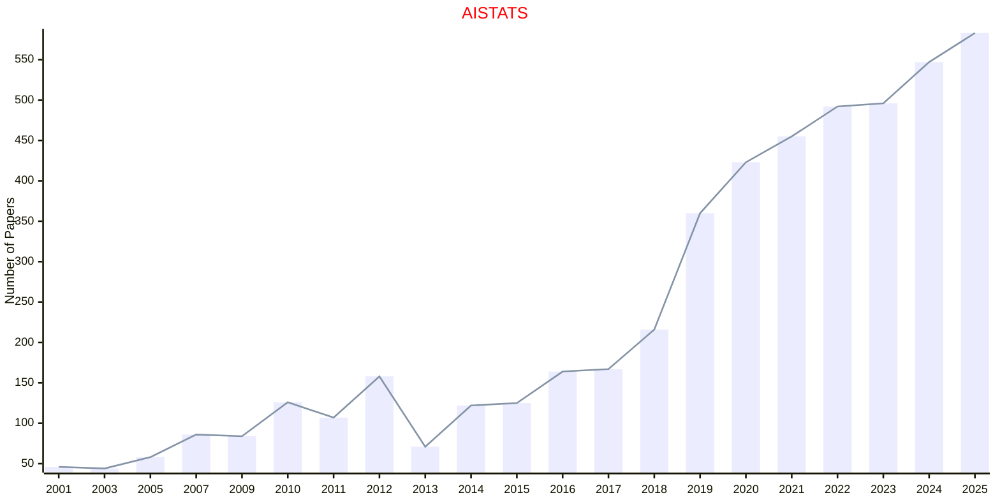
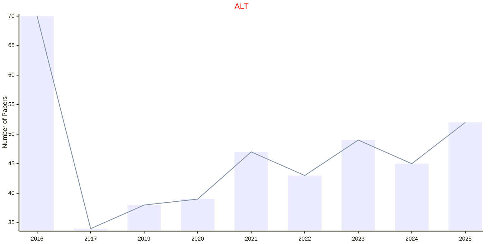
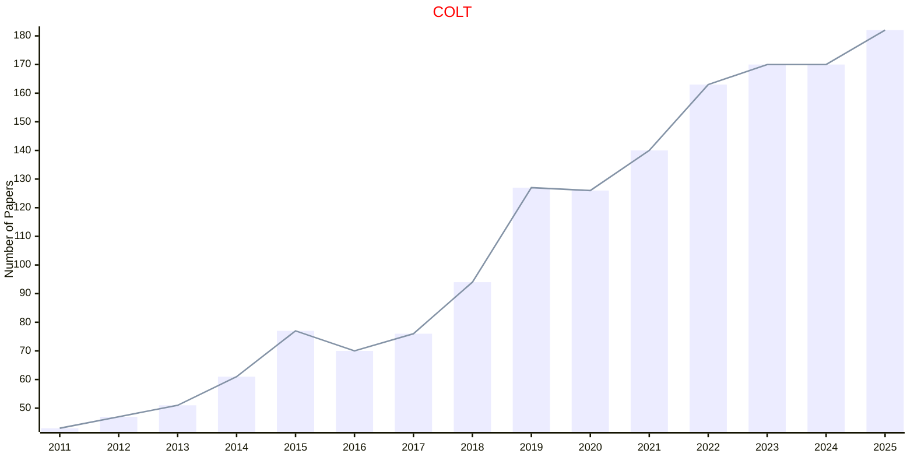

# PMLR

- The data for TOP, CCF, CAS, JCR, and IF are sourced from [easyScholar](https://www.easyscholar.cc/).

## AISTATS

|Publishers|Full/Homepage|Abbr/About|Acronym/Archive|Period/DBLP|Top|CCF|Submission|Days Left|Main Conf.|Days Left|Location|Keywords/Google|
|-         |-            |-         |-              |-          |-  |-  |-         |-        |          |-        |-       |-              |
|[PMLR](https://proceedings.mlr.press/)|[International Conference on Artificial Intelligence and Statistics](https://aistats.org)|Proc. Int. Conf. Artif. Intell. Statist.|[AISTATS](https://proceedings.mlr.press/)|1997 -|False|C|25/09/2025|**{{ diffDate('2025-09-25') }}**|[02/05/2026](https://aistats.org/aistats2026/)|**{{ diffDate('2026-05-02') }}**|Tangier, Morocco|[Artificial Intelligence](https://www.google.com/search?q=Artificial+Intelligence)|

## ALT

|Publishers|Full/Homepage|Abbr/About|Acronym/Archive|Period/DBLP|Top|CCF|Submission|Days Left|Main Conf.|Days Left|Location|Keywords/Google|
|-         |-            |-         |-              |-          |-  |-  |-         |-        |          |-        |-       |-              |
|[PMLR](https://proceedings.mlr.press/)|[International Conference on Algorithmic Learning Theory](http://algorithmiclearningtheory.org/)|Proc. Int. Conf. Algorithmic Learn. Theory|[ALT](https://proceedings.mlr.press/)|1990 -|False|C|02/10/2025|**{{ diffDate('2025-10-02') }}**|[23/02/2026](http://algorithmiclearningtheory.org/alt2026/)|**{{ diffDate('2026-02-23') }}**|Toronto, Canada|[Learning Theory](https://www.google.com/search?q=Learning+Theory)|

### Remarks

SPRINGER: 1992-2016; PMLR: 2016 -

## COLT

|Publishers|Full/Homepage|Abbr/About|Acronym/Archive|Period/DBLP|Top|CCF|Submission|Days Left|Main Conf.|Days Left|Location|Keywords/Google|
|-         |-            |-         |-              |-          |-  |-  |-         |-        |          |-        |-       |-              |
|[PMLR](https://proceedings.mlr.press/)|[Annual Conference On Computational Learning Theory](http://learningtheory.org)|Proc. Conf. Learn. Theory|[COLT](https://dl.acm.org/conference/colt/proceedings)|1988 -|False|B|04/02/2025|**{{ diffDate('2025-02-04') }}**|[29/06/2025](https://learningtheory.org/colt2026/)|**{{ diffDate('2025-06-29') }}**|San Diego, California, USA|[Learning Theory](https://www.google.com/search?q=Learning+Theory)|

