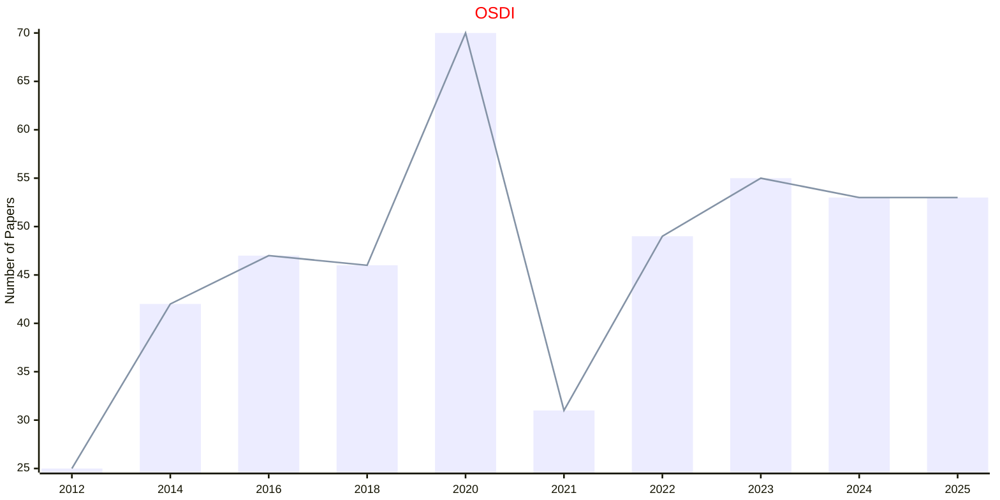

# USENIX

- The data for TOP, CCF, CAS, JCR, and IF are sourced from [easyScholar](https://www.easyscholar.cc/).

## OSDI

|Publishers|Full/Homepage|Abbr/About|Acronym/Archive|Period/DBLP|Top|CCF|Submission|Days Left|Main Conf.|Days Left|Location|Keywords/Google|
|-         |-            |-         |-              |-          |-  |-  |-         |-        |          |-        |-       |-              |
|[USENIX](https://www.usenix.org/)|[Usenix Symposium On Operating Systems Design And Implementations](https://www.usenix.org)|Proc. USENIX Symp. Oper. Syst. Des. Implement.|[OSDI](https://dl.acm.org/conference/osdi/proceedings)|[1994 -](https://dblp.org/db/conf/osdi/index.html)|True|A|01/12/2026|**{{ diffDate('2026-12-01') }}**|[07/07/2027](https://www.usenix.org/conference/osdi27)|**{{ diffDate('2027-07-07') }}**|Baltimore, MD, USA|[Operating Systems](https://www.google.com/search?q=Operating+Systems)|

