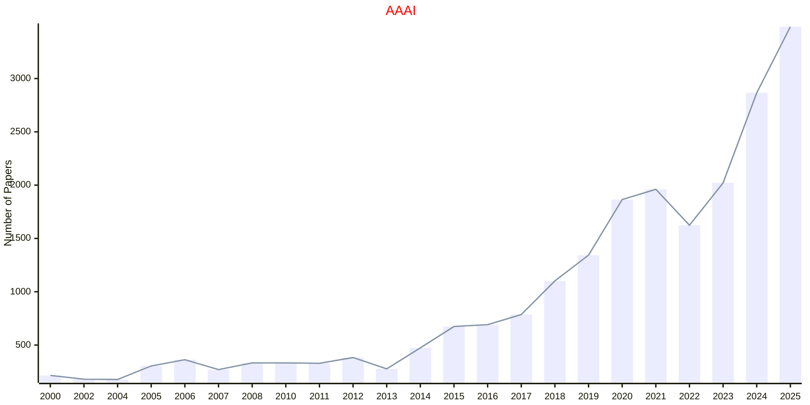
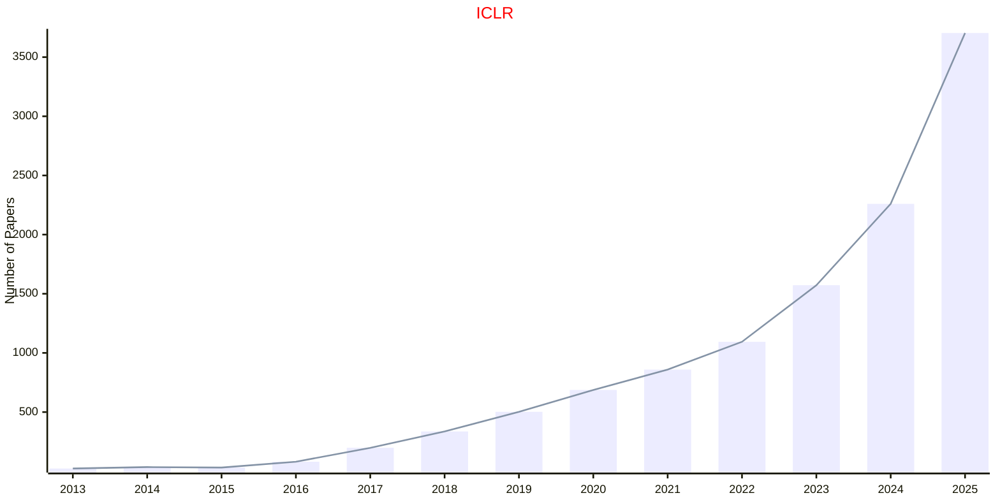
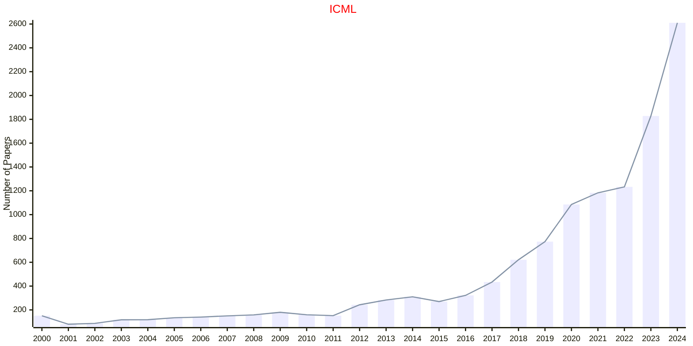
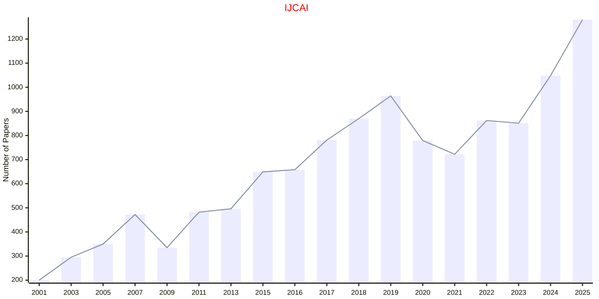
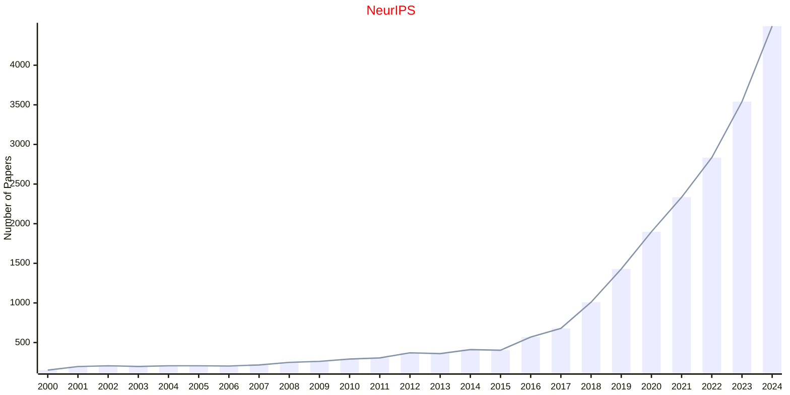
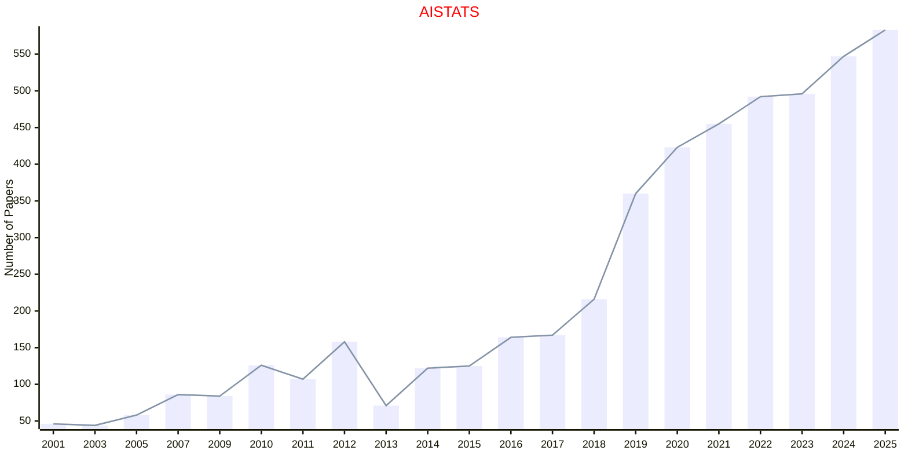

# Artificial Intelligence

## AAAI

|Publishers|Full/Homepage|Abbr/About|Acronym/Archive|Period/DBLP|Top|CCF|Submission|Days Left|Main Conf.|Days Left|Location|Keywords/Google|
|-         |-            |-         |-              |-          |-  |-  |-         |-        |          |-        |-       |-              |
|[AAAI](https://www.aaai.org/)|[AAAI Conference on Artificial Intelligence](https://aaai.org/Conferences/conferences.php)|[Proc. AAAI Conf. Artif. Intell.](https://ojs.aaai.org/index.php/AAAI/about)|[AAAI](https://ojs.aaai.org/index.php/AAAI/issue/archive)|1980 -|True|A|25/07/2025|**{{ diffDate('2025-07-25') }}**|[20/01/2026](https://aaai.org/conference/aaai/aaai-26/)|**{{ diffDate('2026-01-20') }}**|Singapore|[Artificial Intelligence](https://www.google.com/search?q=Artificial+Intelligence)|

## UAI

|Publishers|Full/Homepage|Abbr/About|Acronym/Archive|Period/DBLP|Top|CCF|Submission|Days Left|Main Conf.|Days Left|Location|Keywords/Google|
|-         |-            |-         |-              |-          |-  |-  |-         |-        |          |-        |-       |-              |
|[ACM](https://www.acm.org/)|[Conference on Uncertainty in Artificial Intelligence](https://www.auai.org/)|Proc. Conf. Uncert. Artif. Intell.|[UAI](https://dl.acm.org/conference/uai)|1985 -|False|B|10/02/2025|**{{ diffDate('2025-02-10') }}**|[21/07/2025](https://www.auai.org/uai2025/)|**{{ diffDate('2025-07-21') }}**|Rio de Janeiro, Brazil|[Artificial Intelligence](https://www.google.com/search?q=Artificial+Intelligence); [Uncertainty](https://www.google.com/search?q=Uncertainty)|

## ECAI

|Publishers|Full/Homepage|Abbr/About|Acronym/Archive|Period/DBLP|Top|CCF|Submission|Days Left|Main Conf.|Days Left|Location|Keywords/Google|
|-         |-            |-         |-              |-          |-  |-  |-         |-        |          |-        |-       |-              |
|OPEN|European Conference on Artificial Intelligence|Proc. Eur. Conf. Artif. Intell.|ECAI|1974 -|False|B|29/04/2025|**{{ diffDate('2025-04-29') }}**|[25/10/2025](https://ecai2025.org/)|**{{ diffDate('2025-10-25') }}**|Bologna|[Artificial Intelligence](https://www.google.com/search?q=Artificial+Intelligence)|

## ICLR

|Publishers|Full/Homepage|Abbr/About|Acronym/Archive|Period/DBLP|Top|CCF|Submission|Days Left|Main Conf.|Days Left|Location|Keywords/Google|
|-         |-            |-         |-              |-          |-  |-  |-         |-        |          |-        |-       |-              |
|OPEN|[International Conference on Learning Representations](https://iclr.cc)|Proc. Int. Conf. Learn. Represent.|[ICLR](https://openreview.net/group?id=ICLR.cc)|[2013 -](https://dblp.org/db/conf/iclr/index.html)|True||19/09/2025|**{{ diffDate('2025-09-19') }}**|[23/04/2026](https://iclr.cc/)|**{{ diffDate('2026-04-23') }}**|Rio de Janeiro, Brazil|[Artificial Intelligence](https://www.google.com/search?q=Artificial+Intelligence)|

## ICML

|Publishers|Full/Homepage|Abbr/About|Acronym/Archive|Period/DBLP|Top|CCF|Submission|Days Left|Main Conf.|Days Left|Location|Keywords/Google|
|-         |-            |-         |-              |-          |-  |-  |-         |-        |          |-        |-       |-              |
|OPEN|[International Conference On Machine Learning](https://icml.cc)|Proc. Annu. Int. Conf. Mach. Learn.|[ICML](https://proceedings.mlr.press/)|1987 -|True|A|30/01/2026|**{{ diffDate('2026-01-30') }}**|[06/07/2026](https://icml.cc/)|**{{ diffDate('2026-07-06') }}**|Seoul Korea|[Artificial Intelligence](https://www.google.com/search?q=Artificial+Intelligence); [Machine Learning](https://www.google.com/search?q=Machine+Learning)|

## IJCAI

|Publishers|Full/Homepage|Abbr/About|Acronym/Archive|Period/DBLP|Top|CCF|Submission|Days Left|Main Conf.|Days Left|Location|Keywords/Google|
|-         |-            |-         |-              |-          |-  |-  |-         |-        |          |-        |-       |-              |
|OPEN|[International Joint Conference on Artificial Intelligence](https://www.ijcai.org)|Proc. Int. Joint Conf. Artif. Intell.|[IJCAI](https://www.ijcai.org/all_proceedings)|1969 -|True|A|31/01/2026|**{{ diffDate('2026-01-31') }}**|[15/08/2026](https://2026.ijcai.org/)|**{{ diffDate('2026-08-15') }}**|Bremen, Germany|[Artificial Intelligence](https://www.google.com/search?q=Artificial+Intelligence)|

## NeurIPS

|Publishers|Full/Homepage|Abbr/About|Acronym/Archive|Period/DBLP|Top|CCF|Submission|Days Left|Main Conf.|Days Left|Location|Keywords/Google|
|-         |-            |-         |-              |-          |-  |-  |-         |-        |          |-        |-       |-              |
|OPEN|[Advances in Neural Information Processing Systems](https://nips.cc/)|Proc. Adv. Neural Inf. Process. Syst.|[NeurIPS](https://proceedings.neurips.cc/)|1987 -|True|A|11/05/2025|**{{ diffDate('2025-05-11') }}**|[03/12/2025](https://nips.cc/)|**{{ diffDate('2025-12-03') }}**|San Diego, USA|[Artificial Intelligence](https://www.google.com/search?q=Artificial+Intelligence)|

## AISTATS

|Publishers|Full/Homepage|Abbr/About|Acronym/Archive|Period/DBLP|Top|CCF|Submission|Days Left|Main Conf.|Days Left|Location|Keywords/Google|
|-         |-            |-         |-              |-          |-  |-  |-         |-        |          |-        |-       |-              |
|[PMLR](https://proceedings.mlr.press/)|[International Conference on Artificial Intelligence and Statistics](https://aistats.org)|Proc. Int. Conf. Artif. Intell. Statist.|[AISTATS](https://proceedings.mlr.press/)|1997 -|False|C|25/09/2025|**{{ diffDate('2025-09-25') }}**|[02/05/2026](https://aistats.org/aistats2026/)|**{{ diffDate('2026-05-02') }}**|Tangier, Morocco|[Artificial Intelligence](https://www.google.com/search?q=Artificial+Intelligence)|

