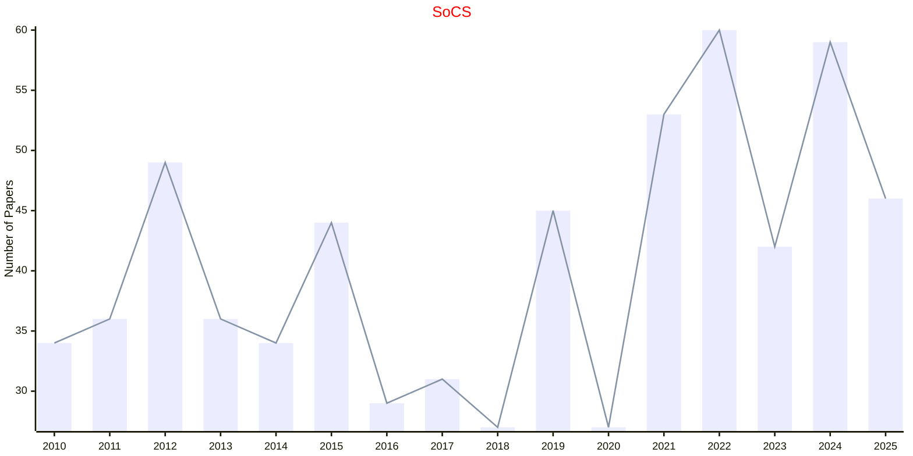

# Combinatorial Optimization

## SoCS

|Publishers|Full/Homepage|Abbr/About|Acronym/Archive|Period/DBLP|Top|CCF|Submission|Days Left|Main Conf.|Days Left|Location|Keywords/Google|
|-         |-            |-         |-              |-          |-  |-  |-         |-        |          |-        |-       |-              |
|[AAAI](https://www.aaai.org/)|[Symposium on Combinatorial Search](http://search-conference.org)|Proc. Symp. Comb. Search|[SoCS](https://ojs.aaai.org/index.php/SOCS/issue/archive)|2008 -|False||12/01/2026|**{{ diffDate('2026-01-12') }}**|[15/08/2026](https://socs25.search-conference.org/)|**{{ diffDate('2026-08-15') }}**|Bremen, Germany|[Combinatorial Optimization](https://www.google.com/search?q=Combinatorial+Optimization); [Heuristic Search](https://www.google.com/search?q=Heuristic+Search)|

