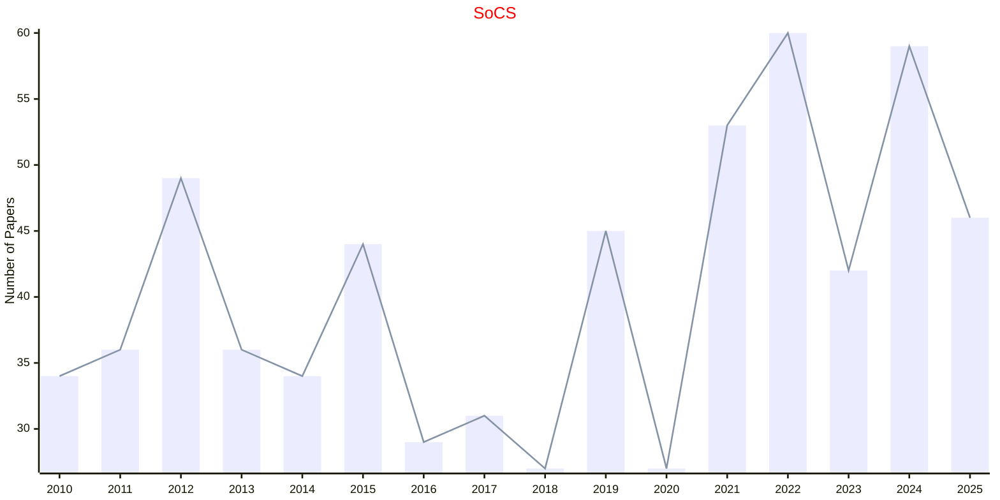
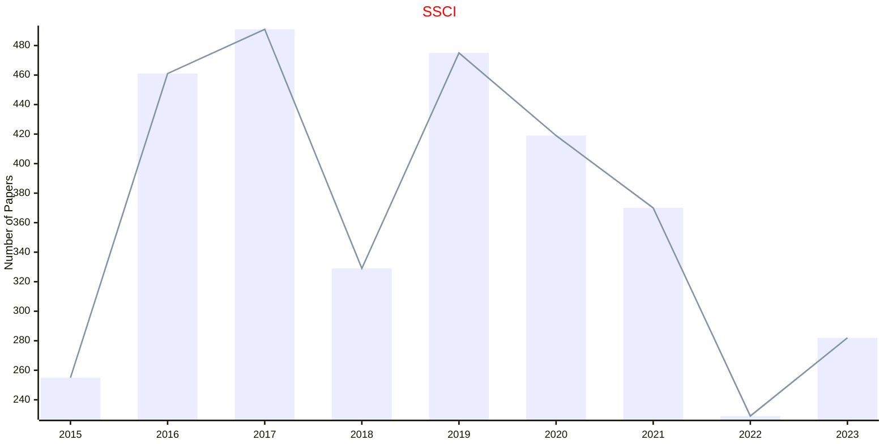

# Computational Intelligence

## SoCS

|Publishers|Full/Homepage|Abbr/About|Acronym/Archive|Period/DBLP|Top|CCF|Submission|Days Left|Main Conf.|Days Left|Location|Keywords/Google|
|-         |-            |-         |-              |-          |-  |-  |-         |-        |          |-        |-       |-              |
|[AAAI](https://www.aaai.org/)|[Symposium on Combinatorial Search](http://search-conference.org)|Proc. Symp. Comb. Search|[SoCS](https://ojs.aaai.org/index.php/SOCS/issue/archive)|2008 -|False||19/03/2025|**{{ diffDate('2025-03-19') }}**|[12/08/2025](https://socs25.search-conference.org/)|**{{ diffDate('2025-08-12') }}**|Scotland, United Kingdom|[Combinatorial Optimization](https://www.google.com/search?q=Combinatorial+Optimization); [Heuristic Search](https://www.google.com/search?q=Heuristic+Search)|

## SoCC

|Publishers|Full/Homepage|Abbr/About|Acronym/Archive|Period/DBLP|Top|CCF|Submission|Days Left|Main Conf.|Days Left|Location|Keywords/Google|
|-         |-            |-         |-              |-          |-  |-  |-         |-        |          |-        |-       |-              |
|[ACM](https://www.acm.org/)|[ACM Symposium On Cloud Computing](https://acmsocc.org/)|Proc. Symp. Cloud Comput.|SoCC|2010 -|False|B|07/07/2025|**{{ diffDate('2025-07-07') }}**|[18/11/2026](https://acmsocc.org/2026/)|**{{ diffDate('2026-11-18') }}**|Singapore|[Cloud Computing](https://www.google.com/search?q=Cloud+Computing)|

## SSCI

|Publishers|Full/Homepage|Abbr/About|Acronym/Archive|Period/DBLP|Top|CCF|Submission|Days Left|Main Conf.|Days Left|Location|Keywords/Google|
|-         |-            |-         |-              |-          |-  |-  |-         |-        |          |-        |-       |-              |
|[IEEE](https://ieeexplore.ieee.org/)|[IEEE Symposium Series on Computational Intelligence](https://ieee-ssci.org/)|Proc. IEEE Symp. Ser. Comput. Intell.|[SSCI](https://ieeexplore.ieee.org/xpl/conhome/1811304/all-proceedings)|[2007 -](https://dblp.org/db/conf/ssci/index.html)|False||||[17/03/2025](https://ieee-ssci.org/)|**{{ diffDate('2025-03-17') }}**|Trondheim, Norway|[Computational Intelligence](https://www.google.com/search?q=Computational+Intelligence)|

## WCCI

|Publishers|Full/Homepage|Abbr/About|Acronym/Archive|Period/DBLP|Top|CCF|Submission|Days Left|Main Conf.|Days Left|Location|Keywords/Google|
|-         |-            |-         |-              |-          |-  |-  |-         |-        |          |-        |-       |-              |
|[IEEE](https://ieeexplore.ieee.org/)|IEEE World Congress on Computational Intelligence|Proc. IEEE World Congr. Comput. Intell.|WCCI|2008 -|False||31/01/2026|**{{ diffDate('2026-01-31') }}**|[21/06/2026](https://attend.ieee.org/wcci-2026/)|**{{ diffDate('2026-06-21') }}**|Maastricht, USA|[Computational Intelligence](https://www.google.com/search?q=Computational+Intelligence)|

