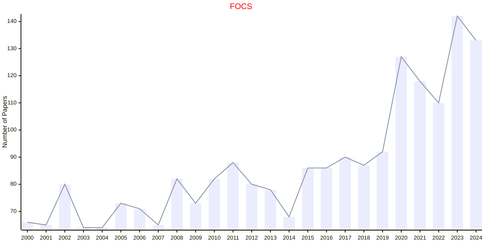
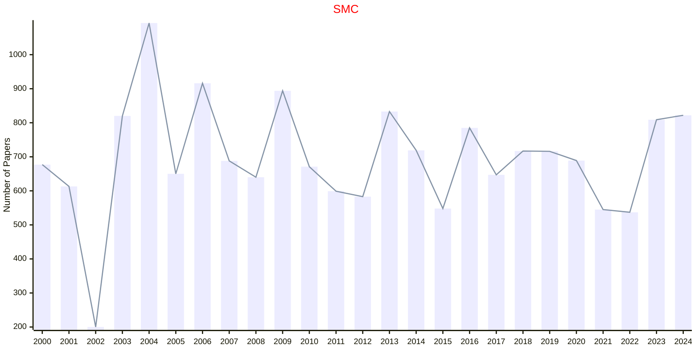

# Computer Science

## FOCS

|Publishers|Full/Homepage|Abbr/About|Acronym/Archive|Period/DBLP|Top|CCF|Submission|Days Left|Main Conf.|Days Left|Location|Keywords/Google|
|-         |-            |-         |-              |-          |-  |-  |-         |-        |          |-        |-       |-              |
|[IEEE](https://ieeexplore.ieee.org/)|[IEEE Symposium on Foundations of Computer Science](https://ieee-focs.org/)|Proc. IEEE Annu. Symp. Found. Comput. Sci.|[FOCS](https://ieeexplore.ieee.org/xpl/conhome/1000292/all-proceedings)|[1960 -](https://dblp.org/db/conf/focs/index.html)|True|A|03/04/2025|**{{ diffDate('2025-04-03') }}**|[14/12/2025](https://focs.computer.org/2025/)|**{{ diffDate('2025-12-14') }}**|Sydney, Australia|[Computer Science](https://www.google.com/search?q=Computer+Science)|

## SMC

|Publishers|Full/Homepage|Abbr/About|Acronym/Archive|Period/DBLP|Top|CCF|Submission|Days Left|Main Conf.|Days Left|Location|Keywords/Google|
|-         |-            |-         |-              |-          |-  |-  |-         |-        |          |-        |-       |-              |
|[IEEE](https://ieeexplore.ieee.org/)|IEEE International Conference on Systems, Man and Cybernetics|Proc. IEEE Int. Conf. Syst., Man, Cybern.|[SMC](https://ieeexplore.ieee.org/xpl/conhome/1000738/all-proceedings)|[1989 -](https://dblp.org/db/conf/smc/index.html)|False|C|22/03/2026|**{{ diffDate('2026-03-22') }}**|[04/10/2026](https://www.ieeesmc2026.org/)|**{{ diffDate('2026-10-04') }}**|Bellevue, WA, USA|[Computer Science](https://www.google.com/search?q=Computer+Science)|

