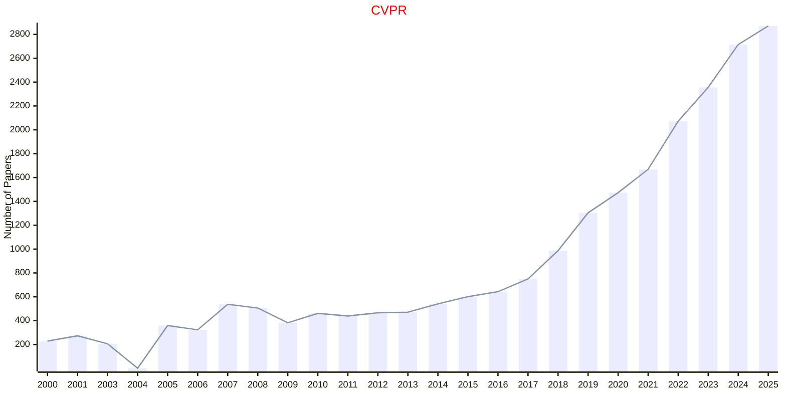
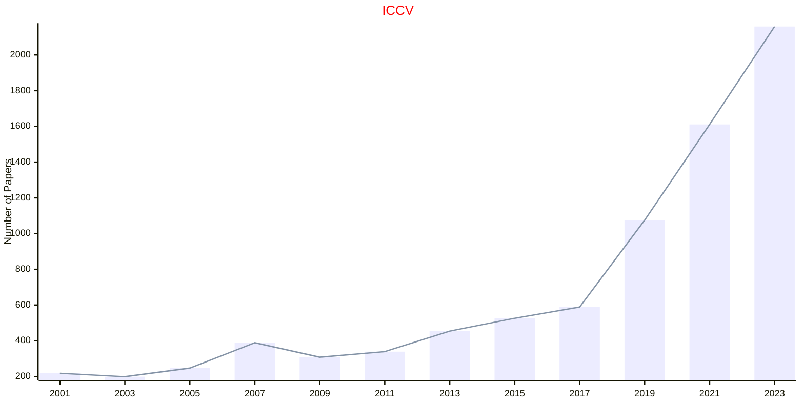
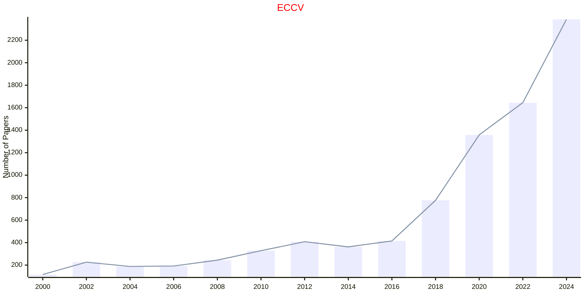

# Computer Vision

## CVPR

|Publishers|Full/Homepage|Abbr/About|Acronym/Archive|Period/DBLP|Top|CCF|Submission|Days Left|Main Conf.|Days Left|Location|Keywords/Google|
|-         |-            |-         |-              |-          |-  |-  |-         |-        |          |-        |-       |-              |
|[IEEE](https://ieeexplore.ieee.org/)|[IEEE Conference On Computer Vision And Pattern Recognition](https://cvpr.thecvf.com/)|Proc. IEEE Conf. Comput. Vis. Pattern Recognit.|[CVPR](https://ieeexplore.ieee.org/xpl/conhome/1000147/all-proceedings)|[1988 -](https://dblp.org/db/conf/cvpr/index.html)|True|A|06/11/2025|**{{ diffDate('2025-11-06') }}**|[03/06/2026](https://cvpr.thecvf.com/Conferences/2026)|**{{ diffDate('2026-06-03') }}**|Denver Convention Center, Denver, CO, USA|[Pattern Recognition](https://www.google.com/search?q=Pattern+Recognition)|

## ICCV

|Publishers|Full/Homepage|Abbr/About|Acronym/Archive|Period/DBLP|Top|CCF|Submission|Days Left|Main Conf.|Days Left|Location|Keywords/Google|
|-         |-            |-         |-              |-          |-  |-  |-         |-        |          |-        |-       |-              |
|[IEEE](https://ieeexplore.ieee.org/)|[IEEE International Conference On Computer Vision](https://iccv.thecvf.com/)|Proc. IEEE Int. Conf. Comput. Vis.|[ICCV](https://ieeexplore.ieee.org/xpl/conhome/1000149/all-proceedings)|[1963 -](https://dblp.org/db/conf/iccv/index.html)|True|A|03/03/2025|**{{ diffDate('2025-03-03') }}**|[19/10/2025](https://iccv.thecvf.com/)|**{{ diffDate('2025-10-19') }}**|Honolulu, Hawai'i|[Computer Vision](https://www.google.com/search?q=Computer+Vision)|

## ECCV

|Publishers|Full/Homepage|Abbr/About|Acronym/Archive|Period/DBLP|Top|CCF|Submission|Days Left|Main Conf.|Days Left|Location|Keywords/Google|
|-         |-            |-         |-              |-          |-  |-  |-         |-        |          |-        |-       |-              |
|[SPRINGER](https://www.springer.com/)|[European Conference on Computer Vision](https://eccv.ecva.net/)|Proc. Eur. Conf. Comput. Vis.|[ECCV](https://link.springer.com/conference/eccv)|[1990 -](https://dblp.org/db/conf/eccv/index.html)|False|B|06/03/2026|**{{ diffDate('2026-03-06') }}**|[08/09/2026](https://eccv.ecva.net/)|**{{ diffDate('2026-09-08') }}**|Malmö, Sweden|[Computer Vision](https://www.google.com/search?q=Computer+Vision)|

