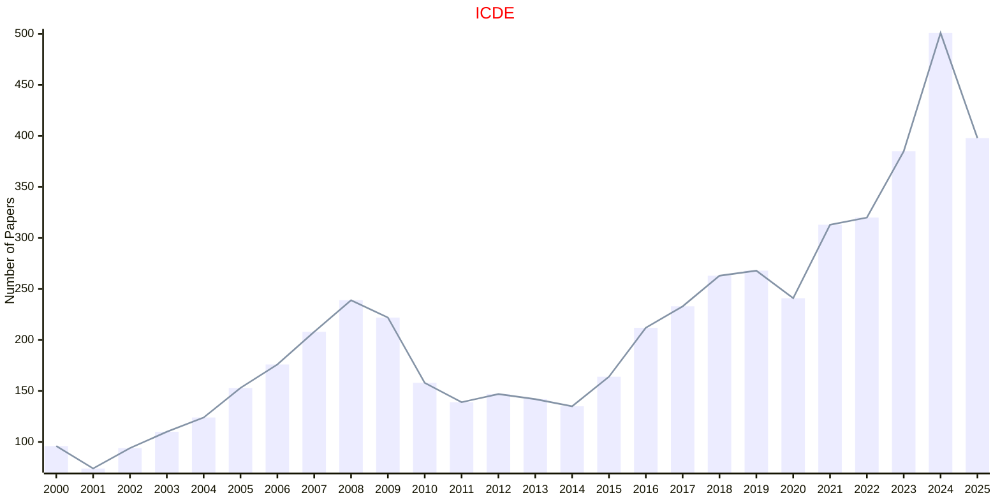

# Data Engineering

## ICDE

|Publishers|Full/Homepage|Abbr/About|Acronym/Archive|Period/DBLP|Top|CCF|Submission|Days Left|Main Conf.|Days Left|Location|Keywords/Google|
|-         |-            |-         |-              |-          |-  |-  |-         |-        |          |-        |-       |-              |
|[IEEE](https://ieeexplore.ieee.org/)|[IEEE International Conference on Data Engineering](https://ieee-icde.org/)|Proc. Int. Conf. Data. Eng.|[ICDE](https://ieeexplore.ieee.org/xpl/conhome/1000178/all-proceedings)|[1984 -](https://dblp.org/db/conf/icde/index.html)|True|A|27/10/2025|**{{ diffDate('2025-10-27') }}**|[04/05/2026](https://icde2026.github.io/)|**{{ diffDate('2026-05-04') }}**|Montréal, Canada|[Data Engineering](https://www.google.com/search?q=Data+Engineering)|

