# Evolutionary Computation

## FOGA

|Publishers|Full/Homepage|Abbr/About|Acronym/Archive|Period/DBLP|Top|CCF|Submission|Days Left|Main Conf.|Days Left|Location|Keywords/Google|
|-         |-            |-         |-              |-          |-  |-  |-         |-        |          |-        |-       |-              |
|[ACM](https://www.acm.org/)|[ACM/SIGEVO Conference on Foundations of Genetic Algorithms](https://sig.sigevo.org/FOGAs)|Proc. ACM/SIGEVO Conf. Found. Genet. Algo.|[FOGA](https://dl.acm.org/conference/foga)|1990 -|False||02/05/2025|**{{ diffDate('2025-05-02') }}**|[27/08/2025](https://naco.liacs.nl/foga2025/)|**{{ diffDate('2025-08-27') }}**|Leiden, The Netherlands|[Evolutionary Computation](https://www.google.com/search?q=Evolutionary+Computation)|

## GECCO

|Publishers|Full/Homepage|Abbr/About|Acronym/Archive|Period/DBLP|Top|CCF|Submission|Days Left|Main Conf.|Days Left|Location|Keywords/Google|
|-         |-            |-         |-              |-          |-  |-  |-         |-        |          |-        |-       |-              |
|[ACM](https://www.acm.org/)|[Genetic and Evolutionary Computation Conference](https://dl.acm.org/conference/gecco)|Proc. Genet. Evol. Comput. Conf.|[GECCO](https://dl.acm.org/conference/gecco)|1996 -|False|C|||[13/07/2026](https://gecco-2026.sigevo.org/HomePage)|**{{ diffDate('2026-07-13') }}**|San Antonio, Costa Rica|[Evolutionary Computation](https://www.google.com/search?q=Evolutionary+Computation)|

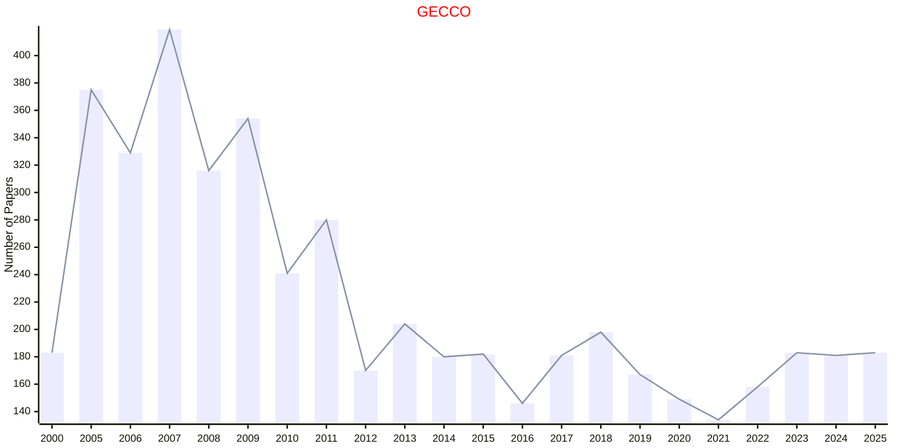

## GECCOC

|Publishers|Full/Homepage|Abbr/About|Acronym/Archive|Period/DBLP|Top|CCF|Submission|Days Left|Main Conf.|Days Left|Location|Keywords/Google|
|-         |-            |-         |-              |-          |-  |-  |-         |-        |          |-        |-       |-              |
|[ACM](https://www.acm.org/)|[Genetic and Evolutionary Computation Conference Companion](https://dl.acm.org/conference/gecco)|Proc. Conf. Comp. Genet. Evol. Comput.|[GECCOC](https://dl.acm.org/conference/gecco)|1996 -|False|C|||[13/07/2026](https://gecco-2025.sigevo.org/HomePage)|**{{ diffDate('2026-07-13') }}**|San Antonio, Costa Rica|[Evolutionary Computation](https://www.google.com/search?q=Evolutionary+Computation)|

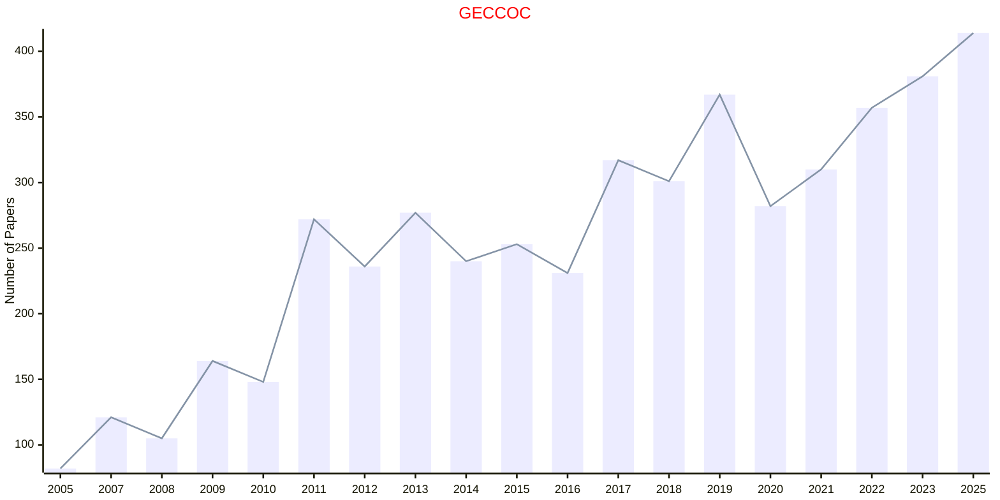

## CEC

|Publishers|Full/Homepage|Abbr/About|Acronym/Archive|Period/DBLP|Top|CCF|Submission|Days Left|Main Conf.|Days Left|Location|Keywords/Google|
|-         |-            |-         |-              |-          |-  |-  |-         |-        |          |-        |-       |-              |
|[IEEE](https://ieeexplore.ieee.org/)|IEEE Congress on Evolutionary Computation|Proc. IEEE Congr. Evol. Comput.|[CEC](https://ieeexplore.ieee.org/xpl/conhome/1000284/all-proceedings)|[1999 -](https://dblp.org/db/conf/cec/index.html)|False||31/01/2026|**{{ diffDate('2026-01-31') }}**|[21/06/2026](https://attend.ieee.org/wcci-2026/)|**{{ diffDate('2026-06-21') }}**|Maastricht|[Evolutionary Computation](https://www.google.com/search?q=Evolutionary+Computation)|

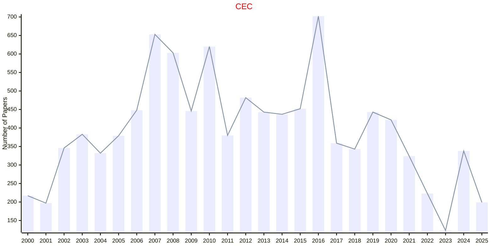

## EAIS

|Publishers|Full/Homepage|Abbr/About|Acronym/Archive|Period/DBLP|Top|CCF|Submission|Days Left|Main Conf.|Days Left|Location|Keywords/Google|
|-         |-            |-         |-              |-          |-  |-  |-         |-        |          |-        |-       |-              |
|[IEEE](https://ieeexplore.ieee.org/)|IEEE International Conference on Evolving and Adaptive Intelligent Systems|Proc. IEEE Int Conf. Evol. Adapt. Intell. Syst.|[EAIS](https://ieeexplore.ieee.org/xpl/conhome/1800397/all-proceedings)|[2011 -](https://dblp.org/db/conf/eais/index.html)|False||15/03/2026|**{{ diffDate('2026-03-15') }}**|[21/09/2026](https://ai.dii.unipi.it/eais2026/)|**{{ diffDate('2026-09-21') }}**|Pisa, Italy|[Evolutionary Computation](https://www.google.com/search?q=Evolutionary+Computation)|

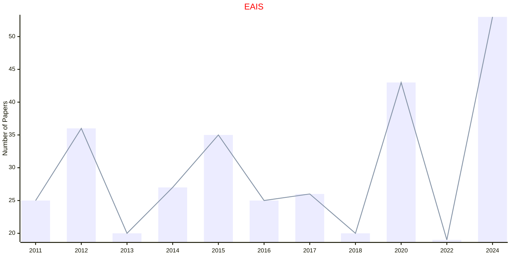

## ANTS

|Publishers|Full/Homepage|Abbr/About|Acronym/Archive|Period/DBLP|Top|CCF|Submission|Days Left|Main Conf.|Days Left|Location|Keywords/Google|
|-         |-            |-         |-              |-          |-  |-  |-         |-        |          |-        |-       |-              |
|OPEN|ANTS International Conference on Swarm Intelligence|ANTS Proc. Int. Conf. Swarm Intell.|ANTS|1998 -|False||10/11/2025|**{{ diffDate('2025-11-10') }}**|[08/06/2026](https://ants2026.org/)|**{{ diffDate('2026-06-08') }}**|Darmstadt, Germany|[Evolutionary Computation](https://www.google.com/search?q=Evolutionary+Computation); [Swarm Intelligence](https://www.google.com/search?q=Swarm+Intelligence)|

## EMO

|Publishers|Full/Homepage|Abbr/About|Acronym/Archive|Period/DBLP|Top|CCF|Submission|Days Left|Main Conf.|Days Left|Location|Keywords/Google|
|-         |-            |-         |-              |-          |-  |-  |-         |-        |          |-        |-       |-              |
|[SPRINGER](https://www.springer.com/)|International Conference on Evolutionary Multi-Criterion Optimization|Proc. Int. Conf. Evol. Multi-Criterion Optim.|[EMO](https://link.springer.com/conference/emo)|[2001 -](https://dblp.org/db/conf/emo/index.html)|False|||||||[Evolutionary Computation](https://www.google.com/search?q=Evolutionary+Computation)|

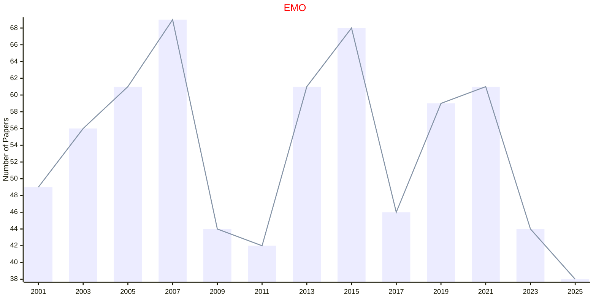

## EuroGP

|Publishers|Full/Homepage|Abbr/About|Acronym/Archive|Period/DBLP|Top|CCF|Submission|Days Left|Main Conf.|Days Left|Location|Keywords/Google|
|-         |-            |-         |-              |-          |-  |-  |-         |-        |          |-        |-       |-              |
|[SPRINGER](https://www.springer.com/)|[European Conference on Genetic Programming](https://www.evostar.org/)|Proc. Eur. Conf. Genet. Program.|[EuroGP](https://link.springer.com/conference/eurogp)|[1998 -](https://dblp.org/db/conf/eurogp/index.html)|False||01/11/2025|**{{ diffDate('2025-11-01') }}**|[08/04/2026](https://www.evostar.org/2026/eurogp/)|**{{ diffDate('2026-04-08') }}**|Toulouse, France|[Evolutionary Computation](https://www.google.com/search?q=Evolutionary+Computation)|

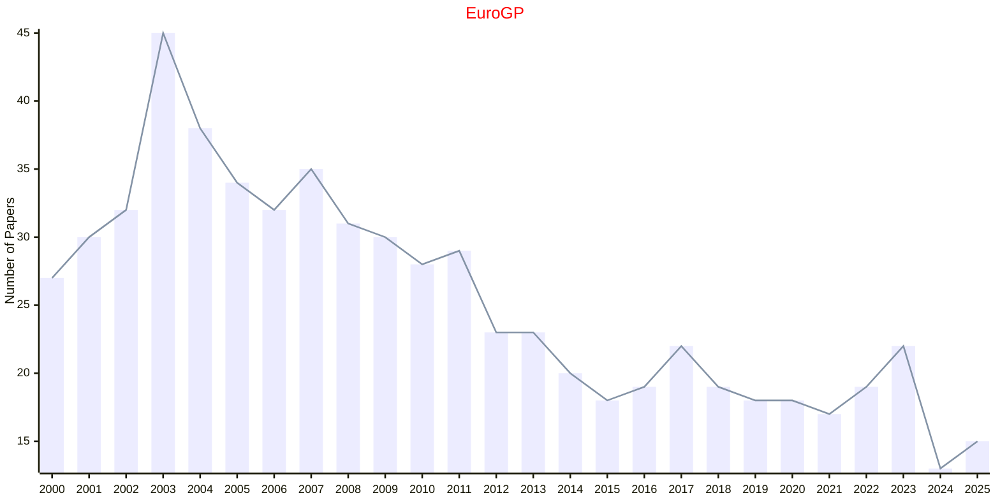

## EvoAPPS

|Publishers|Full/Homepage|Abbr/About|Acronym/Archive|Period/DBLP|Top|CCF|Submission|Days Left|Main Conf.|Days Left|Location|Keywords/Google|
|-         |-            |-         |-              |-          |-  |-  |-         |-        |          |-        |-       |-              |
|[SPRINGER](https://www.springer.com/)|[International Conference on Applications of Evolutionary Computation](https://www.evostar.org/)|Proc. Int. Conf. Appl. Evol. Comput.|[EvoAPPS](https://link.springer.com/conference/evoapplications)|[2010 -](https://dblp.org/db/conf/evoapps/index.html)|False||01/11/2025|**{{ diffDate('2025-11-01') }}**|[08/04/2026](https://www.evostar.org/2026/evoapps/)|**{{ diffDate('2026-04-08') }}**|Toulouse, France|[Evolutionary Computation](https://www.google.com/search?q=Evolutionary+Computation)|

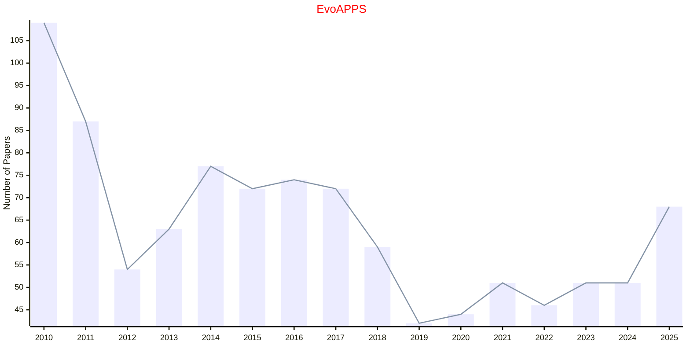

## EvoCOP

|Publishers|Full/Homepage|Abbr/About|Acronym/Archive|Period/DBLP|Top|CCF|Submission|Days Left|Main Conf.|Days Left|Location|Keywords/Google|
|-         |-            |-         |-              |-          |-  |-  |-         |-        |          |-        |-       |-              |
|[SPRINGER](https://www.springer.com/)|[Evolutionary Computation in Combinatorial Optimization](https://www.evostar.org/)|Proc. Eur. Conf. Evol. Comput. Comb. Optim.|[EvoCOP](https://link.springer.com/conference/evocop)|[2004 -](https://dblp.org/db/conf/evocop/index.html)|False||01/11/2025|**{{ diffDate('2025-11-01') }}**|[08/04/2026](https://www.evostar.org/2026/evocop/)|**{{ diffDate('2026-04-08') }}**|Toulouse, France|[Evolutionary Computation](https://www.google.com/search?q=Evolutionary+Computation)|

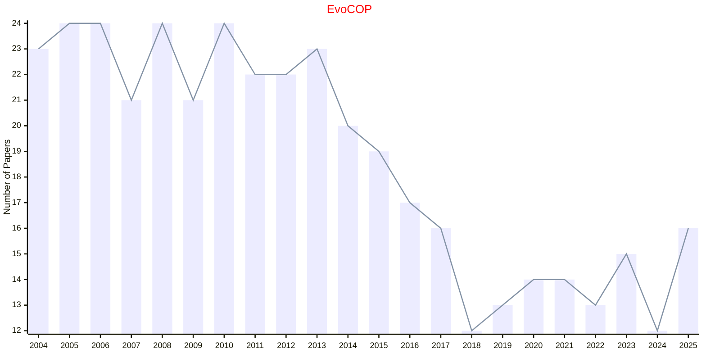

## EvoMUSART

|Publishers|Full/Homepage|Abbr/About|Acronym/Archive|Period/DBLP|Top|CCF|Submission|Days Left|Main Conf.|Days Left|Location|Keywords/Google|
|-         |-            |-         |-              |-          |-  |-  |-         |-        |          |-        |-       |-              |
|[SPRINGER](https://www.springer.com/)|[Artificial Intelligence in Music, Sound, Art and Design](https://www.evostar.org/)|Proc. Int. Conf. Artif. Intell. Music, Sound, Art and Design|[EvoMUSART](https://link.springer.com/conference/evomusart)|[2012 -](https://dblp.org/db/conf/evomusart/index.html)|False||01/11/2025|**{{ diffDate('2025-11-01') }}**|[08/04/2026](https://www.evostar.org/2026/evomusart/)|**{{ diffDate('2026-04-08') }}**|Toulouse, France|[Evolutionary Computation](https://www.google.com/search?q=Evolutionary+Computation)|

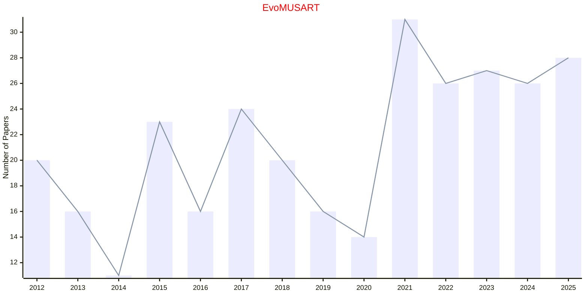

## ICSI

|Publishers|Full/Homepage|Abbr/About|Acronym/Archive|Period/DBLP|Top|CCF|Submission|Days Left|Main Conf.|Days Left|Location|Keywords/Google|
|-         |-            |-         |-              |-          |-  |-  |-         |-        |          |-        |-       |-              |
|[SPRINGER](https://www.springer.com/)|[International Conference on Swarm Intelligence](https://iasei.org/)|Proc. Int. Conf. Swarm Intell.|[ICSI](https://link.springer.com/conference/icsi)|[2010 -](https://dblp.org/db/conf/swarm/index.html)|False||18/04/2025|**{{ diffDate('2025-04-18') }}**|[11/07/2025](https://iasei.org/icsi2025/)|**{{ diffDate('2025-07-11') }}**|Yokohama, Japan|[Evolutionary Computation](https://www.google.com/search?q=Evolutionary+Computation); [Swarm Intelligence](https://www.google.com/search?q=Swarm+Intelligence)|

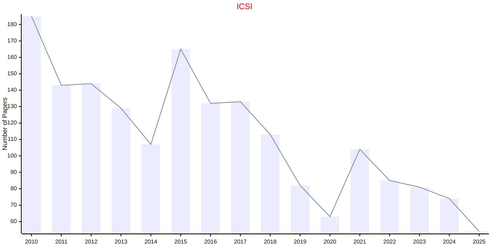

## IJCCI

|Publishers|Full/Homepage|Abbr/About|Acronym/Archive|Period/DBLP|Top|CCF|Submission|Days Left|Main Conf.|Days Left|Location|Keywords/Google|
|-         |-            |-         |-              |-          |-  |-  |-         |-        |          |-        |-       |-              |
|[SPRINGER](https://www.springer.com/)|[International Joint Conference on Computational Intelligence](https://ijcci.scitevents.org/)|Proc. Int. Joint Conf. Comput. Intell.|[IJCCI](https://link.springer.com/conference/ijcci)|[2009 -](https://dblp.org/db/conf/ijcci/index.html)|False||19/05/2025|**{{ diffDate('2025-05-19') }}**|[22/10/2025](https://ijcci.scitevents.org/)|**{{ diffDate('2025-10-22') }}**|Marbella, Spain|[Evolutionary Computation](https://www.google.com/search?q=Evolutionary+Computation)|

## PPSN

|Publishers|Full/Homepage|Abbr/About|Acronym/Archive|Period/DBLP|Top|CCF|Submission|Days Left|Main Conf.|Days Left|Location|Keywords/Google|
|-         |-            |-         |-              |-          |-  |-  |-         |-        |          |-        |-       |-              |
|[SPRINGER](https://www.springer.com/)|Parallel Problem Solving from Nature|Proc. Int. Conf. Parallel Probl. Solving Nat.|[PPSN](https://link.springer.com/conference/ppsn)|[1990 -](https://dblp.org/db/conf/ppsn/index.html)|False|B|28/03/2026|**{{ diffDate('2026-03-28') }}**|[29/08/2026](https://ppsn2026.disi.unitn.it/)|**{{ diffDate('2026-08-29') }}**|Trento, Italy|[Evolutionary Computation](https://www.google.com/search?q=Evolutionary+Computation)|

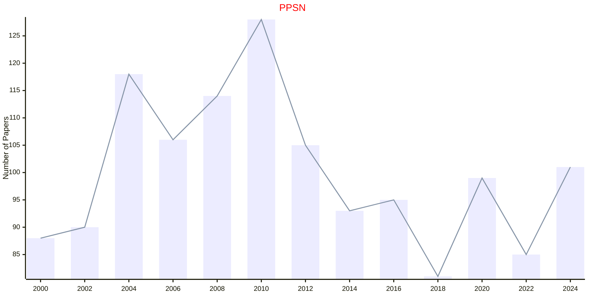

