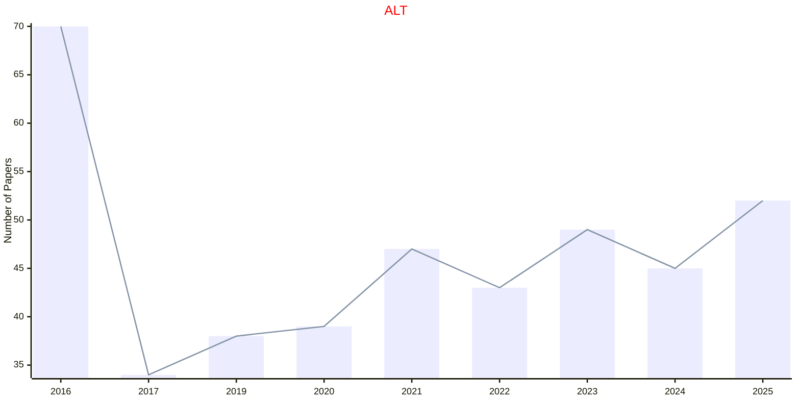
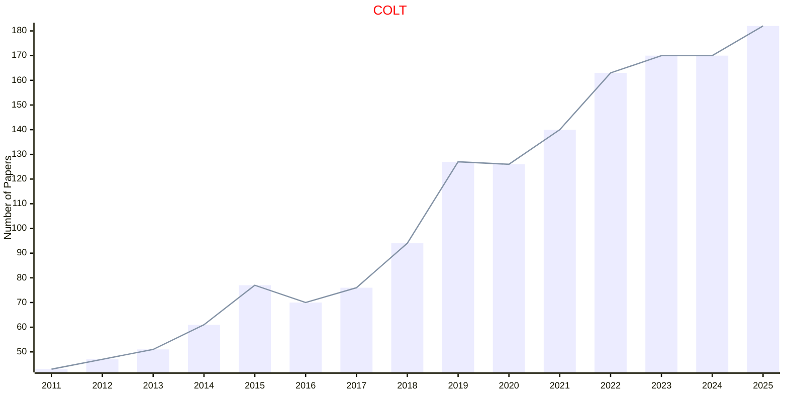

# Learning Theory

## ALT

|Publishers|Full/Homepage|Abbr/About|Acronym/Archive|Period/DBLP|Top|CCF|Submission|Days Left|Main Conf.|Days Left|Location|Keywords/Google|
|-         |-            |-         |-              |-          |-  |-  |-         |-        |          |-        |-       |-              |
|[PMLR](https://proceedings.mlr.press/)|[International Conference on Algorithmic Learning Theory](http://algorithmiclearningtheory.org/)|Proc. Int. Conf. Algorithmic Learn. Theory|[ALT](https://proceedings.mlr.press/)|1990 -|False|C|12/10/2026|**{{ diffDate('2026-10-12') }}**|[09/03/2027](https://algorithmiclearningtheory.org/alt2027/)|**{{ diffDate('2027-03-09') }}**|Leiden, Netherlands|[Learning Theory](https://www.google.com/search?q=Learning+Theory)|

## COLT

|Publishers|Full/Homepage|Abbr/About|Acronym/Archive|Period/DBLP|Top|CCF|Submission|Days Left|Main Conf.|Days Left|Location|Keywords/Google|
|-         |-            |-         |-              |-          |-  |-  |-         |-        |          |-        |-       |-              |
|[PMLR](https://proceedings.mlr.press/)|[Annual Conference On Computational Learning Theory](http://learningtheory.org)|Proc. Conf. Learn. Theory|[COLT](https://dl.acm.org/conference/colt/proceedings)|1988 -|False|B|||[28/06/2027](https://learningtheory.org/colt2027/index.html)|**{{ diffDate('2027-06-28') }}**|Tokyo, JAPAN|[Learning Theory](https://www.google.com/search?q=Learning+Theory)|

