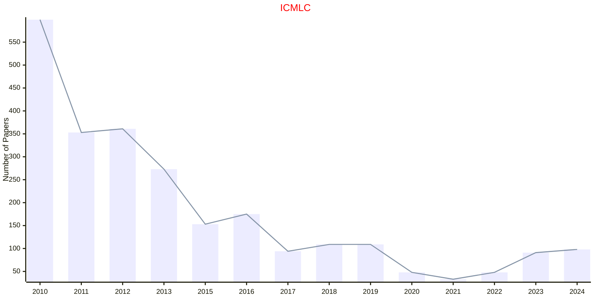
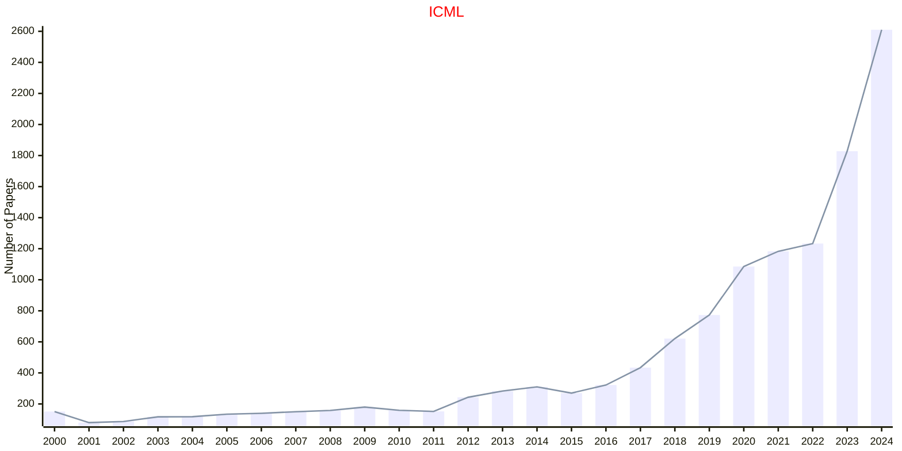

# Machine Learning

## ICMLC

|Publishers|Full/Homepage|Abbr/About|Acronym/Archive|Period/DBLP|Top|CCF|Submission|Days Left|Main Conf.|Days Left|Location|Keywords/Google|
|-         |-            |-         |-              |-          |-  |-  |-         |-        |          |-        |-       |-              |
|[IEEE](https://ieeexplore.ieee.org/)|[IEEE International Conference on Machine Learning and Cybernetics](https://www.icmlc.com/)|Proc. IEEE Int. Conf. Mach. Learn. Cybern.|[ICMLC](https://ieeexplore.ieee.org/xpl/conhome/1000424/all-proceedings)|[2005 -](https://dblp.org/db/conf/icmlc/index.html)|False|||||||[Machine Learning](https://www.google.com/search?q=Machine+Learning)|

## ICML

|Publishers|Full/Homepage|Abbr/About|Acronym/Archive|Period/DBLP|Top|CCF|Submission|Days Left|Main Conf.|Days Left|Location|Keywords/Google|
|-         |-            |-         |-              |-          |-  |-  |-         |-        |          |-        |-       |-              |
|OPEN|[International Conference On Machine Learning](https://icml.cc)|Proc. Annu. Int. Conf. Mach. Learn.|[ICML](https://proceedings.mlr.press/)|1987 -|True|A|01/01/2026|**{{ diffDate('2026-01-01') }}**||||[Artificial Intelligence](https://www.google.com/search?q=Artificial+Intelligence); [Machine Learning](https://www.google.com/search?q=Machine+Learning)|

