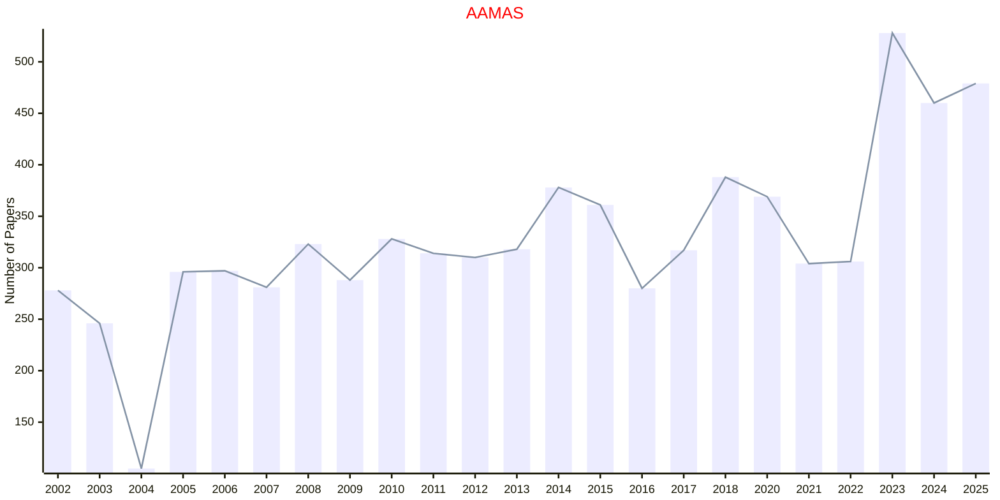

# Multiagent

## AAMAS

|Publishers|Full/Homepage|Abbr/About|Acronym/Archive|Period/DBLP|Top|CCF|Submission|Days Left|Main Conf.|Days Left|Location|Keywords/Google|
|-         |-            |-         |-              |-          |-  |-  |-         |-        |          |-        |-       |-              |
|[ACM](https://www.acm.org/)|[International Conference on Autonomous Agents and Multiagent Systems](https://www.ifaamas.org/)|[Proc. Int. Conf. Auton. Agents Multiagent Syst.](https://www.ifaamas.org/)|[AAMAS](https://dl.acm.org/conference/aamas/proceedings)|2002 -|False|B|01/10/2025|**{{ diffDate('2025-10-01') }}**|[25/05/2026](https://cyprusconferences.org/aamas2026/)|**{{ diffDate('2026-05-25') }}**|Paphos, Cyprus|[Multiagent Systems](https://www.google.com/search?q=Multiagent+Systems)|

