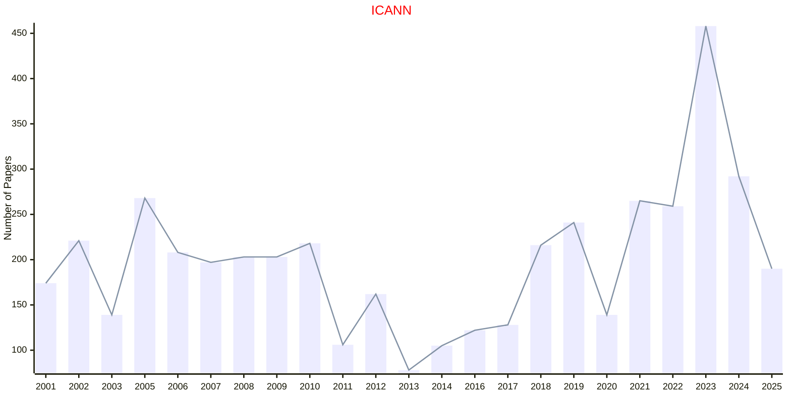

# Neural Networks

## ESANN

|Publishers|Full/Homepage|Abbr/About|Acronym/Archive|Period/DBLP|Top|CCF|Submission|Days Left|Main Conf.|Days Left|Location|Keywords/Google|
|-         |-            |-         |-              |-          |-  |-  |-         |-        |          |-        |-       |-              |
|OPEN|[European Symposium on Artificial Neural Networks](https://www.esann.org/)|Proc. Eur. Symp. Artif. Neural Netw.|ESANN|1993 -|False||19/11/2025|**{{ diffDate('2025-11-19') }}**|[22/04/2026](https://www.esann.org/)|**{{ diffDate('2026-04-22') }}**|Bruges, Belgium|[Neural Networks](https://www.google.com/search?q=Neural+Networks)|

## ICANN

|Publishers|Full/Homepage|Abbr/About|Acronym/Archive|Period/DBLP|Top|CCF|Submission|Days Left|Main Conf.|Days Left|Location|Keywords/Google|
|-         |-            |-         |-              |-          |-  |-  |-         |-        |          |-        |-       |-              |
|[SPRINGER](https://www.springer.com/)|[International Conference on Artificial Neural Networks](https://e-nns.org/)|[Proc. Int. Conf. Artif. Neural Netw. Mach. Learn.](https://e-nns.org/)|[ICANN](https://link.springer.com/conference/icann)|[1991 -](https://dblp.org/db/conf/icann/index.html)|False|C|16/09/2025|**{{ diffDate('2025-09-16') }}**|[27/09/2026](https://waset.org/artificial-neural-networks-conference-in-september-2026-in-hong-kong)|**{{ diffDate('2026-09-27') }}**|Hong Kong, China|[Neural Networks](https://www.google.com/search?q=Neural+Networks)|

