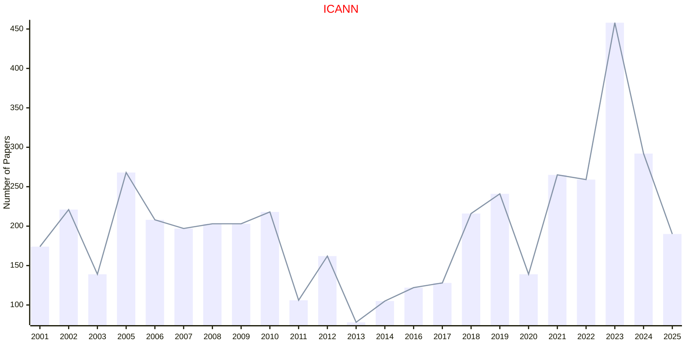

# Neural Networks

## ESANN

|Publishers|Full/Homepage|Abbr/About|Acronym/Archive|Period/DBLP|Top|CCF|Submission|Days Left|Main Conf.|Days Left|Location|Keywords/Google|
|-         |-            |-         |-              |-          |-  |-  |-         |-        |          |-        |-       |-              |
|OPEN|[European Symposium on Artificial Neural Networks](https://www.esann.org/)|Proc. Eur. Symp. Artif. Neural Netw.|ESANN|1993 -|False||18/11/2026|**{{ diffDate('2026-11-18') }}**|[21/04/2027](https://www.esann.org/)|**{{ diffDate('2027-04-21') }}**|Bruges, Belgium|[Neural Networks](https://www.google.com/search?q=Neural+Networks)|

## ICANN

|Publishers|Full/Homepage|Abbr/About|Acronym/Archive|Period/DBLP|Top|CCF|Submission|Days Left|Main Conf.|Days Left|Location|Keywords/Google|
|-         |-            |-         |-              |-          |-  |-  |-         |-        |          |-        |-       |-              |
|[SPRINGER](https://www.springer.com/)|[International Conference on Artificial Neural Networks](https://e-nns.org/)|[Proc. Int. Conf. Artif. Neural Netw. Mach. Learn.](https://e-nns.org/)|[ICANN](https://link.springer.com/conference/icann)|[1991 -](https://dblp.org/db/conf/icann/index.html)|False|C|30/03/2026|**{{ diffDate('2026-03-30') }}**|[14/09/2026](https://e-nns.org/icann2026/)|**{{ diffDate('2026-09-14') }}**|Padua, Italy|[Neural Networks](https://www.google.com/search?q=Neural+Networks)|

```mermaid
---
config:
    xyChart:
        width: 1200
        height: 600
    themeVariables:
        xyChart:
            titleColor: "#ff0000"
---
xychart-beta
    title "ICANN"
    x-axis [2001, 2002, 2003, 2005, 2006, 2007, 2008, 2009, 2010, 2011, 2012, 2013, 2014, 2016, 2017, 2018, 2019, 2020, 2021, 2022, 2023, 2024, 2025]
    y-axis "Number of Papers"
    bar [174, 221, 139, 268, 208, 197, 203, 203, 218, 106, 162, 78, 105, 122, 128, 216, 241, 139, 265, 259, 458, 292, 190]
    line [174, 221, 139, 268, 208, 197, 203, 203, 218, 106, 162, 78, 105, 122, 128, 216, 241, 139, 265, 259, 458, 292, 190]
```

