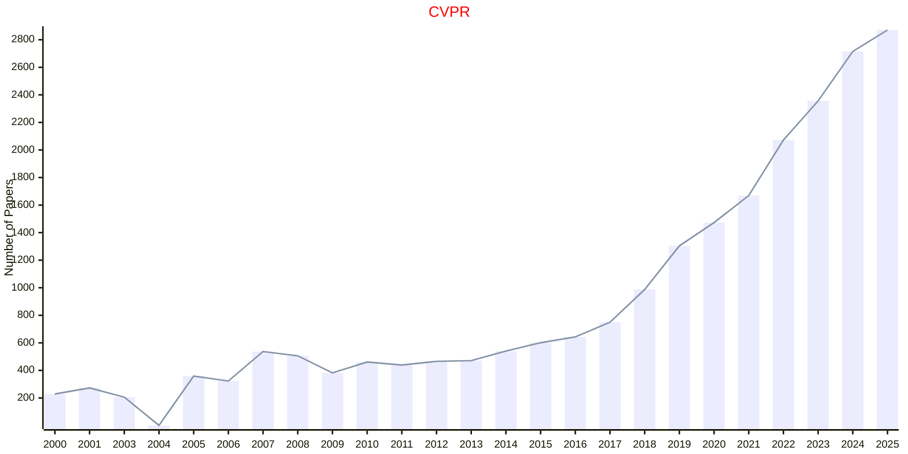

# Pattern Recognition

## CVPR

|Publishers|Full/Homepage|Abbr/About|Acronym/Archive|Period/DBLP|Top|CCF|Submission|Days Left|Main Conf.|Days Left|Location|Keywords/Google|
|-         |-            |-         |-              |-          |-  |-  |-         |-        |          |-        |-       |-              |
|[IEEE](https://ieeexplore.ieee.org/)|[IEEE Conference On Computer Vision And Pattern Recognition](https://cvpr.thecvf.com/)|Proc. IEEE Conf. Comput. Vis. Pattern Recognit.|[CVPR](https://ieeexplore.ieee.org/xpl/conhome/1000147/all-proceedings)|[1988 -](https://dblp.org/db/conf/cvpr/index.html)|True|A|||[06/06/2026](https://cvpr.thecvf.com/Conferences/2026)|**{{ diffDate('2026-06-06') }}**|Denver, CO, USA|[Pattern Recognition](https://www.google.com/search?q=Pattern+Recognition)|

