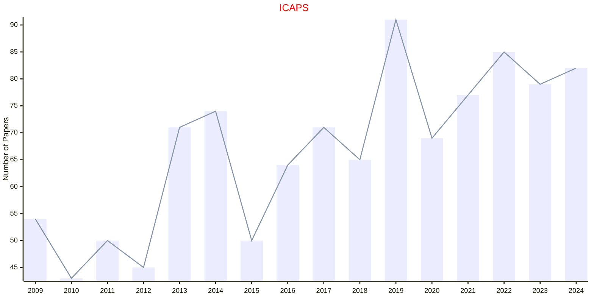

# Planning and Scheduling

## ICAPS

|Publishers|Full/Homepage|Abbr/About|Acronym/Archive|Period/DBLP|Top|CCF|Submission|Days Left|Main Conf.|Days Left|Location|Keywords/Google|
|-         |-            |-         |-              |-          |-  |-  |-         |-        |          |-        |-       |-              |
|[AAAI](https://www.aaai.org/)|[International Conference on Automated Planning and Scheduling](https://www.icaps-conference.org/)|[Proc. Int. Conf. Automat. Plan. Schedul.](https://www.icaps-conference.org/)|[ICAPS](https://ojs.aaai.org/index.php/ICAPS/issue/archive)|1991 -|False|B|01/12/2025|**{{ diffDate('2025-12-01') }}**|[27/06/2026](https://icaps26.icaps-conference.org/)|**{{ diffDate('2026-06-27') }}**|Dublin, Ireland|[Planning and Scheduling](https://www.google.com/search?q=Planning+and+Scheduling)|

