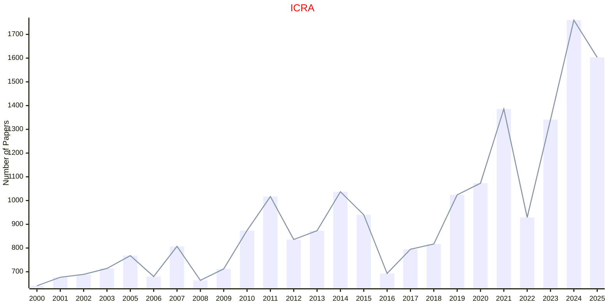
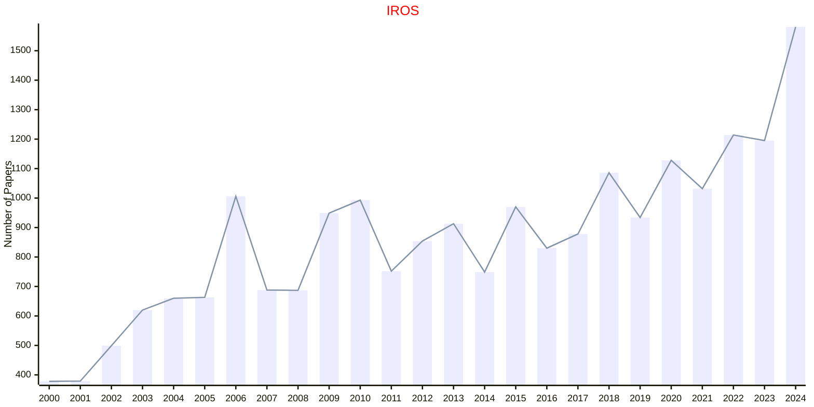
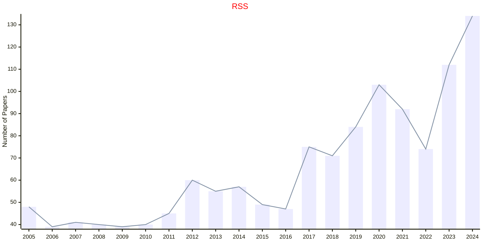

# Robotics and UAV

## ICRA

|Publishers|Full/Homepage|Abbr/About|Acronym/Archive|Period/DBLP|Top|CCF|Submission|Days Left|Main Conf.|Days Left|Location|Keywords/Google|
|-         |-            |-         |-              |-          |-  |-  |-         |-        |          |-        |-       |-              |
|[IEEE](https://ieeexplore.ieee.org/)|[IEEE International Conference on Robotics and Automation](https://www.ieee-ras.org/conferences-workshops/fully-sponsored/icra)|Proc. IEEE Int. Conf. Robot. Automat.|[ICRA](https://ieeexplore.ieee.org/xpl/conhome/1000639/all-proceedings)|[1984 -](https://dblp.org/db/conf/icra/index.html)|False|B|15/09/2025|**{{ diffDate('2025-09-15') }}**|[01/06/2026](https://2026.ieee-icra.org/)|**{{ diffDate('2026-06-01') }}**|Vienna, Austria|[Robotics and UAV](https://www.google.com/search?q=Robotics+and+UAV)|

## IROS

|Publishers|Full/Homepage|Abbr/About|Acronym/Archive|Period/DBLP|Top|CCF|Submission|Days Left|Main Conf.|Days Left|Location|Keywords/Google|
|-         |-            |-         |-              |-          |-  |-  |-         |-        |          |-        |-       |-              |
|[IEEE](https://ieeexplore.ieee.org/)|[IEEE/RSJ International Conference on Intelligent Robots and Systems](https://www.ieee-ras.org/conferences-workshops/financially-co-sponsored/iros)|Proc. IEEE/RSJ Int. Conf. Intell. Robot. Syst.|[IROS](https://ieeexplore.ieee.org/xpl/conhome/1000393/all-proceedings)|[1988 -](https://dblp.org/db/conf/iros/index.html)|False|C|29/03/2026|**{{ diffDate('2026-03-29') }}**|[20/04/2026](https://roboticsforum.org/Conference/2869/IROS/)|**{{ diffDate('2026-04-20') }}**|London, UK|[Intelligent Robots](https://www.google.com/search?q=Intelligent+Robots)|

## CoRL

|Publishers|Full/Homepage|Abbr/About|Acronym/Archive|Period/DBLP|Top|CCF|Submission|Days Left|Main Conf.|Days Left|Location|Keywords/Google|
|-         |-            |-         |-              |-          |-  |-  |-         |-        |          |-        |-       |-              |
|OPEN|[Conference on Robot Learning](https://www.corl.org/)|Proc. Conf. Robot Learn.|CoRL|2017 -|False||||[09/11/2026](https://www.corl.org/)|**{{ diffDate('2026-11-09') }}**|Austin, TX, United States|[Robot Learning](https://www.google.com/search?q=Robot+Learning)|

## RSS

|Publishers|Full/Homepage|Abbr/About|Acronym/Archive|Period/DBLP|Top|CCF|Submission|Days Left|Main Conf.|Days Left|Location|Keywords/Google|
|-         |-            |-         |-              |-          |-  |-  |-         |-        |          |-        |-       |-              |
|OPEN|[Robotics: Science and Systems Conference](https://roboticsconference.org)|Proc. Robot. Sci. Syst.|RSS|[2005 -](https://dblp.org/db/conf/rss/index.html)|False||||[13/07/2026](https://roboticsconference.org)|**{{ diffDate('2026-07-13') }}**|Sydney, Australia|[Robotics and UAV](https://www.google.com/search?q=Robotics+and+UAV)|

