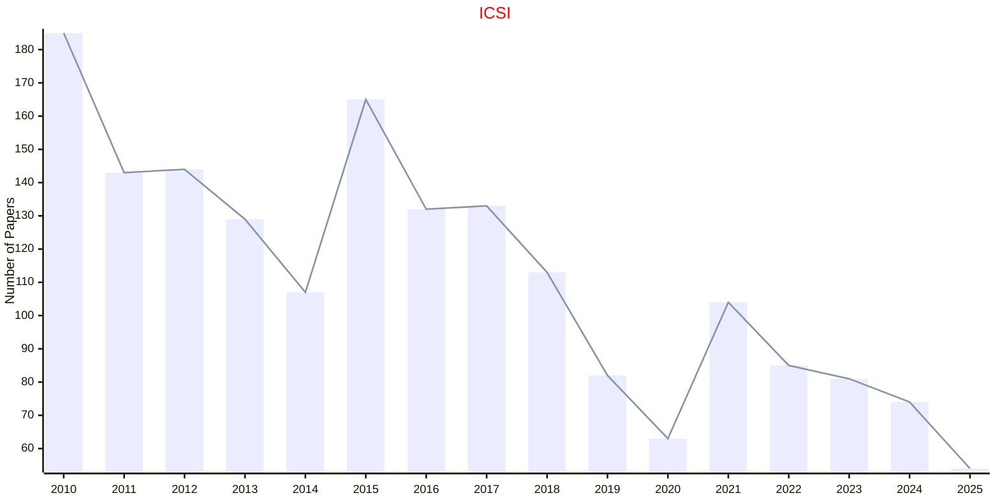

# Swarm Intelligence

## ANTS

|Publishers|Full/Homepage|Abbr/About|Acronym/Archive|Period/DBLP|Top|CCF|Submission|Days Left|Main Conf.|Days Left|Location|Keywords/Google|
|-         |-            |-         |-              |-          |-  |-  |-         |-        |          |-        |-       |-              |
|OPEN|ANTS International Conference on Swarm Intelligence|ANTS Proc. Int. Conf. Swarm Intell.|ANTS|1998 -|False||10/11/2025|**{{ diffDate('2025-11-10') }}**|[08/06/2026](https://ants2026.org/)|**{{ diffDate('2026-06-08') }}**|Darmstadt, Germany|[Evolutionary Computation](https://www.google.com/search?q=Evolutionary+Computation); [Swarm Intelligence](https://www.google.com/search?q=Swarm+Intelligence)|

## ICSI

|Publishers|Full/Homepage|Abbr/About|Acronym/Archive|Period/DBLP|Top|CCF|Submission|Days Left|Main Conf.|Days Left|Location|Keywords/Google|
|-         |-            |-         |-              |-          |-  |-  |-         |-        |          |-        |-       |-              |
|[SPRINGER](https://www.springer.com/)|[International Conference on Swarm Intelligence](https://iasei.org/)|Proc. Int. Conf. Swarm Intell.|[ICSI](https://link.springer.com/conference/icsi)|[2010 -](https://dblp.org/db/conf/swarm/index.html)|False||18/04/2025|**{{ diffDate('2025-04-18') }}**|[11/07/2025](https://iasei.org/icsi2025/)|**{{ diffDate('2025-07-11') }}**|Yokohama, Japan|[Evolutionary Computation](https://www.google.com/search?q=Evolutionary+Computation); [Swarm Intelligence](https://www.google.com/search?q=Swarm+Intelligence)|

