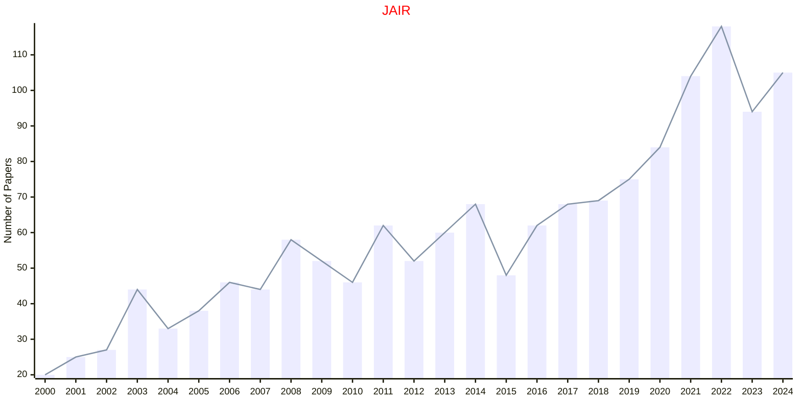

# AAAI

- The data for TOP, CCF, CAS, JCR, and IF are sourced from [easyScholar](https://www.easyscholar.cc/).

## JAIR

|Publishers|Full/Homepage|Abbr/About|Acronym/Issues|Period/DBLP|Top/Early|CCF|CAS|JCR|IF|Keywords/Google|
|-         |-            |-         |-             |-          |-        |-  |-  |-  |- |-              |
|[AAAI](https://www.aaai.org/)|[Journal of Artificial Intelligence Research](https://www.jair.org/index.php/jair)|[J. Artif. Intell. Res.](https://www.jair.org/index.php/jair/about)|[JAIR](https://www.jair.org/index.php/jair/issue/archive)|[1996 -](https://dblp.org/db/journals/jair/index.html)|False|B|3|Q2|4.6|[Artificial Intelligence](https://www.google.com/search?q=Artificial+Intelligence)|

