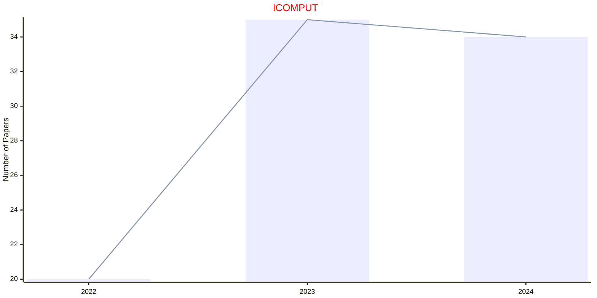
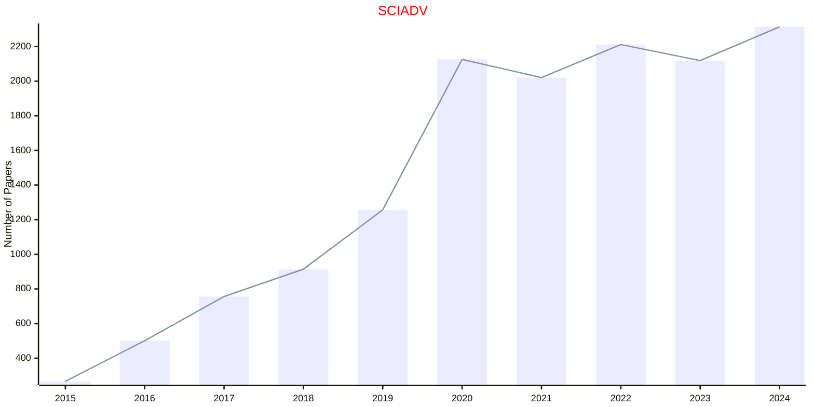
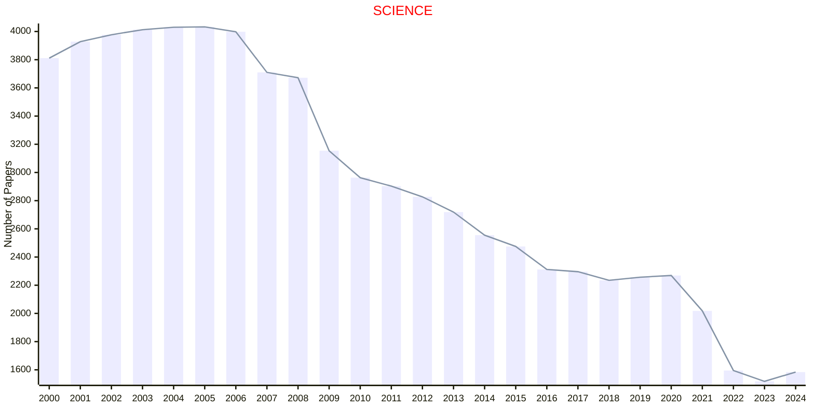
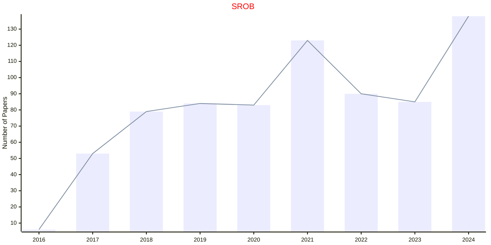
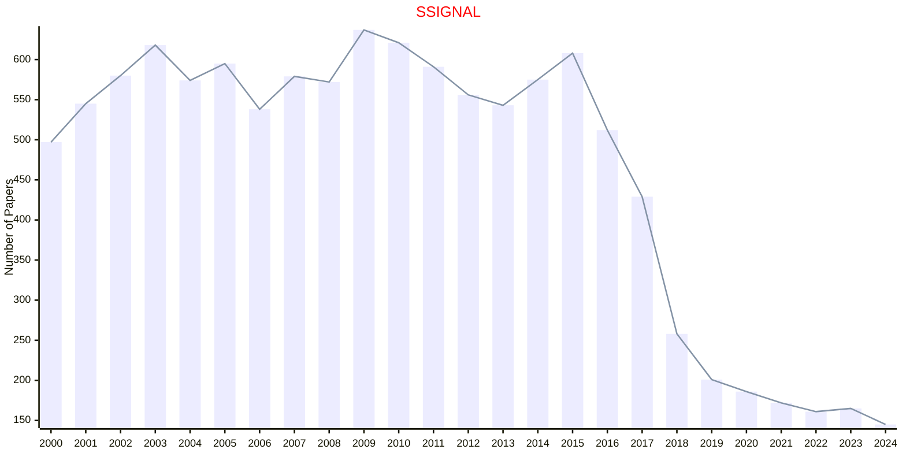

# AAAS

- The data for TOP, CCF, CAS, JCR, and IF are sourced from [easyScholar](https://www.easyscholar.cc/).

## ICOMPUT

|Publishers|Full/Homepage|Abbr/About|Acronym/Issues|Period/DBLP|Top/Early|CCF|CAS|JCR|IF|Keywords/Google|
|-         |-            |-         |-             |-          |-        |-  |-  |-  |- |-              |
|[AAAS](https://www.science.org/)|[Intelligent Computing](https://spj.science.org/journal/icomputing)|[Intell. Comput.](https://spj.science.org/page/icomputing/about)|[ICOMPUT](https://spj.science.org/loi/icomputing)|2022 -|False||||4.5|[Intelligent Computing](https://www.google.com/search?q=Intelligent+Computing)|

## SCIADV

|Publishers|Full/Homepage|Abbr/About|Acronym/Issues|Period/DBLP|Top/Early|CCF|CAS|JCR|IF|Keywords/Google|
|-         |-            |-         |-             |-          |-        |-  |-  |-  |- |-              |
|[AAAS](https://www.science.org/)|[Science Advances](https://www.science.org/journal/sciadv)|[Sci. Adv.](https://www.science.org/content/page/science-advances-mission-and-scope)|[SCIADV](https://www.science.org/loi/sciadv)|2015 -|True||1|Q1|14.1|[Multidisciplinary](https://www.google.com/search?q=Multidisciplinary)|

## SCIENCE

|Publishers|Full/Homepage|Abbr/About|Acronym/Issues|Period/DBLP|Top/Early|CCF|CAS|JCR|IF|Keywords/Google|
|-         |-            |-         |-             |-          |-        |-  |-  |-  |- |-              |
|[AAAS](https://www.science.org/)|[Science](https://www.science.org/journal/science)|[Science](https://www.science.org/content/page/about-science-aaas)|[SCIENCE](https://www.science.org/loi/science)|1880 -|True||1|Q1|49.7|[Multidisciplinary](https://www.google.com/search?q=Multidisciplinary)|

## SROB

|Publishers|Full/Homepage|Abbr/About|Acronym/Issues|Period/DBLP|Top/Early|CCF|CAS|JCR|IF|Keywords/Google|
|-         |-            |-         |-             |-          |-        |-  |-  |-  |- |-              |
|[AAAS](https://www.science.org/)|[Science Robotics](https://www.science.org/journal/scirobotics)|[Sci. Robot.](https://www.science.org/content/page/science-robotics-mission-and-scope)|[SROB](https://www.science.org/loi/scirobotics)|2016 -|True||1|Q1|32.9|[Robotics and UAV](https://www.google.com/search?q=Robotics+and+UAV)|

## SSIGNAL

|Publishers|Full/Homepage|Abbr/About|Acronym/Issues|Period/DBLP|Top/Early|CCF|CAS|JCR|IF|Keywords/Google|
|-         |-            |-         |-             |-          |-        |-  |-  |-  |- |-              |
|[AAAS](https://www.science.org/)|[Science Signaling](https://www.science.org/journal/signaling)|[Sci. Signal.](https://www.science.org/content/page/science-signaling-information)|[SSIGNAL](https://www.science.org/loi/signaling)|1999 -|True||1|Q1|7.3|[Cellular Signaling](https://www.google.com/search?q=Cellular+Signaling)|

