# ACM

- The data for TOP, CCF, CAS, JCR, and IF are sourced from [easyScholar](https://www.easyscholar.cc/).

## CACM

|Publishers|Full/Homepage|Abbr/About|Acronym/Issues|Period/DBLP|Top/Early|CCF|CAS|JCR|IF|Keywords/Google|
|-         |-            |-         |-             |-          |-        |-  |-  |-  |- |-              |
|[ACM](https://www.acm.org/)|[Communications of the ACM](https://dl.acm.org/magazine/cacm)|[Commun. ACM](https://dl.acm.org/magazine/cacm)|[CACM](https://dl.acm.org/loi/cacm)|[1958 -](https://dblp.org/db/journals/cacm/index.html)|False||3|Q1|20.3|[Computer Science](https://www.google.com/search?q=Computer+Science)|

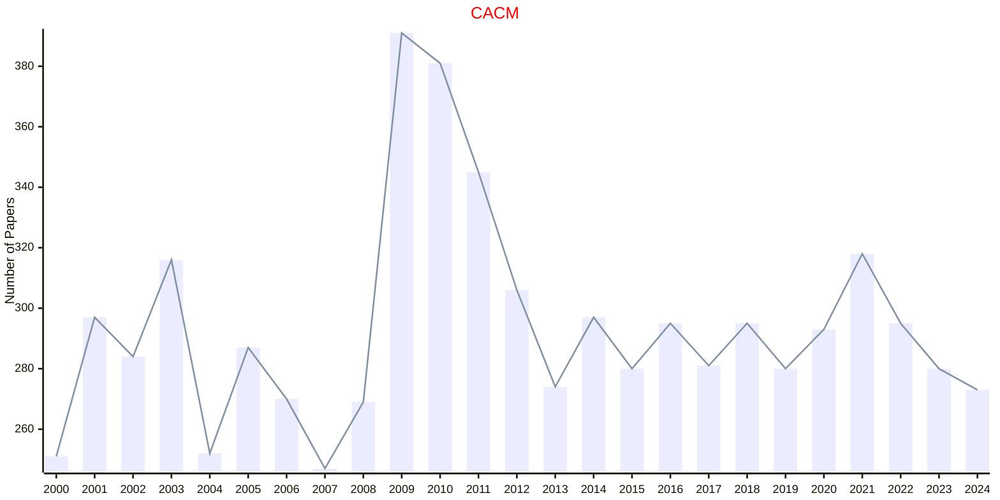

## CSUR

|Publishers|Full/Homepage|Abbr/About|Acronym/Issues|Period/DBLP|Top/Early|CCF|CAS|JCR|IF|Keywords/Google|
|-         |-            |-         |-             |-          |-        |-  |-  |-  |- |-              |
|[ACM](https://www.acm.org/)|[ACM Computing Surveys](https://dl.acm.org/journal/csur)|[ACM Comput. Surv.](https://dl.acm.org/journal/csur)|[CSUR](https://dl.acm.org/loi/csur)|[1969 -](https://dblp.org/db/journals/csur/index.html)|True||1|Q1|26.3|[Computer Science](https://www.google.com/search?q=Computer+Science)|

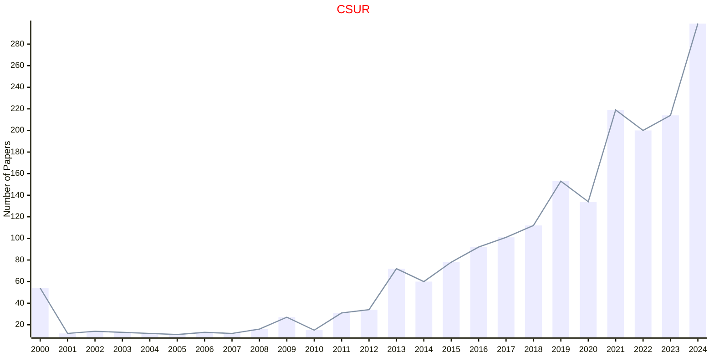

## JACM

|Publishers|Full/Homepage|Abbr/About|Acronym/Issues|Period/DBLP|Top/Early|CCF|CAS|JCR|IF|Keywords/Google|
|-         |-            |-         |-             |-          |-        |-  |-  |-  |- |-              |
|[ACM](https://www.acm.org/)|[Journal of the ACM](https://dl.acm.org/journal/jacm)|[J. ACM](https://dl.acm.org/journal/jacm/about)|[JACM](https://dl.acm.org/loi/jacm)|[1954 -](https://dblp.org/db/journals/jacm/index.html)|False|A|2|Q2|3.3|[Computer Science](https://www.google.com/search?q=Computer+Science)|

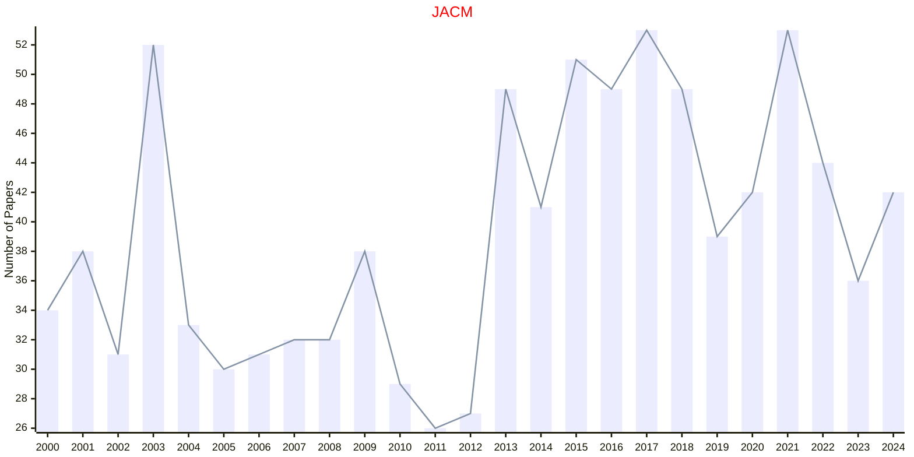

## TAAS

|Publishers|Full/Homepage|Abbr/About|Acronym/Issues|Period/DBLP|Top/Early|CCF|CAS|JCR|IF|Keywords/Google|
|-         |-            |-         |-             |-          |-        |-  |-  |-  |- |-              |
|[ACM](https://www.acm.org/)|[ACM Transactions on Autonomous and Adaptive Systems](https://dl.acm.org/journal/taas)|[ACM Trans. Auton. Adapt. Syst.](https://dl.acm.org/journal/taas/about)|[TAAS](https://dl.acm.org/loi/taas)|[2006 -](https://dblp.org/db/journals/taas/index.html)|False|B|4|Q2|2.1|[Adaptive Systems](https://www.google.com/search?q=Adaptive+Systems)|

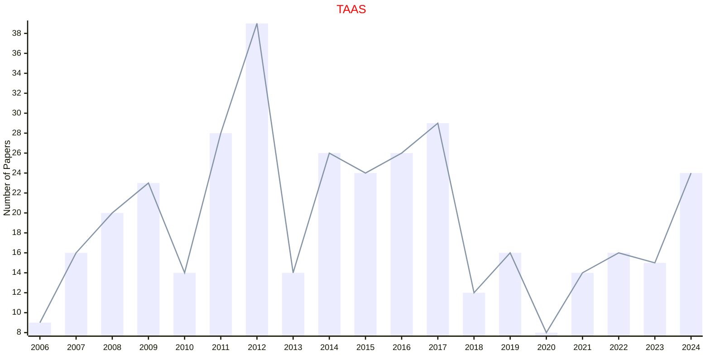

## TACO

|Publishers|Full/Homepage|Abbr/About|Acronym/Issues|Period/DBLP|Top/Early|CCF|CAS|JCR|IF|Keywords/Google|
|-         |-            |-         |-             |-          |-        |-  |-  |-  |- |-              |
|[ACM](https://www.acm.org/)|[ACM Transactions on Architecture and Code Optimization](https://dl.acm.org/journal/taco)|[ACM Trans. Archit. Code Optim.](https://dl.acm.org/journal/taco/about)|[TACO](https://dl.acm.org/loi/taco)|[2004 -](https://dblp.org/db/journals/taco/index.html)|False|A|3|Q2|1.9|[Code Optimization](https://www.google.com/search?q=Code+Optimization); [Computer Architecture](https://www.google.com/search?q=Computer+Architecture)|

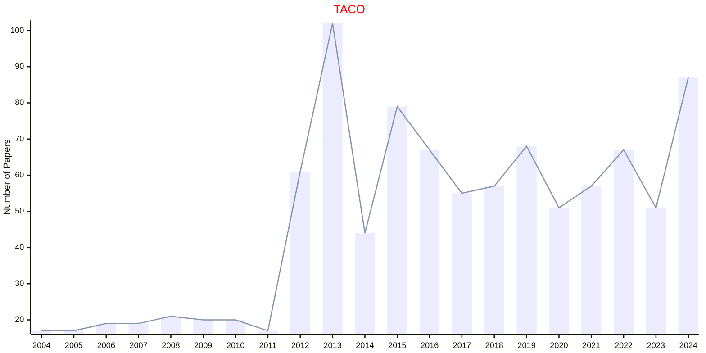

## TAP

|Publishers|Full/Homepage|Abbr/About|Acronym/Issues|Period/DBLP|Top/Early|CCF|CAS|JCR|IF|Keywords/Google|
|-         |-            |-         |-             |-          |-        |-  |-  |-  |- |-              |
|[ACM](https://www.acm.org/)|[ACM Transactions on Applied Perception](https://dl.acm.org/journal/tap)|[ACM Trans. Appl. Perc.](https://dl.acm.org/journal/tap/about)|[TAP](https://dl.acm.org/loi/tap)|[2004 -](https://dblp.org/db/journals/tap/index.html)|False|B|3|Q3|2.5|[Computer Science](https://www.google.com/search?q=Computer+Science); [Psychology](https://www.google.com/search?q=Psychology)|

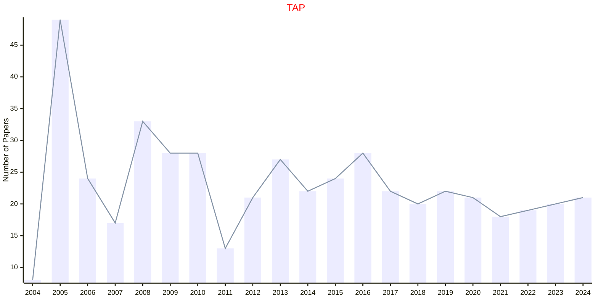

## TELO

|Publishers|Full/Homepage|Abbr/About|Acronym/Issues|Period/DBLP|Top/Early|CCF|CAS|JCR|IF|Keywords/Google|
|-         |-            |-         |-             |-          |-        |-  |-  |-  |- |-              |
|[ACM](https://www.acm.org/)|[ACM Transactions on Evolutionary Learning and Optimization](https://dlnext.acm.org/journal/telo)|[ACM Trans. Evol. Learn. Optim.](https://dlnext.acm.org/journal/telo/about)|[TELO](https://dl.acm.org/loi/telo)|[2021 -](https://dblp.org/db/journals/telo/index.html)|False|||||[Evolutionary Computation](https://www.google.com/search?q=Evolutionary+Computation); [Machine Learning](https://www.google.com/search?q=Machine+Learning)|

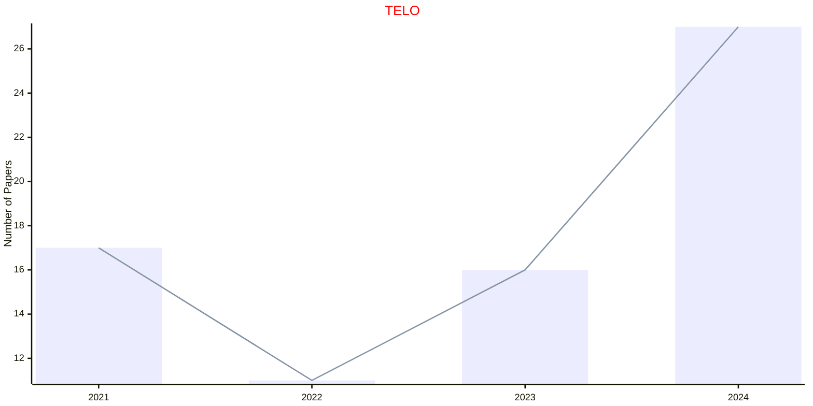

## TIIS

|Publishers|Full/Homepage|Abbr/About|Acronym/Issues|Period/DBLP|Top/Early|CCF|CAS|JCR|IF|Keywords/Google|
|-         |-            |-         |-             |-          |-        |-  |-  |-  |- |-              |
|[ACM](https://www.acm.org/)|[ACM Transactions on Interactive Intelligent Systems](https://dl.acm.org/journal/tiis)|[ACM Trans. Interact. Intell. Syst.](https://dl.acm.org/journal/tiis/about)|[TIIS](https://dl.acm.org/loi/tiis)|[2011 -](https://dblp.org/db/journals/tiis/index.html)|False|C|4|Q2|5.1|[Interactive Intelligent Systems](https://www.google.com/search?q=Interactive+Intelligent+Systems)|

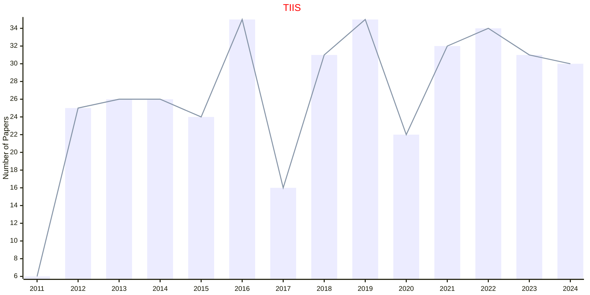

## TIST

|Publishers|Full/Homepage|Abbr/About|Acronym/Issues|Period/DBLP|Top/Early|CCF|CAS|JCR|IF|Keywords/Google|
|-         |-            |-         |-             |-          |-        |-  |-  |-  |- |-              |
|[ACM](https://www.acm.org/)|[ACM Transactions on Intelligent Systems and Technology](https://dl.acm.org/journal/tist)|[ACM Trans. Intell. Syst. Technol.](https://dl.acm.org/journal/tist/about)|[TIST](https://dl.acm.org/loi/tist)|[2010 -](https://dblp.org/db/journals/tist/index.html)|False||3|Q1|8.4|[Intelligent Systems](https://www.google.com/search?q=Intelligent+Systems)|

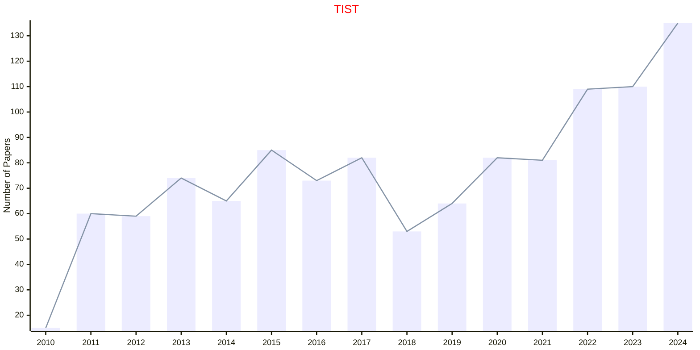

## TKDD

|Publishers|Full/Homepage|Abbr/About|Acronym/Issues|Period/DBLP|Top/Early|CCF|CAS|JCR|IF|Keywords/Google|
|-         |-            |-         |-             |-          |-        |-  |-  |-  |- |-              |
|[ACM](https://www.acm.org/)|[ACM Transactions on Knowledge Discovery from Data](https://dl.acm.org/journal/tkdd)|[ACM Trans. knowl. Discov. Data](https://dl.acm.org/journal/tkdd/about)|[TKDD](https://dl.acm.org/loi/tkdd)|[2007 -](https://dblp.org/db/journals/tkdd/index.html)|False|B|3|Q1|4.9|[Data Mining](https://www.google.com/search?q=Data+Mining); [Knowledge Discovery](https://www.google.com/search?q=Knowledge+Discovery)|

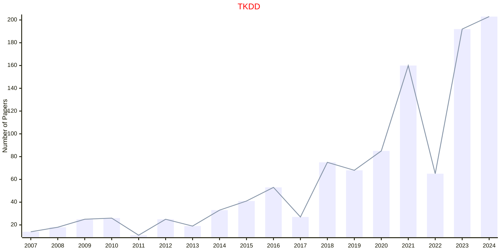

## TMIS

|Publishers|Full/Homepage|Abbr/About|Acronym/Issues|Period/DBLP|Top/Early|CCF|CAS|JCR|IF|Keywords/Google|
|-         |-            |-         |-             |-          |-        |-  |-  |-  |- |-              |
|[ACM](https://www.acm.org/)|[ACM Transactions on Management Information Systems](https://dl.acm.org/journal/tmis)|[ACM Trans. Manag. Inf. Sys.](https://dl.acm.org/journal/tmis/about)|[TMIS](https://dl.acm.org/loi/tmis)|[2010 -](https://dblp.org/db/journals/tmis/index.html)|False||4||3.2|[Information Systems](https://www.google.com/search?q=Information+Systems); [Information Technology](https://www.google.com/search?q=Information+Technology)|

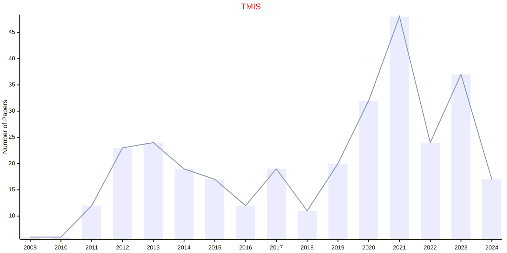

## TOCS

|Publishers|Full/Homepage|Abbr/About|Acronym/Issues|Period/DBLP|Top/Early|CCF|CAS|JCR|IF|Keywords/Google|
|-         |-            |-         |-             |-          |-        |-  |-  |-  |- |-              |
|[ACM](https://www.acm.org/)|[ACM Transactions on Computer Systems](https://dl.acm.org/journal/tocs)|[ACM Trans. Comput. Syst.](https://dl.acm.org/journal/tocs/about)|[TOCS](https://dl.acm.org/loi/tocs)|[1994 -](https://dblp.org/db/journals/tocs/index.html)|False|A|4|Q2|2.4|[Computer Systems](https://www.google.com/search?q=Computer+Systems)|

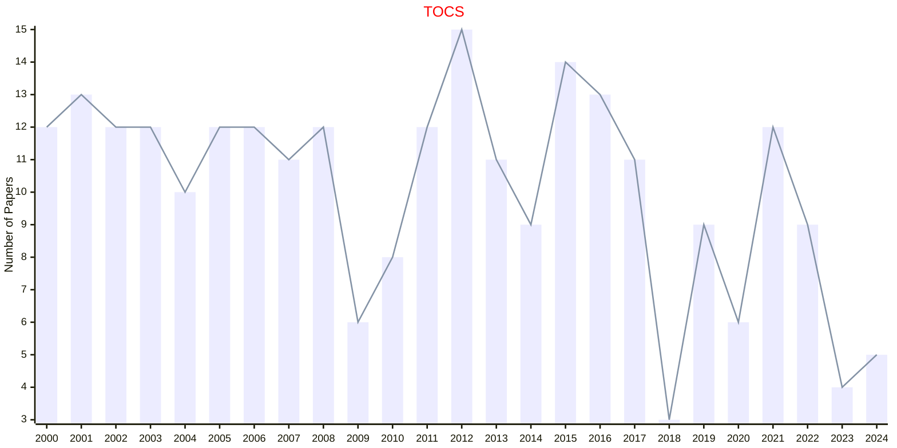

## TODAES

|Publishers|Full/Homepage|Abbr/About|Acronym/Issues|Period/DBLP|Top/Early|CCF|CAS|JCR|IF|Keywords/Google|
|-         |-            |-         |-             |-          |-        |-  |-  |-  |- |-              |
|[ACM](https://www.acm.org/)|[ACM Transactions on Design Automation of Electronic Systems](https://dl.acm.org/journal/todaes)|[ACM Trans. Des. Autom. Electron. Syst.](https://dl.acm.org/journal/todaes/about)|[TODAES](https://dl.acm.org/loi/todaes)|[1996 -](https://dblp.org/db/journals/todaes/index.html)|False|B|4|Q3|1.9|[Electronic Systems](https://www.google.com/search?q=Electronic+Systems)|

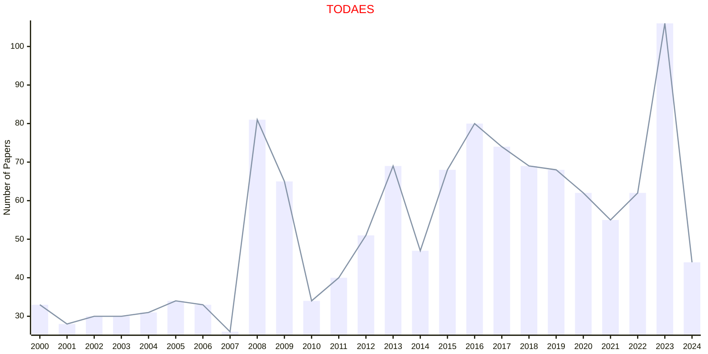

## TOG

|Publishers|Full/Homepage|Abbr/About|Acronym/Issues|Period/DBLP|Top/Early|CCF|CAS|JCR|IF|Keywords/Google|
|-         |-            |-         |-             |-          |-        |-  |-  |-  |- |-              |
|[ACM](https://www.acm.org/)|[ACM Transactions on Graphics](https://dl.acm.org/journal/tog)|[ACM Trans. Graph.](https://dl.acm.org/journal/tog/about)|[TOG](https://dl.acm.org/loi/tog)|[1982 -](https://dblp.org/db/journals/tog/index.html)|True|A|1|Q1|10.9|[Graphics](https://www.google.com/search?q=Graphics)|

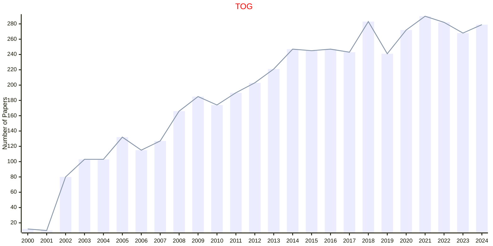

## TOMS

|Publishers|Full/Homepage|Abbr/About|Acronym/Issues|Period/DBLP|Top/Early|CCF|CAS|JCR|IF|Keywords/Google|
|-         |-            |-         |-             |-          |-        |-  |-  |-  |- |-              |
|[ACM](https://www.acm.org/)|[ACM Transactions on Mathematical Software](https://dl.acm.org/journal/toms)|[ACM Trans. Math. Softw.](https://dl.acm.org/journal/toms/about)|[TOMS](https://dl.acm.org/loi/toms)|[1975 -](https://dblp.org/db/journals/toms/index.html)|False|B|2|Q1|3.3|[Mathematical Software](https://www.google.com/search?q=Mathematical+Software)|

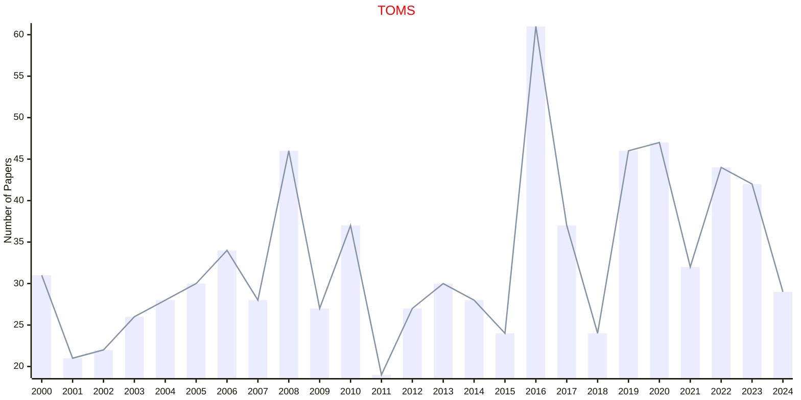

## TOSEM

|Publishers|Full/Homepage|Abbr/About|Acronym/Issues|Period/DBLP|Top/Early|CCF|CAS|JCR|IF|Keywords/Google|
|-         |-            |-         |-             |-          |-        |-  |-  |-  |- |-              |
|[ACM](https://www.acm.org/)|[ACM Transactions on Software Engineering and Methodology](https://dl.acm.org/journal/tosem)|[ACM Trans. Softw. Eng. Methodol.](https://dl.acm.org/journal/tosem/about)|[TOSEM](https://dl.acm.org/loi/tosem)|[1992 -](https://dblp.org/db/journals/tosem/index.html)|True|A|1|Q1|6.3|[Software Engineering](https://www.google.com/search?q=Software+Engineering)|

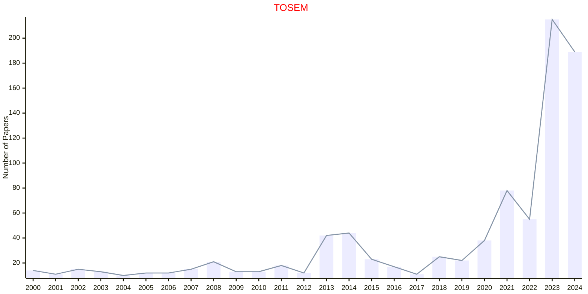

## TSLP

|Publishers|Full/Homepage|Abbr/About|Acronym/Issues|Period/DBLP|Top/Early|CCF|CAS|JCR|IF|Keywords/Google|
|-         |-            |-         |-             |-          |-        |-  |-  |-  |- |-              |
|[ACM](https://www.acm.org/)|[ACM Transactions on Speech and Language Processing](https://dl.acm.org/journal/tslp)|[ACM Trans. Speech Lang. Process.](https://dl.acm.org/journal/tslp)|[TSLP](https://dl.acm.org/loi/tslp)|[2004 - 2013](https://dblp.org/db/journals/tslp/index.html)|False|B||||[Natural Language Processing](https://www.google.com/search?q=Natural+Language+Processing)|

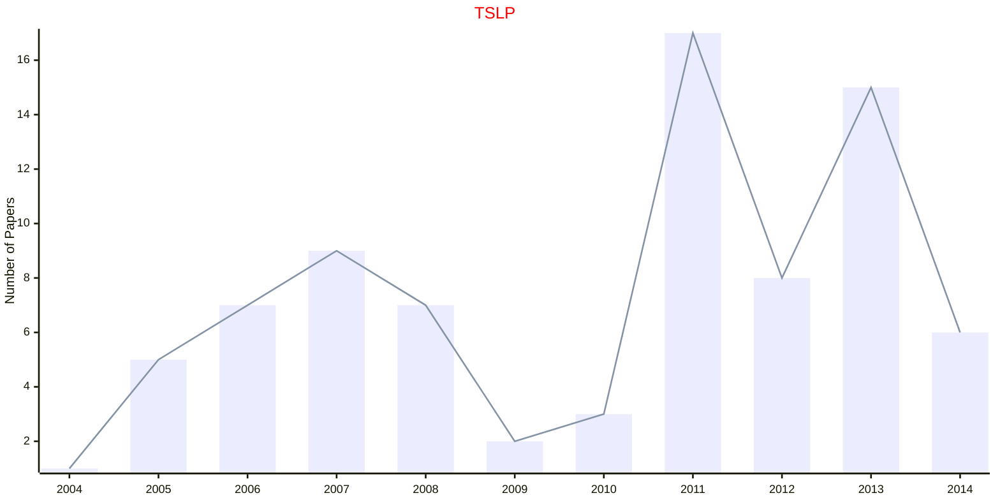

