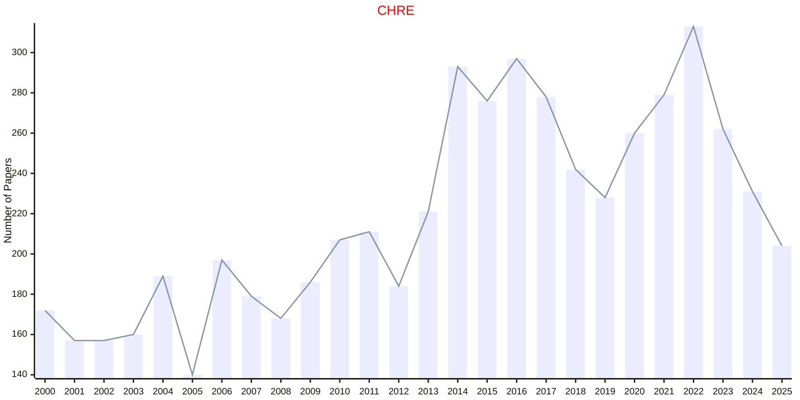
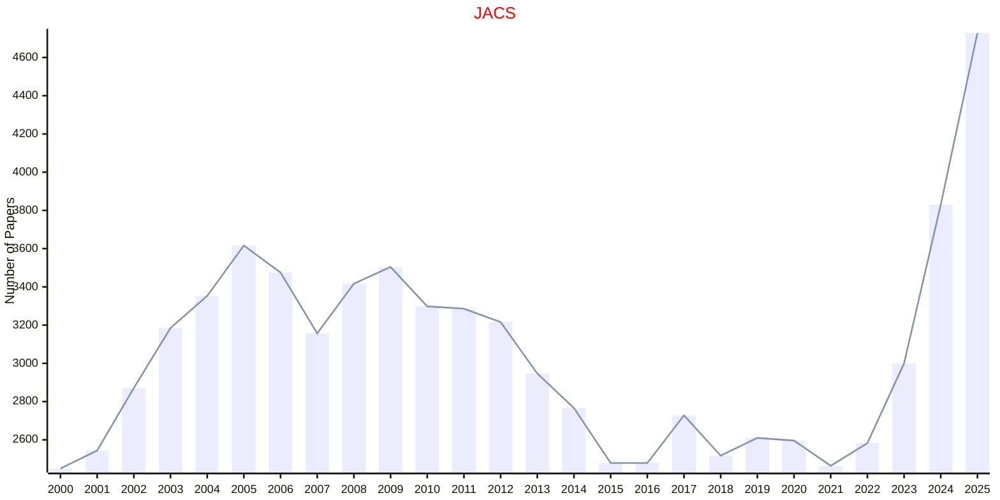

# ACS

- The data for TOP, CCF, CAS, JCR, and IF are sourced from [easyScholar](https://www.easyscholar.cc/).

## CHRE

|Publishers|Full/Homepage|Abbr/About|Acronym/Issues|Period/DBLP|Top/Early|CCF|CAS|JCR|IF|Keywords/Google|
|-         |-            |-         |-             |-          |-        |-  |-  |-  |- |-              |
|[ACS](https://www.acs.org/)|[Chemical Reviews](https://pubs.acs.org/journal/chreay)|[Chem. Rev.](https://pubs.acs.org/page/chreay/about.html)|[CHRE](https://pubs.acs.org/loi/chreay)|1924 -|True||1|Q1|67.5|[Chemical Reviews](https://www.google.com/search?q=Chemical+Reviews); [Chemistry](https://www.google.com/search?q=Chemistry)|

## JACS

|Publishers|Full/Homepage|Abbr/About|Acronym/Issues|Period/DBLP|Top/Early|CCF|CAS|JCR|IF|Keywords/Google|
|-         |-            |-         |-             |-          |-        |-  |-  |-  |- |-              |
|[ACS](https://www.acs.org/)|[Journal of the American Chemical Society](https://pubs.acs.org/journal/jacsat)|[J. Am. Chem. Soc.](https://pubs.acs.org/page/jacsat/about.html)|[JACS](https://pubs.acs.org/loi/jacsat)|1879 -|True||1|Q1|15.6|[Chemistry](https://www.google.com/search?q=Chemistry)|

