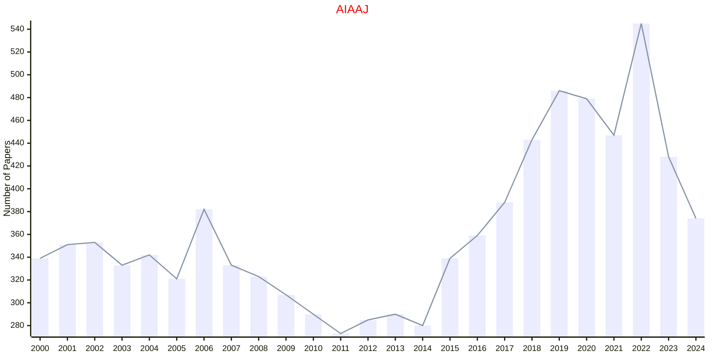
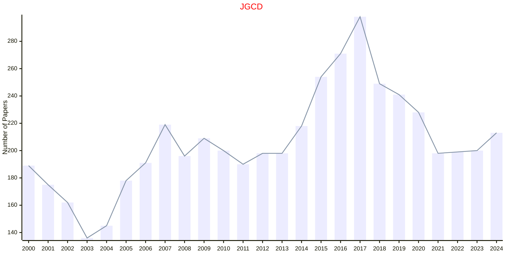

# AIAA

- The data for TOP, CCF, CAS, JCR, and IF are sourced from [easyScholar](https://www.easyscholar.cc/).

## AIAAJ

|Publishers|Full/Homepage|Abbr/About|Acronym/Issues|Period/DBLP|Top/Early|CCF|CAS|JCR|IF|Keywords/Google|
|-         |-            |-         |-             |-          |-        |-  |-  |-  |- |-              |
|[AIAA](https://www.aiaa.org/)|[AIAA Journal](https://arc.aiaa.org/journal/aiaaj)|[AIAA J.](https://arc.aiaa.org/aiaaj/about)|[AIAAJ](https://arc.aiaa.org/loi/aiaaj)|1963 -|False||3|Q1|3.2|[Aeronautics and Astronautics](https://www.google.com/search?q=Aeronautics+and+Astronautics)|

## JGCD

|Publishers|Full/Homepage|Abbr/About|Acronym/Issues|Period/DBLP|Top/Early|CCF|CAS|JCR|IF|Keywords/Google|
|-         |-            |-         |-             |-          |-        |-  |-  |-  |- |-              |
|[AIAA](https://www.aiaa.org/)|[Journal of Guidance, Control, and Dynamics](https://arc.aiaa.org/journal/jgcd)|[J. Guid. Contr. Dyn.](https://arc.aiaa.org/jgcd/about)|[JGCD](https://arc.aiaa.org/loi/jgcd)|1978 -|False||3|Q1|3.1|[Aeronautics and Astronautics](https://www.google.com/search?q=Aeronautics+and+Astronautics)|

