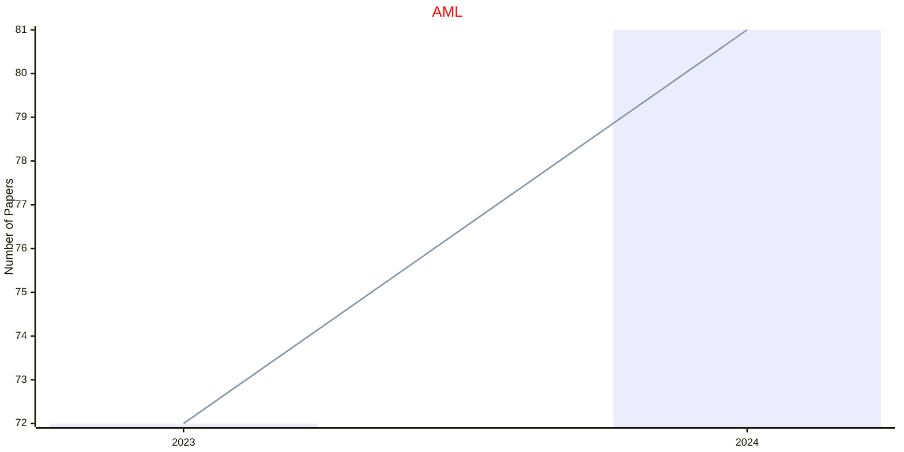
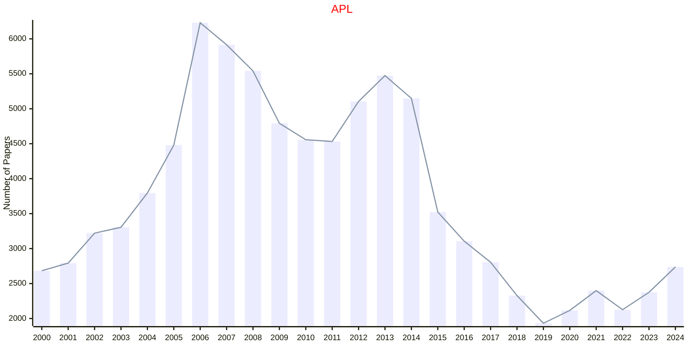
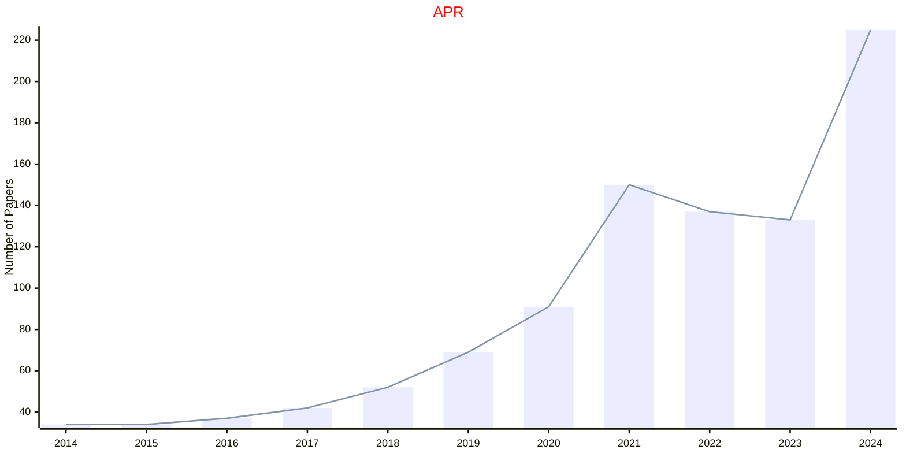
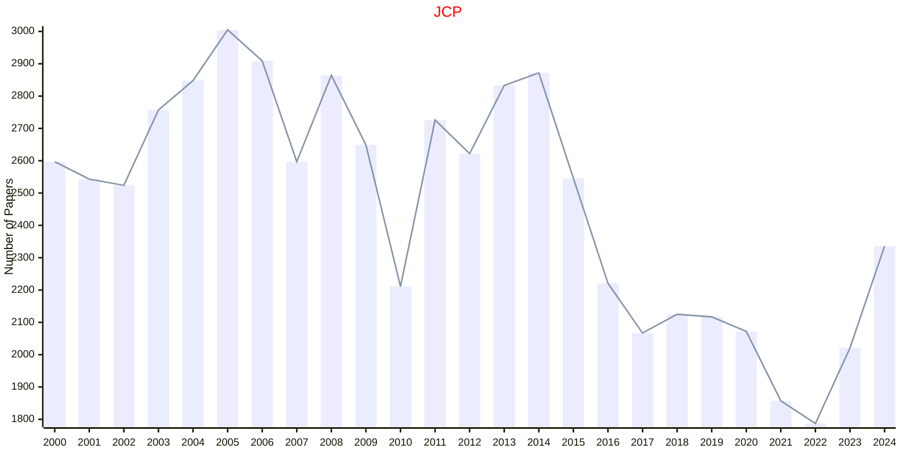
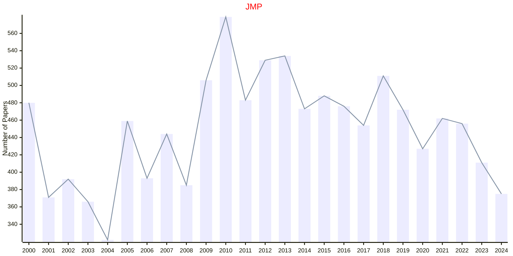

# AIP

- The data for TOP, CCF, CAS, JCR, and IF are sourced from [easyScholar](https://www.easyscholar.cc/).

## AML

|Publishers|Full/Homepage|Abbr/About|Acronym/Issues|Period/DBLP|Top/Early|CCF|CAS|JCR|IF|Keywords/Google|
|-         |-            |-         |-             |-          |-        |-  |-  |-  |- |-              |
|[AIP](https://pubs.aip.org/)|[APL Machine Learning](https://pubs.aip.org/aip/aml)|[APL Mach. Learn.](https://pubs.aip.org/aip/aml/pages/about)|[AML](https://pubs.aip.org/aip/aml/issue)|2023 -|False|||||[Machine Learning](https://www.google.com/search?q=Machine+Learning)|

## APL

|Publishers|Full/Homepage|Abbr/About|Acronym/Issues|Period/DBLP|Top/Early|CCF|CAS|JCR|IF|Keywords/Google|
|-         |-            |-         |-             |-          |-        |-  |-  |-  |- |-              |
|[AIP](https://pubs.aip.org/)|[Applied Physics Letters](https://pubs.aip.org/aip/apl)|[Appl. Phys. Lett.](https://pubs.aip.org/aip/apl/pages/about)|[APL](https://pubs.aip.org/aip/apl/issue)|1962 -|False||2|Q2|3.6|[Applied Physics](https://www.google.com/search?q=Applied+Physics)|

## APR

|Publishers|Full/Homepage|Abbr/About|Acronym/Issues|Period/DBLP|Top/Early|CCF|CAS|JCR|IF|Keywords/Google|
|-         |-            |-         |-             |-          |-        |-  |-  |-  |- |-              |
|[AIP](https://pubs.aip.org/)|[Applied Physics Reviews](https://pubs.aip.org/aip/apr)|[Appl. Phys. Rev.](https://pubs.aip.org/aip/apr/pages/about)|[APR](https://pubs.aip.org/aip/apr/issue)|2014 -|True||2|Q1|15.2|[Applied Physics](https://www.google.com/search?q=Applied+Physics)|

## JCP

|Publishers|Full/Homepage|Abbr/About|Acronym/Issues|Period/DBLP|Top/Early|CCF|CAS|JCR|IF|Keywords/Google|
|-         |-            |-         |-             |-          |-        |-  |-  |-  |- |-              |
|[AIP](https://pubs.aip.org/)|[Journal of Chemical Physics](https://aip.scitation.org/journal/jcp)|[J. Chem. Phys.](https://pubs.aip.org/aip/jcp/pages/about)|[JCP](https://pubs.aip.org/aip/jcp/issue)|1933 -|False||2|Q2|3.8|[Chemical Physics](https://www.google.com/search?q=Chemical+Physics)|

## JMP

|Publishers|Full/Homepage|Abbr/About|Acronym/Issues|Period/DBLP|Top/Early|CCF|CAS|JCR|IF|Keywords/Google|
|-         |-            |-         |-             |-          |-        |-  |-  |-  |- |-              |
|[AIP](https://pubs.aip.org/)|[Journal of Mathematical Physics](https://pubs.aip.org/aip/jmp)|[J. Math. Phys.](https://pubs.aip.org/aip/jmp/pages/about)|[JMP](https://pubs.aip.org/aip/jmp/issue)|1960 -|False||3|Q3|1.4|[Mathematical Physics](https://www.google.com/search?q=Mathematical+Physics)|

