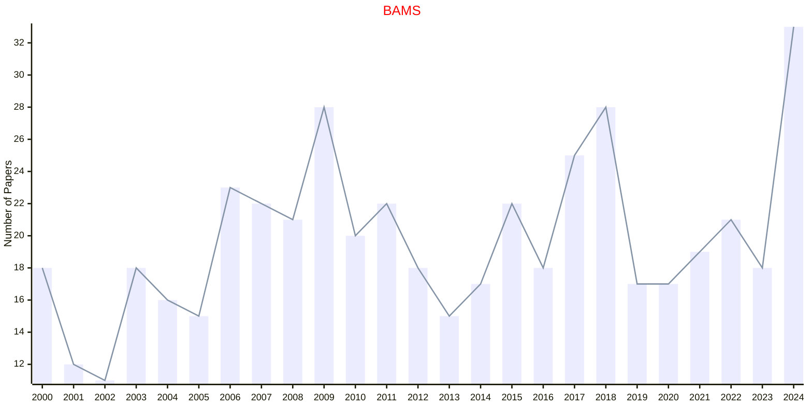
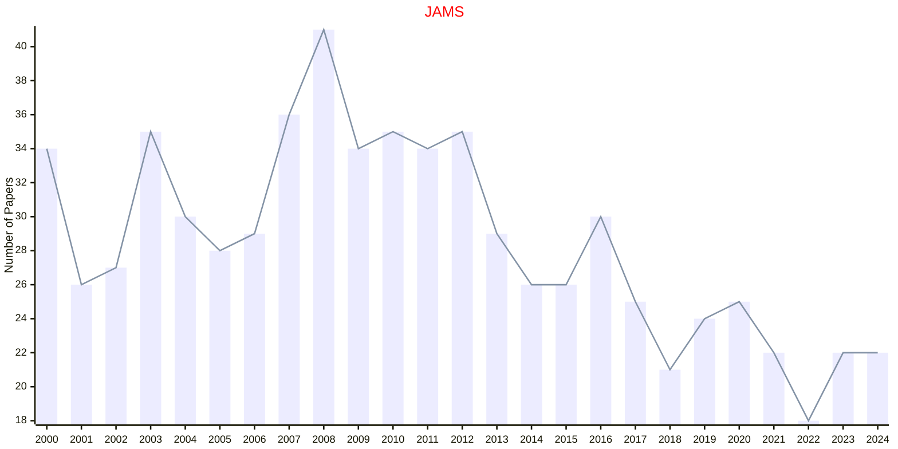
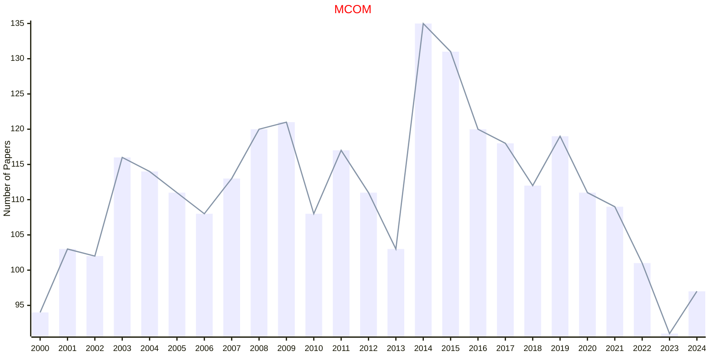

# AMS

- The data for TOP, CCF, CAS, JCR, and IF are sourced from [easyScholar](https://www.easyscholar.cc/).

## BAMS

|Publishers|Full/Homepage|Abbr/About|Acronym/Issues|Period/DBLP|Top/Early|CCF|CAS|JCR|IF|Keywords/Google|
|-         |-            |-         |-             |-          |-        |-  |-  |-  |- |-              |
|[AMS](https://www.ams.org/)|[Bulletin of the American Mathematical Society](https://www.ams.org/journals/bull)|[Bull. Am. Math. Soc.](https://www.ams.org/publications/journals/journalsframework/aboutbull)|[BAMS](https://www.ams.org/journals/bull/all_issues.html?active=allissues)|1891 -|False||2|Q1|2.1|[Mathematics](https://www.google.com/search?q=Mathematics)|

## JAMS

|Publishers|Full/Homepage|Abbr/About|Acronym/Issues|Period/DBLP|Top/Early|CCF|CAS|JCR|IF|Keywords/Google|
|-         |-            |-         |-             |-          |-        |-  |-  |-  |- |-              |
|[AMS](https://www.ams.org/)|[Journal of the American Mathematical Society](https://www.ams.org/journals/jams)|[J. Am. Math. Soc.](https://www.ams.org/publications/journals/journalsframework/aboutjams)|[JAMS](https://www.ams.org/journals/jams/all_issues.html?active=allissues)|1988 -|True||1|Q1|4.1|[Mathematics](https://www.google.com/search?q=Mathematics)|

## MCOM

|Publishers|Full/Homepage|Abbr/About|Acronym/Issues|Period/DBLP|Top/Early|CCF|CAS|JCR|IF|Keywords/Google|
|-         |-            |-         |-             |-          |-        |-  |-  |-  |- |-              |
|[AMS](https://www.ams.org/)|[Mathematics of Computation](https://www.ams.org/journals/mcom)|[Math. Comput.](https://www.ams.org/publications/journals/journalsframework/aboutmcom)|[MCOM](https://www.ams.org/journals/mcom/all_issues.html?active=allissues)|1943 -|True||1|Q1|2.2|[Computational Mathematics](https://www.google.com/search?q=Computational+Mathematics)|

