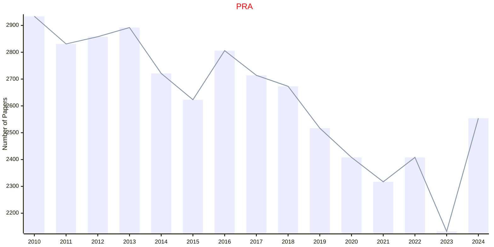
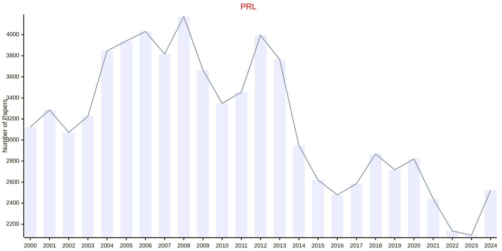
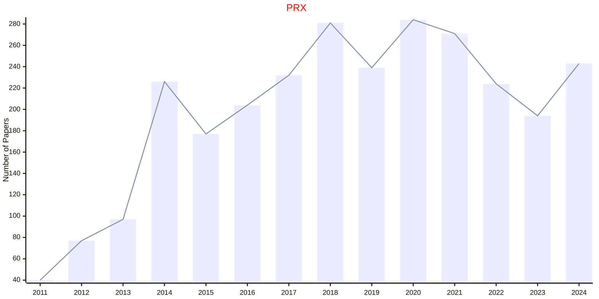
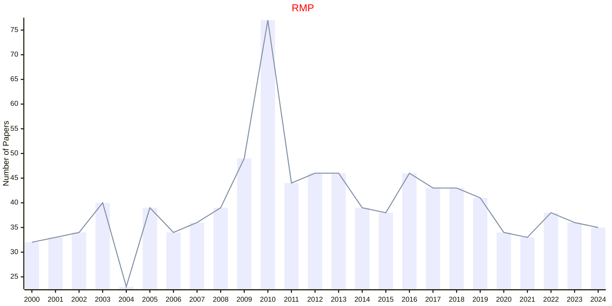

# APS

- The data for TOP, CCF, CAS, JCR, and IF are sourced from [easyScholar](https://www.easyscholar.cc/).

## PRA

|Publishers|Full/Homepage|Abbr/About|Acronym/Issues|Period/DBLP|Top/Early|CCF|CAS|JCR|IF|Keywords/Google|
|-         |-            |-         |-             |-          |-        |-  |-  |-  |- |-              |
|[APS](https://journals.aps.org)|[Physical Review A](https://journals.aps.org/pra)|[Phys. Rev. A](https://journals.aps.org/pra/about)|[PRA](https://journals.aps.org/pra/issues)|1970 -|False||2|Q2|3.0|[Physical Review](https://www.google.com/search?q=Physical+Review); [Physics](https://www.google.com/search?q=Physics)|

## PRL

|Publishers|Full/Homepage|Abbr/About|Acronym/Issues|Period/DBLP|Top/Early|CCF|CAS|JCR|IF|Keywords/Google|
|-         |-            |-         |-             |-          |-        |-  |-  |-  |- |-              |
|[APS](https://journals.aps.org)|[Physical Review Letters](https://journals.aps.org/prl)|[Phys. Rev. Lett.](https://journals.aps.org/prl/about)|[PRL](https://journals.aps.org/prl/issues)|1958 -|True||1|Q1|9.1|[Physical Review](https://www.google.com/search?q=Physical+Review); [Physics](https://www.google.com/search?q=Physics)|

## PRX

|Publishers|Full/Homepage|Abbr/About|Acronym/Issues|Period/DBLP|Top/Early|CCF|CAS|JCR|IF|Keywords/Google|
|-         |-            |-         |-             |-          |-        |-  |-  |-  |- |-              |
|[APS](https://journals.aps.org)|[Physical Review X](https://journals.aps.org/prx)|[Phys. Rev. X](https://journals.aps.org/prx/about)|[PRX](https://journals.aps.org/prx/issues)|2011 -|True||1|Q1|15.4|[Physical Review](https://www.google.com/search?q=Physical+Review); [Physics](https://www.google.com/search?q=Physics)|

## RMP

|Publishers|Full/Homepage|Abbr/About|Acronym/Issues|Period/DBLP|Top/Early|CCF|CAS|JCR|IF|Keywords/Google|
|-         |-            |-         |-             |-          |-        |-  |-  |-  |- |-              |
|[APS](https://journals.aps.org)|[Review Modern Physics](https://journals.aps.org/rmp)|[Rev. Mod. Phys.](https://journals.aps.org/rmp/about)|[RMP](https://journals.aps.org/rmp/issues)|1929 -|False|||||[Physical Review](https://www.google.com/search?q=Physical+Review); [Physics](https://www.google.com/search?q=Physics)|

