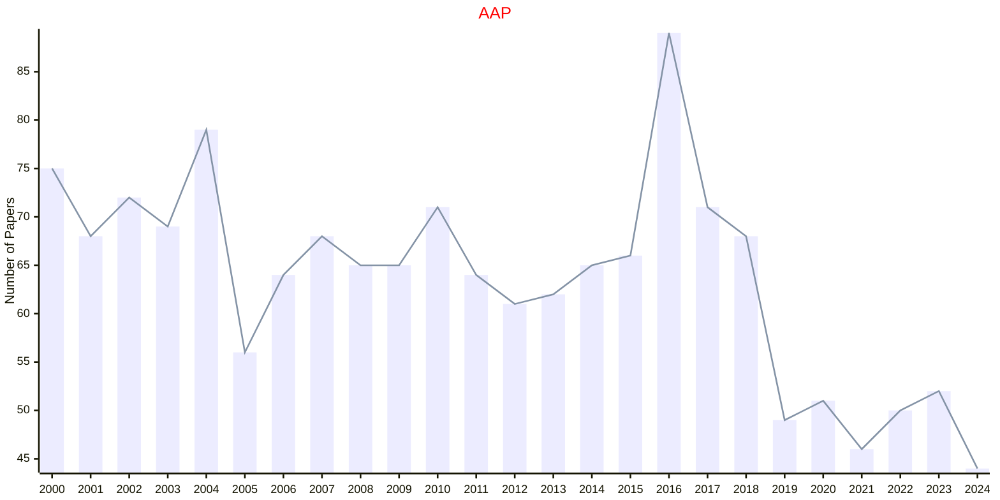
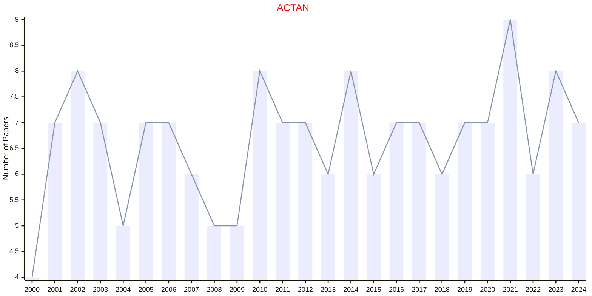
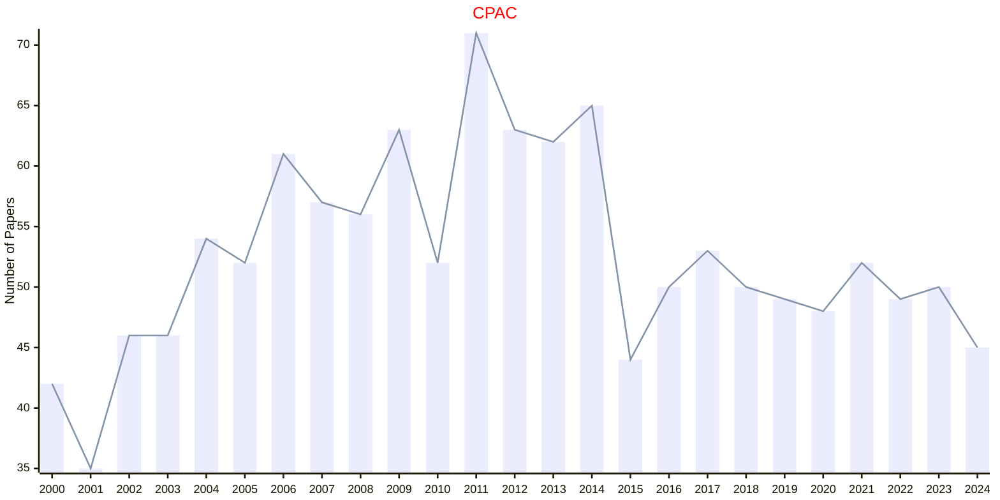
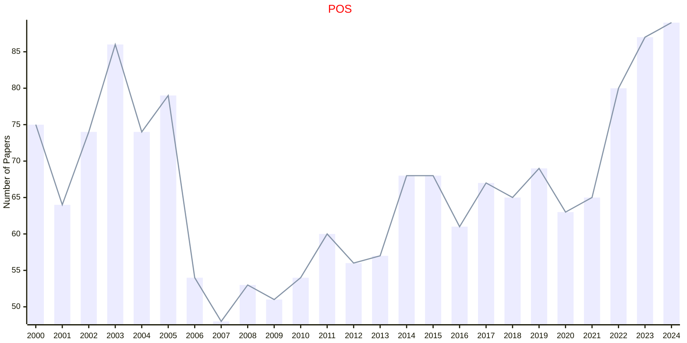

# CAMBRIDGE

- The data for TOP, CCF, CAS, JCR, and IF are sourced from [easyScholar](https://www.easyscholar.cc/).

## AAP

|Publishers|Full/Homepage|Abbr/About|Acronym/Issues|Period/DBLP|Top/Early|CCF|CAS|JCR|IF|Keywords/Google|
|-         |-            |-         |-             |-          |-        |-  |-  |-  |- |-              |
|[CAMBRIDGE](https://www.cambridge.org/universitypress)|[Advances in Applied Probability](https://www.cambridge.org/core/journals/advances-in-applied-probability)|[Adv. Appl. Probab.](https://www.cambridge.org/core/journals/advances-in-applied-probability/information/about-this-journal)|[AAP](https://www.cambridge.org/core/journals/advances-in-applied-probability/all-issues)|1969 -|False||3|Q2|1.2|[Applied Probability](https://www.google.com/search?q=Applied+Probability)|

## ACTAN

|Publishers|Full/Homepage|Abbr/About|Acronym/Issues|Period/DBLP|Top/Early|CCF|CAS|JCR|IF|Keywords/Google|
|-         |-            |-         |-             |-          |-        |-  |-  |-  |- |-              |
|[CAMBRIDGE](https://www.cambridge.org/universitypress)|[Acta Numerica](https://www.cambridge.org/core/journals/acta-numerica)|[Acta Numer.](https://www.cambridge.org/core/journals/acta-numerica/information/about-this-journal)|[ACTAN](https://www.cambridge.org/core/journals/acta-numerica/all-issues)|1992 -|True||1|Q1|22.3|[Computational Mathematics](https://www.google.com/search?q=Computational+Mathematics)|

## CPAC

|Publishers|Full/Homepage|Abbr/About|Acronym/Issues|Period/DBLP|Top/Early|CCF|CAS|JCR|IF|Keywords/Google|
|-         |-            |-         |-             |-          |-        |-  |-  |-  |- |-              |
|[CAMBRIDGE](https://www.cambridge.org/universitypress)|[Combinatorics, Probability & Computing](https://www.cambridge.org/core/journals/combinatorics-probability-and-computing)|[Comb. Probab. Comput.](https://www.cambridge.org/core/journals/combinatorics-probability-and-computing/information/about-this-journal)|[CPAC](https://www.cambridge.org/core/journals/combinatorics-probability-and-computing/all-issues)|1992 -|False||3|Q2|0.9|[Probability and Statistics](https://www.google.com/search?q=Probability+and+Statistics)|

## POS

|Publishers|Full/Homepage|Abbr/About|Acronym/Issues|Period/DBLP|Top/Early|CCF|CAS|JCR|IF|Keywords/Google|
|-         |-            |-         |-             |-          |-        |-  |-  |-  |- |-              |
|[CAMBRIDGE](https://www.cambridge.org/universitypress)|[Philosophy of Science](https://www.cambridge.org/core/journals/philosophy-of-science)|[Philos. Sci.](https://www.cambridge.org/core/journals/philosophy-of-science/information/about-this-journal)|[POS](https://www.cambridge.org/core/journals/philosophy-of-science/all-issues)|1934 -|False||2|Q1|1.5|[Philosophy](https://www.google.com/search?q=Philosophy)|

