# ELSEVIER

- The data for TOP, CCF, CAS, JCR, and IF are sourced from [easyScholar](https://www.easyscholar.cc/).

## AIJ

|Publishers|Full/Homepage|Abbr/About|Acronym/Issues|Period/DBLP|Top/Early|CCF|CAS|JCR|IF|Keywords/Google|
|-         |-            |-         |-             |-          |-        |-  |-  |-  |- |-              |
|[ELSEVIER](https://www.sciencedirect.com/)|[Artificial Intelligence](https://www.sciencedirect.com/journal/artificial-intelligence)|[Artif. Intell.](https://www.sciencedirect.com/journal/artificial-intelligence/about/aims-and-scope)|[AIJ](https://www.sciencedirect.com/journal/artificial-intelligence/issues)|1970 -|False|A|2|Q2|6.4|[Artificial Intelligence](https://www.google.com/search?q=Artificial+Intelligence)|

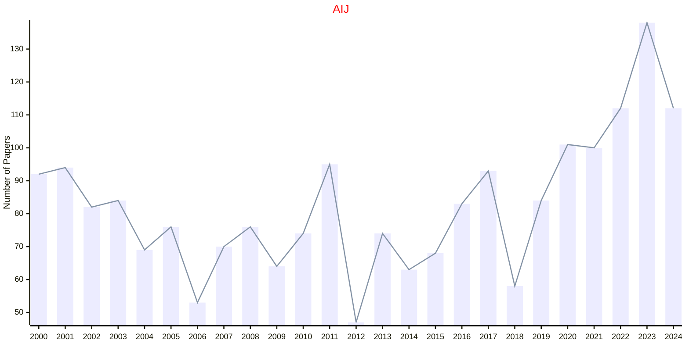

## AMC

|Publishers|Full/Homepage|Abbr/About|Acronym/Issues|Period/DBLP|Top/Early|CCF|CAS|JCR|IF|Keywords/Google|
|-         |-            |-         |-             |-          |-        |-  |-  |-  |- |-              |
|[ELSEVIER](https://www.sciencedirect.com/)|[Applied Mathematics and Computation](https://www.sciencedirect.com/journal/applied-mathematics-and-computation)|[Appl. Math. Comput.](https://www.sciencedirect.com/journal/applied-mathematics-and-computation/about/aims-and-scope)|[AMC](https://www.sciencedirect.com/journal/applied-mathematics-and-computation/issues)|1975 -|False||2|Q1|3.2|[Applied Mathematics](https://www.google.com/search?q=Applied+Mathematics); [Computational Mathematics](https://www.google.com/search?q=Computational+Mathematics)|

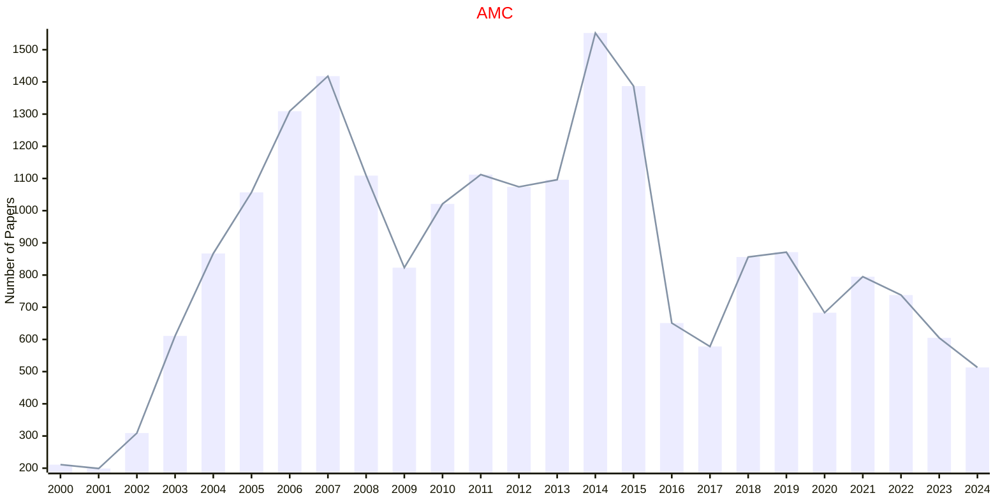

## ARTMED

|Publishers|Full/Homepage|Abbr/About|Acronym/Issues|Period/DBLP|Top/Early|CCF|CAS|JCR|IF|Keywords/Google|
|-         |-            |-         |-             |-          |-        |-  |-  |-  |- |-              |
|[ELSEVIER](https://www.sciencedirect.com/)|[Artificial Intelligence in Medicine](https://www.sciencedirect.com/journal/artificial-intelligence-in-medicine)|[Artif. Intell. Med.](https://www.sciencedirect.com/journal/artificial-intelligence-in-medicine/about/aims-and-scope)|[ARTMED](https://www.sciencedirect.com/journal/artificial-intelligence-in-medicine/issues)|1989 -|True|C|2|Q1|6.9|[Artificial Intelligence](https://www.google.com/search?q=Artificial+Intelligence); [Medicine](https://www.google.com/search?q=Medicine)|

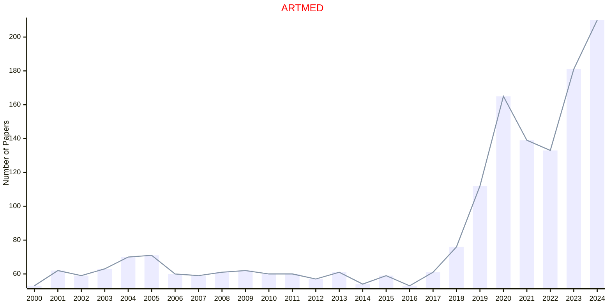

## ASOC

|Publishers|Full/Homepage|Abbr/About|Acronym/Issues|Period/DBLP|Top/Early|CCF|CAS|JCR|IF|Keywords/Google|
|-         |-            |-         |-             |-          |-        |-  |-  |-  |- |-              |
|[ELSEVIER](https://www.sciencedirect.com/)|[Applied Soft Computing](https://www.sciencedirect.com/journal/applied-soft-computing)|[Appl. Soft. Comput.](https://www.sciencedirect.com/journal/applied-soft-computing/about/aims-and-scope)|[ASOC](https://www.sciencedirect.com/journal/applied-soft-computing/issues)|2001 -|True||2|Q1|6.9|[Artificial Intelligence](https://www.google.com/search?q=Artificial+Intelligence); [Evolutionary Computation](https://www.google.com/search?q=Evolutionary+Computation)|

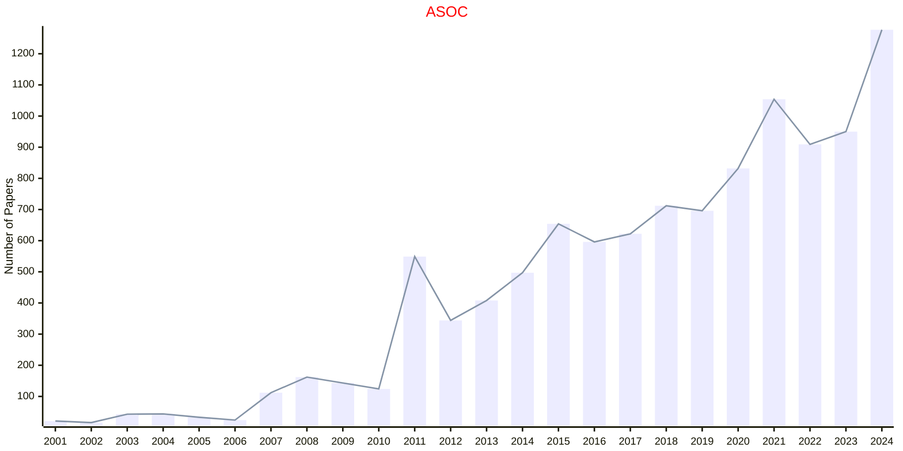

## AUTOM

|Publishers|Full/Homepage|Abbr/About|Acronym/Issues|Period/DBLP|Top/Early|CCF|CAS|JCR|IF|Keywords/Google|
|-         |-            |-         |-             |-          |-        |-  |-  |-  |- |-              |
|[ELSEVIER](https://www.sciencedirect.com/)|[Automatica](https://www.sciencedirect.com/journal/automatica)|[Automatica](https://www.sciencedirect.com/journal/automatica/about/aims-and-scope)|[AUTOM](https://www.sciencedirect.com/journal/automatica/issues)|1963 -|False||2|Q1|6.3|[Control and Automation](https://www.google.com/search?q=Control+and+Automation)|

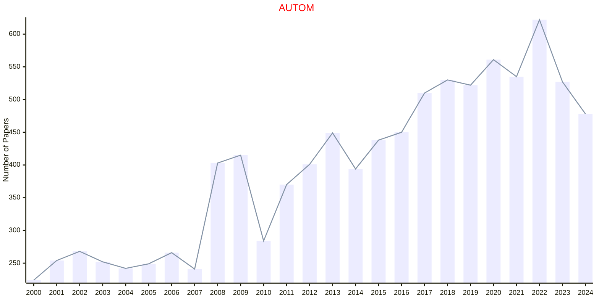

## CMA

|Publishers|Full/Homepage|Abbr/About|Acronym/Issues|Period/DBLP|Top/Early|CCF|CAS|JCR|IF|Keywords/Google|
|-         |-            |-         |-             |-          |-        |-  |-  |-  |- |-              |
|[ELSEVIER](https://www.sciencedirect.com/)|[Computers & Mathematics with Applications](https://www.sciencedirect.com/journal/computers-and-mathematics-with-applications)|[Comput. Meth. Appl.](https://www.sciencedirect.com/journal/computers-and-mathematics-with-applications/about/aims-and-scope)|[CMA](https://www.sciencedirect.com/journal/computers-and-mathematics-with-applications/issues)|1975 -|False||2|Q1|2.5|[Applied Mathematics](https://www.google.com/search?q=Applied+Mathematics)|

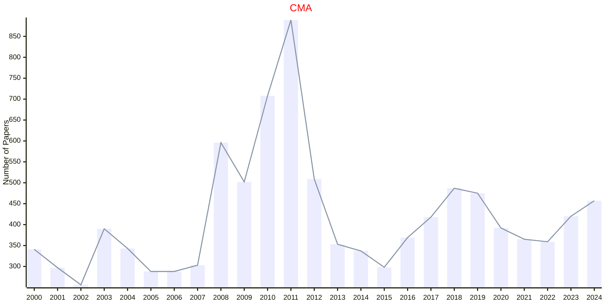

## CMAME

|Publishers|Full/Homepage|Abbr/About|Acronym/Issues|Period/DBLP|Top/Early|CCF|CAS|JCR|IF|Keywords/Google|
|-         |-            |-         |-             |-          |-        |-  |-  |-  |- |-              |
|[ELSEVIER](https://www.sciencedirect.com/)|[Computer Methods in Applied Mechanics and Engineering](https://www.sciencedirect.com/journal/computer-methods-in-applied-mechanics-and-engineering)|[Comput. Meth. Appl. Mech. Eng.](https://www.sciencedirect.com/journal/computer-methods-in-applied-mechanics-and-engineering/about/aims-and-scope)|[CMAME](https://www.sciencedirect.com/journal/computer-methods-in-applied-mechanics-and-engineering/issues)|1972 -|True||1|Q1|7.5|[Computer Science](https://www.google.com/search?q=Computer+Science)|

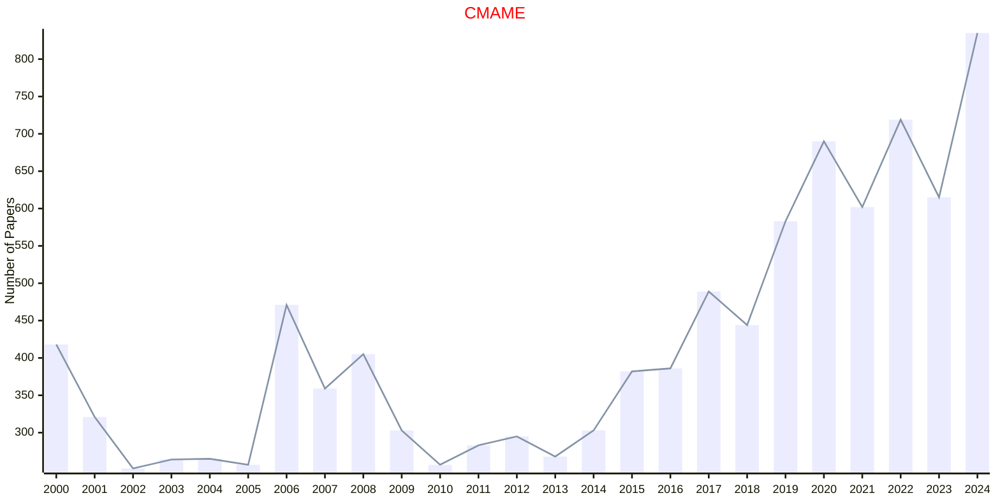

## COMCOM

|Publishers|Full/Homepage|Abbr/About|Acronym/Issues|Period/DBLP|Top/Early|CCF|CAS|JCR|IF|Keywords/Google|
|-         |-            |-         |-             |-          |-        |-  |-  |-  |- |-              |
|[ELSEVIER](https://www.sciencedirect.com/)|[Computer Communications](https://www.sciencedirect.com/journal/computer-communications)|[Comput. Commun.](https://www.sciencedirect.com/journal/computer-communications/about/aims-and-scope)|[COMCOM](https://www.sciencedirect.com/journal/computer-communications/issues)|1978 -|False|C|3|Q2|4.6|[Communication Networks](https://www.google.com/search?q=Communication+Networks); [Computational Science](https://www.google.com/search?q=Computational+Science)|

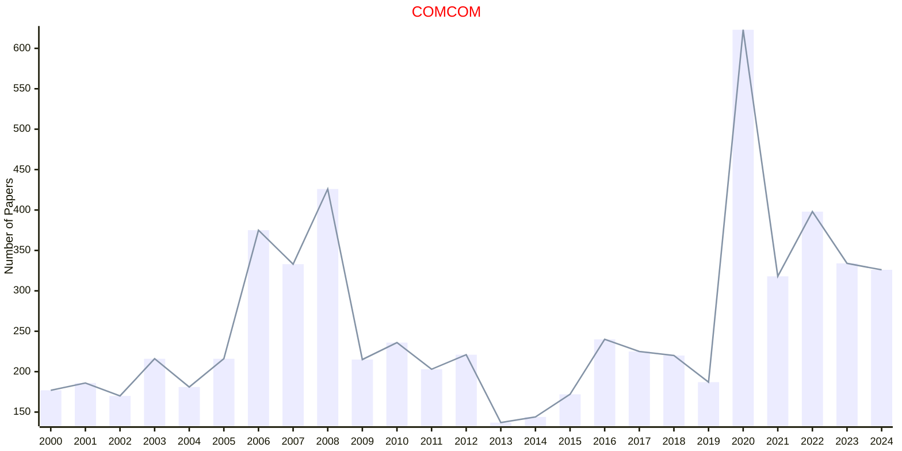

## COR

|Publishers|Full/Homepage|Abbr/About|Acronym/Issues|Period/DBLP|Top/Early|CCF|CAS|JCR|IF|Keywords/Google|
|-         |-            |-         |-             |-          |-        |-  |-  |-  |- |-              |
|[ELSEVIER](https://www.sciencedirect.com/)|[Computers & Operations Research](https://www.sciencedirect.com/journal/computers-and-operations-research)|[Comput. Oper. Res.](https://www.sciencedirect.com/journal/computers-and-operations-research/about/aims-and-scope)|[COR](https://www.sciencedirect.com/journal/computers-and-operations-research/issues)|1974 -|False||2|Q1|4.9|[Operations and Management](https://www.google.com/search?q=Operations+and+Management)|

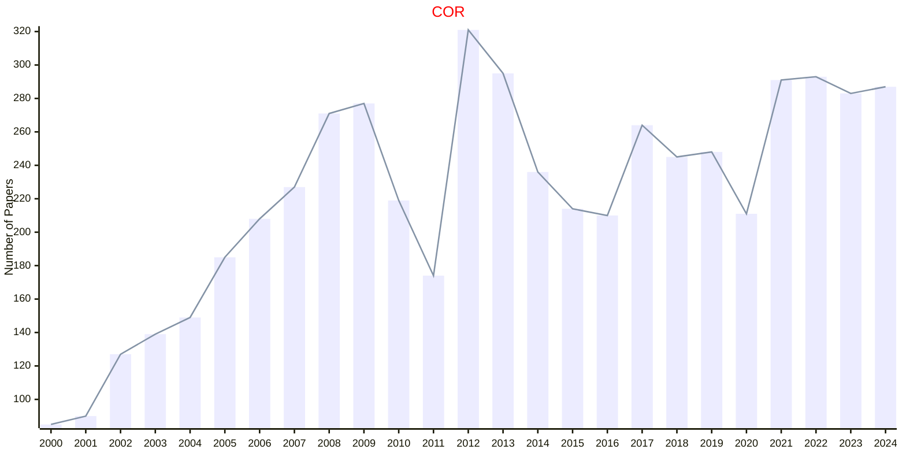

## CSDA

|Publishers|Full/Homepage|Abbr/About|Acronym/Issues|Period/DBLP|Top/Early|CCF|CAS|JCR|IF|Keywords/Google|
|-         |-            |-         |-             |-          |-        |-  |-  |-  |- |-              |
|[ELSEVIER](https://www.sciencedirect.com/)|[Computational Statistics & Data Analysis](https://www.sciencedirect.com/journal/computational-statistics-and-data-analysis)|[Comput. Stat. Data Anal.](https://www.sciencedirect.com/journal/computational-statistics-and-data-analysis/about/aims-and-scope)|[CSDA](https://www.sciencedirect.com/journal/computational-statistics-and-data-analysis/issues)|1983 -|False||3|Q2|1.9|[Computational Statistics](https://www.google.com/search?q=Computational+Statistics); [Data Analysis](https://www.google.com/search?q=Data+Analysis)|

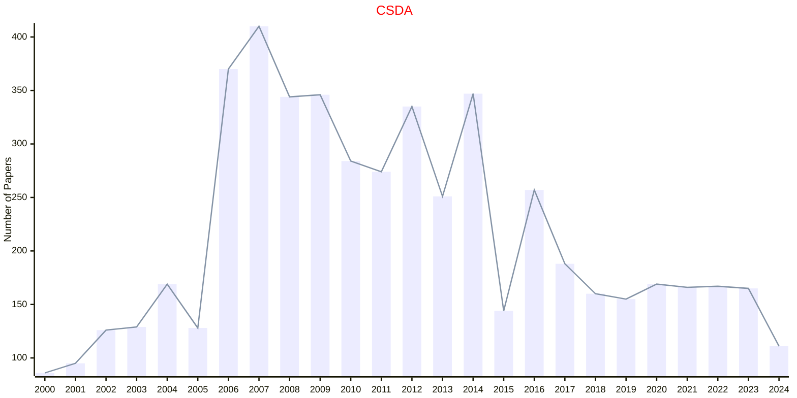

## CVIU

|Publishers|Full/Homepage|Abbr/About|Acronym/Issues|Period/DBLP|Top/Early|CCF|CAS|JCR|IF|Keywords/Google|
|-         |-            |-         |-             |-          |-        |-  |-  |-  |- |-              |
|[ELSEVIER](https://www.sciencedirect.com/)|[Computer Vision and Image Understanding](https://www.sciencedirect.com/journal/computer-vision-and-image-understanding)|[Comput. Vis. Image Understanding](https://www.sciencedirect.com/journal/computer-vision-and-image-understanding/about/aims-and-scope)|[CVIU](https://www.sciencedirect.com/journal/computer-vision-and-image-understanding/issues)|1995 -|False|B|3|Q2|4.8|[Computer Vision](https://www.google.com/search?q=Computer+Vision)|

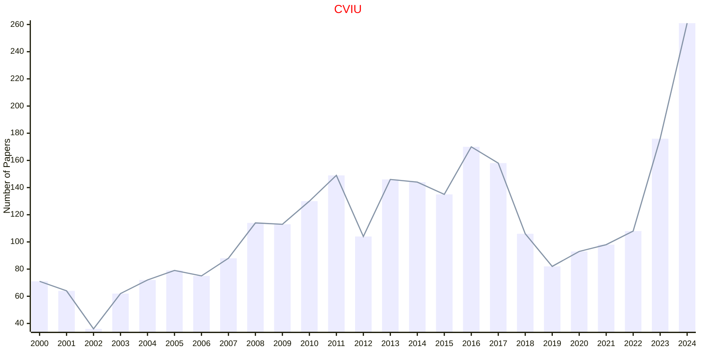

## DISOPT

|Publishers|Full/Homepage|Abbr/About|Acronym/Issues|Period/DBLP|Top/Early|CCF|CAS|JCR|IF|Keywords/Google|
|-         |-            |-         |-             |-          |-        |-  |-  |-  |- |-              |
|[ELSEVIER](https://www.sciencedirect.com/)|[Discrete Optimization](https://www.sciencedirect.com/journal/discrete-optimization)|[Discret. Optim.](https://www.sciencedirect.com/journal/discrete-optimization/about/aims-and-scope)|[DISOPT](https://www.sciencedirect.com/journal/discrete-optimization/issues)|2004 -|False||4|Q2|1.2|[Discrete Optimization](https://www.google.com/search?q=Discrete+Optimization)|

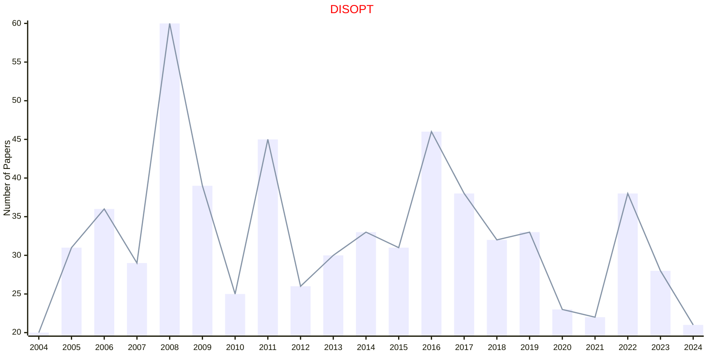

## DKE

|Publishers|Full/Homepage|Abbr/About|Acronym/Issues|Period/DBLP|Top/Early|CCF|CAS|JCR|IF|Keywords/Google|
|-         |-            |-         |-             |-          |-        |-  |-  |-  |- |-              |
|[ELSEVIER](https://www.sciencedirect.com/)|[Data & Knowledge Engineering](https://www.sciencedirect.com/journal/data-and-knowledge-engineering)|[Data Knowl. Eng.](https://www.sciencedirect.com/journal/data-and-knowledge-engineering/about/aims-and-scope)|[DKE](https://www.sciencedirect.com/journal/data-and-knowledge-engineering/issues)|1985 -|False|B|3|Q3|2.3|[Data and Knowledge](https://www.google.com/search?q=Data+and+Knowledge)|

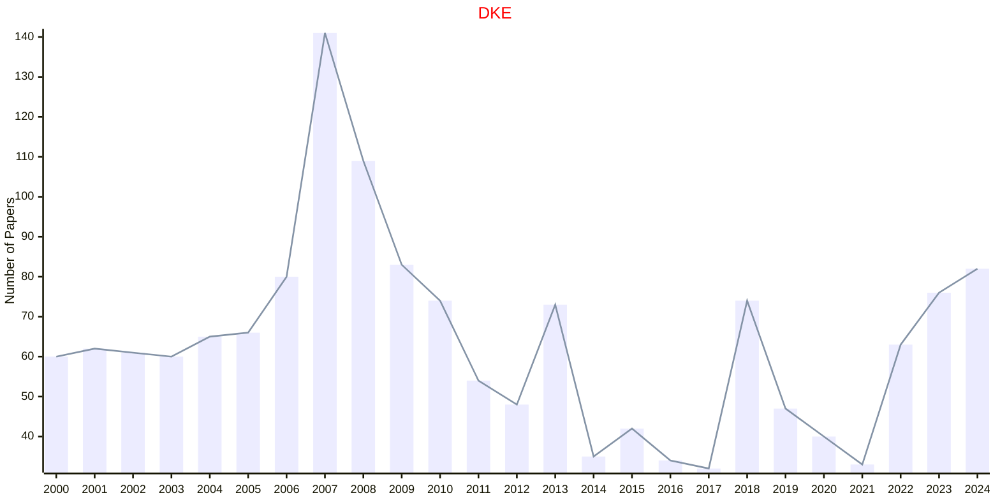

## DSS

|Publishers|Full/Homepage|Abbr/About|Acronym/Issues|Period/DBLP|Top/Early|CCF|CAS|JCR|IF|Keywords/Google|
|-         |-            |-         |-             |-          |-        |-  |-  |-  |- |-              |
|[ELSEVIER](https://www.sciencedirect.com/)|[Decision Support Systems](https://www.sciencedirect.com/journal/decision-support-systems)|[Decis. Supp. Syst.](https://www.sciencedirect.com/journal/decision-support-systems/about/aims-and-scope)|[DSS](https://www.sciencedirect.com/journal/decision-support-systems/issues)|1985 -|True|C|2|Q1|8.2|[Decision Making](https://www.google.com/search?q=Decision+Making)|

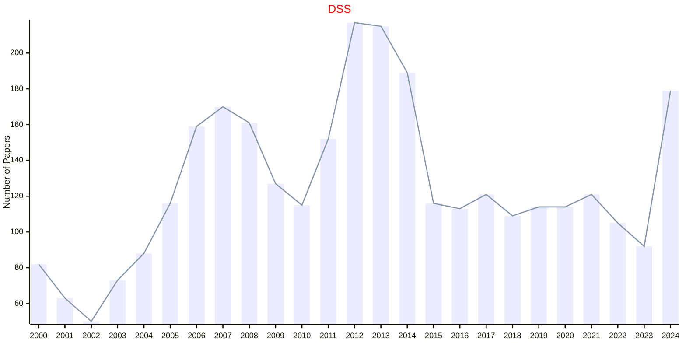

## EAAI

|Publishers|Full/Homepage|Abbr/About|Acronym/Issues|Period/DBLP|Top/Early|CCF|CAS|JCR|IF|Keywords/Google|
|-         |-            |-         |-             |-          |-        |-  |-  |-  |- |-              |
|[ELSEVIER](https://www.sciencedirect.com/)|[Engineering Applications of Artificial Intelligence](https://www.sciencedirect.com/journal/engineering-applications-of-artificial-intelligence)|[Eng. Appl. Artif. Intell.](https://www.sciencedirect.com/journal/engineering-applications-of-artificial-intelligence/about/aims-and-scope)|[EAAI](https://www.sciencedirect.com/journal/engineering-applications-of-artificial-intelligence/issues)|1988 -|True|C|1|Q1|7.7|[Artificial Intelligence](https://www.google.com/search?q=Artificial+Intelligence)|

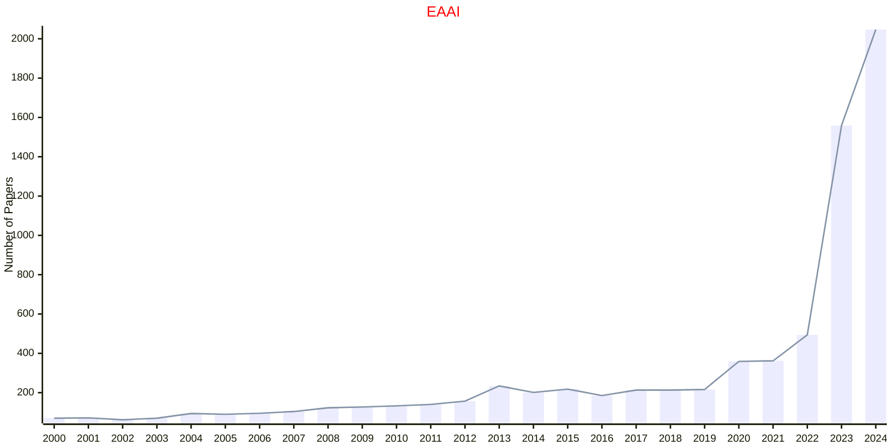

## EJOR

|Publishers|Full/Homepage|Abbr/About|Acronym/Issues|Period/DBLP|Top/Early|CCF|CAS|JCR|IF|Keywords/Google|
|-         |-            |-         |-             |-          |-        |-  |-  |-  |- |-              |
|[ELSEVIER](https://www.sciencedirect.com/)|[European Journal of Operational Research](https://www.sciencedirect.com/journal/european-journal-of-operational-research)|[Eur. J. Oper. Res.](https://www.sciencedirect.com/journal/european-journal-of-operational-research/about/aims-and-scope)|[EJOR](https://www.sciencedirect.com/journal/european-journal-of-operational-research/issues)|1977 -|False||2|Q1|6.2|[Operations and Management](https://www.google.com/search?q=Operations+and+Management)|

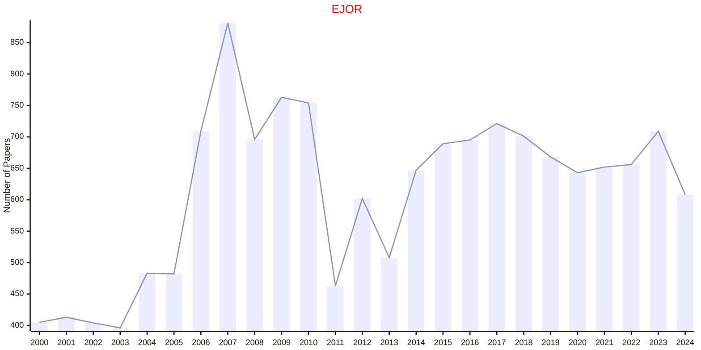

## ESWA

|Publishers|Full/Homepage|Abbr/About|Acronym/Issues|Period/DBLP|Top/Early|CCF|CAS|JCR|IF|Keywords/Google|
|-         |-            |-         |-             |-          |-        |-  |-  |-  |- |-              |
|[ELSEVIER](https://www.sciencedirect.com/)|[Expert Systems with Applications](https://www.sciencedirect.com/journal/expert-systems-with-applications)|[Expert Syst. Appl.](https://www.sciencedirect.com/journal/expert-systems-with-applications/about/aims-and-scope)|[ESWA](https://www.sciencedirect.com/journal/expert-systems-with-applications/issues)|1990 -|True|C|1|Q1|7.8|[Artificial Intelligence](https://www.google.com/search?q=Artificial+Intelligence)|

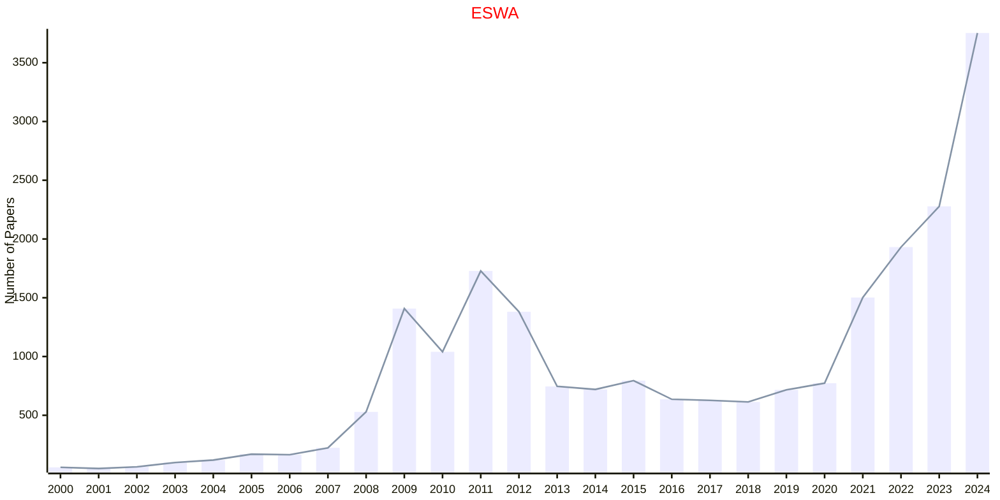

## IANDC

|Publishers|Full/Homepage|Abbr/About|Acronym/Issues|Period/DBLP|Top/Early|CCF|CAS|JCR|IF|Keywords/Google|
|-         |-            |-         |-             |-          |-        |-  |-  |-  |- |-              |
|[ELSEVIER](https://www.sciencedirect.com/)|[Information and Computation](https://www.sciencedirect.com/journal/information-and-computation)|[Inf. Comput.](https://www.sciencedirect.com/journal/information-and-computation/about/aims-and-scope)|[IANDC](https://www.sciencedirect.com/journal/information-and-computation/issues)|1987 -|False|A|4|Q3|1.1|[Information Theory](https://www.google.com/search?q=Information+Theory); [Theoretical Computer Science](https://www.google.com/search?q=Theoretical+Computer+Science)|

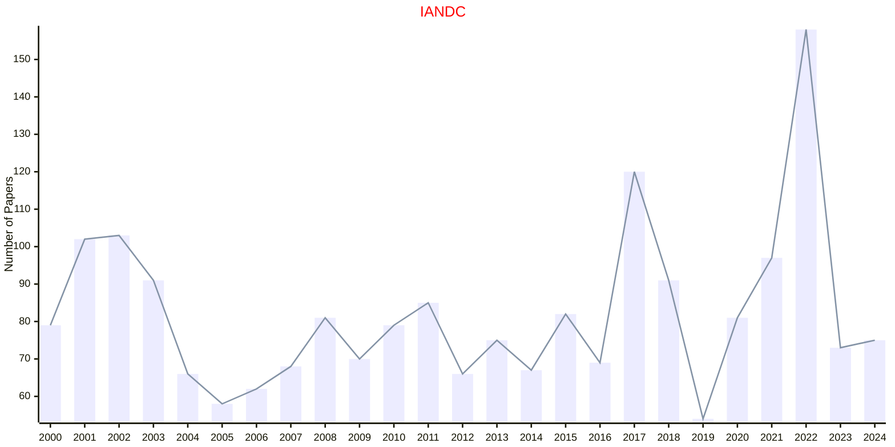

## ICV

|Publishers|Full/Homepage|Abbr/About|Acronym/Issues|Period/DBLP|Top/Early|CCF|CAS|JCR|IF|Keywords/Google|
|-         |-            |-         |-             |-          |-        |-  |-  |-  |- |-              |
|[ELSEVIER](https://www.sciencedirect.com/)|[Image and Vision Computing](https://www.sciencedirect.com/journal/image-and-vision-computing)|[Image Vis. Comput.](https://www.sciencedirect.com/journal/image-and-vision-computing/about/aims-and-scope)|[ICV](https://www.sciencedirect.com/journal/image-and-vision-computing/issues)|1983 -|False|C|3|Q1|4.1|[Computer Vision](https://www.google.com/search?q=Computer+Vision); [Image Processing](https://www.google.com/search?q=Image+Processing)|

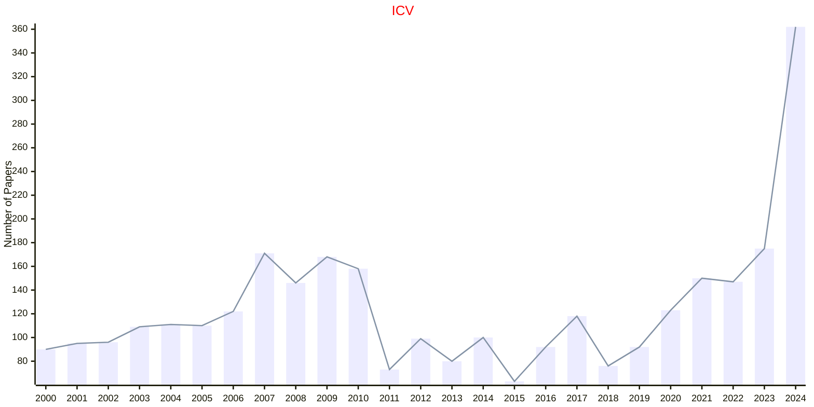

## IJAR

|Publishers|Full/Homepage|Abbr/About|Acronym/Issues|Period/DBLP|Top/Early|CCF|CAS|JCR|IF|Keywords/Google|
|-         |-            |-         |-             |-          |-        |-  |-  |-  |- |-              |
|[ELSEVIER](https://www.sciencedirect.com/)|[International Journal of Approximate Reasoning](https://www.sciencedirect.com/journal/international-journal-of-approximate-reasoning)|[Int. J. Approx. Reasoning](https://www.sciencedirect.com/journal/international-journal-of-approximate-reasoning/about/aims-and-scope)|[IJAR](https://www.sciencedirect.com/journal/international-journal-of-approximate-reasoning/issues)|1987 -|False|B|3|Q2|3.1||

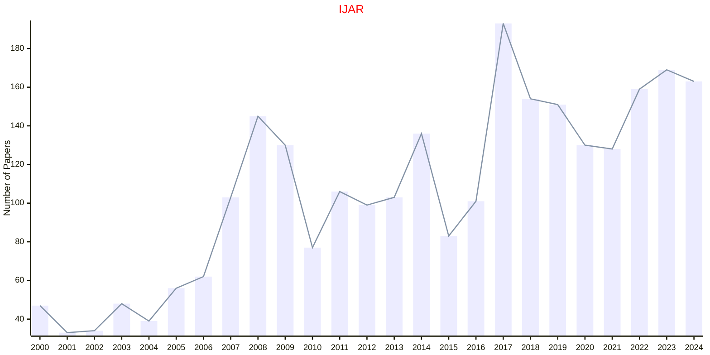

## IPL

|Publishers|Full/Homepage|Abbr/About|Acronym/Issues|Period/DBLP|Top/Early|CCF|CAS|JCR|IF|Keywords/Google|
|-         |-            |-         |-             |-          |-        |-  |-  |-  |- |-              |
|[ELSEVIER](https://www.sciencedirect.com/)|[Information Processing Letters](https://www.sciencedirect.com/journal/information-processing-letters)|[Inf. Process. Lett.](https://www.sciencedirect.com/journal/information-processing-letters/about/aims-and-scope)|[IPL](https://www.sciencedirect.com/journal/information-processing-letters/issues)|1971 -|False|C|4|Q4|0.6||

```mermaid
---
config:
    xyChart:
        width: 1200
        height: 600
    themeVariables:
        xyChart:
            titleColor: "#ff0000"
---
xychart-beta
    title "IPL"
    x-axis [2000, 2001, 2002, 2003, 2004, 2005, 2006, 2007, 2008, 2009, 2010, 2011, 2012, 2013, 2014, 2015, 2016, 2017, 2018, 2019, 2020, 2021, 2022, 2023, 2024]
    y-axis "Number of Papers"
    bar [155, 142, 218, 232, 220, 194, 182, 184, 254, 241, 221, 194, 196, 178, 135, 188, 135, 122, 159, 111, 85, 68, 82, 82, 54]
    line [155, 142, 218, 232, 220, 194, 182, 184, 254, 241, 221, 194, 196, 178, 135, 188, 135, 122, 159, 111, 85, 68, 82, 82, 54]
```

## ISAT

|Publishers|Full/Homepage|Abbr/About|Acronym/Issues|Period/DBLP|Top/Early|CCF|CAS|JCR|IF|Keywords/Google|
|-         |-            |-         |-             |-          |-        |-  |-  |-  |- |-              |
|[ELSEVIER](https://www.sciencedirect.com/)|[ISA Transactions](https://www.sciencedirect.com/journal/isa-transactions)|[ISA Trans.](https://www.sciencedirect.com/journal/isa-transactions/about/aims-and-scope)|[ISAT](https://www.sciencedirect.com/journal/isa-transactions/issues)|1989 -|True||2|Q1|6.3|[Control and Automation](https://www.google.com/search?q=Control+and+Automation)|

## ISCI

|Publishers|Full/Homepage|Abbr/About|Acronym/Issues|Period/DBLP|Top/Early|CCF|CAS|JCR|IF|Keywords/Google|
|-         |-            |-         |-             |-          |-        |-  |-  |-  |- |-              |
|[ELSEVIER](https://www.sciencedirect.com/)|[Information Sciences](https://www.sciencedirect.com/journal/information-sciences)|[Inf. Sci.](https://www.sciencedirect.com/journal/information-sciences/about/aims-and-scope)|[ISCI](https://www.sciencedirect.com/journal/information-sciences/issues)|1968 -|False|B|2|Q1|6.6||

```mermaid
---
config:
    xyChart:
        width: 1200
        height: 600
    themeVariables:
        xyChart:
            titleColor: "#ff0000"
---
xychart-beta
    title "ISCI"
    x-axis [2000, 2001, 2002, 2003, 2004, 2005, 2006, 2007, 2008, 2009, 2010, 2011, 2012, 2013, 2014, 2015, 2016, 2017, 2018, 2019, 2020, 2021, 2022, 2023, 2024]
    y-axis "Number of Papers"
    bar [137, 120, 140, 144, 181, 143, 180, 388, 331, 344, 362, 360, 423, 613, 876, 624, 815, 596, 755, 837, 929, 1310, 1330, 1355, 1308]
    line [137, 120, 140, 144, 181, 143, 180, 388, 331, 344, 362, 360, 423, 613, 876, 624, 815, 596, 755, 837, 929, 1310, 1330, 1355, 1308]
```

## JAIM

|Publishers|Full/Homepage|Abbr/About|Acronym/Issues|Period/DBLP|Top/Early|CCF|CAS|JCR|IF|Keywords/Google|
|-         |-            |-         |-             |-          |-        |-  |-  |-  |- |-              |
|[ELSEVIER](https://www.sciencedirect.com/)|[Advances in Mathematics](https://www.sciencedirect.com/journal/advances-in-mathematics)|[Adv. Math.](https://www.sciencedirect.com/journal/advances-in-mathematics/about/aims-and-scope)|[JAIM](https://www.sciencedirect.com/journal/advances-in-mathematics/issues)|1961 -|True||1|Q1|1.7|[Mathematics](https://www.google.com/search?q=Mathematics)|

```mermaid
---
config:
    xyChart:
        width: 1200
        height: 600
    themeVariables:
        xyChart:
            titleColor: "#ff0000"
---
xychart-beta
    title "JAIM"
    x-axis [2020, 2021, 2022, 2023, 2024]
    y-axis "Number of Papers"
    bar [394, 464, 512, 368, 437]
    line [394, 464, 512, 368, 437]
```

## JAT

|Publishers|Full/Homepage|Abbr/About|Acronym/Issues|Period/DBLP|Top/Early|CCF|CAS|JCR|IF|Keywords/Google|
|-         |-            |-         |-             |-          |-        |-  |-  |-  |- |-              |
|[ELSEVIER](https://www.sciencedirect.com/)|[Journal of Approximation Theory](https://www.sciencedirect.com/journal/journal-of-approximation-theory)|[J. Approx. Theory](https://www.sciencedirect.com/journal/journal-of-approximation-theory/about/aims-and-scope)|[JAT](https://www.sciencedirect.com/journal/journal-of-approximation-theory/issues)|1968 -|False||4|Q3|0.9||

```mermaid
---
config:
    xyChart:
        width: 1200
        height: 600
    themeVariables:
        xyChart:
            titleColor: "#ff0000"
---
xychart-beta
    title "JAT"
    x-axis [2000, 2001, 2002, 2003, 2004, 2005, 2006, 2007, 2008, 2009, 2010, 2011, 2012, 2013, 2014, 2015, 2016, 2017, 2018, 2019, 2020, 2021, 2022, 2023, 2024]
    y-axis "Number of Papers"
    bar [122, 102, 101, 139, 106, 117, 109, 112, 91, 126, 133, 102, 90, 102, 86, 123, 84, 70, 54, 78, 89, 62, 47, 56, 48]
    line [122, 102, 101, 139, 106, 117, 109, 112, 91, 126, 133, 102, 90, 102, 86, 123, 84, 70, 54, 78, 89, 62, 47, 56, 48]
```

## JDA

|Publishers|Full/Homepage|Abbr/About|Acronym/Issues|Period/DBLP|Top/Early|CCF|CAS|JCR|IF|Keywords/Google|
|-         |-            |-         |-             |-          |-        |-  |-  |-  |- |-              |
|[ELSEVIER](https://www.sciencedirect.com/)|[Journal of Discrete Algorithms](https://www.sciencedirect.com/journal/journal-of-discrete-algorithms)|J. Discret. Algo.|[JDA](https://www.sciencedirect.com/journal/journal-of-discrete-algorithms/issues)|2003 - 2018|False||||||

```mermaid
---
config:
    xyChart:
        width: 1200
        height: 600
    themeVariables:
        xyChart:
            titleColor: "#ff0000"
---
xychart-beta
    title "JDA"
    x-axis [2003, 2004, 2005, 2006, 2007, 2008, 2009, 2010, 2011, 2012, 2013, 2014, 2015, 2016, 2017, 2018]
    y-axis "Number of Papers"
    bar [30, 30, 28, 40, 63, 56, 48, 36, 35, 106, 49, 44, 72, 21, 28, 31]
    line [30, 30, 28, 40, 63, 56, 48, 36, 35, 106, 49, 44, 72, 21, 28, 31]
```

## JDE

|Publishers|Full/Homepage|Abbr/About|Acronym/Issues|Period/DBLP|Top/Early|CCF|CAS|JCR|IF|Keywords/Google|
|-         |-            |-         |-             |-          |-        |-  |-  |-  |- |-              |
|[ELSEVIER](https://www.sciencedirect.com/)|[Journal of Differential Equations](https://www.sciencedirect.com/journal/journal-of-differential-equations)|[J. Diff. Equ.](https://www.sciencedirect.com/journal/journal-of-differential-equations/about/aims-and-scope)|[JDE](https://www.sciencedirect.com/journal/journal-of-differential-equations/issues)|1965 -|True||1|Q1|2.5|[Differential Equations](https://www.google.com/search?q=Differential+Equations)|

```mermaid
---
config:
    xyChart:
        width: 1200
        height: 600
    themeVariables:
        xyChart:
            titleColor: "#ff0000"
---
xychart-beta
    title "JDE"
    x-axis [2000, 2001, 2002, 2003, 2004, 2005, 2006, 2007, 2008, 2009, 2010, 2011, 2012, 2013, 2014, 2015, 2016, 2017, 2018, 2019, 2020, 2021, 2022, 2023, 2024]
    y-axis "Number of Papers"
    bar [161, 163, 191, 214, 203, 201, 297, 262, 268, 341, 262, 313, 379, 337, 293, 401, 520, 474, 434, 503, 601, 659, 507, 589, 465]
    line [161, 163, 191, 214, 203, 201, 297, 262, 268, 341, 262, 313, 379, 337, 293, 401, 520, 474, 434, 503, 601, 659, 507, 589, 465]
```

## JMAA

|Publishers|Full/Homepage|Abbr/About|Acronym/Issues|Period/DBLP|Top/Early|CCF|CAS|JCR|IF|Keywords/Google|
|-         |-            |-         |-             |-          |-        |-  |-  |-  |- |-              |
|[ELSEVIER](https://www.sciencedirect.com/)|[Journal of Mathematical Analysis and Applications](https://www.sciencedirect.com/journal/journal-of-mathematical-analysis-and-applications)|[J. Math. Anal. Appl.](https://www.sciencedirect.com/journal/journal-of-mathematical-analysis-and-applications/about/aims-and-scope)|[JMAA](https://www.sciencedirect.com/journal/journal-of-mathematical-analysis-and-applications/issues)|1960 -|False||3|Q1|1.2|[Mathematical Analysis](https://www.google.com/search?q=Mathematical+Analysis)|

```mermaid
---
config:
    xyChart:
        width: 1200
        height: 600
    themeVariables:
        xyChart:
            titleColor: "#ff0000"
---
xychart-beta
    title "JMAA"
    x-axis [2000, 2001, 2002, 2003, 2004, 2005, 2006, 2007, 2008, 2009, 2010, 2011, 2012, 2013, 2014, 2015, 2016, 2017, 2018, 2019, 2020, 2021, 2022, 2023, 2024]
    y-axis "Number of Papers"
    bar [479, 540, 564, 680, 640, 626, 869, 1306, 1235, 811, 764, 840, 928, 809, 949, 992, 915, 990, 951, 909, 822, 808, 873, 775, 711]
    line [479, 540, 564, 680, 640, 626, 869, 1306, 1235, 811, 764, 840, 928, 809, 949, 992, 915, 990, 951, 909, 822, 808, 873, 775, 711]
```

## JOCS

|Publishers|Full/Homepage|Abbr/About|Acronym/Issues|Period/DBLP|Top/Early|CCF|CAS|JCR|IF|Keywords/Google|
|-         |-            |-         |-             |-          |-        |-  |-  |-  |- |-              |
|[ELSEVIER](https://www.sciencedirect.com/)|[Journal of Computational Science](https://www.sciencedirect.com/journal/journal-of-computational-science)|[J. Comput. Sci.](https://www.sciencedirect.com/journal/journal-of-computational-science/about/aims-and-scope)|[JOCS](https://www.sciencedirect.com/journal/journal-of-computational-science/issues)|2010 -|False||3|Q1|3.7||

```mermaid
---
config:
    xyChart:
        width: 1200
        height: 600
    themeVariables:
        xyChart:
            titleColor: "#ff0000"
---
xychart-beta
    title "JOCS"
    x-axis [2010, 2011, 2012, 2013, 2014, 2015, 2016, 2017, 2018, 2019, 2020, 2021, 2022, 2023, 2024]
    y-axis "Number of Papers"
    bar [32, 44, 61, 59, 97, 120, 122, 142, 233, 114, 112, 156, 222, 191, 198]
    line [32, 44, 61, 59, 97, 120, 122, 142, 233, 114, 112, 156, 222, 191, 198]
```

## JOE

|Publishers|Full/Homepage|Abbr/About|Acronym/Issues|Period/DBLP|Top/Early|CCF|CAS|JCR|IF|Keywords/Google|
|-         |-            |-         |-             |-          |-        |-  |-  |-  |- |-              |
|[ELSEVIER](https://www.sciencedirect.com/)|[Journal of Econometrics](https://www.sciencedirect.com/journal/journal-of-econometrics)|[J. Econ.](https://www.sciencedirect.com/journal/journal-of-econometrics/about/aims-and-scope)|[JOE](https://www.sciencedirect.com/journal/journal-of-econometrics/issues)|1973 -|False||2|Q1|7.8||

```mermaid
---
config:
    xyChart:
        width: 1200
        height: 600
    themeVariables:
        xyChart:
            titleColor: "#ff0000"
---
xychart-beta
    title "JOE"
    x-axis [2000, 2001, 2002, 2003, 2004, 2005, 2006, 2007, 2008, 2009, 2010, 2011, 2012, 2013, 2014, 2015, 2016, 2017, 2018, 2019, 2020, 2021, 2022, 2023, 2024]
    y-axis "Number of Papers"
    bar [92, 96, 98, 95, 91, 87, 130, 189, 171, 104, 146, 148, 180, 101, 156, 200, 155, 130, 126, 163, 154, 163, 141, 274, 226]
    line [92, 96, 98, 95, 91, 87, 130, 189, 171, 104, 146, 148, 180, 101, 156, 200, 155, 130, 126, 163, 154, 163, 141, 274, 226]
```

## JOMA

|Publishers|Full/Homepage|Abbr/About|Acronym/Issues|Period/DBLP|Top/Early|CCF|CAS|JCR|IF|Keywords/Google|
|-         |-            |-         |-             |-          |-        |-  |-  |-  |- |-              |
|[ELSEVIER](https://www.sciencedirect.com/)|[Journal of Multivariate Analysis](https://www.sciencedirect.com/journal/journal-of-multivariate-analysis)|[J. Multi. Anal.](https://www.sciencedirect.com/journal/journal-of-multivariate-analysis/about/aims-and-scope)|[JOMA](https://www.sciencedirect.com/journal/journal-of-multivariate-analysis/issues)|1971 -|False||2|Q2|1.7||

```mermaid
---
config:
    xyChart:
        width: 1200
        height: 600
    themeVariables:
        xyChart:
            titleColor: "#ff0000"
---
xychart-beta
    title "JOMA"
    x-axis [2000, 2001, 2002, 2003, 2004, 2005, 2006, 2007, 2008, 2009, 2010, 2011, 2012, 2013, 2014, 2015, 2016, 2017, 2018, 2019, 2020, 2021, 2022, 2023, 2024]
    y-axis "Number of Papers"
    bar [61, 61, 92, 93, 85, 118, 126, 109, 137, 173, 194, 110, 176, 213, 206, 169, 184, 135, 101, 147, 84, 92, 161, 86, 91]
    line [61, 61, 92, 93, 85, 118, 126, 109, 137, 173, 194, 110, 176, 213, 206, 169, 184, 135, 101, 147, 84, 92, 161, 86, 91]
```

## JOMP

|Publishers|Full/Homepage|Abbr/About|Acronym/Issues|Period/DBLP|Top/Early|CCF|CAS|JCR|IF|Keywords/Google|
|-         |-            |-         |-             |-          |-        |-  |-  |-  |- |-              |
|[ELSEVIER](https://www.sciencedirect.com/)|[Journal of Mathematical Psychology](https://www.sciencedirect.com/journal/journal-of-mathematical-psychology)|[J. Math. Psychol.](https://www.sciencedirect.com/journal/journal-of-mathematical-psychology/about/aims-and-scope)|[JOMP](https://www.sciencedirect.com/journal/journal-of-mathematical-psychology/issues)|1964 -|False||3|Q3|1.7||

```mermaid
---
config:
    xyChart:
        width: 1200
        height: 600
    themeVariables:
        xyChart:
            titleColor: "#ff0000"
---
xychart-beta
    title "JOMP"
    x-axis [2000, 2001, 2002, 2003, 2004, 2005, 2006, 2007, 2008, 2009, 2010, 2011, 2012, 2013, 2014, 2015, 2016, 2017, 2018, 2019, 2020, 2021, 2022, 2023, 2024]
    y-axis "Number of Papers"
    bar [44, 64, 57, 67, 57, 59, 70, 47, 52, 79, 67, 57, 57, 39, 40, 34, 76, 72, 42, 60, 76, 47, 33, 42, 29]
    line [44, 64, 57, 67, 57, 59, 70, 47, 52, 79, 67, 57, 57, 39, 40, 34, 76, 72, 42, 60, 76, 47, 33, 42, 29]
```

## JPDC

|Publishers|Full/Homepage|Abbr/About|Acronym/Issues|Period/DBLP|Top/Early|CCF|CAS|JCR|IF|Keywords/Google|
|-         |-            |-         |-             |-          |-        |-  |-  |-  |- |-              |
|[ELSEVIER](https://www.sciencedirect.com/)|[Journal of Parallel and Distributed Computing](https://www.sciencedirect.com/journal/journal-of-parallel-and-distributed-computing)|[J. Parallel Distrib. Comput.](https://www.sciencedirect.com/journal/journal-of-parallel-and-distributed-computing/about/aims-and-scope)|[JPDC](https://www.sciencedirect.com/journal/journal-of-parallel-and-distributed-computing/issues)|1984 -|False|B|3|Q1|3.6|[Parallel and Distributed](https://www.google.com/search?q=Parallel+and+Distributed)|

```mermaid
---
config:
    xyChart:
        width: 1200
        height: 600
    themeVariables:
        xyChart:
            titleColor: "#ff0000"
---
xychart-beta
    title "JPDC"
    x-axis [2000, 2001, 2002, 2003, 2004, 2005, 2006, 2007, 2008, 2009, 2010, 2011, 2012, 2013, 2014, 2015, 2016, 2017, 2018, 2019, 2020, 2021, 2022, 2023, 2024]
    y-axis "Number of Papers"
    bar [75, 106, 102, 114, 121, 140, 128, 93, 124, 94, 111, 141, 148, 145, 126, 98, 88, 171, 212, 214, 172, 177, 155, 125, 129]
    line [75, 106, 102, 114, 121, 140, 128, 93, 124, 94, 111, 141, 148, 145, 126, 98, 88, 171, 212, 214, 172, 177, 155, 125, 129]
```

## JTB

|Publishers|Full/Homepage|Abbr/About|Acronym/Issues|Period/DBLP|Top/Early|CCF|CAS|JCR|IF|Keywords/Google|
|-         |-            |-         |-             |-          |-        |-  |-  |-  |- |-              |
|[ELSEVIER](https://www.sciencedirect.com/)|[Journal of Theoretical Biology](https://www.sciencedirect.com/journal/journal-of-theoretical-biology)|[J. Theor. Biol](https://www.sciencedirect.com/journal/journal-of-theoretical-biology/about/aims-and-scope)|[JTB](https://www.sciencedirect.com/journal/journal-of-theoretical-biology/issues)|1961 -|False||4|Q2|1.9|[Theoretical Biology](https://www.google.com/search?q=Theoretical+Biology)|

```mermaid
---
config:
    xyChart:
        width: 1200
        height: 600
    themeVariables:
        xyChart:
            titleColor: "#ff0000"
---
xychart-beta
    title "JTB"
    x-axis [2000, 2001, 2002, 2003, 2004, 2005, 2006, 2007, 2008, 2009, 2010, 2011, 2012, 2013, 2014, 2015, 2016, 2017, 2018, 2019, 2020, 2021, 2022, 2023, 2024]
    y-axis "Number of Papers"
    bar [253, 237, 244, 278, 304, 277, 435, 424, 432, 426, 473, 447, 445, 376, 444, 491, 451, 388, 419, 371, 269, 270, 209, 191, 170]
    line [253, 237, 244, 278, 304, 277, 435, 424, 432, 426, 473, 447, 445, 376, 444, 491, 451, 388, 419, 371, 269, 270, 209, 191, 170]
```

## KBS

|Publishers|Full/Homepage|Abbr/About|Acronym/Issues|Period/DBLP|Top/Early|CCF|CAS|JCR|IF|Keywords/Google|
|-         |-            |-         |-             |-          |-        |-  |-  |-  |- |-              |
|[ELSEVIER](https://www.sciencedirect.com/)|[Knowledge-Based Systems](https://www.sciencedirect.com/journal/knowledge-based-systems)|[Knowl. Based Syst.](https://www.sciencedirect.com/journal/knowledge-based-systems/about/aims-and-scope)|[KBS](https://www.sciencedirect.com/journal/knowledge-based-systems/issues)|1987 -|True|C|1|Q1|7.6|[Knowledge Based Systems](https://www.google.com/search?q=Knowledge+Based+Systems)|

```mermaid
---
config:
    xyChart:
        width: 1200
        height: 600
    themeVariables:
        xyChart:
            titleColor: "#ff0000"
---
xychart-beta
    title "KBS"
    x-axis [2000, 2001, 2002, 2003, 2004, 2005, 2006, 2007, 2008, 2009, 2010, 2011, 2012, 2013, 2014, 2015, 2016, 2017, 2018, 2019, 2020, 2021, 2022, 2023, 2024]
    y-axis "Number of Papers"
    bar [53, 58, 62, 53, 39, 53, 98, 81, 113, 90, 113, 138, 266, 316, 318, 356, 406, 371, 395, 418, 726, 888, 1242, 898, 1385]
    line [53, 58, 62, 53, 39, 53, 98, 81, 113, 90, 113, 138, 266, 316, 318, 356, 406, 371, 395, 418, 726, 888, 1242, 898, 1385]
```

## MATDES

|Publishers|Full/Homepage|Abbr/About|Acronym/Issues|Period/DBLP|Top/Early|CCF|CAS|JCR|IF|Keywords/Google|
|-         |-            |-         |-             |-          |-        |-  |-  |-  |- |-              |
|[ELSEVIER](https://www.sciencedirect.com/)|[Materials & Design](https://www.sciencedirect.com/journal/materials-and-design)|[Mater. Des.](https://www.sciencedirect.com/journal/materials-and-design/about/aims-and-scope)|[MATDES](https://www.sciencedirect.com/journal/materials-and-design/issues)|2015 -|False||2|Q1|8.9|[Materials](https://www.google.com/search?q=Materials)|

```mermaid
---
config:
    xyChart:
        width: 1200
        height: 600
    themeVariables:
        xyChart:
            titleColor: "#ff0000"
---
xychart-beta
    title "MATDES"
    x-axis [2015, 2016, 2017, 2018, 2019, 2020, 2021, 2022, 2023, 2024]
    y-axis "Number of Papers"
    bar [690, 1677, 1048, 877, 618, 952, 1083, 1115, 1022, 972]
    line [690, 1677, 1048, 877, 618, 952, 1083, 1115, 1022, 972]
```

## MLA

|Publishers|Full/Homepage|Abbr/About|Acronym/Issues|Period/DBLP|Top/Early|CCF|CAS|JCR|IF|Keywords/Google|
|-         |-            |-         |-             |-          |-        |-  |-  |-  |- |-              |
|[ELSEVIER](https://www.sciencedirect.com/)|[Machine Learning with Applications](https://www.sciencedirect.com/journal/machine-learning-with-applications)|[Mach. Learn. Appl.](https://www.sciencedirect.com/journal/machine-learning-with-applications/about/aims-and-scope)|[MLA](https://www.sciencedirect.com/journal/machine-learning-with-applications/issues)|2020 -|False||||6.8|[Machine Learning](https://www.google.com/search?q=Machine+Learning)|

```mermaid
---
config:
    xyChart:
        width: 1200
        height: 600
    themeVariables:
        xyChart:
            titleColor: "#ff0000"
---
xychart-beta
    title "MLA"
    x-axis [2020, 2021, 2022, 2023, 2024]
    y-axis "Number of Papers"
    bar [8, 106, 138, 57, 91]
    line [8, 106, 138, 57, 91]
```

## NEUCOM

|Publishers|Full/Homepage|Abbr/About|Acronym/Issues|Period/DBLP|Top/Early|CCF|CAS|JCR|IF|Keywords/Google|
|-         |-            |-         |-             |-          |-        |-  |-  |-  |- |-              |
|[ELSEVIER](https://www.sciencedirect.com/)|[Neurocomputing](https://www.sciencedirect.com/journal/neurocomputing)|[Neurocomputing](https://www.sciencedirect.com/journal/neurocomputing/about/aims-and-scope)|[NEUCOM](https://www.sciencedirect.com/journal/neurocomputing/issues)|1989 -|False|C|2|Q1|6.0||

```mermaid
---
config:
    xyChart:
        width: 1200
        height: 600
    themeVariables:
        xyChart:
            titleColor: "#ff0000"
---
xychart-beta
    title "NEUCOM"
    x-axis [2000, 2001, 2002, 2003, 2004, 2005, 2006, 2007, 2008, 2009, 2010, 2011, 2012, 2013, 2014, 2015, 2016, 2017, 2018, 2019, 2020, 2021, 2022, 2023, 2024]
    y-axis "Number of Papers"
    bar [239, 272, 333, 262, 310, 275, 352, 353, 405, 426, 345, 370, 427, 702, 902, 1301, 1840, 1116, 1323, 1152, 1549, 1676, 1433, 961, 1204]
    line [239, 272, 333, 262, 310, 275, 352, 353, 405, 426, 345, 370, 427, 702, 902, 1301, 1840, 1116, 1323, 1152, 1549, 1676, 1433, 961, 1204]
```

## NN

|Publishers|Full/Homepage|Abbr/About|Acronym/Issues|Period/DBLP|Top/Early|CCF|CAS|JCR|IF|Keywords/Google|
|-         |-            |-         |-             |-          |-        |-  |-  |-  |- |-              |
|[ELSEVIER](https://www.sciencedirect.com/)|[Neural Networks](https://www.sciencedirect.com/journal/neural-networks)|[Neural Netw.](https://www.sciencedirect.com/journal/neural-networks/about/aims-and-scope)|[NN](https://www.sciencedirect.com/journal/neural-networks/issues)|1988 -|True|B|2|Q1|7.5|[Neural Networks](https://www.google.com/search?q=Neural+Networks)|

```mermaid
---
config:
    xyChart:
        width: 1200
        height: 600
    themeVariables:
        xyChart:
            titleColor: "#ff0000"
---
xychart-beta
    title "NN"
    x-axis [2000, 2001, 2002, 2003, 2004, 2005, 2006, 2007, 2008, 2009, 2010, 2011, 2012, 2013, 2014, 2015, 2016, 2017, 2018, 2019, 2020, 2021, 2022, 2023, 2024]
    y-axis "Number of Papers"
    bar [94, 124, 112, 146, 121, 132, 155, 114, 163, 158, 136, 126, 185, 181, 153, 167, 143, 171, 228, 224, 400, 401, 406, 513, 736]
    line [94, 124, 112, 146, 121, 132, 155, 114, 163, 158, 136, 126, 185, 181, 153, 167, 143, 171, 228, 224, 400, 401, 406, 513, 736]
```

## ORL

|Publishers|Full/Homepage|Abbr/About|Acronym/Issues|Period/DBLP|Top/Early|CCF|CAS|JCR|IF|Keywords/Google|
|-         |-            |-         |-             |-          |-        |-  |-  |-  |- |-              |
|[ELSEVIER](https://www.sciencedirect.com/)|[Operations Research Letters](https://www.sciencedirect.com/journal/operations-research-letters)|[Oper. Res. Lett.](https://www.sciencedirect.com/journal/operations-research-letters/about/aims-and-scope)|[ORL](https://www.sciencedirect.com/journal/operations-research-letters/issues)|1981 -|False||4|Q4|1.0|[Operations](https://www.google.com/search?q=Operations)|

```mermaid
---
config:
    xyChart:
        width: 1200
        height: 600
    themeVariables:
        xyChart:
            titleColor: "#ff0000"
---
xychart-beta
    title "ORL"
    x-axis [2000, 2001, 2002, 2003, 2004, 2005, 2006, 2007, 2008, 2009, 2010, 2011, 2012, 2013, 2014, 2015, 2016, 2017, 2018, 2019, 2020, 2021, 2022, 2023, 2024]
    y-axis "Number of Papers"
    bar [64, 62, 60, 79, 96, 94, 99, 119, 156, 95, 122, 94, 113, 145, 107, 126, 162, 123, 117, 112, 140, 153, 120, 124, 104]
    line [64, 62, 60, 79, 96, 94, 99, 119, 156, 95, 122, 94, 113, 145, 107, 126, 162, 123, 117, 112, 140, 153, 120, 124, 104]
```

## PARCO

|Publishers|Full/Homepage|Abbr/About|Acronym/Issues|Period/DBLP|Top/Early|CCF|CAS|JCR|IF|Keywords/Google|
|-         |-            |-         |-             |-          |-        |-  |-  |-  |- |-              |
|[ELSEVIER](https://www.sciencedirect.com/)|[Parallel Computing](https://www.sciencedirect.com/journal/parallel-computing)|[Parallel Comput.](https://www.sciencedirect.com/journal/parallel-computing/about/aims-and-scope)|[PARCO](https://www.sciencedirect.com/journal/parallel-computing/issues)|1984 -|False|B|3|Q2|1.5|[Parallel Computing](https://www.google.com/search?q=Parallel+Computing)|

```mermaid
---
config:
    xyChart:
        width: 1200
        height: 600
    themeVariables:
        xyChart:
            titleColor: "#ff0000"
---
xychart-beta
    title "PARCO"
    x-axis [2000, 2001, 2002, 2003, 2004, 2005, 2006, 2007, 2008, 2009, 2010, 2011, 2012, 2013, 2014, 2015, 2016, 2017, 2018, 2019, 2020, 2021, 2022, 2023, 2024]
    y-axis "Number of Papers"
    bar [100, 98, 87, 92, 73, 63, 60, 59, 56, 45, 53, 60, 38, 59, 64, 60, 81, 53, 69, 91, 40, 55, 51, 34, 21]
    line [100, 98, 87, 92, 73, 63, 60, 59, 56, 45, 53, 60, 38, 59, 64, 60, 81, 53, 69, 91, 40, 55, 51, 34, 21]
```

## PR

|Publishers|Full/Homepage|Abbr/About|Acronym/Issues|Period/DBLP|Top/Early|CCF|CAS|JCR|IF|Keywords/Google|
|-         |-            |-         |-             |-          |-        |-  |-  |-  |- |-              |
|[ELSEVIER](https://www.sciencedirect.com/)|[Pattern Recognition](https://www.sciencedirect.com/journal/pattern-recognition)|[Pattern Recognition](https://www.sciencedirect.com/journal/pattern-recognition/about/aims-and-scope)|[PR](https://www.sciencedirect.com/journal/pattern-recognition/issues)|1968 -|True|B|1|Q1|7.9||

```mermaid
---
config:
    xyChart:
        width: 1200
        height: 600
    themeVariables:
        xyChart:
            titleColor: "#ff0000"
---
xychart-beta
    title "PR"
    x-axis [2000, 2001, 2002, 2003, 2004, 2005, 2006, 2007, 2008, 2009, 2010, 2011, 2012, 2013, 2014, 2015, 2016, 2017, 2018, 2019, 2020, 2021, 2022, 2023, 2024]
    y-axis "Number of Papers"
    bar [167, 211, 245, 245, 207, 239, 235, 318, 322, 315, 353, 246, 370, 291, 322, 323, 327, 416, 404, 380, 415, 506, 679, 781, 819]
    line [167, 211, 245, 245, 207, 239, 235, 318, 322, 315, 353, 246, 370, 291, 322, 323, 327, 416, 404, 380, 415, 506, 679, 781, 819]
```

## RAS

|Publishers|Full/Homepage|Abbr/About|Acronym/Issues|Period/DBLP|Top/Early|CCF|CAS|JCR|IF|Keywords/Google|
|-         |-            |-         |-             |-          |-        |-  |-  |-  |- |-              |
|[ELSEVIER](https://www.sciencedirect.com/)|[Robotics and Autonomous Systems](https://www.sciencedirect.com/journal/robotics-and-autonomous-systems)|[Robot. Auton. Syst.](https://www.sciencedirect.com/journal/robotics-and-autonomous-systems/about/aims-and-scope)|[RAS](https://www.sciencedirect.com/journal/robotics-and-autonomous-systems/issues)|1988 -|False||2|Q1|5.1|[Robotics](https://www.google.com/search?q=Robotics)|

```mermaid
---
config:
    xyChart:
        width: 1200
        height: 600
    themeVariables:
        xyChart:
            titleColor: "#ff0000"
---
xychart-beta
    title "RAS"
    x-axis [2000, 2001, 2002, 2003, 2004, 2005, 2006, 2007, 2008, 2009, 2010, 2011, 2012, 2013, 2014, 2015, 2016, 2017, 2018, 2019, 2020, 2021, 2022, 2023, 2024]
    y-axis "Number of Papers"
    bar [94, 83, 89, 94, 87, 84, 100, 84, 91, 120, 125, 94, 138, 142, 151, 200, 175, 227, 170, 182, 171, 143, 154, 171, 186]
    line [94, 83, 89, 94, 87, 84, 100, 84, 91, 120, 125, 94, 138, 142, 151, 200, 175, 227, 170, 182, 171, 143, 154, 171, 186]
```

## SPA

|Publishers|Full/Homepage|Abbr/About|Acronym/Issues|Period/DBLP|Top/Early|CCF|CAS|JCR|IF|Keywords/Google|
|-         |-            |-         |-             |-          |-        |-  |-  |-  |- |-              |
|[ELSEVIER](https://www.sciencedirect.com/)|[Stochastic Processes and their Applications](https://www.sciencedirect.com/journal/stochastic-processes-and-their-applications)|[Stoch. Proc. Appl.](https://www.sciencedirect.com/journal/stochastic-processes-and-their-applications/about/aims-and-scope)|[SPA](https://www.sciencedirect.com/journal/stochastic-processes-and-their-applications/issues)|1973 -|False||3|Q2|1.4|[Stochastic Processes](https://www.google.com/search?q=Stochastic+Processes)|

```mermaid
---
config:
    xyChart:
        width: 1200
        height: 600
    themeVariables:
        xyChart:
            titleColor: "#ff0000"
---
xychart-beta
    title "SPA"
    x-axis [2000, 2001, 2002, 2003, 2004, 2005, 2006, 2007, 2008, 2009, 2010, 2011, 2012, 2013, 2014, 2015, 2016, 2017, 2018, 2019, 2020, 2021, 2022, 2023, 2024]
    y-axis "Number of Papers"
    bar [115, 96, 93, 85, 97, 92, 97, 98, 103, 185, 119, 129, 158, 168, 163, 168, 150, 147, 149, 189, 254, 138, 199, 180, 170]
    line [115, 96, 93, 85, 97, 92, 97, 98, 103, 185, 119, 129, 158, 168, 163, 168, 150, 147, 149, 189, 254, 138, 199, 180, 170]
```

## SWEVO

|Publishers|Full/Homepage|Abbr/About|Acronym/Issues|Period/DBLP|Top/Early|CCF|CAS|JCR|IF|Keywords/Google|
|-         |-            |-         |-             |-          |-        |-  |-  |-  |- |-              |
|[ELSEVIER](https://www.sciencedirect.com/)|[Swarm and Evolutionary Computation](https://www.sciencedirect.com/journal/swarm-and-evolutionary-computation)|[Swarm Evol. Comput.](https://www.sciencedirect.com/journal/swarm-and-evolutionary-computation/about/aims-and-scope)|[SWEVO](https://www.sciencedirect.com/journal/swarm-and-evolutionary-computation/issues)|2011 -|False||2|Q1|8.8|[Evolutionary Computation](https://www.google.com/search?q=Evolutionary+Computation); [Swarm Intelligence](https://www.google.com/search?q=Swarm+Intelligence)|

```mermaid
---
config:
    xyChart:
        width: 1200
        height: 600
    themeVariables:
        xyChart:
            titleColor: "#ff0000"
---
xychart-beta
    title "SWEVO"
    x-axis [2011, 2012, 2013, 2014, 2015, 2016, 2017, 2018, 2019, 2020, 2021, 2022, 2023, 2024]
    y-axis "Number of Papers"
    bar [19, 27, 41, 41, 35, 54, 59, 103, 215, 100, 140, 169, 122, 286]
    line [19, 27, 41, 41, 35, 54, 59, 103, 215, 100, 140, 169, 122, 286]
```

## TCS

|Publishers|Full/Homepage|Abbr/About|Acronym/Issues|Period/DBLP|Top/Early|CCF|CAS|JCR|IF|Keywords/Google|
|-         |-            |-         |-             |-          |-        |-  |-  |-  |- |-              |
|[ELSEVIER](https://www.sciencedirect.com/)|[Theoretical Computer Science](https://www.sciencedirect.com/journal/theoretical-computer-science)|[Theor. Comput. Sci.](https://www.sciencedirect.com/journal/theoretical-computer-science/about/aims-and-scope)|[TCS](https://www.sciencedirect.com/journal/theoretical-computer-science/issues)|1975 -|False|B|4|Q3|1.0|[Theoretical Computer Science](https://www.google.com/search?q=Theoretical+Computer+Science)|

```mermaid
---
config:
    xyChart:
        width: 1200
        height: 600
    themeVariables:
        xyChart:
            titleColor: "#ff0000"
---
xychart-beta
    title "TCS"
    x-axis [2000, 2001, 2002, 2003, 2004, 2005, 2006, 2007, 2008, 2009, 2010, 2011, 2012, 2013, 2014, 2015, 2016, 2017, 2018, 2019, 2020, 2021, 2022, 2023, 2024]
    y-axis "Number of Papers"
    bar [348, 385, 399, 587, 448, 445, 470, 437, 464, 480, 330, 567, 469, 446, 445, 522, 465, 380, 353, 475, 582, 507, 423, 371, 346]
    line [348, 385, 399, 587, 448, 445, 470, 437, 464, 480, 330, 567, 469, 446, 445, 522, 465, 380, 353, 475, 582, 507, 423, 371, 346]
```

