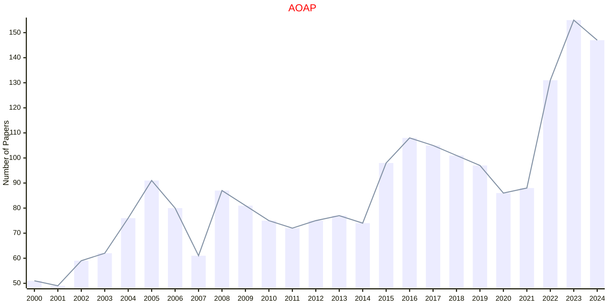
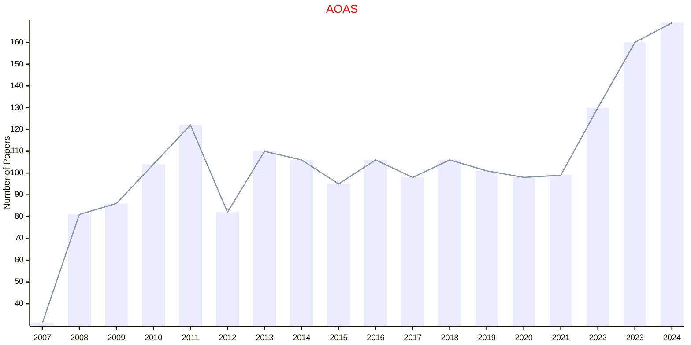
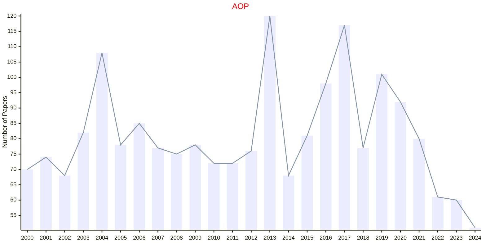
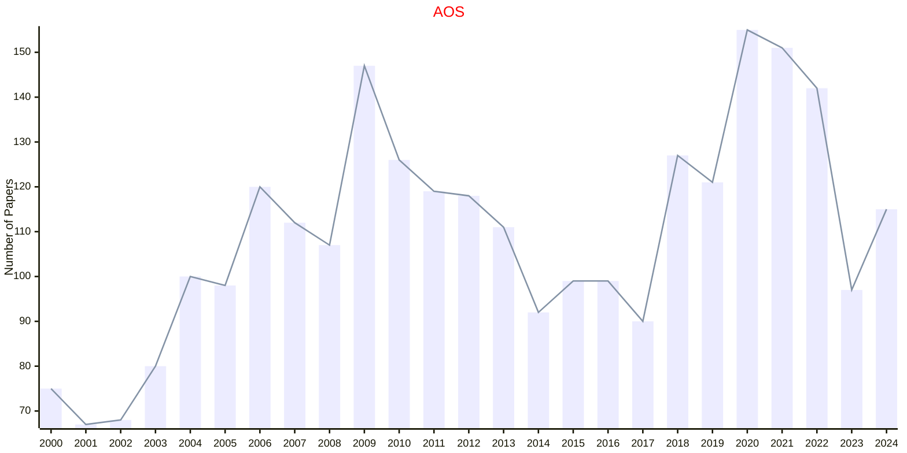

# EUCLID

- The data for TOP, CCF, CAS, JCR, and IF are sourced from [easyScholar](https://www.easyscholar.cc/).

## AOAP

|Publishers|Full/Homepage|Abbr/About|Acronym/Issues|Period/DBLP|Top/Early|CCF|CAS|JCR|IF|Keywords/Google|
|-         |-            |-         |-             |-          |-        |-  |-  |-  |- |-              |
|[EUCLID](https://projecteuclid.org)|[Annals of Applied Probability](https://imstat.org/journals-and-publications/annals-of-applied-probability)|[Ann. Appl. Probab.](https://imstat.org/journals-and-publications/annals-of-applied-probability)|[AOAP](https://projecteuclid.org/journals/annals-of-applied-probability/issues)|1991 -|False||2|Q1|2.1|[Applied Probability](https://www.google.com/search?q=Applied+Probability); [MCMC](https://www.google.com/search?q=MCMC); [Variational Inference](https://www.google.com/search?q=Variational+Inference)|

### Remarks

Publisher: Institute of Mathematical Statistics

## AOAS

|Publishers|Full/Homepage|Abbr/About|Acronym/Issues|Period/DBLP|Top/Early|CCF|CAS|JCR|IF|Keywords/Google|
|-         |-            |-         |-             |-          |-        |-  |-  |-  |- |-              |
|[EUCLID](https://projecteuclid.org)|[Annals of Applied Statistics](https://imstat.org/journals-and-publications/annals-of-applied-statistics)|[Ann. Appl. Stat.](https://imstat.org/journals-and-publications/annals-of-applied-statistics)|[AOAS](https://projecteuclid.org/journals/annals-of-applied-statistics/issues)|2007 -|False||4|Q2|1.8|[Applied Statistics](https://www.google.com/search?q=Applied+Statistics)|

### Remarks

Publisher: Institute of Mathematical Statistics

## AOP

|Publishers|Full/Homepage|Abbr/About|Acronym/Issues|Period/DBLP|Top/Early|CCF|CAS|JCR|IF|Keywords/Google|
|-         |-            |-         |-             |-          |-        |-  |-  |-  |- |-              |
|[EUCLID](https://projecteuclid.org)|[Annals of Probability](https://imstat.org/journals-and-publications/annals-of-probability)|[Ann. Probab.](https://imstat.org/journals-and-publications/annals-of-probability/)|[AOP](https://projecteuclid.org/journals/annals-of-probability/issues)|1973 -|True||1|Q1|2.6|[Probability](https://www.google.com/search?q=Probability)|

### Remarks

Publisher: Institute of Mathematical Statistics

## AOS

|Publishers|Full/Homepage|Abbr/About|Acronym/Issues|Period/DBLP|Top/Early|CCF|CAS|JCR|IF|Keywords/Google|
|-         |-            |-         |-             |-          |-        |-  |-  |-  |- |-              |
|[EUCLID](https://projecteuclid.org)|[Annals of Statistics](https://imstat.org/journals-and-publications/annals-of-statistics)|[Ann. Stat.](https://imstat.org/journals-and-publications/annals-of-statistics)|[AOS](https://projecteuclid.org/journals/annals-of-statistics/issues)|1973 -|True||1|Q1|5.9|[Statistics](https://www.google.com/search?q=Statistics)|

### Remarks

Publisher: Institute of Mathematical Statistics

## BA

|Publishers|Full/Homepage|Abbr/About|Acronym/Issues|Period/DBLP|Top/Early|CCF|CAS|JCR|IF|Keywords/Google|
|-         |-            |-         |-             |-          |-        |-  |-  |-  |- |-              |
|[EUCLID](https://projecteuclid.org)|[Bayesian Analysis](https://projecteuclid.org/journals/bayesian-analysis)|[Bayesian Anal.](https://projecteuclid.org/journals/bayesian-analysis)|[BA](https://projecteuclid.org/journals/bayesian-analysis/issues)|2006 -|True||1|Q1|3.8|[Inference](https://www.google.com/search?q=Inference); [Sampling](https://www.google.com/search?q=Sampling)|

## BERNOULLI

|Publishers|Full/Homepage|Abbr/About|Acronym/Issues|Period/DBLP|Top/Early|CCF|CAS|JCR|IF|Keywords/Google|
|-         |-            |-         |-             |-          |-        |-  |-  |-  |- |-              |
|[EUCLID](https://projecteuclid.org)|[Bernoulli](https://www.bernoullisociety.org/publications/bernoulli-journal)|[Bernoulli](https://www.bernoullisociety.org/index.php/publications/bernoulli-journal/bernoulli-journal-aims-and-scope)|[BERNOULLI](https://projecteuclid.org/journals/bernoulli/issues)|1995 -|False||2|Q2|1.9|[Probability and Statistics](https://www.google.com/search?q=Probability+and+Statistics)|

### Remarks

Publisher: Bernoulli Society for Mathematical Statistics and Probability

## ECP

|Publishers|Full/Homepage|Abbr/About|Acronym/Issues|Period/DBLP|Top/Early|CCF|CAS|JCR|IF|Keywords/Google|
|-         |-            |-         |-             |-          |-        |-  |-  |-  |- |-              |
|[EUCLID](https://projecteuclid.org)|[Electronic Communications in Probability](https://imstat.org/journals-and-publications/electronic-communications-in-probability/)|[Elec. Commun. Probab.](https://imstat.org/journals-and-publications/electronic-communications-in-probability/)|[ECP](https://projecteuclid.org/journals/electronic-communications-in-probability/issues)|1996 -|False||4|Q4|0.7|[Probability and Statistics](https://www.google.com/search?q=Probability+and+Statistics)|

### Remarks

Publisher: Institute of Mathematical Statistics and Bernoulli Society

## EJP

|Publishers|Full/Homepage|Abbr/About|Acronym/Issues|Period/DBLP|Top/Early|CCF|CAS|JCR|IF|Keywords/Google|
|-         |-            |-         |-             |-          |-        |-  |-  |-  |- |-              |
|[EUCLID](https://projecteuclid.org)|[Electronic Journal of Probability](https://imstat.org/journals-and-publications/electronic-journal-of-probability/)|[Elec. J. Probab.](https://imstat.org/journals-and-publications/electronic-journal-of-probability/)|[EJP](https://projecteuclid.org/journals/electronic-journal-of-probability/issues)|1996 -|False||2|Q3|1.3|[Probability and Statistics](https://www.google.com/search?q=Probability+and+Statistics)|

### Remarks

Publisher: Institute of Mathematical Statistics and Bernoulli Society

## EJS

|Publishers|Full/Homepage|Abbr/About|Acronym/Issues|Period/DBLP|Top/Early|CCF|CAS|JCR|IF|Keywords/Google|
|-         |-            |-         |-             |-          |-        |-  |-  |-  |- |-              |
|[EUCLID](https://projecteuclid.org)|[Electronic Journal of Statistics](https://imstat.org/journals-and-publications/electronic-journal-of-statistics/)|[Elec. J. Stat.](https://imstat.org/journals-and-publications/electronic-journal-of-statistics/)|[EJS](https://projecteuclid.org/journals/electronic-journal-of-statistics/issues)|2007 -|False||4|Q2|1.5|[Probability and Statistics](https://www.google.com/search?q=Probability+and+Statistics)|

### Remarks

Publisher: Institute of Mathematical Statistics and Bernoulli Society

## PSURV

|Publishers|Full/Homepage|Abbr/About|Acronym/Issues|Period/DBLP|Top/Early|CCF|CAS|JCR|IF|Keywords/Google|
|-         |-            |-         |-             |-          |-        |-  |-  |-  |- |-              |
|[EUCLID](https://projecteuclid.org)|[Probability Surveys](https://imstat.org/journals-and-publications/probability-surveys/)|[Probab. Surv.](https://imstat.org/journals-and-publications/probability-surveys/)|[PSURV](https://projecteuclid.org/journals/probability-surveys/issues)|2004 -|False||2||2.0|[Probability](https://www.google.com/search?q=Probability); [Probability and Statistics](https://www.google.com/search?q=Probability+and+Statistics)|

### Remarks

Publisher: Institute of Mathematical Statistics and Bernoulli Society

## SSCI

|Publishers|Full/Homepage|Abbr/About|Acronym/Issues|Period/DBLP|Top/Early|CCF|CAS|JCR|IF|Keywords/Google|
|-         |-            |-         |-             |-          |-        |-  |-  |-  |- |-              |
|[EUCLID](https://projecteuclid.org)|[Statistical Science](https://imstat.org/journals-and-publications/statistical-science/)|[Stat. Sci.](https://imstat.org/journals-and-publications/statistical-science/)|[SSCI](https://projecteuclid.org/journals/statistical-science/issues)|1986 -|True||1|Q1|5.2|[Probability and Statistics](https://www.google.com/search?q=Probability+and+Statistics)|

### Remarks

Publisher: Institute of Mathematical Statistics

## SSURV

|Publishers|Full/Homepage|Abbr/About|Acronym/Issues|Period/DBLP|Top/Early|CCF|CAS|JCR|IF|Keywords/Google|
|-         |-            |-         |-             |-          |-        |-  |-  |-  |- |-              |
|[EUCLID](https://projecteuclid.org)|[Statistics Surveys](https://imstat.org/journals-and-publications/statistics-surveys/)|[Stat. Surv.](https://imstat.org/journals-and-publications/statistics-surveys/)|[SSURV](https://projecteuclid.org/journals/statistics-surveys/issues)|2007 -|False||2||9.4|[Probability and Statistics](https://www.google.com/search?q=Probability+and+Statistics); [Statistics](https://www.google.com/search?q=Statistics)|

### Remarks

Publisher: Amer. Statist. Assoc., the Bernoulli Soc., the Inst. Math. Statist., and the Statist. Soc. Canada

