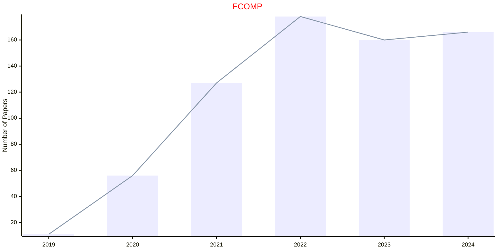
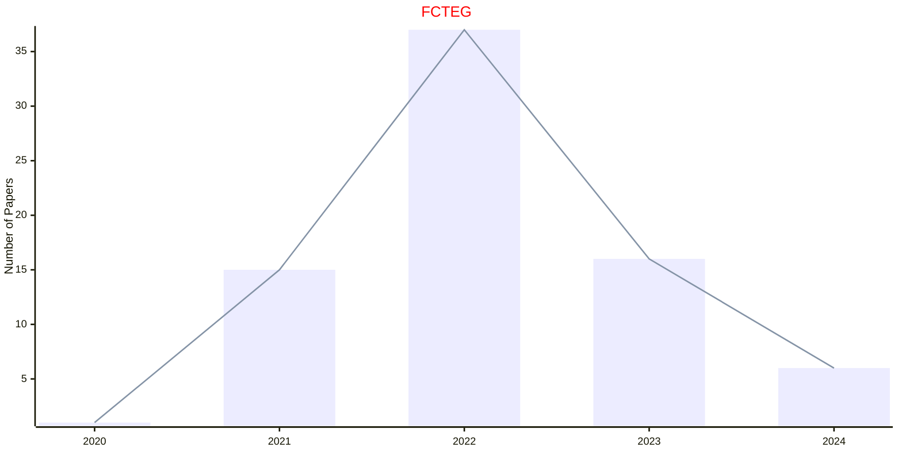
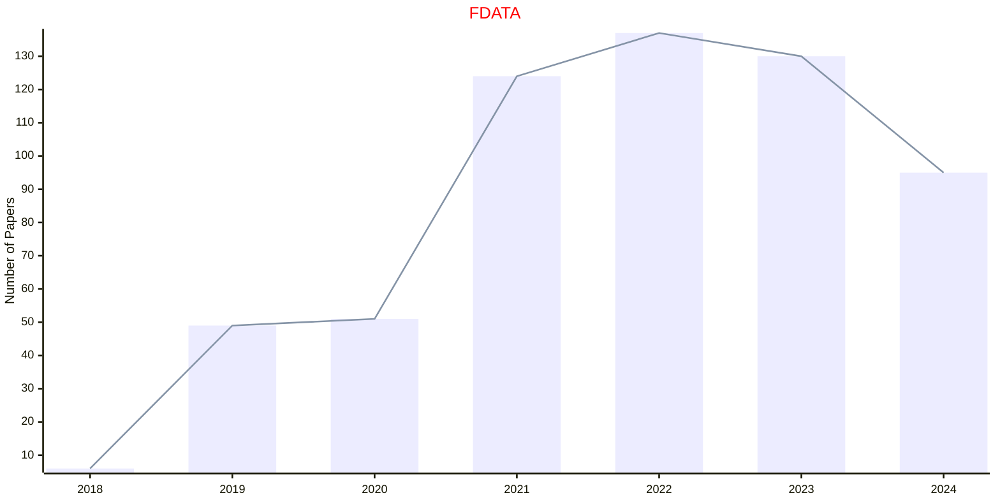
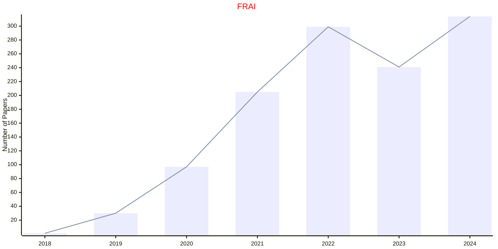
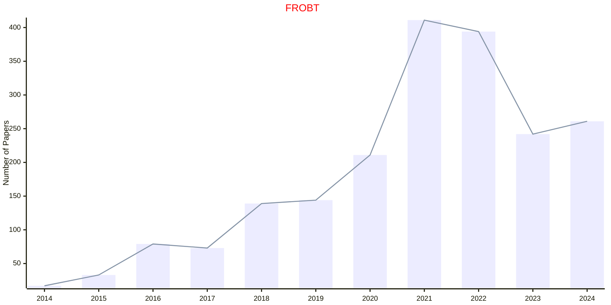

# FRONTIERS

- The data for TOP, CCF, CAS, JCR, and IF are sourced from [easyScholar](https://www.easyscholar.cc/).

## FCOMP

|Publishers|Full/Homepage|Abbr/About|Acronym/Issues|Period/DBLP|Top/Early|CCF|CAS|JCR|IF|Keywords/Google|
|-         |-            |-         |-             |-          |-        |-  |-  |-  |- |-              |
|[FRONTIERS](https://www.frontiersin.org/)|[Frontiers in Computer Science](https://www.frontiersin.org/journals/computer-science)|[Front. Comput. Sci.](https://www.frontiersin.org/journals/computer-science/about)|[FCOMP](https://www.frontiersin.org/journals/computer-science/volumes)|2019 -|False||4||3.2|[Computational Science](https://www.google.com/search?q=Computational+Science)|

## FCTEG

|Publishers|Full/Homepage|Abbr/About|Acronym/Issues|Period/DBLP|Top/Early|CCF|CAS|JCR|IF|Keywords/Google|
|-         |-            |-         |-             |-          |-        |-  |-  |-  |- |-              |
|[FRONTIERS](https://www.frontiersin.org/)|[Frontiers in Control Engineering](https://www.frontiersin.org/journals/control-engineering)|[Front. Control Eng.](https://www.frontiersin.org/journals/control-engineering/about)|[FCTEG](https://www.frontiersin.org/journals/control-engineering/volumes)|2020 -|False|||||[Control Systems](https://www.google.com/search?q=Control+Systems)|

## FDATA

|Publishers|Full/Homepage|Abbr/About|Acronym/Issues|Period/DBLP|Top/Early|CCF|CAS|JCR|IF|Keywords/Google|
|-         |-            |-         |-             |-          |-        |-  |-  |-  |- |-              |
|[FRONTIERS](https://www.frontiersin.org/)|[Frontiers in Big Data](https://www.frontiersin.org/journals/big-data)|[Front. Big Data](https://www.frontiersin.org/journals/big-data/about)|[FDATA](https://www.frontiersin.org/journals/big-data/volumes)|2018 -|False||4||3.5|[Data Mining](https://www.google.com/search?q=Data+Mining)|

## FRAI

|Publishers|Full/Homepage|Abbr/About|Acronym/Issues|Period/DBLP|Top/Early|CCF|CAS|JCR|IF|Keywords/Google|
|-         |-            |-         |-             |-          |-        |-  |-  |-  |- |-              |
|[FRONTIERS](https://www.frontiersin.org/)|[Frontiers in Artificial Intelligence](https://www.frontiersin.org/journals/artificial-intelligence)|[Front. Artif. Intell.](https://www.frontiersin.org/journals/artificial-intelligence/about)|[FRAI](https://www.frontiersin.org/journals/artificial-intelligence/volumes)|2018 -|False||4||5.1|[Ambient Intelligence](https://www.google.com/search?q=Ambient+Intelligence)|

## FROBT

|Publishers|Full/Homepage|Abbr/About|Acronym/Issues|Period/DBLP|Top/Early|CCF|CAS|JCR|IF|Keywords/Google|
|-         |-            |-         |-             |-          |-        |-  |-  |-  |- |-              |
|[FRONTIERS](https://www.frontiersin.org/)|[Frontiers in Robotics and AI](https://www.frontiersin.org/journals/robotics-and-ai)|[Front. Robot. AI](https://www.frontiersin.org/journals/robotics-and-ai/about)|[FROBT](https://www.frontiersin.org/journals/robotics-and-ai/volumes)|2014 -|False||4||4.0|[Ambient Intelligence](https://www.google.com/search?q=Ambient+Intelligence); [Robotics and UAV](https://www.google.com/search?q=Robotics+and+UAV)|

