# IEEE

- The data for TOP, CCF, CAS, JCR, and IF are sourced from [easyScholar](https://www.easyscholar.cc/).

## ACCESS

|Publishers|Full/Homepage|Abbr/About|Acronym/Issues|Period/DBLP|Top/Early|CCF|CAS|JCR|IF|Keywords/Google|
|-         |-            |-         |-             |-          |-        |-  |-  |-  |- |-              |
|[IEEE](https://ieeexplore.ieee.org/)|[IEEE Access](https://ieeexplore.ieee.org/xpl/RecentIssue.jsp?punumber=6287639)|[IEEE Access](https://ieeexplore.ieee.org/xpl/aboutJournal.jsp?punumber=6287639)|[ACCESS](https://ieeexplore.ieee.org/xpl/issues?punumber=6287639&isnumber=10820123)|2013 -|[False](https://ieeexplore.ieee.org/xpl/tocresult.jsp?isnumber=6514899)||4|Q2|3.9||

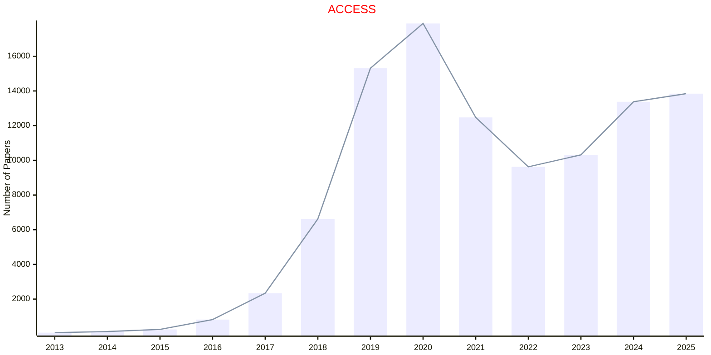

## JSYST

|Publishers|Full/Homepage|Abbr/About|Acronym/Issues|Period/DBLP|Top/Early|CCF|CAS|JCR|IF|Keywords/Google|
|-         |-            |-         |-             |-          |-        |-  |-  |-  |- |-              |
|[IEEE](https://ieeexplore.ieee.org/)|[IEEE Systems Journal](https://ieeexplore.ieee.org/xpl/RecentIssue.jsp?punumber=4267003)|[IEEE Syst. J.](https://ieeexplore.ieee.org/xpl/aboutJournal.jsp?punumber=4267003)|[JSYST](https://ieeexplore.ieee.org/xpl/issues?punumber=4267003&isnumber=10566074)|2007 -|[False](https://ieeexplore.ieee.org/xpl/tocresult.jsp?isnumber=4357939)||3|Q1|4.4||

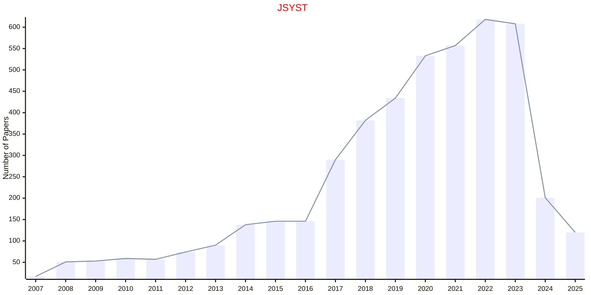

## LCOMM

|Publishers|Full/Homepage|Abbr/About|Acronym/Issues|Period/DBLP|Top/Early|CCF|CAS|JCR|IF|Keywords/Google|
|-         |-            |-         |-             |-          |-        |-  |-  |-  |- |-              |
|[IEEE](https://ieeexplore.ieee.org/)|[IEEE Communications Letters](https://ieeexplore.ieee.org/xpl/RecentIssue.jsp?punumber=4234)|[IEEE Commun. Lett.](https://ieeexplore.ieee.org/xpl/aboutJournal.jsp?punumber=4234)|[LCOMM](https://ieeexplore.ieee.org/xpl/issues?punumber=4234&isnumber=11199985)|1997 -|[False](https://ieeexplore.ieee.org/xpl/tocresult.jsp?isnumber=5534602)||3|Q2|4.2||

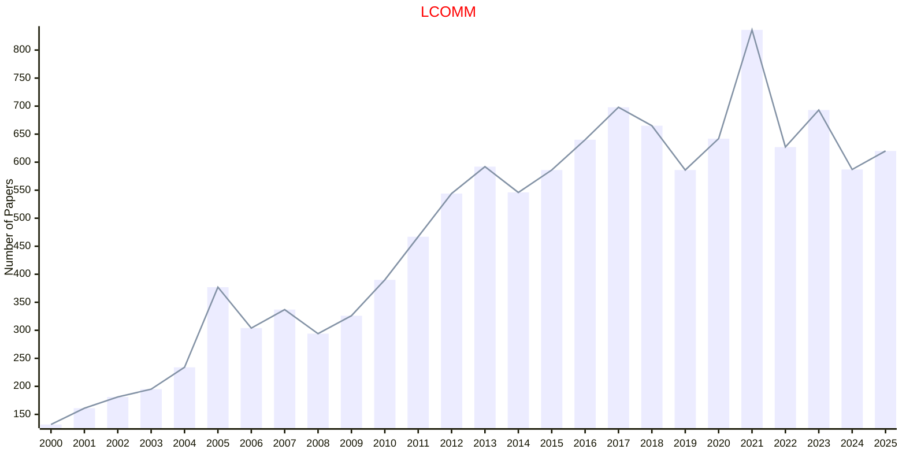

## MC

|Publishers|Full/Homepage|Abbr/About|Acronym/Issues|Period/DBLP|Top/Early|CCF|CAS|JCR|IF|Keywords/Google|
|-         |-            |-         |-             |-          |-        |-  |-  |-  |- |-              |
|[IEEE](https://ieeexplore.ieee.org/)|[Computer](https://ieeexplore.ieee.org/xpl/RecentIssue.jsp?punumber=2)|[Computer](https://ieeexplore.ieee.org/xpl/aboutJournal.jsp?punumber=2)|[MC](https://ieeexplore.ieee.org/xpl/issues?punumber=2&isnumber=10574404)|1970 -|[False](https://ieeexplore.ieee.org/xpl/tocresult.jsp?isnumber=5306045)||4|Q2|2.6|[Hardware and Software](https://www.google.com/search?q=Hardware+and+Software)|

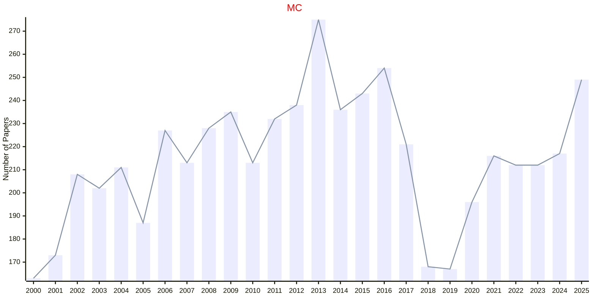

## MCI

|Publishers|Full/Homepage|Abbr/About|Acronym/Issues|Period/DBLP|Top/Early|CCF|CAS|JCR|IF|Keywords/Google|
|-         |-            |-         |-             |-          |-        |-  |-  |-  |- |-              |
|[IEEE](https://ieeexplore.ieee.org/)|[IEEE Computational Intelligence Magazine](https://ieeexplore.ieee.org/xpl/RecentIssue.jsp?punumber=10207)|[IEEE Comput. Intell. Mag.](https://ieeexplore.ieee.org/xpl/aboutJournal.jsp?punumber=10207)|[MCI](https://ieeexplore.ieee.org/xpl/issues?punumber=10207&isnumber=10844565)|2006 -|False||2|Q1|9.3|[Computational Intelligence](https://www.google.com/search?q=Computational+Intelligence)|

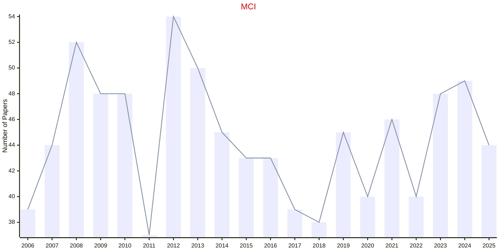

## MICRO

|Publishers|Full/Homepage|Abbr/About|Acronym/Issues|Period/DBLP|Top/Early|CCF|CAS|JCR|IF|Keywords/Google|
|-         |-            |-         |-             |-          |-        |-  |-  |-  |- |-              |
|[IEEE](https://ieeexplore.ieee.org/)|[IEEE Micro](https://ieeexplore.ieee.org/xpl/RecentIssue.jsp?punumber=40)|[IEEE Micro](https://ieeexplore.ieee.org/xpl/aboutJournal.jsp?punumber=40)|[MICRO](https://ieeexplore.ieee.org/xpl/issues?punumber=40&isnumber=10568462)|1981 -|[False](https://ieeexplore.ieee.org/xpl/tocresult.jsp?isnumber=5210076)||3|Q2|3.7||

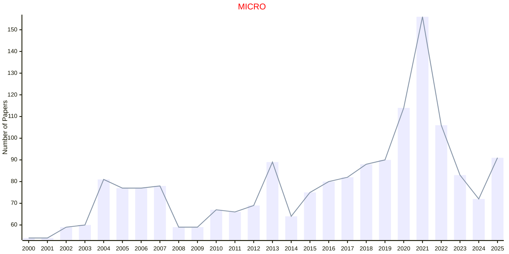

## MIS

|Publishers|Full/Homepage|Abbr/About|Acronym/Issues|Period/DBLP|Top/Early|CCF|CAS|JCR|IF|Keywords/Google|
|-         |-            |-         |-             |-          |-        |-  |-  |-  |- |-              |
|[IEEE](https://ieeexplore.ieee.org/)|[IEEE Intelligent Systems](https://ieeexplore.ieee.org/xpl/RecentIssue.jsp?punumber=9670)|[IEEE Intell. Syst.](https://ieeexplore.ieee.org/xpl/aboutJournal.jsp?punumber=9670)|[MIS](https://ieeexplore.ieee.org/xpl/issues?punumber=9670&isnumber=10614835)|2001 -|[False](https://ieeexplore.ieee.org/xpl/tocresult.jsp?isnumber=5196652)||4|Q1|6.6|[Intelligent Systems](https://www.google.com/search?q=Intelligent+Systems)|

### Remarks

**Previous Titles**
- 2001 - Present: IEEE Intelligent Systems
- 1998 - 2000: IEEE Intelligent Systems and their Applications
- 1986 - 1997: IEEE Expert

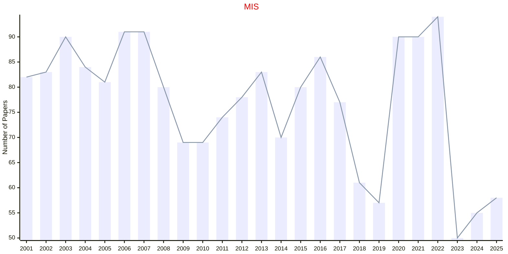

## MRA

|Publishers|Full/Homepage|Abbr/About|Acronym/Issues|Period/DBLP|Top/Early|CCF|CAS|JCR|IF|Keywords/Google|
|-         |-            |-         |-             |-          |-        |-  |-  |-  |- |-              |
|[IEEE](https://ieeexplore.ieee.org/)|[IEEE Robotics and Automation Magazine](https://ieeexplore.ieee.org/xpl/RecentIssue.jsp?punumber=100)|[IEEE Robot. Autom. Mag.](https://ieeexplore.ieee.org/xpl/aboutJournal.jsp?punumber=100)|[MRA](https://ieeexplore.ieee.org/xpl/issues?punumber=100&isnumber=10931179)|1994 -|[False](https://ieeexplore.ieee.org/xpl/tocresult.jsp?isnumber=4600619)||3|Q1|7.3|[Robotics and UAV](https://www.google.com/search?q=Robotics+and+UAV)|

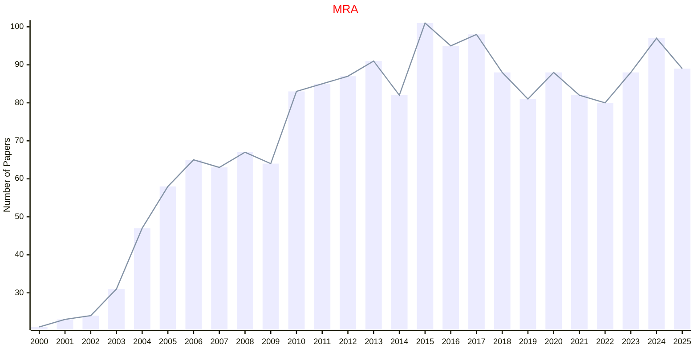

## MSP

|Publishers|Full/Homepage|Abbr/About|Acronym/Issues|Period/DBLP|Top/Early|CCF|CAS|JCR|IF|Keywords/Google|
|-         |-            |-         |-             |-          |-        |-  |-  |-  |- |-              |
|[IEEE](https://ieeexplore.ieee.org/)|[IEEE Signal Processing Magazine](https://ieeexplore.ieee.org/xpl/RecentIssue.jsp?punumber=79)|[IEEE Signal Process. Mag.](https://ieeexplore.ieee.org/xpl/aboutJournal.jsp?punumber=79)|[MSP](https://ieeexplore.ieee.org/xpl/issues?punumber=79&isnumber=10934750)|1991 -|False||2|Q1|17.1|[Signal Processing](https://www.google.com/search?q=Signal+Processing)|

### Remarks

**Previous Titles**
- 1991 - Present: IEEE Signal Processing Magazine
- 1984 - 1990: IEEE ASSP Magazine
- 1974 - 1983: IEEE Acoustics, Speech, and Signal Processing Newsletter
- 1970 - 1973: IEEE Audio and Electroacoustics Newsletter

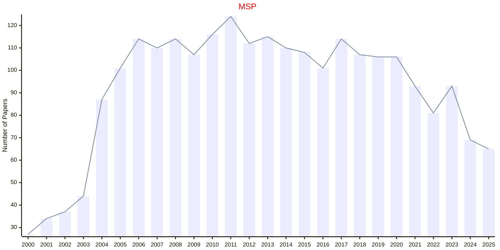

## MSSC

|Publishers|Full/Homepage|Abbr/About|Acronym/Issues|Period/DBLP|Top/Early|CCF|CAS|JCR|IF|Keywords/Google|
|-         |-            |-         |-             |-          |-        |-  |-  |-  |- |-              |
|[IEEE](https://ieeexplore.ieee.org/)|[IEEE Solid-State Circuits Magazine](https://ieeexplore.ieee.org/xpl/RecentIssue.jsp?punumber=4563670)|[IEEE Solid-State Circuits Mag.](https://ieeexplore.ieee.org/xpl/aboutJournal.jsp?punumber=4563670)|[MSSC](https://ieeexplore.ieee.org/xpl/issues?punumber=4563670&isnumber=10857681)|2009 -|False||||||

### Remarks

**Previous Titles**
- 2009 - Present: IEEE Solid-State Circuits Magazine
- 2000 - 2008: IEEE Solid-State Circuits Society Newsletter

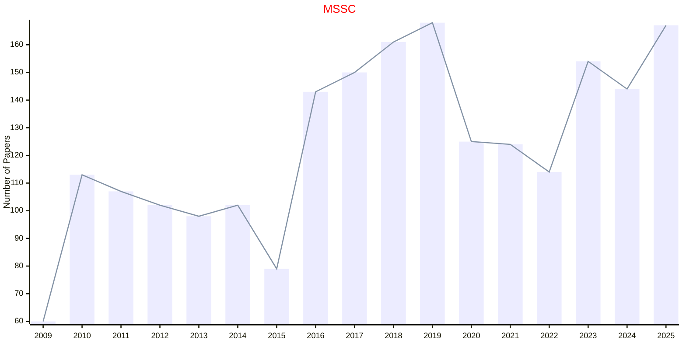

## PIEEE

|Publishers|Full/Homepage|Abbr/About|Acronym/Issues|Period/DBLP|Top/Early|CCF|CAS|JCR|IF|Keywords/Google|
|-         |-            |-         |-             |-          |-        |-  |-  |-  |- |-              |
|[IEEE](https://ieeexplore.ieee.org/)|[Proceedings of the IEEE](https://ieeexplore.ieee.org/xpl/RecentIssue.jsp?punumber=5)|[Proc. IEEE](https://ieeexplore.ieee.org/xpl/aboutJournal.jsp?punumber=5)|[PIEEE](https://ieeexplore.ieee.org/xpl/issues?punumber=5&isnumber=10193795)|1963 -|[True](https://ieeexplore.ieee.org/xpl/tocresult.jsp?isnumber=4357935)|A|1|Q1|25.0|[Multidisciplinary](https://www.google.com/search?q=Multidisciplinary)|

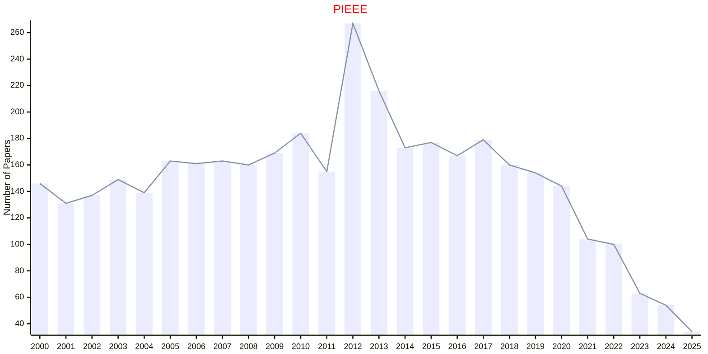

## TAC

|Publishers|Full/Homepage|Abbr/About|Acronym/Issues|Period/DBLP|Top/Early|CCF|CAS|JCR|IF|Keywords/Google|
|-         |-            |-         |-             |-          |-        |-  |-  |-  |- |-              |
|[IEEE](https://ieeexplore.ieee.org/)|[IEEE Transactions on Automatic Control](https://ieeexplore.ieee.org/xpl/RecentIssue.jsp?punumber=9)|[IEEE Trans. Autom. Control](https://ieeexplore.ieee.org/xpl/aboutJournal.jsp?punumber=9)|[TAC](https://ieeexplore.ieee.org/xpl/issues?punumber=9&isnumber=10233941)|1963 -|[True](https://ieeexplore.ieee.org/xpl/tocresult.jsp?isnumber=4601496)||2|Q1|7.2|[Control and Automation](https://www.google.com/search?q=Control+and+Automation)|

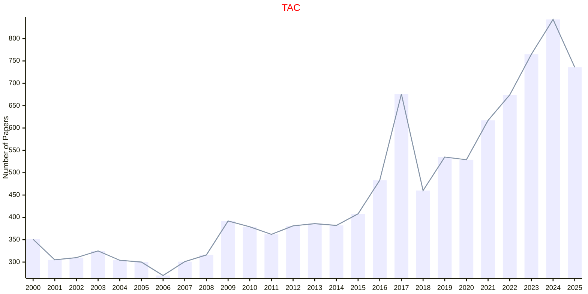

## TAFFC

|Publishers|Full/Homepage|Abbr/About|Acronym/Issues|Period/DBLP|Top/Early|CCF|CAS|JCR|IF|Keywords/Google|
|-         |-            |-         |-             |-          |-        |-  |-  |-  |- |-              |
|[IEEE](https://ieeexplore.ieee.org/)|[IEEE Transactions on Affective Computing](https://ieeexplore.ieee.org/xpl/RecentIssue.jsp?punumber=5165369)|[IEEE Trans. Affect. Comput.](https://ieeexplore.ieee.org/xpl/aboutJournal.jsp?punumber=5165369)|[TAFFC](https://xplorestaging.ieee.org/xpl/issues?punumber=5165369&isnumber=10542474)|2010 -|[True](https://xplorestaging.ieee.org/xpl/tocresult.jsp?isnumber=5520654)|B|1|Q1|10.2|[Affective Computing](https://www.google.com/search?q=Affective+Computing)|

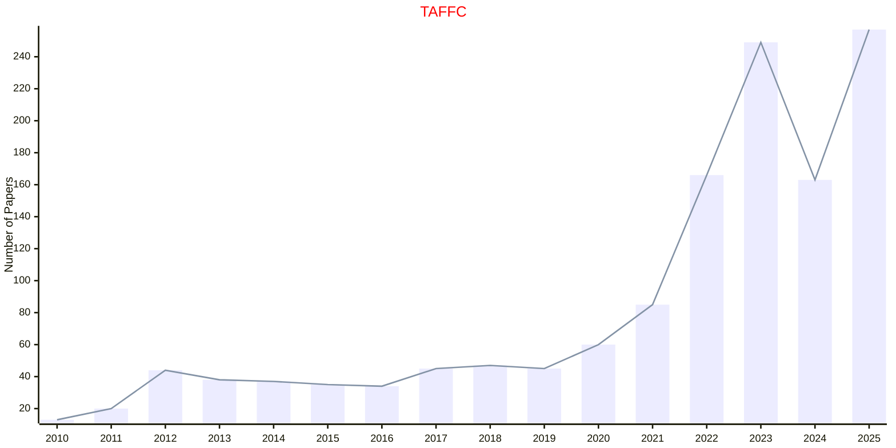

## TAI

|Publishers|Full/Homepage|Abbr/About|Acronym/Issues|Period/DBLP|Top/Early|CCF|CAS|JCR|IF|Keywords/Google|
|-         |-            |-         |-             |-          |-        |-  |-  |-  |- |-              |
|[IEEE](https://ieeexplore.ieee.org/)|[IEEE Transactions on Artificial Intelligence](https://ieeexplore.ieee.org/xpl/RecentIssue.jsp?punumber=9078688)|[IEEE Trans. Artif. Intell.](https://ieeexplore.ieee.org/xpl/aboutJournal.jsp?punumber=9078688)|[TAI](https://ieeexplore.ieee.org/xpl/issues?punumber=9078688&isnumber=10599850)|2020 -|[False](https://ieeexplore.ieee.org/xpl/tocresult.jsp?isnumber=9184921)|||||[Artificial Intelligence](https://www.google.com/search?q=Artificial+Intelligence)|

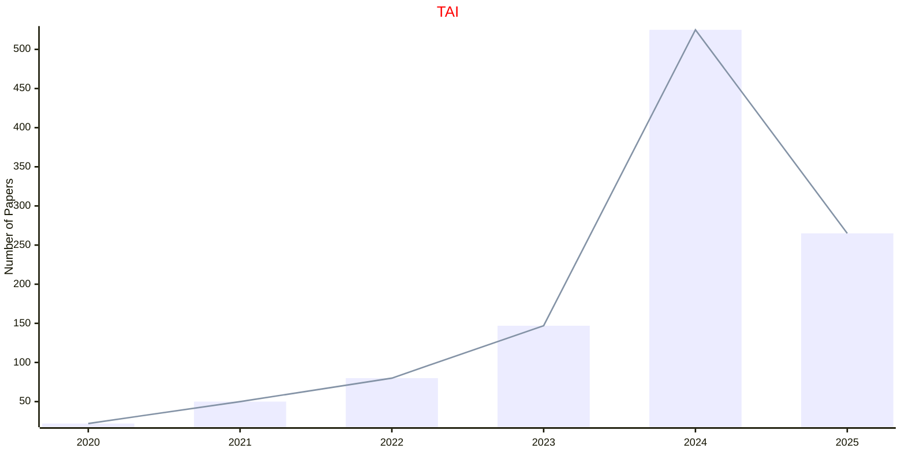

## TASE

|Publishers|Full/Homepage|Abbr/About|Acronym/Issues|Period/DBLP|Top/Early|CCF|CAS|JCR|IF|Keywords/Google|
|-         |-            |-         |-             |-          |-        |-  |-  |-  |- |-              |
|[IEEE](https://ieeexplore.ieee.org/)|[IEEE Transactions on Automation Science and Engineering](https://ieeexplore.ieee.org/xpl/RecentIssue.jsp?punumber=8856)|[IEEE Trans. Autom. Sci. Eng.](https://ieeexplore.ieee.org/xpl/aboutJournal.jsp?punumber=8856)|[TASE](https://ieeexplore.ieee.org/xpl/issues?punumber=8856&isnumber=10839176)|2004 -|[False](https://ieeexplore.ieee.org/xpl/tocresult.jsp?isnumber=4358066)|B|2|Q1|7.0||

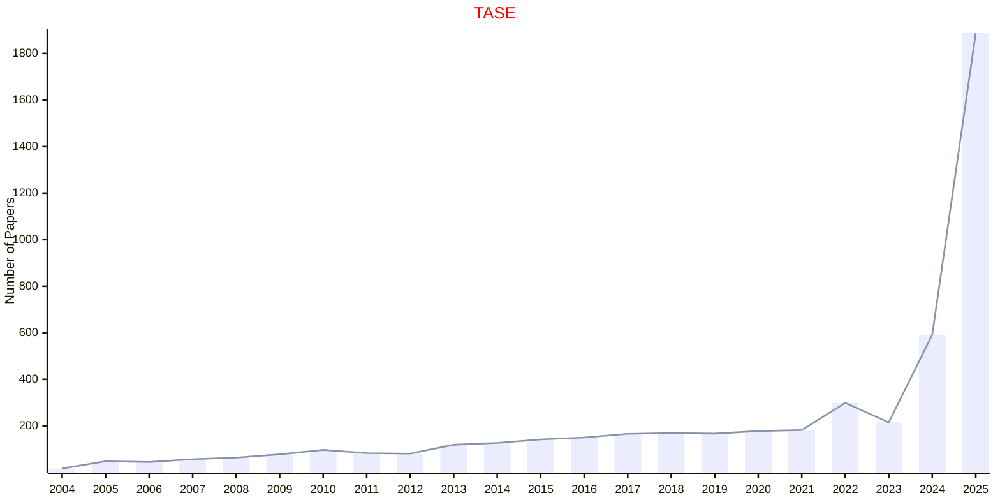

## TASLP

|Publishers|Full/Homepage|Abbr/About|Acronym/Issues|Period/DBLP|Top/Early|CCF|CAS|JCR|IF|Keywords/Google|
|-         |-            |-         |-             |-          |-        |-  |-  |-  |- |-              |
|[IEEE](https://ieeexplore.ieee.org/)|[IEEE/ACM Transactions on Audio, Speech, and Language Processing](https://ieeexplore.ieee.org/xpl/RecentIssue.jsp?punumber=6570655)|[IEEE/ACM Trans. Audio Speech Lang. Process.](https://ieeexplore.ieee.org/xpl/aboutJournal.jsp?punumber=6570655)|[TASLP](https://ieeexplore.ieee.org/xpl/issues?punumber=6570655&isnumber=10304349)|2014 - 2024|False||2|Q1|6.1|[Natural Language Processing](https://www.google.com/search?q=Natural+Language+Processing)|

### Remarks

**Previous Titles**

2025 - Present: IEEE Transactions on Audio, Speech and Language Processing

2014 - 2024: IEEE/ACM Transactions on Audio, Speech, and Language Processing

2004 - 2013: ACM Transactions on Speech and Language Processing

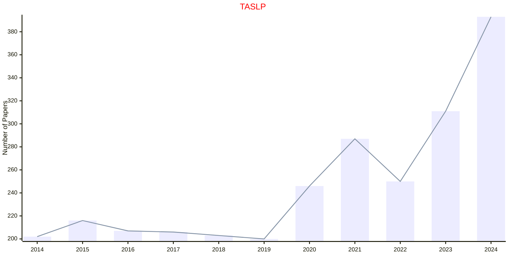

## TASLPRO

|Publishers|Full/Homepage|Abbr/About|Acronym/Issues|Period/DBLP|Top/Early|CCF|CAS|JCR|IF|Keywords/Google|
|-         |-            |-         |-             |-          |-        |-  |-  |-  |- |-              |
|[IEEE](https://ieeexplore.ieee.org/)|[IEEE Transactions on Audio, Speech, and Language Processing](https://ieeexplore.ieee.org/xpl/RecentIssue.jsp?punumber=10723155)|[IEEE Trans. Audio Speech Lang. Process.](https://ieeexplore.ieee.org/xpl/RecentIssue.jsp?punumber=10723155)|[TASLPRO](https://ieeexplore.ieee.org/xpl/issues?punumber=10723155&isnumber=10835842)|2025 -|[False](https://ieeexplore.ieee.org/xpl/tocresult.jsp?isnumber=10818373)|B||||[Natural Language Processing](https://www.google.com/search?q=Natural+Language+Processing)|

### Remarks

**Previous Titles**

2025 - Present: IEEE Transactions on Audio, Speech and Language Processing

2014 - 2024: IEEE/ACM Transactions on Audio, Speech, and Language Processing

2004 - 2013: ACM Transactions on Speech and Language Processing

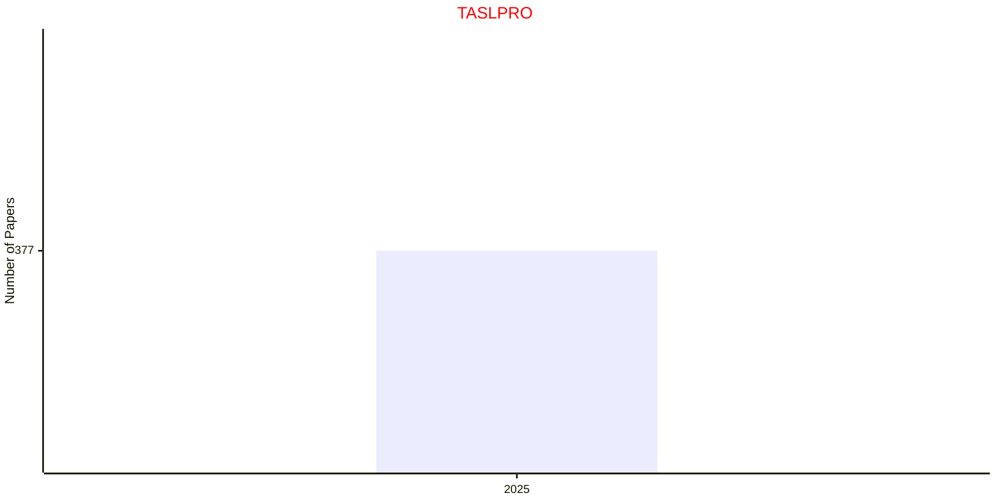

## TBD

|Publishers|Full/Homepage|Abbr/About|Acronym/Issues|Period/DBLP|Top/Early|CCF|CAS|JCR|IF|Keywords/Google|
|-         |-            |-         |-             |-          |-        |-  |-  |-  |- |-              |
|[IEEE](https://ieeexplore.ieee.org/)|[IEEE Transactions on Big Data](https://ieeexplore.ieee.org/xpl/RecentIssue.jsp?punumber=6687317)|[IEEE Trans. Big Data](https://ieeexplore.ieee.org/xpl/aboutJournal.jsp?punumber=6687317)|[TBD](https://ieeexplore.ieee.org/xpl/issues?punumber=6687317&isnumber=10595994)|2015 -|[False](https://ieeexplore.ieee.org/xpl/tocresult.jsp?isnumber=7153538)|C|2|Q1|5.7|[Data Mining](https://www.google.com/search?q=Data+Mining)|

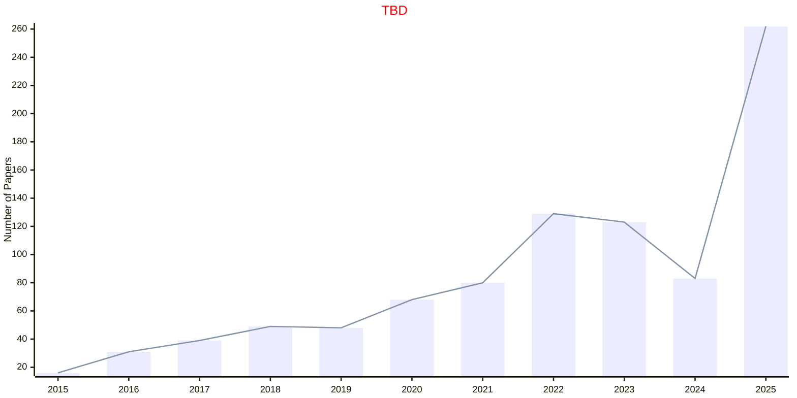

## TC

|Publishers|Full/Homepage|Abbr/About|Acronym/Issues|Period/DBLP|Top/Early|CCF|CAS|JCR|IF|Keywords/Google|
|-         |-            |-         |-             |-          |-        |-  |-  |-  |- |-              |
|[IEEE](https://ieeexplore.ieee.org/)|[IEEE Transactions on Computers](https://ieeexplore.ieee.org/xpl/RecentIssue.jsp?punumber=12)|[IEEE Trans. Comput.](https://ieeexplore.ieee.org/xpl/aboutJournal.jsp?punumber=12)|[TC](https://ieeexplore.ieee.org/xpl/issues?punumber=12&isnumber=10243393)|1968 -|[False](https://ieeexplore.ieee.org/xpl/tocresult.jsp?isnumber=4358213)|A|2|Q2|3.7|[Computational Science](https://www.google.com/search?q=Computational+Science)|

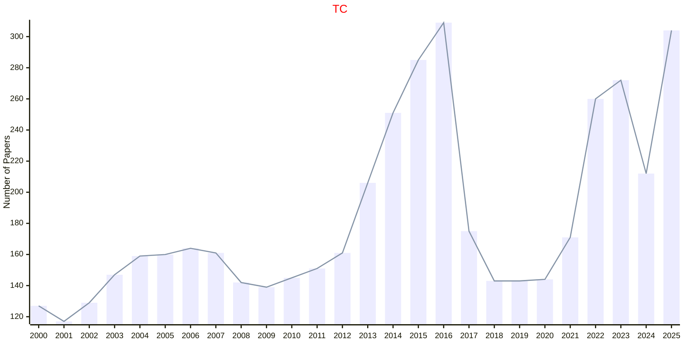

## TCC

|Publishers|Full/Homepage|Abbr/About|Acronym/Issues|Period/DBLP|Top/Early|CCF|CAS|JCR|IF|Keywords/Google|
|-         |-            |-         |-             |-          |-        |-  |-  |-  |- |-              |
|[IEEE](https://ieeexplore.ieee.org/)|[IEEE Transactions on Cloud Computing](https://ieeexplore.ieee.org/xpl/RecentIssue.jsp?punumber=6245519)|[IEEE Trans. Cloud Comput.](https://ieeexplore.ieee.org/xpl/aboutJournal.jsp?punumber=6245519)|[TCC](https://ieeexplore.ieee.org/xpl/issues?punumber=6245519&isnumber=10241247)|2013 -|[False](https://ieeexplore.ieee.org/xpl/tocresult.jsp?isnumber=6562694)|C|2|Q1|4.5||

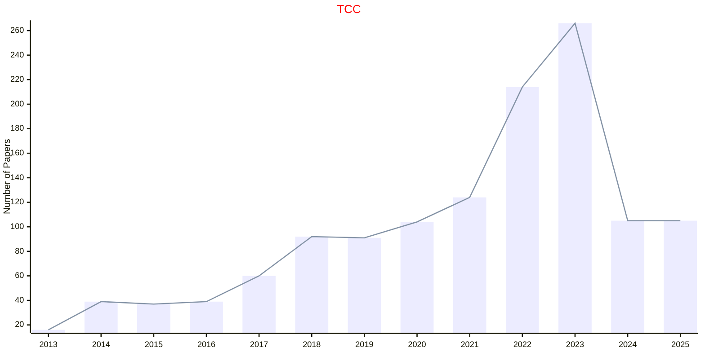

## TCDS

|Publishers|Full/Homepage|Abbr/About|Acronym/Issues|Period/DBLP|Top/Early|CCF|CAS|JCR|IF|Keywords/Google|
|-         |-            |-         |-             |-          |-        |-  |-  |-  |- |-              |
|[IEEE](https://ieeexplore.ieee.org/)|[IEEE Transactions on Cognitive and Developmental Systems](https://ieeexplore.ieee.org/xpl/RecentIssue.jsp?punumber=7274989)|[IEEE Trans. Cogn. Develop. Syst.](https://ieeexplore.ieee.org/xpl/aboutJournal.jsp?punumber=7274989)|[TCDS](https://ieeexplore.ieee.org/xpl/issues?punumber=7274989&isnumber=10633860)|2016 -|[False](https://ieeexplore.ieee.org/xpl/tocresult.jsp?isnumber=7422051)||3|Q1|5.0||

### Remarks

**Previous Titles**
- 2016 - Present: IEEE Transactions on Cognitive and Developmental Systems
- 2009 - 2015: IEEE Transactions on Autonomous Mental Development

```mermaid
---
config:
    xyChart:
        width: 1200
        height: 600
    themeVariables:
        xyChart:
            titleColor: "#ff0000"
---
xychart-beta
    title "TCDS"
    x-axis [2016, 2017, 2018, 2019, 2020, 2021, 2022, 2023, 2024, 2025]
    y-axis "Number of Papers"
    bar [28, 38, 104, 55, 76, 92, 152, 196, 175, 120]
    line [28, 38, 104, 55, 76, 92, 152, 196, 175, 120]
```

## TCNS

|Publishers|Full/Homepage|Abbr/About|Acronym/Issues|Period/DBLP|Top/Early|CCF|CAS|JCR|IF|Keywords/Google|
|-         |-            |-         |-             |-          |-        |-  |-  |-  |- |-              |
|[IEEE](https://ieeexplore.ieee.org/)|[IEEE Transactions on Control of Network Systems](https://ieeexplore.ieee.org/xpl/RecentIssue.jsp?punumber=6509490)|[IEEE Trans. Control Netw. Syst.](https://ieeexplore.ieee.org/xpl/aboutJournal.jsp?punumber=6509490)|[TCNS](https://ieeexplore.ieee.org/xpl/issues?punumber=6509490&isnumber=10564798)|2014 -|[False](https://ieeexplore.ieee.org/xpl/tocresult.jsp?isnumber=6730648)||3|Q1|4.7|[Neural Networks](https://www.google.com/search?q=Neural+Networks)|

```mermaid
---
config:
    xyChart:
        width: 1200
        height: 600
    themeVariables:
        xyChart:
            titleColor: "#ff0000"
---
xychart-beta
    title "TCNS"
    x-axis [2014, 2015, 2016, 2017, 2018, 2019, 2020, 2021, 2022, 2023, 2024, 2025]
    y-axis "Number of Papers"
    bar [35, 38, 34, 80, 180, 127, 170, 172, 166, 183, 189, 258]
    line [35, 38, 34, 80, 180, 127, 170, 172, 166, 183, 189, 258]
```

## TCSS

|Publishers|Full/Homepage|Abbr/About|Acronym/Issues|Period/DBLP|Top/Early|CCF|CAS|JCR|IF|Keywords/Google|
|-         |-            |-         |-             |-          |-        |-  |-  |-  |- |-              |
|[IEEE](https://ieeexplore.ieee.org/)|[IEEE Transactions on Computational Social Systems](https://ieeexplore.ieee.org/xpl/RecentIssue.jsp?punumber=6570650)|[IEEE Trans. Comput. Social Syst.](https://ieeexplore.ieee.org/xpl/aboutJournal.jsp?punumber=6570650)|[TCSS](https://ieeexplore.ieee.org/xpl/issues?punumber=6570650&isnumber=10557215)|2014 -|[False](https://ieeexplore.ieee.org/xpl/tocresult.jsp?isnumber=6780646)|C|3|Q1|5.1||

```mermaid
---
config:
    xyChart:
        width: 1200
        height: 600
    themeVariables:
        xyChart:
            titleColor: "#ff0000"
---
xychart-beta
    title "TCSS"
    x-axis [2014, 2015, 2016, 2017, 2018, 2019, 2020, 2021, 2022, 2023, 2024, 2025]
    y-axis "Number of Papers"
    bar [17, 21, 24, 23, 102, 136, 132, 137, 161, 301, 654, 418]
    line [17, 21, 24, 23, 102, 136, 132, 137, 161, 301, 654, 418]
```

## TCYB

|Publishers|Full/Homepage|Abbr/About|Acronym/Issues|Period/DBLP|Top/Early|CCF|CAS|JCR|IF|Keywords/Google|
|-         |-            |-         |-             |-          |-        |-  |-  |-  |- |-              |
|[IEEE](https://ieeexplore.ieee.org/)|[IEEE Transactions on Cybernetics](https://ieeexplore.ieee.org/xpl/RecentIssue.jsp?punumber=6221036)|[IEEE Trans. Cybern.](https://ieeexplore.ieee.org/xpl/aboutJournal.jsp?punumber=6221036)|[TCYB](https://ieeexplore.ieee.org/xpl/issues?punumber=6221036&isnumber=10223305)|2013 -|[True](https://ieeexplore.ieee.org/xpl/tocresult.jsp?isnumber=6352949)|B|1|Q1|11.6|[Artificial Intelligence](https://www.google.com/search?q=Artificial+Intelligence); [Evolutionary Computation](https://www.google.com/search?q=Evolutionary+Computation)|

### Remarks

**Previous Titles**
- 2013 - Present: IEEE Transactions on Cybernetics
- 1996 - 2012: IEEE Transactions on Systems, Man, and Cybernetics, Part B (Cybernetics)
- 1971 - 1995: IEEE Transactions on Systems, Man, and Cybernetics
- 1968 - 1970: IEEE Transactions on Man-Machine Systems
- 1965 - 1970: IEEE Transactions on Systems Science and Cybernetics
- 1963 - 1967: IEEE Transactions on Human Factors in Electronics
- 1960 - 1962: IRE Transactions on Human Factors in Electronics

```mermaid
---
config:
    xyChart:
        width: 1200
        height: 600
    themeVariables:
        xyChart:
            titleColor: "#ff0000"
---
xychart-beta
    title "TCYB"
    x-axis [2013, 2014, 2015, 2016, 2017, 2018, 2019, 2020, 2021, 2022, 2023, 2024, 2025]
    y-axis "Number of Papers"
    bar [191, 243, 256, 310, 406, 307, 396, 440, 540, 1138, 640, 648, 483]
    line [191, 243, 256, 310, 406, 307, 396, 440, 540, 1138, 640, 648, 483]
```

## TETC

|Publishers|Full/Homepage|Abbr/About|Acronym/Issues|Period/DBLP|Top/Early|CCF|CAS|JCR|IF|Keywords/Google|
|-         |-            |-         |-             |-          |-        |-  |-  |-  |- |-              |
|[IEEE](https://ieeexplore.ieee.org/)|[IEEE Transactions on Emerging Topics in Computing](https://ieeexplore.ieee.org/xpl/RecentIssue.jsp?punumber=6245516)|[IEEE Trans. Emerg. Topics Comput.](https://ieeexplore.ieee.org/xpl/aboutJournal.jsp?punumber=6245516)|[TETC](https://ieeexplore.ieee.org/xpl/issues?punumber=6245516&isnumber=10552369)|2013 -|[False](https://ieeexplore.ieee.org/xpl/tocresult.jsp?isnumber=6558478)||2|Q1|4.9||

```mermaid
---
config:
    xyChart:
        width: 1200
        height: 600
    themeVariables:
        xyChart:
            titleColor: "#ff0000"
---
xychart-beta
    title "TETC"
    x-axis [2013, 2014, 2015, 2016, 2017, 2018, 2019, 2020, 2021, 2022, 2023, 2024, 2025]
    y-axis "Number of Papers"
    bar [34, 42, 53, 51, 52, 53, 54, 88, 185, 164, 85, 92, 120]
    line [34, 42, 53, 51, 52, 53, 54, 88, 185, 164, 85, 92, 120]
```

## TETCI

|Publishers|Full/Homepage|Abbr/About|Acronym/Issues|Period/DBLP|Top/Early|CCF|CAS|JCR|IF|Keywords/Google|
|-         |-            |-         |-             |-          |-        |-  |-  |-  |- |-              |
|[IEEE](https://ieeexplore.ieee.org/)|[IEEE Transactions on Emerging Topics in Computational Intelligence](https://ieeexplore.ieee.org/xpl/RecentIssue.jsp?punumber=7433297)|[IEEE Trans. Emerg. Topics Comput. Intell.](https://ieeexplore.ieee.org/xpl/aboutJournal.jsp?punumber=7433297)|[TETCI](https://ieeexplore.ieee.org/xpl/issues?punumber=7433297&isnumber=11177632)|2017 -|[False](https://ieeexplore.ieee.org/xpl/tocresult.jsp?isnumber=7777658)||2|Q1|6.6||

```mermaid
---
config:
    xyChart:
        width: 1200
        height: 600
    themeVariables:
        xyChart:
            titleColor: "#ff0000"
---
xychart-beta
    title "TETCI"
    x-axis [2017, 2018, 2019, 2020, 2021, 2022, 2023, 2024, 2025]
    y-axis "Number of Papers"
    bar [41, 46, 49, 75, 86, 126, 137, 320, 320]
    line [41, 46, 49, 75, 86, 126, 137, 320, 320]
```

## TEVC

|Publishers|Full/Homepage|Abbr/About|Acronym/Issues|Period/DBLP|Top/Early|CCF|CAS|JCR|IF|Keywords/Google|
|-         |-            |-         |-             |-          |-        |-  |-  |-  |- |-              |
|[IEEE](https://ieeexplore.ieee.org/)|[IEEE Transactions on Evolutionary Computation](https://ieeexplore.ieee.org/xpl/RecentIssue.jsp?punumber=4235)|[IEEE Trans. Evol. Comput.](https://ieeexplore.ieee.org/xpl/aboutJournal.jsp?punumber=4235)|[TEVC](https://ieeexplore.ieee.org/xpl/issues?punumber=4235&isnumber=10198499)|1997 -|[True](https://ieeexplore.ieee.org/xpl/tocresult.jsp?isnumber=4358751)|B|1|Q1|14.5|[Evolutionary Computation](https://www.google.com/search?q=Evolutionary+Computation)|

```mermaid
---
config:
    xyChart:
        width: 1200
        height: 600
    themeVariables:
        xyChart:
            titleColor: "#ff0000"
---
xychart-beta
    title "TEVC"
    x-axis [2000, 2001, 2002, 2003, 2004, 2005, 2006, 2007, 2008, 2009, 2010, 2011, 2012, 2013, 2014, 2015, 2016, 2017, 2018, 2019, 2020, 2021, 2022, 2023, 2024, 2025]
    y-axis "Number of Papers"
    bar [31, 50, 48, 38, 42, 62, 48, 54, 53, 83, 62, 55, 61, 58, 72, 67, 76, 74, 76, 90, 96, 90, 118, 138, 129, 200]
    line [31, 50, 48, 38, 42, 62, 48, 54, 53, 83, 62, 55, 61, 58, 72, 67, 76, 74, 76, 90, 96, 90, 118, 138, 129, 200]
```

## TFS

|Publishers|Full/Homepage|Abbr/About|Acronym/Issues|Period/DBLP|Top/Early|CCF|CAS|JCR|IF|Keywords/Google|
|-         |-            |-         |-             |-          |-        |-  |-  |-  |- |-              |
|[IEEE](https://ieeexplore.ieee.org/)|[IEEE Transactions on Fuzzy Systems](https://ieeexplore.ieee.org/xpl/RecentIssue.jsp?punumber=91)|[IEEE Trans. Fuzzy Syst.](https://ieeexplore.ieee.org/xpl/aboutJournal.jsp?punumber=91)|[TFS](https://ieeexplore.ieee.org/xpl/issues?punumber=91&isnumber=10336246)|1993 -|[True](https://ieeexplore.ieee.org/xpl/tocresult.jsp?isnumber=4358784)|B|1|Q1|10.8|[Fuzzy and Uncertainty](https://www.google.com/search?q=Fuzzy+and+Uncertainty)|

```mermaid
---
config:
    xyChart:
        width: 1200
        height: 600
    themeVariables:
        xyChart:
            titleColor: "#ff0000"
---
xychart-beta
    title "TFS"
    x-axis [2000, 2001, 2002, 2003, 2004, 2005, 2006, 2007, 2008, 2009, 2010, 2011, 2012, 2013, 2014, 2015, 2016, 2017, 2018, 2019, 2020, 2021, 2022, 2023, 2024, 2025]
    y-axis "Number of Papers"
    bar [71, 78, 73, 82, 81, 85, 73, 111, 135, 115, 97, 95, 97, 102, 146, 192, 142, 149, 330, 219, 298, 344, 457, 363, 584, 357]
    line [71, 78, 73, 82, 81, 85, 73, 111, 135, 115, 97, 95, 97, 102, 146, 192, 142, 149, 330, 219, 298, 344, 457, 363, 584, 357]
```

## THMS

|Publishers|Full/Homepage|Abbr/About|Acronym/Issues|Period/DBLP|Top/Early|CCF|CAS|JCR|IF|Keywords/Google|
|-         |-            |-         |-             |-          |-        |-  |-  |-  |- |-              |
|[IEEE](https://ieeexplore.ieee.org/)|[IEEE Transactions on Human-Machine Systems](https://ieeexplore.ieee.org/xpl/RecentIssue.jsp?punumber=6221037)|[IEEE Trans. Human-Mach. Syst.](https://ieeexplore.ieee.org/xpl/aboutJournal.jsp?punumber=6221037)|[THMS](https://ieeexplore.ieee.org/xpl/issues?punumber=6221037&isnumber=10684406)|2013 -|[False](https://ieeexplore.ieee.org/xpl/tocresult.jsp?isnumber=6340045)|B|2|Q2|4.9|[Cybernetics](https://www.google.com/search?q=Cybernetics)|

### Remarks

**Previous Titles**
- 2013 - Present: IEEE Transactions on Human-Machine Systems
- 1998 - 2012: IEEE Transactions on Systems, Man, and Cybernetics, Part C (Applications and Reviews)
- 1971 - 1995: IEEE Transactions on Systems, Man, and Cybernetics
- 1968 - 1970: IEEE Transactions on Man-Machine Systems
- 1965 - 1970: IEEE Transactions on Systems Science and Cybernetics
- 1963 - 1967: IEEE Transactions on Human Factors in Electronics
- 1960 - 1962: IRE Transactions on Human Factors in Electronics

```mermaid
---
config:
    xyChart:
        width: 1200
        height: 600
    themeVariables:
        xyChart:
            titleColor: "#ff0000"
---
xychart-beta
    title "THMS"
    x-axis [2013, 2014, 2015, 2016, 2017, 2018, 2019, 2020, 2021, 2022, 2023, 2024, 2025]
    y-axis "Number of Papers"
    bar [67, 79, 87, 93, 112, 78, 73, 67, 77, 126, 102, 74, 99]
    line [67, 79, 87, 93, 112, 78, 73, 67, 77, 126, 102, 74, 99]
```

## TIFS

|Publishers|Full/Homepage|Abbr/About|Acronym/Issues|Period/DBLP|Top/Early|CCF|CAS|JCR|IF|Keywords/Google|
|-         |-            |-         |-             |-          |-        |-  |-  |-  |- |-              |
|[IEEE](https://ieeexplore.ieee.org/)|[IEEE Transactions on Information Forensics and Security](https://ieeexplore.ieee.org/xpl/RecentIssue.jsp?punumber=10206)|[IEEE Trans. Inf. Forensics Security](https://ieeexplore.ieee.org/xpl/aboutJournal.jsp?punumber=10206)|[TIFS](https://ieeexplore.ieee.org/xpl/issues?punumber=10206&isnumber=10319981)|2006 -|[True](https://ieeexplore.ieee.org/xpl/tocresult.jsp?isnumber=4358835)|A|1|Q1|8.5||

```mermaid
---
config:
    xyChart:
        width: 1200
        height: 600
    themeVariables:
        xyChart:
            titleColor: "#ff0000"
---
xychart-beta
    title "TIFS"
    x-axis [2006, 2007, 2008, 2009, 2010, 2011, 2012, 2013, 2014, 2015, 2016, 2017, 2018, 2019, 2020, 2021, 2022, 2023, 2024, 2025]
    y-axis "Number of Papers"
    bar [47, 69, 72, 89, 89, 127, 171, 196, 201, 219, 230, 241, 247, 254, 293, 393, 282, 424, 732, 927]
    line [47, 69, 72, 89, 89, 127, 171, 196, 201, 219, 230, 241, 247, 254, 293, 393, 282, 424, 732, 927]
```

## TIP

|Publishers|Full/Homepage|Abbr/About|Acronym/Issues|Period/DBLP|Top/Early|CCF|CAS|JCR|IF|Keywords/Google|
|-         |-            |-         |-             |-          |-        |-  |-  |-  |- |-              |
|[IEEE](https://ieeexplore.ieee.org/)|[IEEE Transactions on Image Processing](https://ieeexplore.ieee.org/xpl/RecentIssue.jsp?punumber=83)|[IEEE Trans. Image Process.](https://ieeexplore.ieee.org/xpl/aboutJournal.jsp?punumber=83)|[TIP](https://ieeexplore.ieee.org/xpl/issues?punumber=83&isnumber=9991910)|1992 -|[True](https://ieeexplore.ieee.org/xpl/tocresult.jsp?isnumber=4358840)|A|1|Q1|13.7|[Image Processing](https://www.google.com/search?q=Image+Processing)|

```mermaid
---
config:
    xyChart:
        width: 1200
        height: 600
    themeVariables:
        xyChart:
            titleColor: "#ff0000"
---
xychart-beta
    title "TIP"
    x-axis [2000, 2001, 2002, 2003, 2004, 2005, 2006, 2007, 2008, 2009, 2010, 2011, 2012, 2013, 2014, 2015, 2016, 2017, 2018, 2019, 2020, 2021, 2022, 2023, 2024, 2025]
    y-axis "Number of Papers"
    bar [213, 175, 129, 143, 138, 210, 336, 268, 211, 247, 279, 324, 431, 450, 461, 480, 481, 475, 479, 472, 724, 706, 546, 479, 481, 617]
    line [213, 175, 129, 143, 138, 210, 336, 268, 211, 247, 279, 324, 431, 450, 461, 480, 481, 475, 479, 472, 724, 706, 546, 479, 481, 617]
```

## TIT

|Publishers|Full/Homepage|Abbr/About|Acronym/Issues|Period/DBLP|Top/Early|CCF|CAS|JCR|IF|Keywords/Google|
|-         |-            |-         |-             |-          |-        |-  |-  |-  |- |-              |
|[IEEE](https://ieeexplore.ieee.org/)|[IRE Transactions on Information Theory](https://ieeexplore.ieee.org/xpl/RecentIssue.jsp?punumber=18)|[IEEE Trans. Inf. Theory](https://ieeexplore.ieee.org/xpl/aboutJournal.jsp?punumber=18)|[TIT](https://ieeexplore.ieee.org/xpl/issues?punumber=18&isnumber=10225323)|1963 -|[False](https://ieeexplore.ieee.org/xpl/tocresult.jsp?isnumber=4667673)|||||[Information Theory](https://www.google.com/search?q=Information+Theory)|

```mermaid
---
config:
    xyChart:
        width: 1200
        height: 600
    themeVariables:
        xyChart:
            titleColor: "#ff0000"
---
xychart-beta
    title "TIT"
    x-axis [2000, 2001, 2002, 2003, 2004, 2005, 2006, 2007, 2008, 2009, 2010, 2011, 2012, 2013, 2014, 2015, 2016, 2017, 2018, 2019, 2020, 2021, 2022, 2023, 2024, 2025]
    y-axis "Number of Papers"
    bar [275, 290, 282, 321, 333, 411, 477, 402, 481, 438, 488, 574, 511, 569, 519, 454, 476, 483, 502, 531, 501, 492, 482, 449, 507, 523]
    line [275, 290, 282, 321, 333, 411, 477, 402, 481, 438, 488, 574, 511, 569, 519, 454, 476, 483, 502, 531, 501, 492, 482, 449, 507, 523]
```

## TITS

|Publishers|Full/Homepage|Abbr/About|Acronym/Issues|Period/DBLP|Top/Early|CCF|CAS|JCR|IF|Keywords/Google|
|-         |-            |-         |-             |-          |-        |-  |-  |-  |- |-              |
|[IEEE](https://ieeexplore.ieee.org/)|[IEEE Transactions on Intelligent Transportation Systems](https://ieeexplore.ieee.org/xpl/RecentIssue.jsp?punumber=6979)|[IEEE Trans. Intell. Transp. Syst.](https://ieeexplore.ieee.org/xpl/aboutJournal.jsp?punumber=6979)|[TITS](https://ieeexplore.ieee.org/xpl/issues?punumber=6979&isnumber=10621861)|2000 -|[True](https://ieeexplore.ieee.org/xpl/tocresult.jsp?isnumber=4358928)|B|2|Q1|9.5|[Transportation Systems](https://www.google.com/search?q=Transportation+Systems)|

```mermaid
---
config:
    xyChart:
        width: 1200
        height: 600
    themeVariables:
        xyChart:
            titleColor: "#ff0000"
---
xychart-beta
    title "TITS"
    x-axis [2000, 2001, 2002, 2003, 2004, 2005, 2006, 2007, 2008, 2009, 2010, 2011, 2012, 2013, 2014, 2015, 2016, 2017, 2018, 2019, 2020, 2021, 2022, 2023, 2024, 2025]
    y-axis "Number of Papers"
    bar [20, 22, 29, 22, 38, 51, 51, 64, 62, 69, 94, 146, 175, 190, 241, 309, 322, 303, 360, 400, 440, 670, 1978, 1209, 1584, 1615]
    line [20, 22, 29, 22, 38, 51, 51, 64, 62, 69, 94, 146, 175, 190, 241, 309, 322, 303, 360, 400, 440, 670, 1978, 1209, 1584, 1615]
```

## TIV

|Publishers|Full/Homepage|Abbr/About|Acronym/Issues|Period/DBLP|Top/Early|CCF|CAS|JCR|IF|Keywords/Google|
|-         |-            |-         |-             |-          |-        |-  |-  |-  |- |-              |
|[IEEE](https://ieeexplore.ieee.org/)|[IEEE Transactions on Intelligent Vehicles](https://ieeexplore.ieee.org/xpl/RecentIssue.jsp?punumber=7274857)|[IEEE Trans. Intell. Veh.](https://ieeexplore.ieee.org/xpl/aboutJournal.jsp?punumber=7274857)|[TIV](https://ieeexplore.ieee.org/xpl/issues?punumber=7274857&isnumber=10631803)|2016 -|[True](https://ieeexplore.ieee.org/xpl/tocresult.jsp?isnumber=7448921)||1|Q1|13.1|[Vehicles and Vehicular Systems](https://www.google.com/search?q=Vehicles+and+Vehicular+Systems)|

```mermaid
---
config:
    xyChart:
        width: 1200
        height: 600
    themeVariables:
        xyChart:
            titleColor: "#ff0000"
---
xychart-beta
    title "TIV"
    x-axis [2016, 2017, 2018, 2019, 2020, 2021, 2022, 2023, 2024, 2025]
    y-axis "Number of Papers"
    bar [40, 31, 56, 61, 62, 71, 79, 379, 626, 383]
    line [40, 31, 56, 61, 62, 71, 79, 379, 626, 383]
```

## TKDE

|Publishers|Full/Homepage|Abbr/About|Acronym/Issues|Period/DBLP|Top/Early|CCF|CAS|JCR|IF|Keywords/Google|
|-         |-            |-         |-             |-          |-        |-  |-  |-  |- |-              |
|[IEEE](https://ieeexplore.ieee.org/)|[IEEE Transactions on Knowledge and Data Engineering](https://ieeexplore.ieee.org/xpl/RecentIssue.jsp?punumber=69)|[IEEE Trans. Knowl. Data Eng.](https://ieeexplore.ieee.org/xpl/aboutJournal.jsp?punumber=69)|[TKDE](https://ieeexplore.ieee.org/xpl/issues?punumber=69&isnumber=10210449)|1989 -|[True](https://ieeexplore.ieee.org/xpl/tocresult.jsp?isnumber=4358933)|A|1|Q1|9.6|[Data Mining](https://www.google.com/search?q=Data+Mining)|

```mermaid
---
config:
    xyChart:
        width: 1200
        height: 600
    themeVariables:
        xyChart:
            titleColor: "#ff0000"
---
xychart-beta
    title "TKDE"
    x-axis [2000, 2001, 2002, 2003, 2004, 2005, 2006, 2007, 2008, 2009, 2010, 2011, 2012, 2013, 2014, 2015, 2016, 2017, 2018, 2019, 2020, 2021, 2022, 2023, 2024, 2025]
    y-axis "Number of Papers"
    bar [65, 77, 98, 120, 143, 157, 147, 136, 133, 134, 136, 138, 174, 217, 230, 251, 244, 199, 177, 178, 185, 269, 430, 927, 666, 512]
    line [65, 77, 98, 120, 143, 157, 147, 136, 133, 134, 136, 138, 174, 217, 230, 251, 244, 199, 177, 178, 185, 269, 430, 927, 666, 512]
```

## TLT

|Publishers|Full/Homepage|Abbr/About|Acronym/Issues|Period/DBLP|Top/Early|CCF|CAS|JCR|IF|Keywords/Google|
|-         |-            |-         |-             |-          |-        |-  |-  |-  |- |-              |
|[IEEE](https://ieeexplore.ieee.org/)|[IEEE Transactions on Learning Technologies](https://ieeexplore.ieee.org/xpl/RecentIssue.jsp?punumber=4620076)|[IEEE Trans. Learn. Technol.](https://ieeexplore.ieee.org/xpl/aboutJournal.jsp?punumber=4620076)|[TLT](https://ieeexplore.ieee.org/xpl/issues?punumber=4620076&isnumber=10376229)|2008 -|[False](https://ieeexplore.ieee.org/xpl/tocresult.jsp?isnumber=4620077)||3|Q1|5.5|[Machine Learning](https://www.google.com/search?q=Machine+Learning)|

```mermaid
---
config:
    xyChart:
        width: 1200
        height: 600
    themeVariables:
        xyChart:
            titleColor: "#ff0000"
---
xychart-beta
    title "TLT"
    x-axis [2008, 2009, 2010, 2011, 2012, 2013, 2014, 2015, 2016, 2017, 2018, 2019, 2020, 2021, 2022, 2023, 2024, 2025]
    y-axis "Number of Papers"
    bar [27, 35, 39, 34, 34, 37, 35, 34, 39, 47, 48, 42, 66, 61, 66, 89, 168, 81]
    line [27, 35, 39, 34, 34, 37, 35, 34, 39, 47, 48, 42, 66, 61, 66, 89, 168, 81]
```

## TMC

|Publishers|Full/Homepage|Abbr/About|Acronym/Issues|Period/DBLP|Top/Early|CCF|CAS|JCR|IF|Keywords/Google|
|-         |-            |-         |-             |-          |-        |-  |-  |-  |- |-              |
|[IEEE](https://ieeexplore.ieee.org/)|[IEEE Transactions on Mobile Computing](https://ieeexplore.ieee.org/xpl/RecentIssue.jsp?punumber=7755)|[IEEE Trans. Mobile Comput.](https://ieeexplore.ieee.org/xpl/aboutJournal.jsp?punumber=7755)|[TMC](https://ieeexplore.ieee.org/xpl/issues?punumber=7755&isnumber=10627925)|2002 -|[True](https://ieeexplore.ieee.org/xpl/tocresult.jsp?isnumber=4358975)|A|1|Q1|8.1|[Mobile Computing](https://www.google.com/search?q=Mobile+Computing)|

```mermaid
---
config:
    xyChart:
        width: 1200
        height: 600
    themeVariables:
        xyChart:
            titleColor: "#ff0000"
---
xychart-beta
    title "TMC"
    x-axis [2002, 2003, 2004, 2005, 2006, 2007, 2008, 2009, 2010, 2011, 2012, 2013, 2014, 2015, 2016, 2017, 2018, 2019, 2020, 2021, 2022, 2023, 2024, 2025]
    y-axis "Number of Papers"
    bar [26, 30, 39, 60, 143, 121, 113, 124, 131, 135, 176, 193, 218, 187, 225, 258, 212, 214, 203, 238, 319, 492, 984, 885]
    line [26, 30, 39, 60, 143, 121, 113, 124, 131, 135, 176, 193, 218, 187, 225, 258, 212, 214, 203, 238, 319, 492, 984, 885]
```

## TMM

|Publishers|Full/Homepage|Abbr/About|Acronym/Issues|Period/DBLP|Top/Early|CCF|CAS|JCR|IF|Keywords/Google|
|-         |-            |-         |-             |-          |-        |-  |-  |-  |- |-              |
|[IEEE](https://ieeexplore.ieee.org/)|[IEEE Transactions on Multimedia](https://ieeexplore.ieee.org/xpl/RecentIssue.jsp?punumber=6046)|[IEEE Trans. Multimed.](https://ieeexplore.ieee.org/xpl/aboutJournal.jsp?punumber=6046)|[TMM](https://ieeexplore.ieee.org/xpl/issues?punumber=6046&isnumber=10384483)|1999 -|[True](https://ieeexplore.ieee.org/xpl/tocresult.jsp?isnumber=4456689)|B|1|Q1|9.0|[Multimedia](https://www.google.com/search?q=Multimedia)|

```mermaid
---
config:
    xyChart:
        width: 1200
        height: 600
    themeVariables:
        xyChart:
            titleColor: "#ff0000"
---
xychart-beta
    title "TMM"
    x-axis [2000, 2001, 2002, 2003, 2004, 2005, 2006, 2007, 2008, 2009, 2010, 2011, 2012, 2013, 2014, 2015, 2016, 2017, 2018, 2019, 2020, 2021, 2022, 2023, 2024, 2025]
    y-axis "Number of Papers"
    bar [21, 36, 47, 48, 84, 126, 119, 148, 154, 141, 81, 125, 154, 193, 205, 209, 227, 241, 282, 268, 264, 353, 350, 741, 874, 754]
    line [21, 36, 47, 48, 84, 126, 119, 148, 154, 141, 81, 125, 154, 193, 205, 209, 227, 241, 282, 268, 264, 353, 350, 741, 874, 754]
```

## TMRB

|Publishers|Full/Homepage|Abbr/About|Acronym/Issues|Period/DBLP|Top/Early|CCF|CAS|JCR|IF|Keywords/Google|
|-         |-            |-         |-             |-          |-        |-  |-  |-  |- |-              |
|[IEEE](https://ieeexplore.ieee.org/)|[IEEE Transactions on Medical Robotics and Bionics](https://ieeexplore.ieee.org/xpl/RecentIssue.jsp?punumber=8253409)|[IEEE Tran. Med. Robot. Bionics](https://ieeexplore.ieee.org/xpl/aboutJournal.jsp?punumber=8253409)|[TMRB](https://ieeexplore.ieee.org/xpl/issues?punumber=8253409&isnumber=10908098)|2019 -|[False](https://ieeexplore.ieee.org/xpl/tocresult.jsp?isnumber=8627956)||3||4.2|[Medical Robotics](https://www.google.com/search?q=Medical+Robotics)|

```mermaid
---
config:
    xyChart:
        width: 1200
        height: 600
    themeVariables:
        xyChart:
            titleColor: "#ff0000"
---
xychart-beta
    title "TMRB"
    x-axis [2019, 2020, 2021, 2022, 2023, 2024, 2025]
    y-axis "Number of Papers"
    bar [36, 83, 106, 104, 94, 159, 160]
    line [36, 83, 106, 104, 94, 159, 160]
```

## TNN

|Publishers|Full/Homepage|Abbr/About|Acronym/Issues|Period/DBLP|Top/Early|CCF|CAS|JCR|IF|Keywords/Google|
|-         |-            |-         |-             |-          |-        |-  |-  |-  |- |-              |
|[IEEE](https://ieeexplore.ieee.org/)|[IEEE Transactions on Neural Networks](https://ieeexplore.ieee.org/xpl/RecentIssue.jsp?punumber=72)|[IEEE Trans. Neural Netw.](https://ieeexplore.ieee.org/xpl/aboutJournal.jsp?punumber=72)|[TNN](https://ieeexplore.ieee.org/xpl/issues?punumber=72&isnumber=6099844)|1990 - 2011|False|||||[Neural Networks](https://www.google.com/search?q=Neural+Networks)|

### Remarks

**Previous Titles**
- 2012 - Present: IEEE Transactions on Neural Networks and Learning Systems
- 1990 - 2011: IEEE Transactions on Neural Networks

```mermaid
---
config:
    xyChart:
        width: 1200
        height: 600
    themeVariables:
        xyChart:
            titleColor: "#ff0000"
---
xychart-beta
    title "TNN"
    x-axis [2000, 2001, 2002, 2003, 2004, 2005, 2006, 2007, 2008, 2009, 2010, 2011]
    y-axis "Number of Papers"
    bar [145, 153, 146, 146, 141, 167, 136, 174, 186, 165, 173, 214]
    line [145, 153, 146, 146, 141, 167, 136, 174, 186, 165, 173, 214]
```

## TNNLS

|Publishers|Full/Homepage|Abbr/About|Acronym/Issues|Period/DBLP|Top/Early|CCF|CAS|JCR|IF|Keywords/Google|
|-         |-            |-         |-             |-          |-        |-  |-  |-  |- |-              |
|[IEEE](https://ieeexplore.ieee.org/)|[IEEE Transactions on Neural Networks and Learning Systems](https://ieeexplore.ieee.org/xpl/RecentIssue.jsp?punumber=5962385)|[IEEE Trans. Neural Netw. Learn. Syst.](https://ieeexplore.ieee.org/xpl/aboutJournal.jsp?punumber=5962385)|[TNNLS](https://ieeexplore.ieee.org/xpl/issues?punumber=5962385&isnumber=10237282)|2012 -|[True](https://ieeexplore.ieee.org/xpl/tocresult.jsp?isnumber=6104215)|B|1|Q1|11.1|[Neural Networks](https://www.google.com/search?q=Neural+Networks)|

```mermaid
---
config:
    xyChart:
        width: 1200
        height: 600
    themeVariables:
        xyChart:
            titleColor: "#ff0000"
---
xychart-beta
    title "TNNLS"
    x-axis [2012, 2013, 2014, 2015, 2016, 2017, 2018, 2019, 2020, 2021, 2022, 2023, 2024, 2025]
    y-axis "Number of Papers"
    bar [195, 200, 210, 288, 242, 272, 549, 332, 474, 484, 635, 878, 1448, 1514]
    line [195, 200, 210, 288, 242, 272, 549, 332, 474, 484, 635, 878, 1448, 1514]
```

## TPAMI

|Publishers|Full/Homepage|Abbr/About|Acronym/Issues|Period/DBLP|Top/Early|CCF|CAS|JCR|IF|Keywords/Google|
|-         |-            |-         |-             |-          |-        |-  |-  |-  |- |-              |
|[IEEE](https://ieeexplore.ieee.org/)|[IEEE Transactions on Pattern Analysis and Machine Intelligence](https://ieeexplore.ieee.org/xpl/RecentIssue.jsp?punumber=34)|[IEEE Trans. Pattern Anal. Mach. Intell.](https://ieeexplore.ieee.org/xpl/aboutJournal.jsp?punumber=34)|[TPAMI](https://ieeexplore.ieee.org/xpl/issues?punumber=34&isnumber=10241246)|1979 -|[True](https://ieeexplore.ieee.org/xpl/tocresult.jsp?isnumber=4359286)|A|1|Q1|20.4|[Machine Intelligence](https://www.google.com/search?q=Machine+Intelligence); [Pattern Analysis](https://www.google.com/search?q=Pattern+Analysis)|

```mermaid
---
config:
    xyChart:
        width: 1200
        height: 600
    themeVariables:
        xyChart:
            titleColor: "#ff0000"
---
xychart-beta
    title "TPAMI"
    x-axis [2000, 2001, 2002, 2003, 2004, 2005, 2006, 2007, 2008, 2009, 2010, 2011, 2012, 2013, 2014, 2015, 2016, 2017, 2018, 2019, 2020, 2021, 2022, 2023, 2024, 2025]
    y-axis "Number of Papers"
    bar [130, 128, 149, 158, 172, 202, 205, 206, 191, 192, 181, 201, 206, 235, 200, 199, 206, 204, 231, 229, 248, 341, 695, 1039, 732, 778]
    line [130, 128, 149, 158, 172, 202, 205, 206, 191, 192, 181, 201, 206, 235, 200, 199, 206, 204, 231, 229, 248, 341, 695, 1039, 732, 778]
```

## TPDS

|Publishers|Full/Homepage|Abbr/About|Acronym/Issues|Period/DBLP|Top/Early|CCF|CAS|JCR|IF|Keywords/Google|
|-         |-            |-         |-             |-          |-        |-  |-  |-  |- |-              |
|[IEEE](https://ieeexplore.ieee.org/)|[IEEE Transactions on Parallel and Distributed Systems](https://ieeexplore.ieee.org/xpl/RecentIssue.jsp?punumber=71)|[IEEE Trans. Parallel Distrib. Syst.](https://ieeexplore.ieee.org/xpl/aboutJournal.jsp?punumber=71)|[TPDS](https://ieeexplore.ieee.org/xpl/issues?punumber=71&isnumber=10201356)|1990 -|[True](https://ieeexplore.ieee.org/xpl/tocresult.jsp?isnumber=4359390)|A|2|Q1|5.6|[Parallel and Distributed](https://www.google.com/search?q=Parallel+and+Distributed)|

```mermaid
---
config:
    xyChart:
        width: 1200
        height: 600
    themeVariables:
        xyChart:
            titleColor: "#ff0000"
---
xychart-beta
    title "TPDS"
    x-axis [2000, 2001, 2002, 2003, 2004, 2005, 2006, 2007, 2008, 2009, 2010, 2011, 2012, 2013, 2014, 2015, 2016, 2017, 2018, 2019, 2020, 2021, 2022, 2023, 2024, 2025]
    y-axis "Number of Papers"
    bar [92, 92, 97, 102, 104, 112, 138, 151, 131, 140, 142, 191, 234, 226, 308, 284, 275, 264, 205, 203, 210, 226, 363, 226, 175, 193]
    line [92, 92, 97, 102, 104, 112, 138, 151, 131, 140, 142, 191, 234, 226, 308, 284, 275, 264, 205, 203, 210, 226, 363, 226, 175, 193]
```

## TRA

|Publishers|Full/Homepage|Abbr/About|Acronym/Issues|Period/DBLP|Top/Early|CCF|CAS|JCR|IF|Keywords/Google|
|-         |-            |-         |-             |-          |-        |-  |-  |-  |- |-              |
|[IEEE](https://ieeexplore.ieee.org/)|[IEEE Transactions on Robotics and Automation](https://ieeexplore.ieee.org/xpl/RecentIssue.jsp?punumber=70)|[IEEE Trans. Robot. Autom.](https://ieeexplore.ieee.org/xpl/aboutJournal.jsp?punumber=70)|TRA|1989 - 2004|False|||||[Robotics and UAV](https://www.google.com/search?q=Robotics+and+UAV)|

### Remarks

**Previous Titles**
- 2004 - Present: IEEE Transactions on Automation Science and Engineering
- 1989 - 2004: IEEE Transactions on Robotics and Automation
- 1985 - 1988: IEEE Journal on Robotics and Automation

```mermaid
---
config:
    xyChart:
        width: 1200
        height: 600
    themeVariables:
        xyChart:
            titleColor: "#ff0000"
---
xychart-beta
    title "TRA"
    x-axis [2000, 2001, 2002, 2003, 2004]
    y-axis "Number of Papers"
    bar [95, 100, 98, 105, 68]
    line [95, 100, 98, 105, 68]
```

## TROB

|Publishers|Full/Homepage|Abbr/About|Acronym/Issues|Period/DBLP|Top/Early|CCF|CAS|JCR|IF|Keywords/Google|
|-         |-            |-         |-             |-          |-        |-  |-  |-  |- |-              |
|[IEEE](https://ieeexplore.ieee.org/)|[IEEE Transactions on Robotics](https://ieeexplore.ieee.org/xpl/RecentIssue.jsp?punumber=8860)|[IEEE Trans. Robot.](https://ieeexplore.ieee.org/xpl/aboutJournal.jsp?punumber=8860)|[TROB](https://ieeexplore.ieee.org/xpl/issues?punumber=8860&isnumber=10214173)|2004 -|[True](https://ieeexplore.ieee.org/xpl/tocresult.jsp?isnumber=4359257)|B|1|Q1|11.5|[Robotics and UAV](https://www.google.com/search?q=Robotics+and+UAV)|

```mermaid
---
config:
    xyChart:
        width: 1200
        height: 600
    themeVariables:
        xyChart:
            titleColor: "#ff0000"
---
xychart-beta
    title "TROB"
    x-axis [2004, 2005, 2006, 2007, 2008, 2009, 2010, 2011, 2012, 2013, 2014, 2015, 2016, 2017, 2018, 2019, 2020, 2021, 2022, 2023, 2024, 2025]
    y-axis "Number of Papers"
    bar [44, 141, 120, 126, 140, 145, 105, 114, 133, 131, 144, 134, 133, 126, 129, 123, 123, 150, 238, 283, 269, 366]
    line [44, 141, 120, 126, 140, 145, 105, 114, 133, 131, 144, 134, 133, 126, 129, 123, 123, 150, 238, 283, 269, 366]
```

## TSC

|Publishers|Full/Homepage|Abbr/About|Acronym/Issues|Period/DBLP|Top/Early|CCF|CAS|JCR|IF|Keywords/Google|
|-         |-            |-         |-             |-          |-        |-  |-  |-  |- |-              |
|[IEEE](https://ieeexplore.ieee.org/)|[IEEE Transactions on Services Computing](https://ieeexplore.ieee.org/xpl/RecentIssue.jsp?punumber=4629386)|[IEEE Trans. Serv. Comput.](https://ieeexplore.ieee.org/xpl/aboutJournal.jsp?punumber=4629386)|[TSC](https://ieeexplore.ieee.org/xpl/issues?punumber=4629386&isnumber=11198176)|2008 -|[True](https://ieeexplore.ieee.org/xpl/tocresult.jsp?isnumber=4629387)|A|2|Q1|5.7||

```mermaid
---
config:
    xyChart:
        width: 1200
        height: 600
    themeVariables:
        xyChart:
            titleColor: "#ff0000"
---
xychart-beta
    title "TSC"
    x-axis [2008, 2009, 2010, 2011, 2012, 2013, 2014, 2015, 2016, 2017, 2018, 2019, 2020, 2021, 2022, 2023, 2024, 2025]
    y-axis "Number of Papers"
    bar [21, 29, 29, 30, 46, 48, 57, 76, 82, 78, 77, 76, 92, 154, 271, 336, 323, 312]
    line [21, 29, 29, 30, 46, 48, 57, 76, 82, 78, 77, 76, 92, 154, 271, 336, 323, 312]
```

## TSMC

|Publishers|Full/Homepage|Abbr/About|Acronym/Issues|Period/DBLP|Top/Early|CCF|CAS|JCR|IF|Keywords/Google|
|-         |-            |-         |-             |-          |-        |-  |-  |-  |- |-              |
|[IEEE](https://ieeexplore.ieee.org/)|[IEEE Transactions on Systems, Man, and Cybernetics: Systems](https://ieeexplore.ieee.org/xpl/RecentIssue.jsp?punumber=6221021)|[IEEE Trans. Syst., Man, Cybern., Syst.](https://ieeexplore.ieee.org/xpl/aboutJournal.jsp?punumber=6221021)|[TSMC](https://ieeexplore.ieee.org/xpl/issues?punumber=6221021&isnumber=10223304)|2013 -|[True](https://ieeexplore.ieee.org/xpl/tocresult.jsp?isnumber=6376248)|B|1|||[Cybernetics](https://www.google.com/search?q=Cybernetics)|

```mermaid
---
config:
    xyChart:
        width: 1200
        height: 600
    themeVariables:
        xyChart:
            titleColor: "#ff0000"
---
xychart-beta
    title "TSMC"
    x-axis [2013, 2014, 2015, 2016, 2017, 2018, 2019, 2020, 2021, 2022, 2023, 2024, 2025]
    y-axis "Number of Papers"
    bar [132, 157, 145, 166, 302, 229, 257, 488, 715, 670, 668, 661, 793]
    line [132, 157, 145, 166, 302, 229, 257, 488, 715, 670, 668, 661, 793]
```

## TSMCA

|Publishers|Full/Homepage|Abbr/About|Acronym/Issues|Period/DBLP|Top/Early|CCF|CAS|JCR|IF|Keywords/Google|
|-         |-            |-         |-             |-          |-        |-  |-  |-  |- |-              |
|[IEEE](https://ieeexplore.ieee.org/)|[IEEE Transactions on Systems, Man, and Cybernetics, Part A: Systems and Humans](https://ieeexplore.ieee.org/xpl/RecentIssue.jsp?punumber=3468)|[IEEE Trans. Syst., Man, Cybern. A](https://ieeexplore.ieee.org/xpl/aboutJournal.jsp?punumber=3468)|TSMCA|1996 - 2012|False|||||[Cybernetics](https://www.google.com/search?q=Cybernetics)|

### Remarks

**Previous Titles**
- 2013 - Present: IEEE Transactions on Systems, Man, and Cybernetics: Systems
- 1996 - 2012: IEEE Transactions on Systems, Man, and Cybernetics - Part A: Systems and Humans
- 1971 - 1995: IEEE Transactions on Systems, Man, and Cybernetics
- 1968 - 1970: IEEE Transactions on Man-Machine Systems
- 1965 - 1970: IEEE Transactions on Systems Science and Cybernetics
- 1963 - 1967: IEEE Transactions on Human Factors in Electronics
- 1960 - 1962: IRE Transactions on Human Factors in Electronics

```mermaid
---
config:
    xyChart:
        width: 1200
        height: 600
    themeVariables:
        xyChart:
            titleColor: "#ff0000"
---
xychart-beta
    title "TSMCA"
    x-axis [2000, 2001, 2002, 2003, 2004, 2005, 2006, 2007, 2008, 2009, 2010, 2011, 2012]
    y-axis "Number of Papers"
    bar [86, 83, 74, 75, 74, 95, 106, 98, 120, 123, 120, 116, 137]
    line [86, 83, 74, 75, 74, 95, 106, 98, 120, 123, 120, 116, 137]
```

## TSMCB

|Publishers|Full/Homepage|Abbr/About|Acronym/Issues|Period/DBLP|Top/Early|CCF|CAS|JCR|IF|Keywords/Google|
|-         |-            |-         |-             |-          |-        |-  |-  |-  |- |-              |
|[IEEE](https://ieeexplore.ieee.org/)|[IEEE Transactions on Systems, Man, and Cybernetics, Part B (Cybernetics)](https://ieeexplore.ieee.org/xpl/RecentIssue.jsp?punumber=3477)|[IEEE Trans. Syst., Man, Cybern. B](https://ieeexplore.ieee.org/xpl/aboutJournal.jsp?punumber=3477)|TSMCB|1996 - 2012|False|||||[Cybernetics](https://www.google.com/search?q=Cybernetics)|

### Remarks

**Previous Titles**
- 2013 - Present: IEEE Transactions on Cybernetics
- 1996 - 2012: IEEE Transactions on Systems, Man, and Cybernetics, Part B (Cybernetics)
- 1971 - 1995: IEEE Transactions on Systems, Man, and Cybernetics
- 1968 - 1970: IEEE Transactions on Man-Machine Systems
- 1965 - 1970: IEEE Transactions on Systems Science and Cybernetics
- 1963 - 1967: IEEE Transactions on Human Factors in Electronics
- 1960 - 1962: IRE Transactions on Human Factors in Electronics

```mermaid
---
config:
    xyChart:
        width: 1200
        height: 600
    themeVariables:
        xyChart:
            titleColor: "#ff0000"
---
xychart-beta
    title "TSMCB"
    x-axis [2000, 2001, 2002, 2003, 2004, 2005, 2006, 2007, 2008, 2009, 2010, 2011, 2012]
    y-axis "Number of Papers"
    bar [91, 96, 84, 100, 240, 139, 133, 142, 155, 143, 147, 145, 141]
    line [91, 96, 84, 100, 240, 139, 133, 142, 155, 143, 147, 145, 141]
```

## TSMCC

|Publishers|Full/Homepage|Abbr/About|Acronym/Issues|Period/DBLP|Top/Early|CCF|CAS|JCR|IF|Keywords/Google|
|-         |-            |-         |-             |-          |-        |-  |-  |-  |- |-              |
|[IEEE](https://ieeexplore.ieee.org/)|[IEEE Transactions on Systems, Man, and Cybernetics, Part C (Applications and Reviews)](https://ieeexplore.ieee.org/xpl/RecentIssue.jsp?punumber=5326)|[IEEE Trans. Syst., Man, Cybern. C](https://ieeexplore.ieee.org/xpl/aboutJournal.jsp?punumber=5326)|TSMCC|1998 - 2012|False|||||[Cybernetics](https://www.google.com/search?q=Cybernetics)|

### Remarks

**Previous Titles**
- 2013 - Present: IEEE Transactions on Human-Machine Systems
- 1998 - 2012: IEEE Transactions on Systems, Man, and Cybernetics, Part C (Applications and Reviews)
- 1971 - 1995: IEEE Transactions on Systems, Man, and Cybernetics
- 1968 - 1970: IEEE Transactions on Man-Machine Systems
- 1965 - 1970: IEEE Transactions on Systems Science and Cybernetics
- 1963 - 1967: IEEE Transactions on Human Factors in Electronics
- 1960 - 1962: IRE Transactions on Human Factors in Electronics

```mermaid
---
config:
    xyChart:
        width: 1200
        height: 600
    themeVariables:
        xyChart:
            titleColor: "#ff0000"
---
xychart-beta
    title "TSMCC"
    x-axis [2000, 2001, 2002, 2003, 2004, 2005, 2006, 2007, 2008, 2009, 2010, 2011, 2012]
    y-axis "Number of Papers"
    bar [58, 56, 53, 52, 52, 70, 76, 121, 78, 64, 67, 89, 165]
    line [58, 56, 53, 52, 52, 70, 76, 121, 78, 64, 67, 89, 165]
```

## TVC

|Publishers|Full/Homepage|Abbr/About|Acronym/Issues|Period/DBLP|Top/Early|CCF|CAS|JCR|IF|Keywords/Google|
|-         |-            |-         |-             |-          |-        |-  |-  |-  |- |-              |
|[IEEE](https://ieeexplore.ieee.org/)|[IEEE Transactions on Vehicular Communications](https://ieeexplore.ieee.org/xpl/RecentIssue.jsp?punumber=10785)|[IEEE Trans. Veh. Commun.](https://ieeexplore.ieee.org/xpl/aboutJournal.jsp?punumber=10785)|TVC|1963 - 1966|False|||||[Vehicles and Vehicular Systems](https://www.google.com/search?q=Vehicles+and+Vehicular+Systems)|

### Remarks

**Previous Titles**
- 1967 - Present: IEEE Transactions on Vehicular Technology
- 1963 - 1966: IEEE Transactions on Vehicular Communications
- 1955 - 1962: IRE Transactions on Vehicular Communications
- 1952 - 1954: Transactions of the IRE Professional Group on Vehicular Communications

## TVCG

|Publishers|Full/Homepage|Abbr/About|Acronym/Issues|Period/DBLP|Top/Early|CCF|CAS|JCR|IF|Keywords/Google|
|-         |-            |-         |-             |-          |-        |-  |-  |-  |- |-              |
|[IEEE](https://ieeexplore.ieee.org/)|[IEEE Transactions on Visualization and Computer Graphics](https://ieeexplore.ieee.org/xpl/RecentIssue.jsp?punumber=2945)|[IEEE Trans. Vis. Comput. Graph.](https://ieeexplore.ieee.org/xpl/aboutJournal.jsp?punumber=2945)|[TVCG](https://ieeexplore.ieee.org/xpl/issues?punumber=2945&isnumber=10237330)|1995 -|[True](https://ieeexplore.ieee.org/xpl/tocresult.jsp?isnumber=4359476)|A|2|Q1|6.4|[Graphics](https://www.google.com/search?q=Graphics)|

```mermaid
---
config:
    xyChart:
        width: 1200
        height: 600
    themeVariables:
        xyChart:
            titleColor: "#ff0000"
---
xychart-beta
    title "TVCG"
    x-axis [2000, 2001, 2002, 2003, 2004, 2005, 2006, 2007, 2008, 2009, 2010, 2011, 2012, 2013, 2014, 2015, 2016, 2017, 2018, 2019, 2020, 2021, 2022, 2023, 2024, 2025]
    y-axis "Number of Papers"
    bar [28, 30, 29, 45, 73, 78, 176, 178, 172, 166, 166, 246, 291, 283, 257, 131, 247, 246, 289, 291, 313, 383, 427, 458, 609, 851]
    line [28, 30, 29, 45, 73, 78, 176, 178, 172, 166, 166, 246, 291, 283, 257, 131, 247, 246, 289, 291, 313, 383, 427, 458, 609, 851]
```

## TVT

|Publishers|Full/Homepage|Abbr/About|Acronym/Issues|Period/DBLP|Top/Early|CCF|CAS|JCR|IF|Keywords/Google|
|-         |-            |-         |-             |-          |-        |-  |-  |-  |- |-              |
|[IEEE](https://ieeexplore.ieee.org/)|[IEEE Transactions on Vehicular Technology](https://ieeexplore.ieee.org/xpl/RecentIssue.jsp?punumber=25)|[IEEE Trans. Veh. Technol.](https://ieeexplore.ieee.org/xpl/aboutJournal.jsp?punumber=25)|[TVT](https://ieeexplore.ieee.org/xpl/issues?punumber=25&isnumber=10606142)|1967 -|[False](https://ieeexplore.ieee.org/xpl/tocresult.jsp?isnumber=4356907)||2|Q1|7.4|[Vehicles and Vehicular Systems](https://www.google.com/search?q=Vehicles+and+Vehicular+Systems)|

### Remarks

**Previous Titles**
- 1967 - Present: IEEE Transactions on Vehicular Technology
- 1963 - 1966: IEEE Transactions on Vehicular Communications
- 1955 - 1962: IRE Transactions on Vehicular Communications
- 1952 - 1954: Transactions of the IRE Professional Group on Vehicular Communications

```mermaid
---
config:
    xyChart:
        width: 1200
        height: 600
    themeVariables:
        xyChart:
            titleColor: "#ff0000"
---
xychart-beta
    title "TVT"
    x-axis [2000, 2001, 2002, 2003, 2004, 2005, 2006, 2007, 2008, 2009, 2010, 2011, 2012, 2013, 2014, 2015, 2016, 2017, 2018, 2019, 2020, 2021, 2022, 2023, 2024, 2025]
    y-axis "Number of Papers"
    bar [235, 153, 168, 162, 183, 211, 186, 374, 381, 511, 452, 444, 406, 449, 447, 541, 913, 976, 1120, 1099, 1425, 1148, 1151, 1418, 1667, 1682]
    line [235, 153, 168, 162, 183, 211, 186, 374, 381, 511, 452, 444, 406, 449, 447, 541, 913, 976, 1120, 1099, 1425, 1148, 1151, 1418, 1667, 1682]
```

