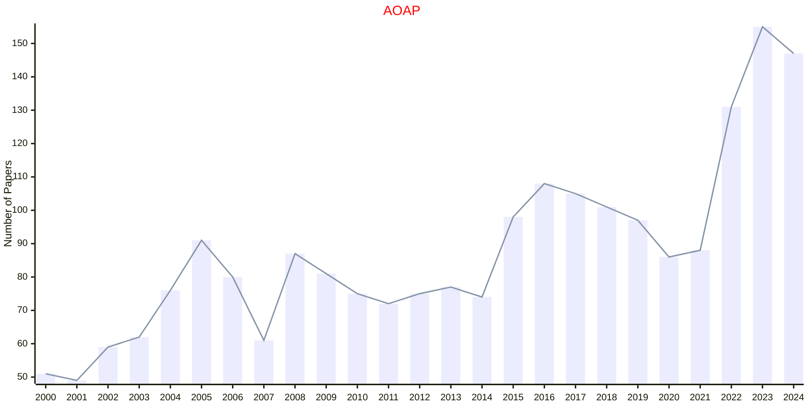
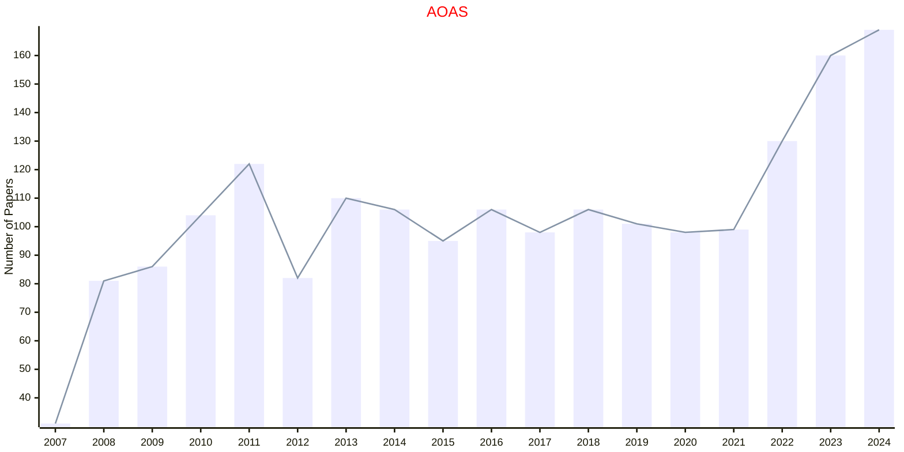
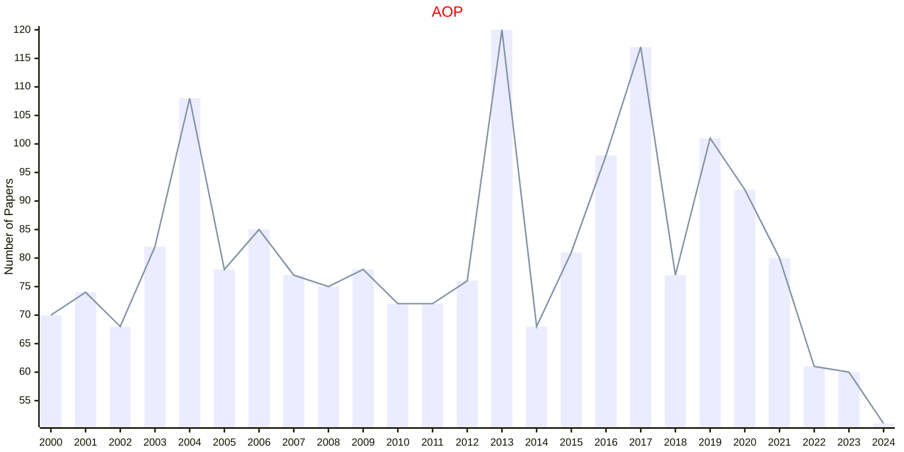
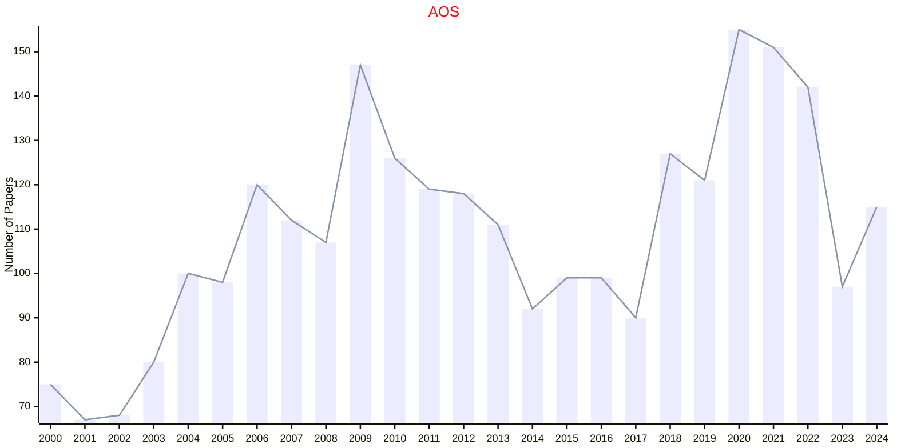

# IMS

- The data for TOP, CCF, CAS, JCR, and IF are sourced from [easyScholar](https://www.easyscholar.cc/).

## AOAP

|Publishers|Full/Homepage|Abbr/About|Acronym/Issues|Period/DBLP|Top/Early|CCF|CAS|JCR|IF|Keywords/Google|
|-         |-            |-         |-             |-          |-        |-  |-  |-  |- |-              |
|[IMS](https://imstat.org/)|[Annals of Applied Probability](https://imstat.org/journals-and-publications/annals-of-applied-probability)|[Ann. Appl. Probab.](https://imstat.org/journals-and-publications/annals-of-applied-probability)|[AOAP](https://projecteuclid.org/journals/annals-of-applied-probability/issues)|1991 -|False||2|Q1|2.1|[Applied Probability](https://www.google.com/search?q=Applied+Probability); [MCMC](https://www.google.com/search?q=MCMC); [Variational Inference](https://www.google.com/search?q=Variational+Inference)|

### Remarks

Publisher: Institute of Mathematical Statistics

## AOAS

|Publishers|Full/Homepage|Abbr/About|Acronym/Issues|Period/DBLP|Top/Early|CCF|CAS|JCR|IF|Keywords/Google|
|-         |-            |-         |-             |-          |-        |-  |-  |-  |- |-              |
|[IMS](https://imstat.org/)|[Annals of Applied Statistics](https://imstat.org/journals-and-publications/annals-of-applied-statistics)|[Ann. Appl. Stat.](https://imstat.org/journals-and-publications/annals-of-applied-statistics)|[AOAS](https://projecteuclid.org/journals/annals-of-applied-statistics/issues)|2007 -|False||4|Q2|1.8|[Applied Statistics](https://www.google.com/search?q=Applied+Statistics)|

### Remarks

Publisher: Institute of Mathematical Statistics

## AOP

|Publishers|Full/Homepage|Abbr/About|Acronym/Issues|Period/DBLP|Top/Early|CCF|CAS|JCR|IF|Keywords/Google|
|-         |-            |-         |-             |-          |-        |-  |-  |-  |- |-              |
|[IMS](https://imstat.org/)|[Annals of Probability](https://imstat.org/journals-and-publications/annals-of-probability)|[Ann. Probab.](https://imstat.org/journals-and-publications/annals-of-probability/)|[AOP](https://projecteuclid.org/journals/annals-of-probability/issues)|1973 -|True||1|Q1|2.6|[Probability](https://www.google.com/search?q=Probability)|

### Remarks

Publisher: Institute of Mathematical Statistics

## AOS

|Publishers|Full/Homepage|Abbr/About|Acronym/Issues|Period/DBLP|Top/Early|CCF|CAS|JCR|IF|Keywords/Google|
|-         |-            |-         |-             |-          |-        |-  |-  |-  |- |-              |
|[IMS](https://imstat.org/)|[Annals of Statistics](https://imstat.org/journals-and-publications/annals-of-statistics)|[Ann. Stat.](https://imstat.org/journals-and-publications/annals-of-statistics)|[AOS](https://projecteuclid.org/journals/annals-of-statistics/issues)|1973 -|True||1|Q1|5.9|[Statistics](https://www.google.com/search?q=Statistics)|

### Remarks

Publisher: Institute of Mathematical Statistics

## BULLETIN

|Publishers|Full/Homepage|Abbr/About|Acronym/Issues|Period/DBLP|Top/Early|CCF|CAS|JCR|IF|Keywords/Google|
|-         |-            |-         |-             |-          |-        |-  |-  |-  |- |-              |
|[IMS](https://imstat.org/)|[IMS Bulletin](https://imstat.org/journals-and-publications/ims-bulletin/)|[IMS Bull.](https://imstat.org/journals-and-publications/ims-bulletin/)|[BULLETIN](https://imstat.org/ims-bulletin-archive/)|2002 -|False|||||[Probability and Statistics](https://www.google.com/search?q=Probability+and+Statistics)|

### Remarks

Publisher: Institute of Mathematical Statistics

Before 2002 there are no PDF copies of the Bulletin.

## STATS

|Publishers|Full/Homepage|Abbr/About|Acronym/Issues|Period/DBLP|Top/Early|CCF|CAS|JCR|IF|Keywords/Google|
|-         |-            |-         |-             |-          |-        |-  |-  |-  |- |-              |
|[IMS](https://imstat.org/)|[Statistical Science](https://imstat.org/journals-and-publications/statistical-science/)|[Stat. Sci.](https://imstat.org/journals-and-publications/statistical-science/)|[STATS](https://projecteuclid.org/journals/statistical-science/issues)|1986 -|True||1|Q1|5.2|[Probability and Statistics](https://www.google.com/search?q=Probability+and+Statistics)|

### Remarks

Publisher: Institute of Mathematical Statistics

