# INFORMS

- The data for TOP, CCF, CAS, JCR, and IF are sourced from [easyScholar](https://www.easyscholar.cc/).

## DECA

|Publishers|Full/Homepage|Abbr/About|Acronym/Issues|Period/DBLP|Top/Early|CCF|CAS|JCR|IF|Keywords/Google|
|-         |-            |-         |-             |-          |-        |-  |-  |-  |- |-              |
|[INFORMS](https://pubsonline.informs.org/)|[Decision Analysis](https://pubsonline.informs.org/journal/deca)|[Decis. Anal.](https://pubsonline.informs.org/page/deca/editorial-statement)|[DECA](https://pubsonline.informs.org/loi/deca)|2004 -|False||4||1.6||

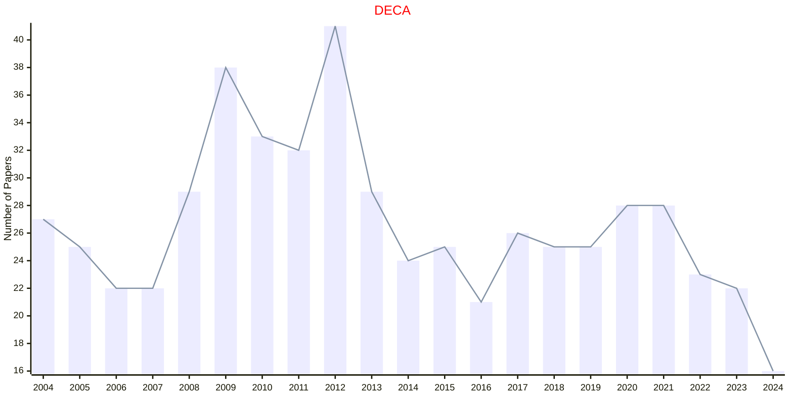

## IJAA

|Publishers|Full/Homepage|Abbr/About|Acronym/Issues|Period/DBLP|Top/Early|CCF|CAS|JCR|IF|Keywords/Google|
|-         |-            |-         |-             |-          |-        |-  |-  |-  |- |-              |
|[INFORMS](https://pubsonline.informs.org/)|[INFORMS Journal on Applied Analysis](https://pubsonline.informs.org/journal/ijaa)|[INFORMS. J. Appl. Anal.](https://pubsonline.informs.org/page/inte/editorial-statement)|[IJAA](https://pubsonline.informs.org/loi/ijaa)|1970 -|False||||||

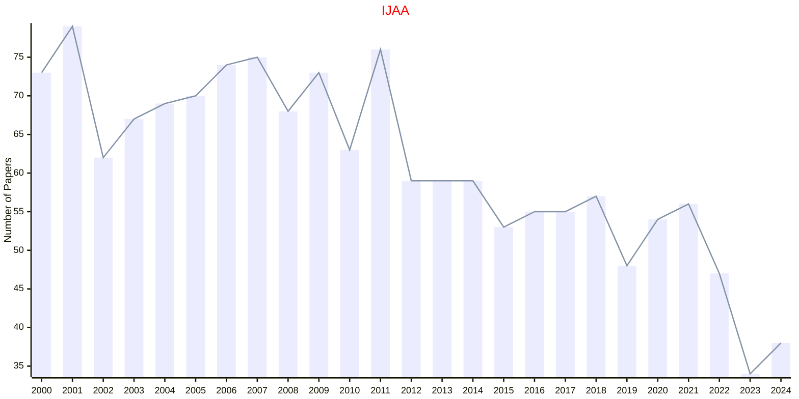

## IJDS

|Publishers|Full/Homepage|Abbr/About|Acronym/Issues|Period/DBLP|Top/Early|CCF|CAS|JCR|IF|Keywords/Google|
|-         |-            |-         |-             |-          |-        |-  |-  |-  |- |-              |
|[INFORMS](https://pubsonline.informs.org/)|[INFORMS Journal on Data Science](https://pubsonline.informs.org/journal/ijds)|[INFORMS J. Data Sci.](https://pubsonline.informs.org/page/ijds/editorial-statement)|[IJDS](https://pubsonline.informs.org/loi/ijds)|2022 -|False||||||

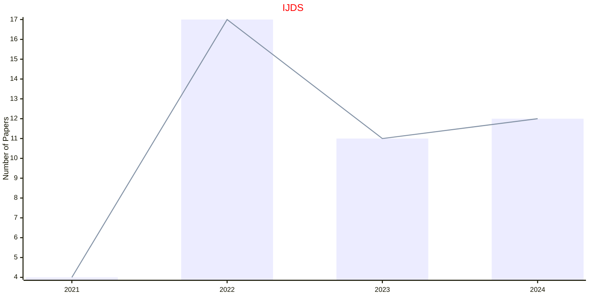

## IJOC

|Publishers|Full/Homepage|Abbr/About|Acronym/Issues|Period/DBLP|Top/Early|CCF|CAS|JCR|IF|Keywords/Google|
|-         |-            |-         |-             |-          |-        |-  |-  |-  |- |-              |
|[INFORMS](https://pubsonline.informs.org/)|[INFORMS Journal on Computing](https://pubsonline.informs.org/journal/ijoc)|[INFORMS J. Comput.](https://pubsonline.informs.org/page/ijoc/editorial-statement)|[IJOC](https://pubsonline.informs.org/loi/ijoc)|1989 -|False|B|3|Q2|2.7||

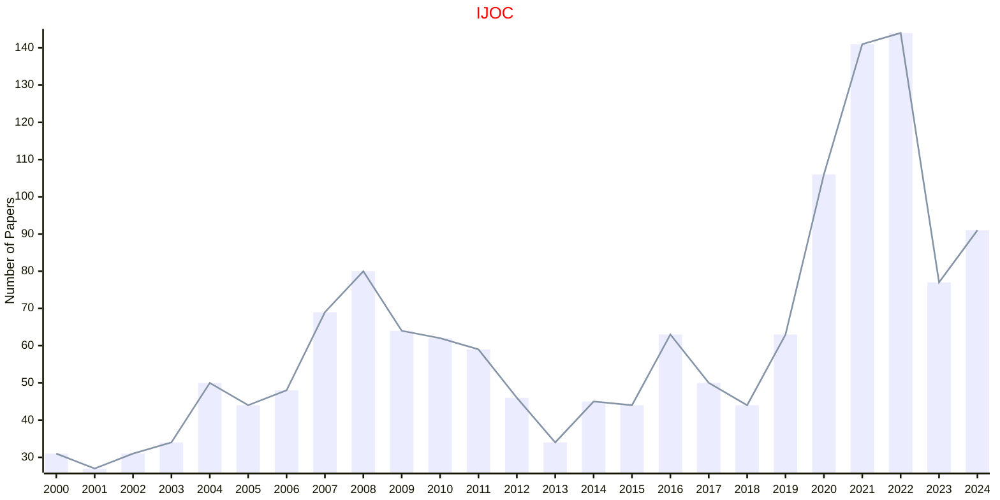

## IJOO

|Publishers|Full/Homepage|Abbr/About|Acronym/Issues|Period/DBLP|Top/Early|CCF|CAS|JCR|IF|Keywords/Google|
|-         |-            |-         |-             |-          |-        |-  |-  |-  |- |-              |
|[INFORMS](https://pubsonline.informs.org/)|[INFORMS Journal on Optimization](https://pubsonline.informs.org/journal/ijoo)|[INFORMS J. Optim.](https://pubsonline.informs.org/page/ijoo/editorial-statement)|[IJOO](https://pubsonline.informs.org/loi/ijoo)|2019 -|False|||||[Optimization](https://www.google.com/search?q=Optimization)|

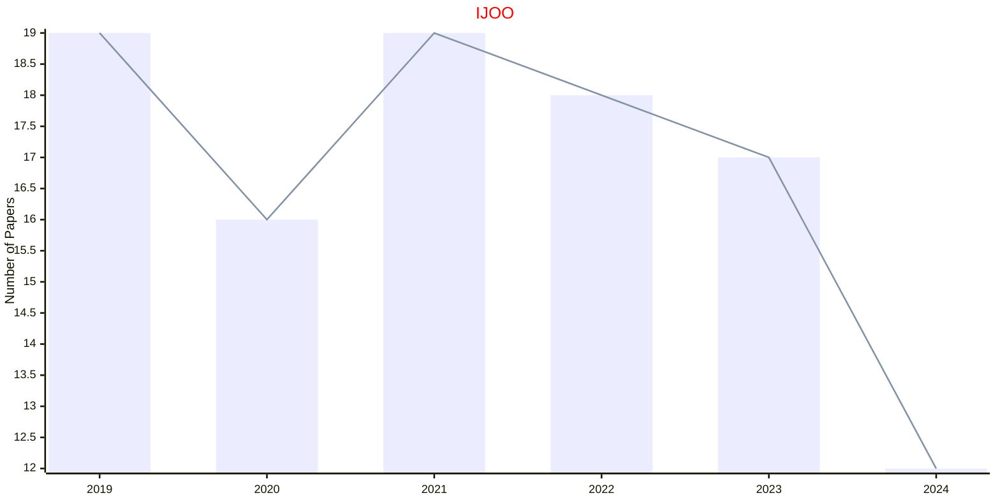

## ISRE

|Publishers|Full/Homepage|Abbr/About|Acronym/Issues|Period/DBLP|Top/Early|CCF|CAS|JCR|IF|Keywords/Google|
|-         |-            |-         |-             |-          |-        |-  |-  |-  |- |-              |
|[INFORMS](https://pubsonline.informs.org/)|[Information Systems Research](https://pubsonline.informs.org/journal/isre)|[Inf. Syst. Res.](https://pubsonline.informs.org/page/isre/editorial-statement)|[ISRE](https://pubsonline.informs.org/loi/isre)|1990 -|False||3||9.2||

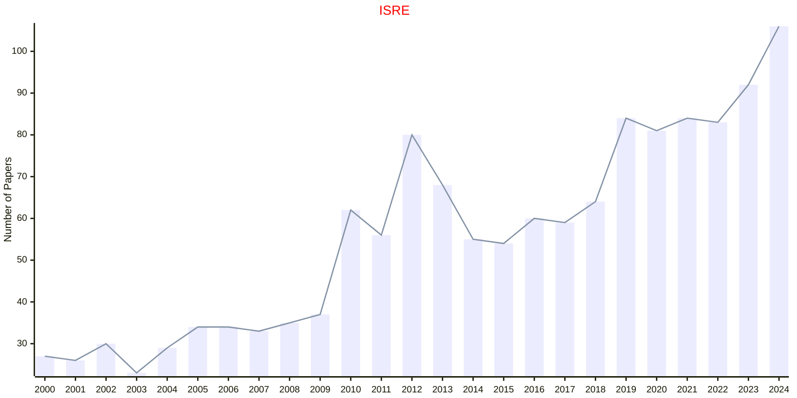

## ITED

|Publishers|Full/Homepage|Abbr/About|Acronym/Issues|Period/DBLP|Top/Early|CCF|CAS|JCR|IF|Keywords/Google|
|-         |-            |-         |-             |-          |-        |-  |-  |-  |- |-              |
|[INFORMS](https://pubsonline.informs.org/)|[INFORMS Transactions on Education](https://pubsonline.informs.org/journal/ited)|[Inf. Syst. Res.](https://pubsonline.informs.org/page/ited/editorial-statement)|[ITED](https://pubsonline.informs.org/loi/ited)|2000 -|False||||||

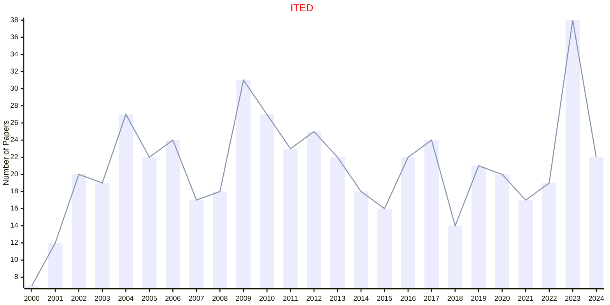

## MKSC

|Publishers|Full/Homepage|Abbr/About|Acronym/Issues|Period/DBLP|Top/Early|CCF|CAS|JCR|IF|Keywords/Google|
|-         |-            |-         |-             |-          |-        |-  |-  |-  |- |-              |
|[INFORMS](https://pubsonline.informs.org/)|[Marketing Science](https://pubsonline.informs.org/journal/mksc)|[Market. Sci.](https://pubsonline.informs.org/page/mksc/editorial-statement)|[MKSC](https://pubsonline.informs.org/loi/mksc)|1982 -|False||3||6.6||

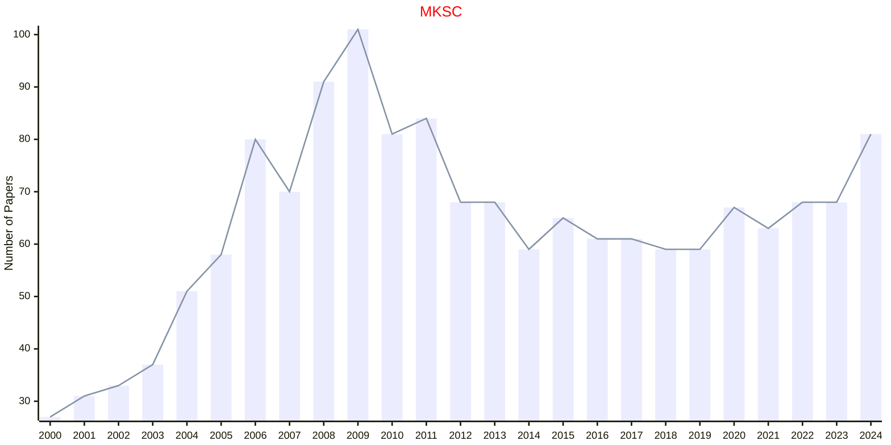

## MOOR

|Publishers|Full/Homepage|Abbr/About|Acronym/Issues|Period/DBLP|Top/Early|CCF|CAS|JCR|IF|Keywords/Google|
|-         |-            |-         |-             |-          |-        |-  |-  |-  |- |-              |
|[INFORMS](https://pubsonline.informs.org/)|[Mathematics of Operations Research](https://pubsonline.informs.org/journal/moor)|[Math. Oper. Res.](https://pubsonline.informs.org/page/moor/editorial-statement)|[MOOR](https://pubsonline.informs.org/loi/moor)|1976 -|False||4|Q1|2.0|[Operations](https://www.google.com/search?q=Operations)|

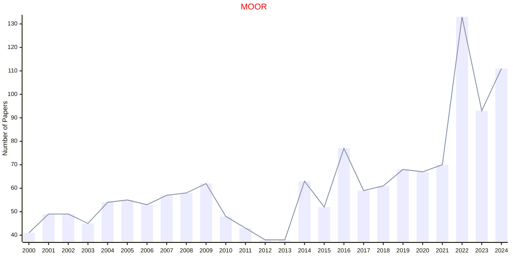

## MS

|Publishers|Full/Homepage|Abbr/About|Acronym/Issues|Period/DBLP|Top/Early|CCF|CAS|JCR|IF|Keywords/Google|
|-         |-            |-         |-             |-          |-        |-  |-  |-  |- |-              |
|[INFORMS](https://pubsonline.informs.org/)|[Management Science](https://pubsonline.informs.org/journal/mnsc)|[Manag. Sci.](https://pubsonline.informs.org/page/mnsc/editorial-statement)|[MS](https://pubsonline.informs.org/loi/mnsc)|1954 -|False||2|Q1|6.6|[Management](https://www.google.com/search?q=Management)|

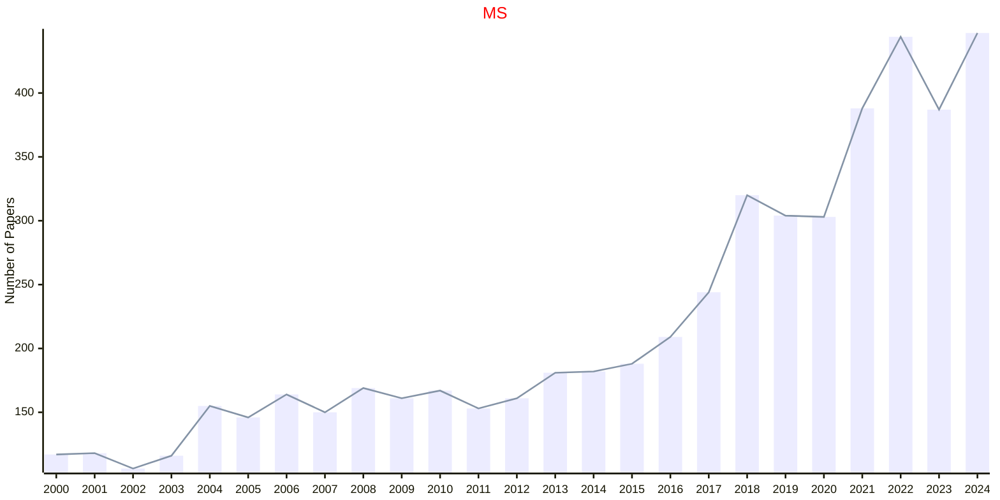

## MSOM

|Publishers|Full/Homepage|Abbr/About|Acronym/Issues|Period/DBLP|Top/Early|CCF|CAS|JCR|IF|Keywords/Google|
|-         |-            |-         |-             |-          |-        |-  |-  |-  |- |-              |
|[INFORMS](https://pubsonline.informs.org/)|[M&som-manufacturing & Service Operations Management](https://pubsonline.informs.org/journal/msom)|[Manuf. Serv. Oper. Manag.](https://pubsonline.informs.org/page/msom/editorial-statement)|[MSOM](https://pubsonline.informs.org/loi/msom)|1999 -|False||3|Q2|6.6|[Operations and Management](https://www.google.com/search?q=Operations+and+Management)|

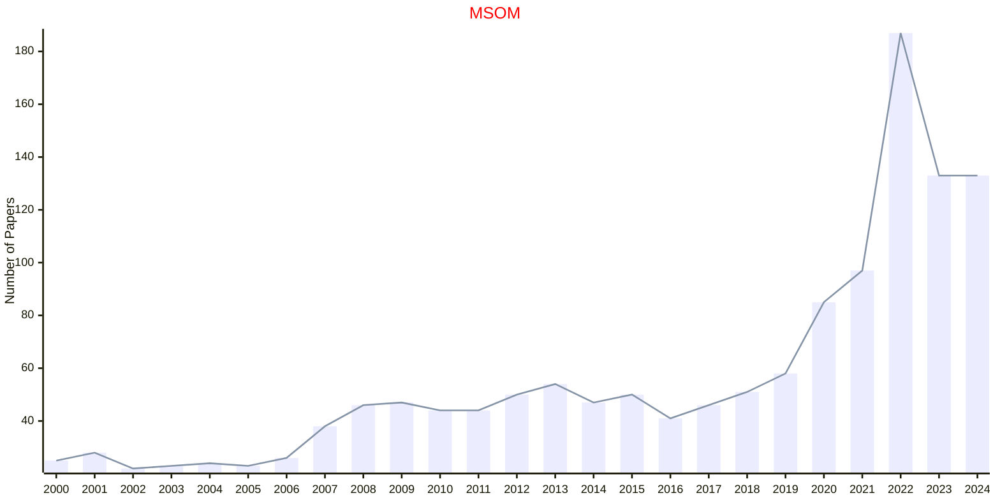

## OR

|Publishers|Full/Homepage|Abbr/About|Acronym/Issues|Period/DBLP|Top/Early|CCF|CAS|JCR|IF|Keywords/Google|
|-         |-            |-         |-             |-          |-        |-  |-  |-  |- |-              |
|[INFORMS](https://pubsonline.informs.org/)|[Operations Research](https://pubsonline.informs.org/journal/opre)|[Oper. Res.](https://pubsonline.informs.org/page/opre/editorial-statement)|[OR](https://pubsonline.informs.org/loi/opre)|1952 -|False||4|Q2|3.3|[Operations](https://www.google.com/search?q=Operations)|

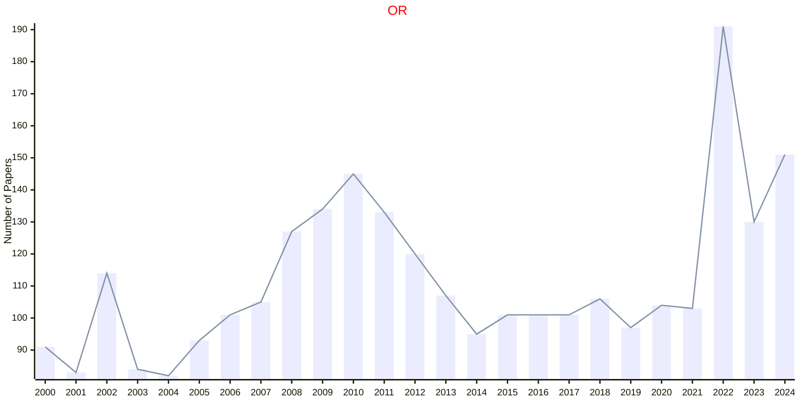

## ORSC

|Publishers|Full/Homepage|Abbr/About|Acronym/Issues|Period/DBLP|Top/Early|CCF|CAS|JCR|IF|Keywords/Google|
|-         |-            |-         |-             |-          |-        |-  |-  |-  |- |-              |
|[INFORMS](https://pubsonline.informs.org/)|[Organization Science](https://pubsonline.informs.org/journal/orsc)|[Organ. Sci.](https://pubsonline.informs.org/page/orsc/editorial-statement)|[ORSC](https://pubsonline.informs.org/loi/orsc)|1990 -|False||2||7.2||

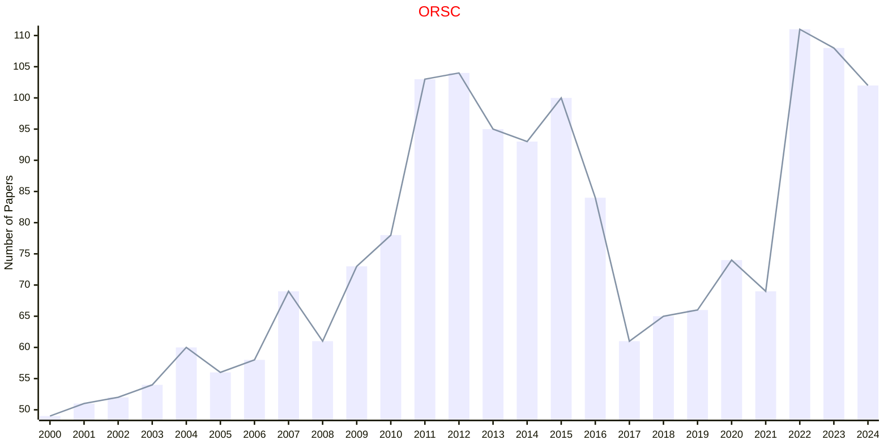

## SERV

|Publishers|Full/Homepage|Abbr/About|Acronym/Issues|Period/DBLP|Top/Early|CCF|CAS|JCR|IF|Keywords/Google|
|-         |-            |-         |-             |-          |-        |-  |-  |-  |- |-              |
|[INFORMS](https://pubsonline.informs.org/)|[Service Science](https://pubsonline.informs.org/journal/serv)|[Serv. Sci.](https://pubsonline.informs.org/page/serv/editorial-statement)|[SERV](https://pubsonline.informs.org/loi/serv)|2009 -|False||4||2.5||

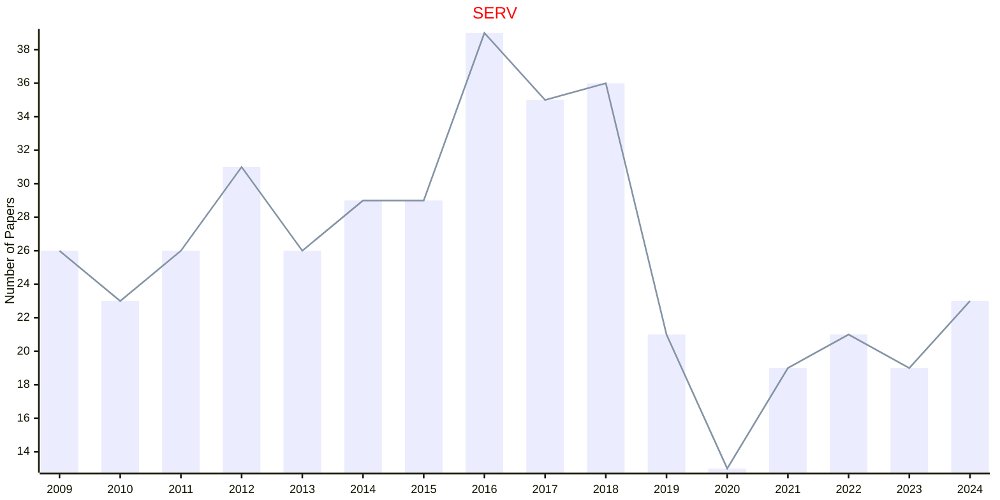

## STSC

|Publishers|Full/Homepage|Abbr/About|Acronym/Issues|Period/DBLP|Top/Early|CCF|CAS|JCR|IF|Keywords/Google|
|-         |-            |-         |-             |-          |-        |-  |-  |-  |- |-              |
|[INFORMS](https://pubsonline.informs.org/)|[Strategy Science](https://pubsonline.informs.org/journal/stsc)|[Strat. Sci.](https://pubsonline.informs.org/page/stsc/editorial-statement)|[STSC](https://pubsonline.informs.org/loi/stsc)|2016 -|False||4||4.6||

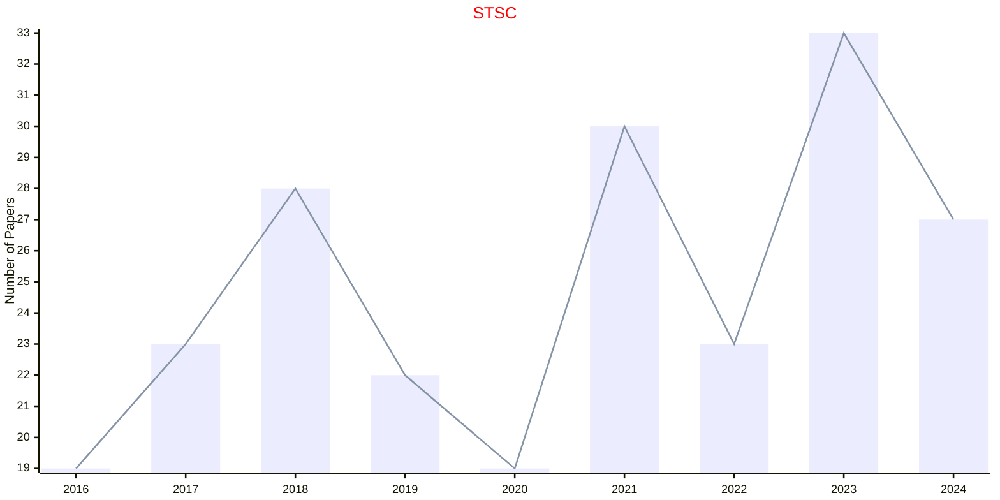

## STSY

|Publishers|Full/Homepage|Abbr/About|Acronym/Issues|Period/DBLP|Top/Early|CCF|CAS|JCR|IF|Keywords/Google|
|-         |-            |-         |-             |-          |-        |-  |-  |-  |- |-              |
|[INFORMS](https://pubsonline.informs.org/)|[Stochastic Systems](https://pubsonline.informs.org/journal/stsy)|[Stoch. Syst.](https://pubsonline.informs.org/page/stsy/editorial-statement)|[STSY](https://pubsonline.informs.org/loi/stsy)|2011 -|False|||||[Stochastic Systems](https://www.google.com/search?q=Stochastic+Systems)|

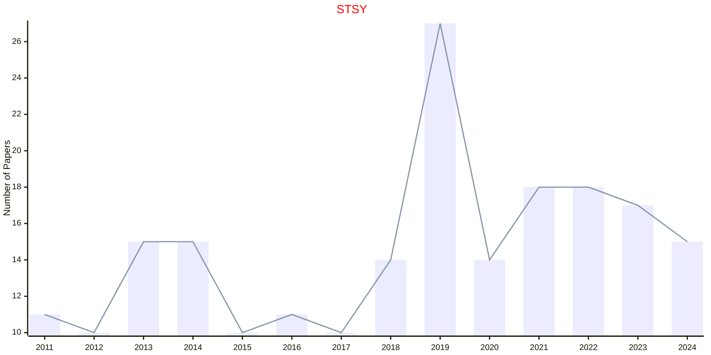

## TRSC

|Publishers|Full/Homepage|Abbr/About|Acronym/Issues|Period/DBLP|Top/Early|CCF|CAS|JCR|IF|Keywords/Google|
|-         |-            |-         |-             |-          |-        |-  |-  |-  |- |-              |
|[INFORMS](https://pubsonline.informs.org/)|[Transportation Science](https://pubsonline.informs.org/journal/trsc)|[Trans. Sci.](https://pubsonline.informs.org/page/trsc/editorial-statement)|[TRSC](https://pubsonline.informs.org/loi/trsc)|1967 -|False||2|Q1|6.2|[Transportation](https://www.google.com/search?q=Transportation)|

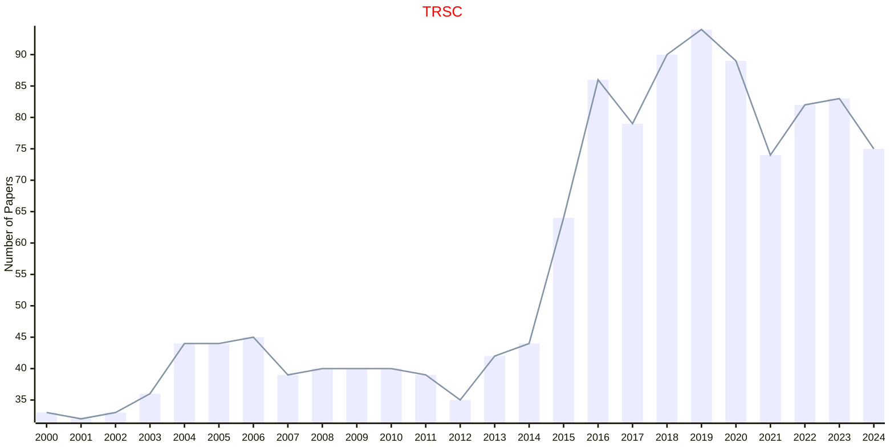

