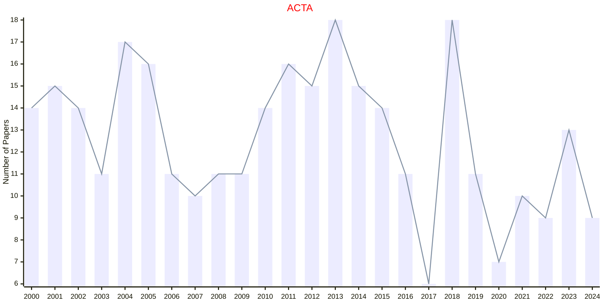
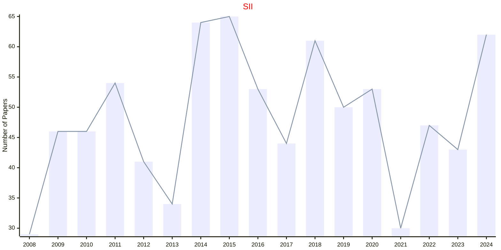

# INTLPRESS

- The data for TOP, CCF, CAS, JCR, and IF are sourced from [easyScholar](https://www.easyscholar.cc/).

## ACTA

|Publishers|Full/Homepage|Abbr/About|Acronym/Issues|Period/DBLP|Top/Early|CCF|CAS|JCR|IF|Keywords/Google|
|-         |-            |-         |-             |-          |-        |-  |-  |-  |- |-              |
|[INTLPRESS](https://intlpress.com/)|[Acta Mathematica](https://intlpress.com/site/pub/pages/journals/items/acta/_home/_main/index.php)|[Acta Math.](https://intlpress.com/journals/journalList?id=1804409921462136833)|[ACTA](https://link.intlpress.com/journals/journalList?p=5&id=1804409921462136833)|1882 -|True||1|Q1|5.9||

## SII

|Publishers|Full/Homepage|Abbr/About|Acronym/Issues|Period/DBLP|Top/Early|CCF|CAS|JCR|IF|Keywords/Google|
|-         |-            |-         |-             |-          |-        |-  |-  |-  |- |-              |
|[INTLPRESS](https://intlpress.com/)|[Statistics and Its Interface](https://intlpress.com/site/pub/pages/journals/items/sii/_home/_main/index.php)|[Stat. Interface](https://intlpress.com/journals/journalList?id=1804418089940480002)|[SII](https://link.intlpress.com/journals/journalList?p=5&id=1804418089940480002)|2008 -|False||4|Q4|0.5||

