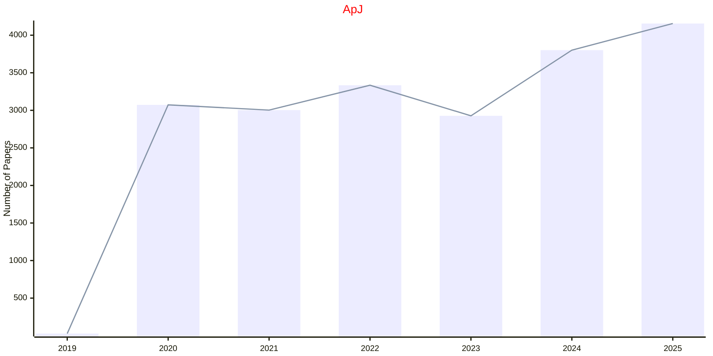
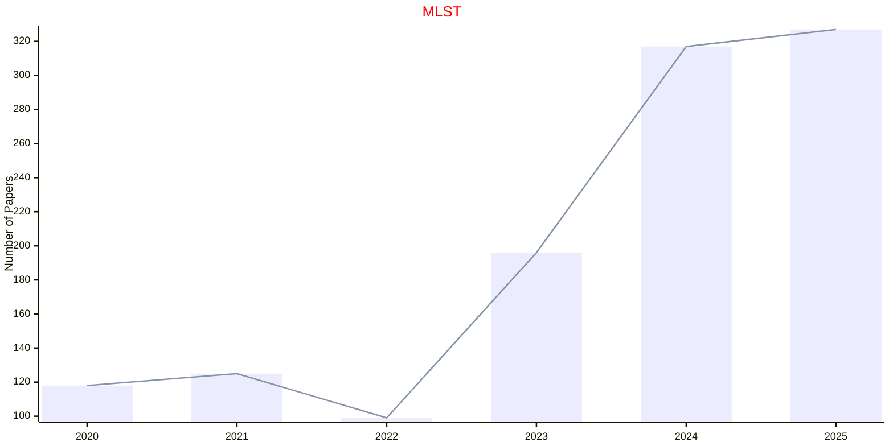

# IOP

- The data for TOP, CCF, CAS, JCR, and IF are sourced from [easyScholar](https://www.easyscholar.cc/).

## ApJ

|Publishers|Full/Homepage|Abbr/About|Acronym/Issues|Period/DBLP|Top/Early|CCF|CAS|JCR|IF|Keywords/Google|
|-         |-            |-         |-             |-          |-        |-  |-  |-  |- |-              |
|[IOP](https://ioppublishing.org/)|[The Astrophysical Journal](https://iopscience.iop.org/journal/0004-637X)|[The Astrophys. J.](https://iopscience.iop.org/journal/0004-637X/page/about-the-journal)|[ApJ](https://iopscience.iop.org/journal/0004-637X)|1995 -|False||2|Q1|5.2|[Astrophysics](https://www.google.com/search?q=Astrophysics)|

## MLST

|Publishers|Full/Homepage|Abbr/About|Acronym/Issues|Period/DBLP|Top/Early|CCF|CAS|JCR|IF|Keywords/Google|
|-         |-            |-         |-             |-          |-        |-  |-  |-  |- |-              |
|[IOP](https://ioppublishing.org/)|[Machine Learning: Science and Technology](https://iopscience.iop.org/journal/2632-2153)|[Mach. Learn.: Sci. Technol.](https://publishingsupport.iopscience.iop.org/journals/machine-learning-science-and-technology/about-machine-learning-science-technology/)|[MLST](https://iopscience.iop.org/journal/2632-2153)|2020 -|False||2|Q1|6.1|[Machine Learning](https://www.google.com/search?q=Machine+Learning)|

