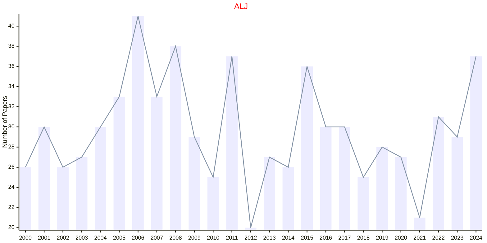
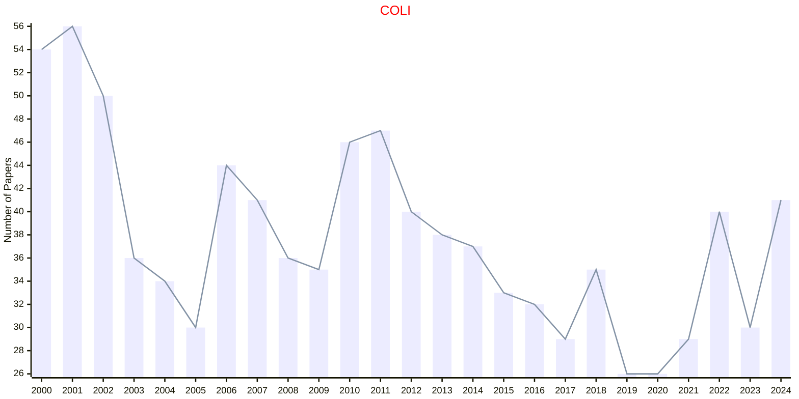
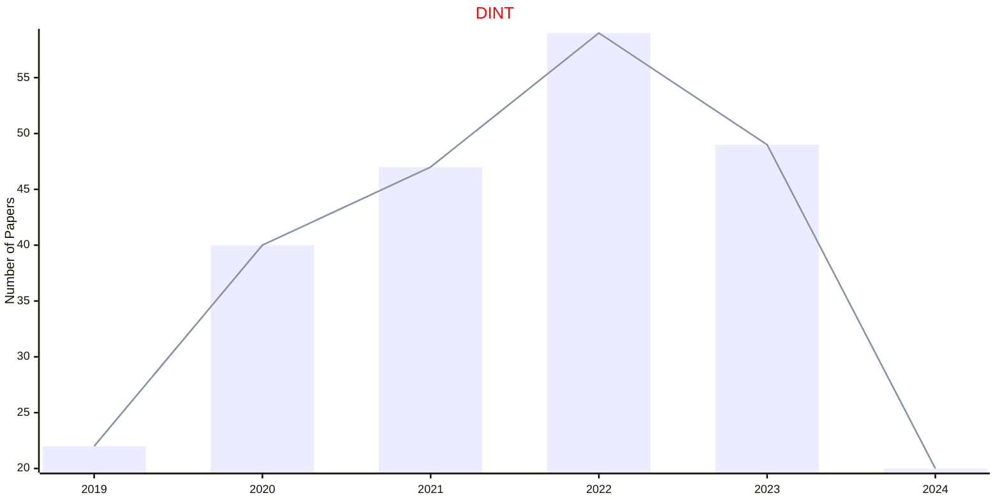
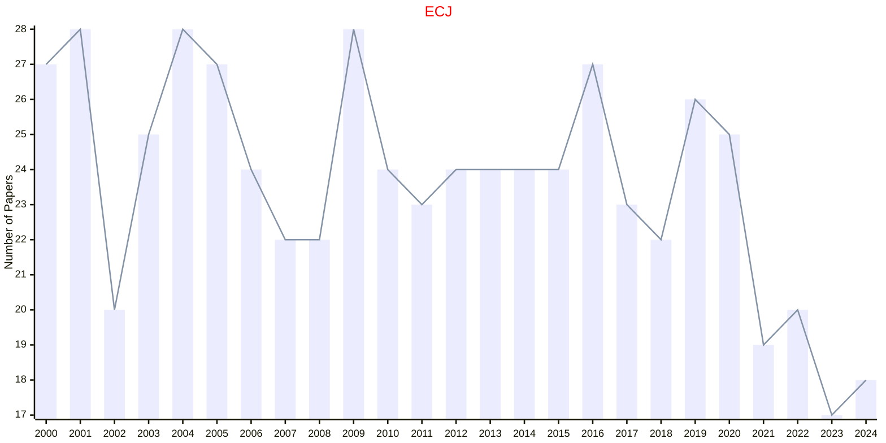
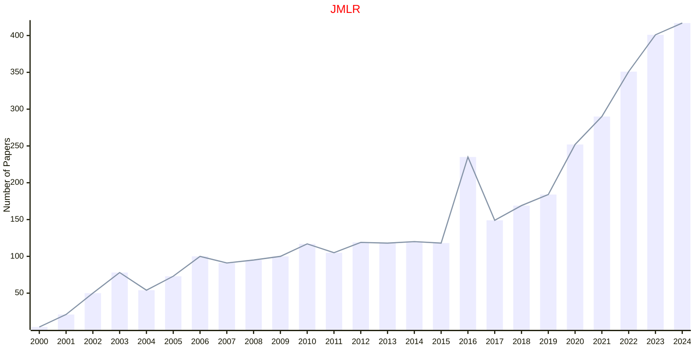
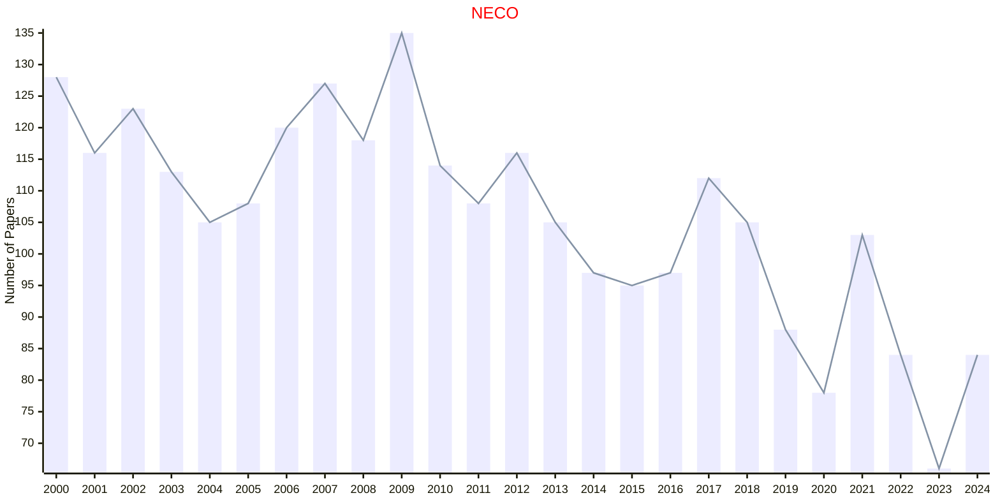
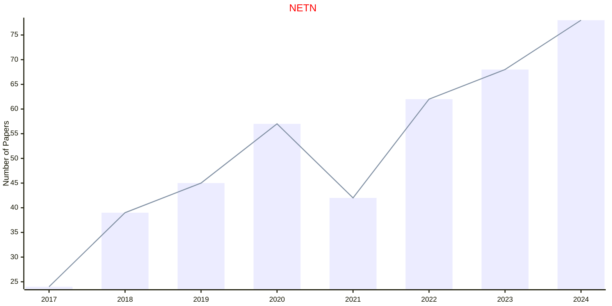
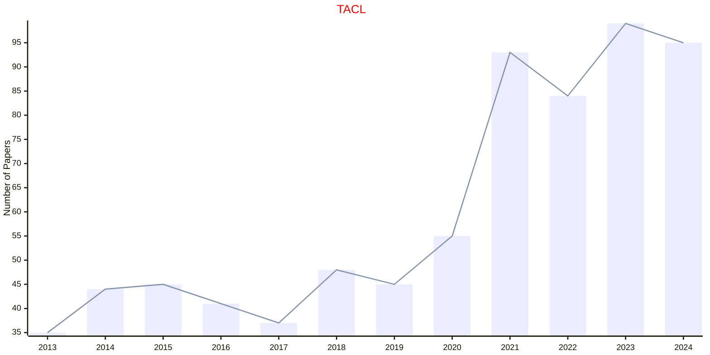
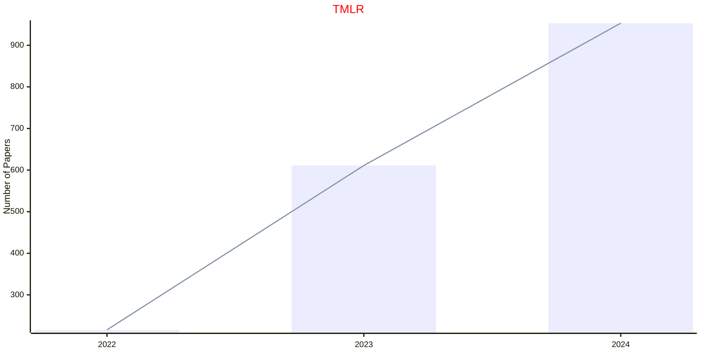

# MIT

- The data for TOP, CCF, CAS, JCR, and IF are sourced from [easyScholar](https://www.easyscholar.cc/).

## ALJ

|Publishers|Full/Homepage|Abbr/About|Acronym/Issues|Period/DBLP|Top/Early|CCF|CAS|JCR|IF|Keywords/Google|
|-         |-            |-         |-             |-          |-        |-  |-  |-  |- |-              |
|[MIT](https://direct.mit.edu/)|[Artificial Life](https://direct.mit.edu/artl)|Artif. Life|[ALJ](https://direct.mit.edu/artl/issue)|1993 -|[False](https://direct.mit.edu/artl/online-early)|C|4|Q3|2.4||

## COLI

|Publishers|Full/Homepage|Abbr/About|Acronym/Issues|Period/DBLP|Top/Early|CCF|CAS|JCR|IF|Keywords/Google|
|-         |-            |-         |-             |-          |-        |-  |-  |-  |- |-              |
|[MIT](https://direct.mit.edu/)|[Computational Linguistics](https://direct.mit.edu/coli)|Comput. Lingu.|[COLI](https://direct.mit.edu/coli/issue)|2000 -|[False](https://direct.mit.edu/coli/online-early)|B|2|Q1|6.1||

## DINT

|Publishers|Full/Homepage|Abbr/About|Acronym/Issues|Period/DBLP|Top/Early|CCF|CAS|JCR|IF|Keywords/Google|
|-         |-            |-         |-             |-          |-        |-  |-  |-  |- |-              |
|[MIT](https://direct.mit.edu/)|[Data Intelligence](https://direct.mit.edu/dint)|Data Intell.|[DINT](https://direct.mit.edu/dint/issue)|2019 -|[False](https://direct.mit.edu/dint/online-early)||2||2.8||

## ECJ

|Publishers|Full/Homepage|Abbr/About|Acronym/Issues|Period/DBLP|Top/Early|CCF|CAS|JCR|IF|Keywords/Google|
|-         |-            |-         |-             |-          |-        |-  |-  |-  |- |-              |
|[MIT](https://direct.mit.edu/)|[Evolutionary Computation](https://direct.mit.edu/evco)|Evol. Comput.|[ECJ](https://direct.mit.edu/evco/issue)|1993 -|[False](https://direct.mit.edu/evco/online-early)|B|3|Q2|5.1|[Evolutionary Computation](https://www.google.com/search?q=Evolutionary+Computation)|

## JMLR

|Publishers|Full/Homepage|Abbr/About|Acronym/Issues|Period/DBLP|Top/Early|CCF|CAS|JCR|IF|Keywords/Google|
|-         |-            |-         |-             |-          |-        |-  |-  |-  |- |-              |
|[MIT](https://direct.mit.edu/)|[Journal of Machine Learning Research](https://www.jmlr.org/)|J. Mach. Learn. Res.|JMLR||False|A|4|Q1|8.8|[Machine Learning](https://www.google.com/search?q=Machine+Learning)|

## NECO

|Publishers|Full/Homepage|Abbr/About|Acronym/Issues|Period/DBLP|Top/Early|CCF|CAS|JCR|IF|Keywords/Google|
|-         |-            |-         |-             |-          |-        |-  |-  |-  |- |-              |
|[MIT](https://direct.mit.edu/)|[Neural Computation](https://direct.mit.edu/neco)|Neural Comput.|[NECO](https://direct.mit.edu/neco/issue)|1989 -|[False](https://direct.mit.edu/neco/online-early)|B|4|Q3|4.8||

## NETN

|Publishers|Full/Homepage|Abbr/About|Acronym/Issues|Period/DBLP|Top/Early|CCF|CAS|JCR|IF|Keywords/Google|
|-         |-            |-         |-             |-          |-        |-  |-  |-  |- |-              |
|[MIT](https://direct.mit.edu/)|[Network Neuroscience](https://direct.mit.edu/netn)|Netw. Neuroscience|[NETN](https://direct.mit.edu/netn/issue)|2017 -|[False](https://direct.mit.edu/netn/online-early)||4|Q2|4.0||

## TACL

|Publishers|Full/Homepage|Abbr/About|Acronym/Issues|Period/DBLP|Top/Early|CCF|CAS|JCR|IF|Keywords/Google|
|-         |-            |-         |-             |-          |-        |-  |-  |-  |- |-              |
|[MIT](https://direct.mit.edu/)|[Transactions of the Association for Computational Linguistics](https://direct.mit.edu/tacl)|Trans. Assoc. Comput. Lingu.|[TACL](https://direct.mit.edu/tacl/issue)|2013 -|[False](https://direct.mit.edu/tacl/online-early)|B|2|Q1|10.7||

## TMLR

|Publishers|Full/Homepage|Abbr/About|Acronym/Issues|Period/DBLP|Top/Early|CCF|CAS|JCR|IF|Keywords/Google|
|-         |-            |-         |-             |-          |-        |-  |-  |-  |- |-              |
|[MIT](https://direct.mit.edu/)|[Transactions on Machine Learning Research](https://www.jmlr.org/tmlr/index.html)|Trans. Mach. Learn. Res.|[TMLR](https://www.jmlr.org/tmlr/papers/)|2022 -|False|||||[Machine Learning](https://www.google.com/search?q=Machine+Learning)|

