# NATURE

- The data for TOP, CCF, CAS, JCR, and IF are sourced from [easyScholar](https://www.easyscholar.cc/).

## NATCS

|Publishers|Full/Homepage|Abbr/About|Acronym/Issues|Period/DBLP|Top/Early|CCF|CAS|JCR|IF|Keywords/Google|
|-         |-            |-         |-             |-          |-        |-  |-  |-  |- |-              |
|[NATURE](https://www.nature.com/)|[Nature Computational Science](https://www.nature.com/natcomputsci)|[Nat. Comput. Sci](https://www.nature.com/natcomputsci/aims)|[NATCS](https://www.nature.com/natcomputsci/volumes)|2021 -|True||1|Q1|17.6||

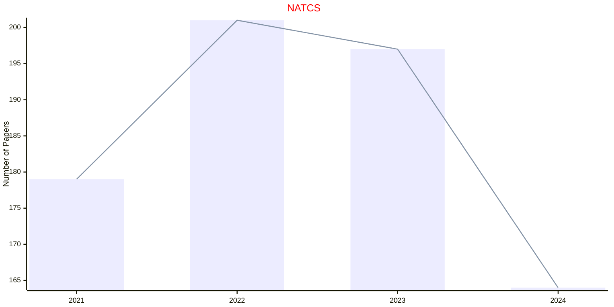

## NATEE

|Publishers|Full/Homepage|Abbr/About|Acronym/Issues|Period/DBLP|Top/Early|CCF|CAS|JCR|IF|Keywords/Google|
|-         |-            |-         |-             |-          |-        |-  |-  |-  |- |-              |
|[NATURE](https://www.nature.com/)|[Nature Ecology & Evolution](https://www.nature.com/natecolevol)|[Nat. Ecol. Evol](https://www.nature.com/natecolevol/aims)|[NATEE](https://www.nature.com/natecolevol/volumes)|2017 -|True||1|Q1|17.6||

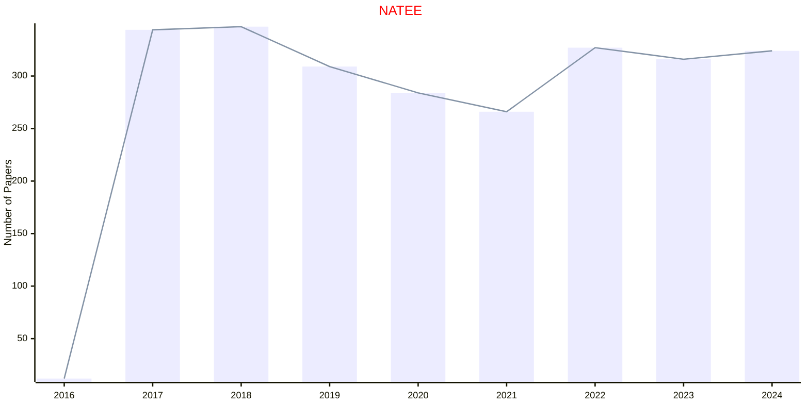

## NATMI

|Publishers|Full/Homepage|Abbr/About|Acronym/Issues|Period/DBLP|Top/Early|CCF|CAS|JCR|IF|Keywords/Google|
|-         |-            |-         |-             |-          |-        |-  |-  |-  |- |-              |
|[NATURE](https://www.nature.com/)|[Nature Machine Intelligence](https://www.nature.com/natmachintell)|[Nat. Mach. Intell.](https://www.nature.com/natmachintell/aims)|[NATMI](https://www.nature.com/natmachintell/volumes)|2019 -|True||1|Q1|31.8||

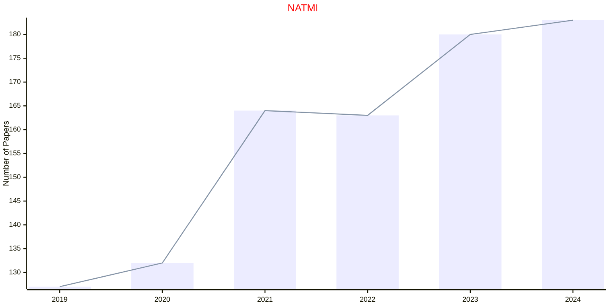

## NATURE

|Publishers|Full/Homepage|Abbr/About|Acronym/Issues|Period/DBLP|Top/Early|CCF|CAS|JCR|IF|Keywords/Google|
|-         |-            |-         |-             |-          |-        |-  |-  |-  |- |-              |
|[NATURE](https://www.nature.com/)|[Nature](https://www.nature.com/nature)|Nature|[NATURE](https://www.nature.com/nature/volumes)|1869 -|True||1|Q1|55.0|[Multidisciplinary](https://www.google.com/search?q=Multidisciplinary)|

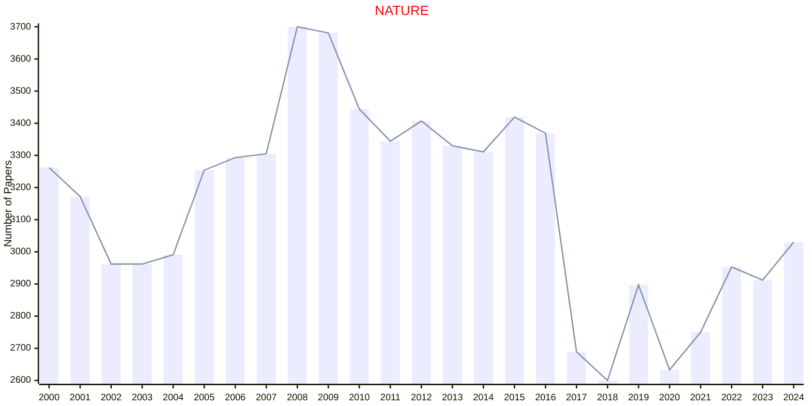

## NBT

|Publishers|Full/Homepage|Abbr/About|Acronym/Issues|Period/DBLP|Top/Early|CCF|CAS|JCR|IF|Keywords/Google|
|-         |-            |-         |-             |-          |-        |-  |-  |-  |- |-              |
|[NATURE](https://www.nature.com/)|[Nature Biotechnology](https://www.nature.com/nbt)|[Nature Biotech.](https://www.nature.com/nbt/aims)|[NBT](https://www.nature.com/nbt/volumes)|1983 -|True||1|Q1|59.5||

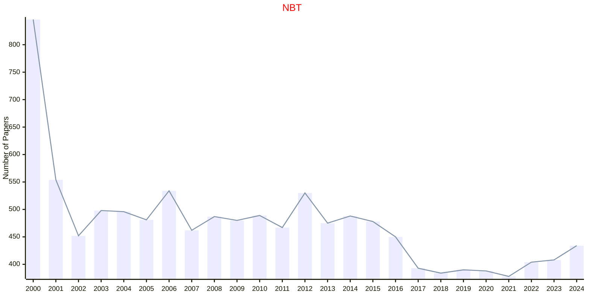

## NCHEM

|Publishers|Full/Homepage|Abbr/About|Acronym/Issues|Period/DBLP|Top/Early|CCF|CAS|JCR|IF|Keywords/Google|
|-         |-            |-         |-             |-          |-        |-  |-  |-  |- |-              |
|[NATURE](https://www.nature.com/)|[Nature Chemistry](https://www.nature.com/nchem)|[Nat. Chem.](https://www.nature.com/nchem/aims)|[NCHEM](https://www.nature.com/nchem/volumes)|2009 -|True||1|Q1|22.6|[Chemistry](https://www.google.com/search?q=Chemistry)|

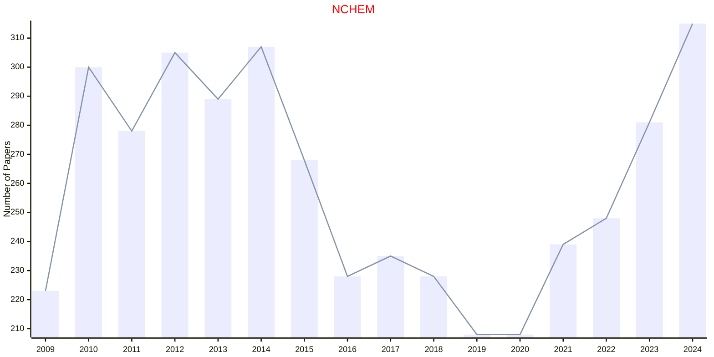

## NCOMMS

|Publishers|Full/Homepage|Abbr/About|Acronym/Issues|Period/DBLP|Top/Early|CCF|CAS|JCR|IF|Keywords/Google|
|-         |-            |-         |-             |-          |-        |-  |-  |-  |- |-              |
|[NATURE](https://www.nature.com/)|[Nature Communications](https://www.nature.com/ncomms)|[Nat. Commun.](https://www.nature.com/ncomms/aims)|[NCOMMS](https://www.nature.com/ncomms/volumes)||True||1|Q1|17.2||

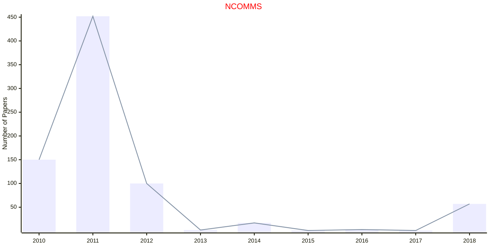

## NG

|Publishers|Full/Homepage|Abbr/About|Acronym/Issues|Period/DBLP|Top/Early|CCF|CAS|JCR|IF|Keywords/Google|
|-         |-            |-         |-             |-          |-        |-  |-  |-  |- |-              |
|[NATURE](https://www.nature.com/)|[Nature Genetics](https://www.nature.com/ng)|[Nat. Genet.](https://www.nature.com/ng/aims)|[NG](https://www.nature.com/ng/volumes)|1992 -|True||1|Q1|37.4|[Biology](https://www.google.com/search?q=Biology)|

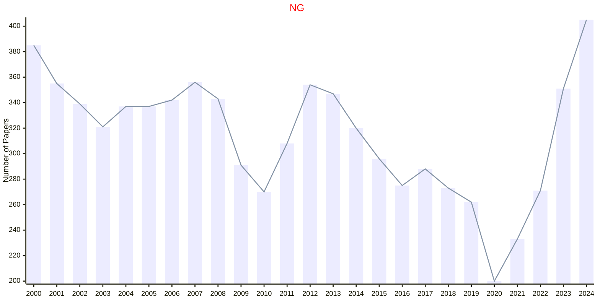

## NMAT

|Publishers|Full/Homepage|Abbr/About|Acronym/Issues|Period/DBLP|Top/Early|CCF|CAS|JCR|IF|Keywords/Google|
|-         |-            |-         |-             |-          |-        |-  |-  |-  |- |-              |
|[NATURE](https://www.nature.com/)|[Nature Materials](https://www.nature.com/nmat)|[Nat. Mater.](https://www.nature.com/nmat/aims)|[NMAT](https://www.nature.com/nmat/volumes)|2002 -|True||1|Q1|46.8|[Materials](https://www.google.com/search?q=Materials)|

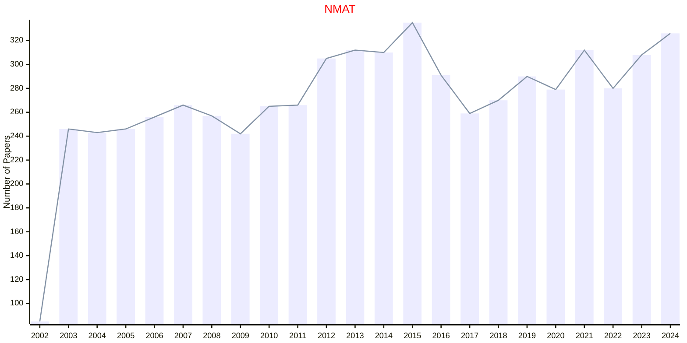

## NMETH

|Publishers|Full/Homepage|Abbr/About|Acronym/Issues|Period/DBLP|Top/Early|CCF|CAS|JCR|IF|Keywords/Google|
|-         |-            |-         |-             |-          |-        |-  |-  |-  |- |-              |
|[NATURE](https://www.nature.com/)|[Nature Methods](https://www.nature.com/nmeth)|[Nat. Meth.](https://www.nature.com/nmeth/aims)|[NMETH](https://www.nature.com/nmeth/volumes)|2004 -|True||1|Q1|51.7||

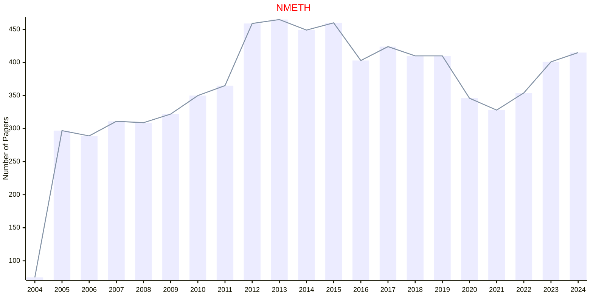

## NPHYS

|Publishers|Full/Homepage|Abbr/About|Acronym/Issues|Period/DBLP|Top/Early|CCF|CAS|JCR|IF|Keywords/Google|
|-         |-            |-         |-             |-          |-        |-  |-  |-  |- |-              |
|[NATURE](https://www.nature.com/)|[Nature Physics](https://www.nature.com/nphys)|[Nat. Phys.](https://www.nature.com/nphys/aims)|[NPHYS](https://www.nature.com/nphys/volumes)|2005 -|True||1|Q1|21.2|[Physics](https://www.google.com/search?q=Physics)|

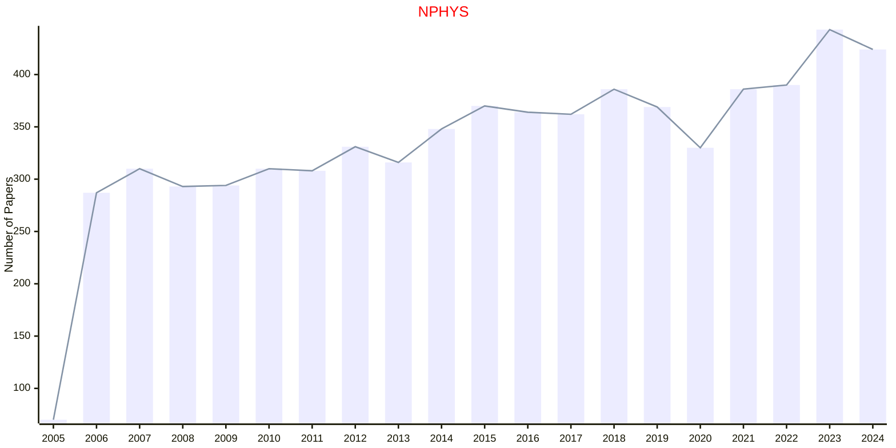

## NPJQI

|Publishers|Full/Homepage|Abbr/About|Acronym/Issues|Period/DBLP|Top/Early|CCF|CAS|JCR|IF|Keywords/Google|
|-         |-            |-         |-             |-          |-        |-  |-  |-  |- |-              |
|[NATURE](https://www.nature.com/)|[npj Quantum Information](https://www.nature.com/npjqi)|[npj Quantum Inf.](https://www.nature.com/npjqi/aims)|[NPJQI](https://www.nature.com/npjqi/volumes)|2015 -|True||1|Q1|9.4||

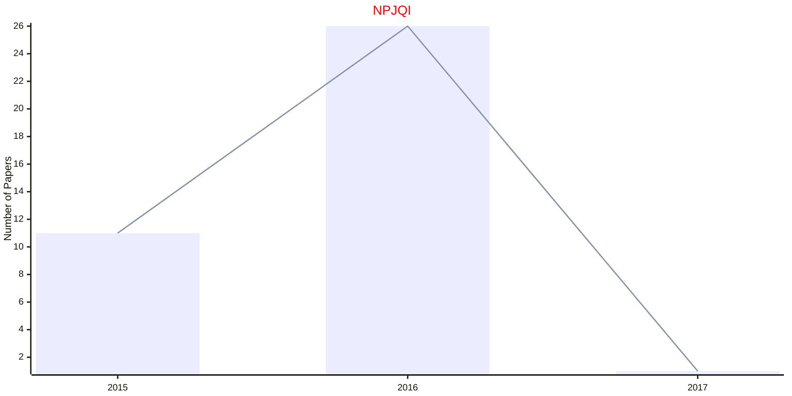

## SREP

|Publishers|Full/Homepage|Abbr/About|Acronym/Issues|Period/DBLP|Top/Early|CCF|CAS|JCR|IF|Keywords/Google|
|-         |-            |-         |-             |-          |-        |-  |-  |-  |- |-              |
|[NATURE](https://www.nature.com/)|[Scientific Reports](https://www.nature.com/srep)|Sci. Rep.|SREP|2015 -|False||3|Q1|4.3||

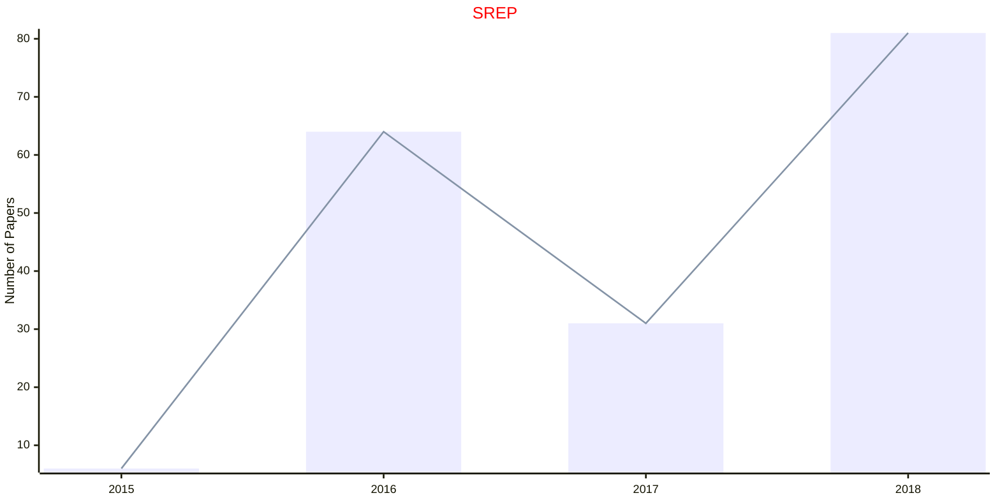

