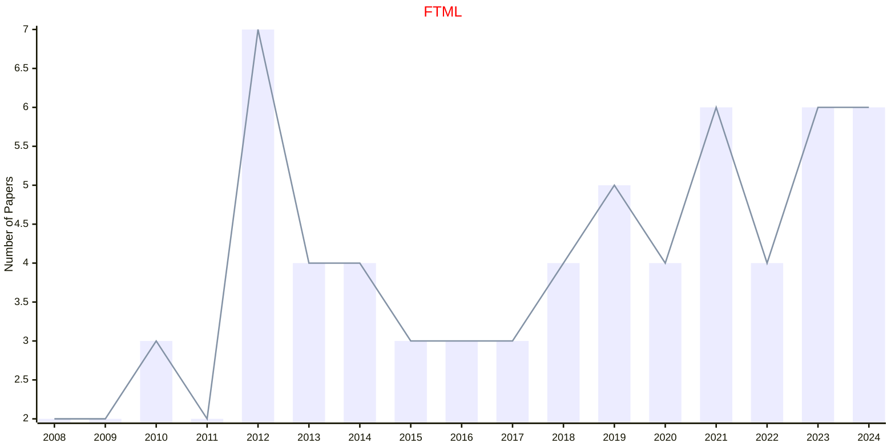
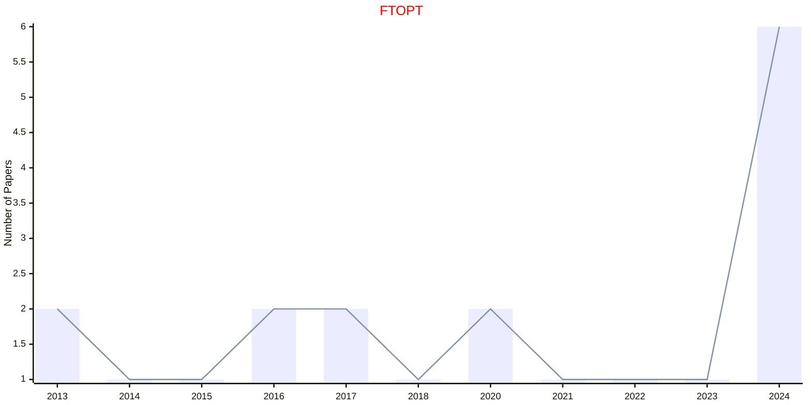
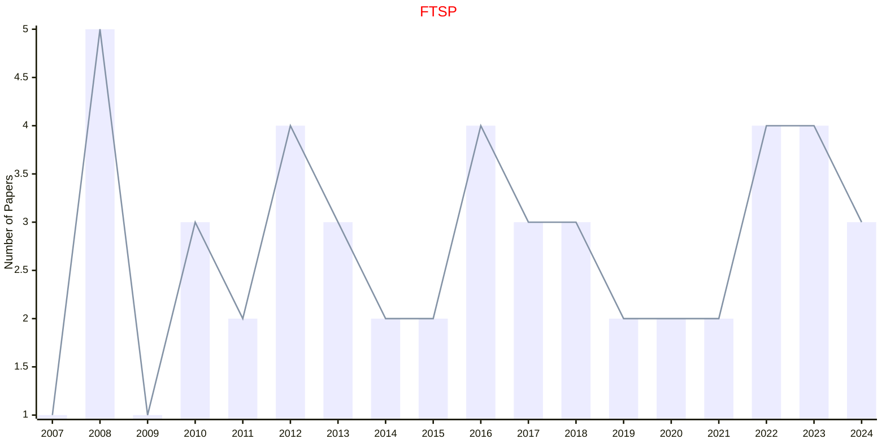

# NOW

- The data for TOP, CCF, CAS, JCR, and IF are sourced from [easyScholar](https://www.easyscholar.cc/).

## FTML

|Publishers|Full/Homepage|Abbr/About|Acronym/Issues|Period/DBLP|Top/Early|CCF|CAS|JCR|IF|Keywords/Google|
|-         |-            |-         |-             |-          |-        |-  |-  |-  |- |-              |
|[NOW](https://www.nowpublishers.com/)|[Foundations and Trends in Machine Learning](https://www.nowpublishers.com/MAL)|[Found. Trends Mach. Learn.](https://www.nowpublishers.com/Journal/EditorialAims/MAL)|[FTML](https://www.nowpublishers.com/MAL)|2008 -|True||1||89.0|[Machine Learning](https://www.google.com/search?q=Machine+Learning)|

## FTOPT

|Publishers|Full/Homepage|Abbr/About|Acronym/Issues|Period/DBLP|Top/Early|CCF|CAS|JCR|IF|Keywords/Google|
|-         |-            |-         |-             |-          |-        |-  |-  |-  |- |-              |
|[NOW](https://www.nowpublishers.com/)|[Foundations and Trends in Optimization](https://www.nowpublishers.com/OPT)|[Found. Trends Optim.](https://www.nowpublishers.com/Journal/EditorialAims/OPT)|[FTOPT](https://www.nowpublishers.com/OPT)|2014 -|False|||||[Optimization](https://www.google.com/search?q=Optimization)|

## FTSP

|Publishers|Full/Homepage|Abbr/About|Acronym/Issues|Period/DBLP|Top/Early|CCF|CAS|JCR|IF|Keywords/Google|
|-         |-            |-         |-             |-          |-        |-  |-  |-  |- |-              |
|[NOW](https://www.nowpublishers.com/)|[Foundations and Trends in Signal Processing](https://www.nowpublishers.com/SIG)|[Found. Trends Signal Process.](https://www.nowpublishers.com/Journal/EditorialAims/SIG)|[FTSP](https://www.nowpublishers.com/SIG)|2007 -|False||4||12.0|[Signal Processing](https://www.google.com/search?q=Signal+Processing)|

