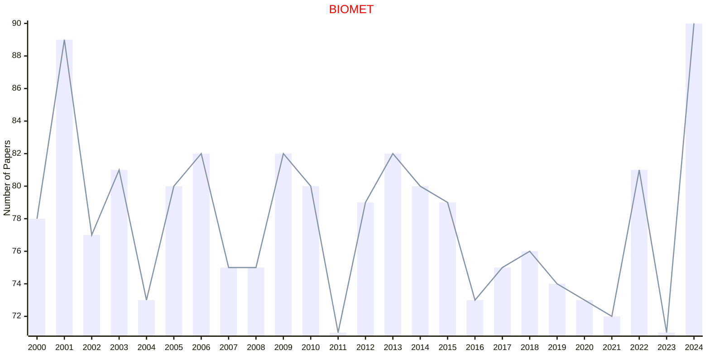
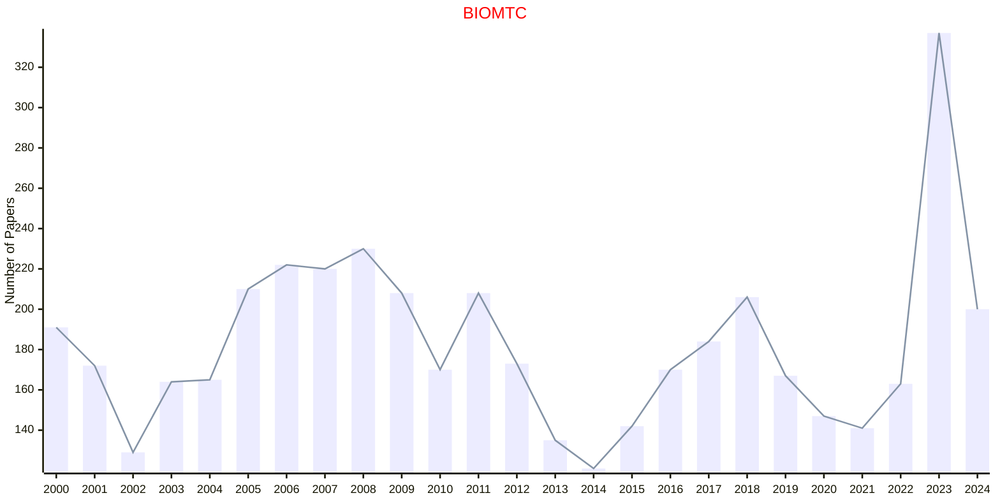
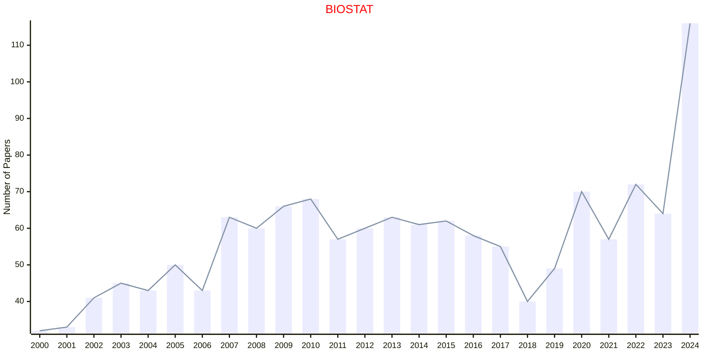
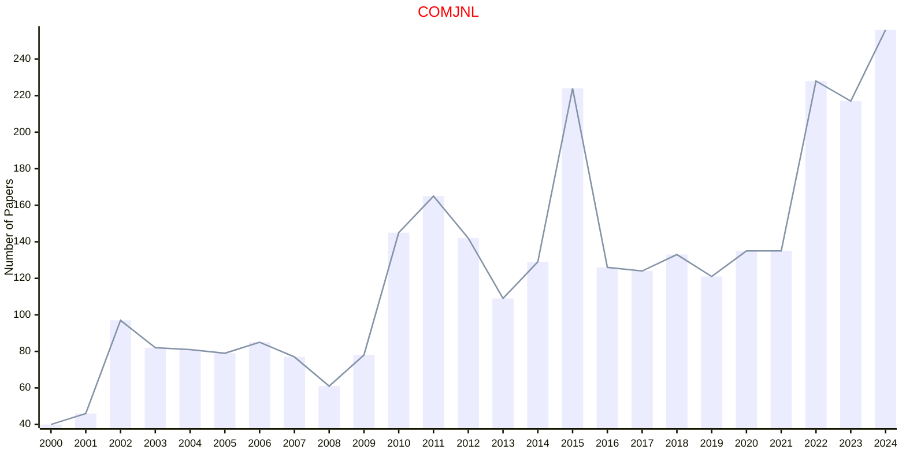
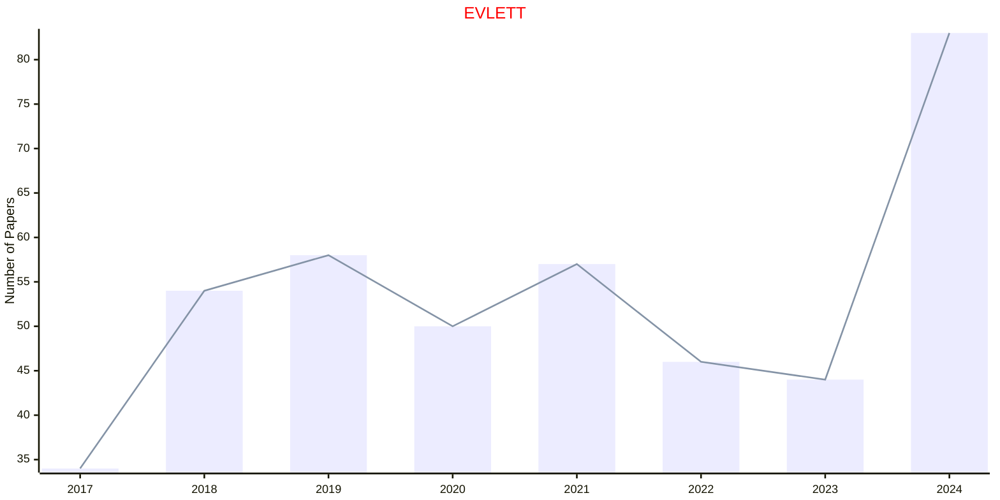
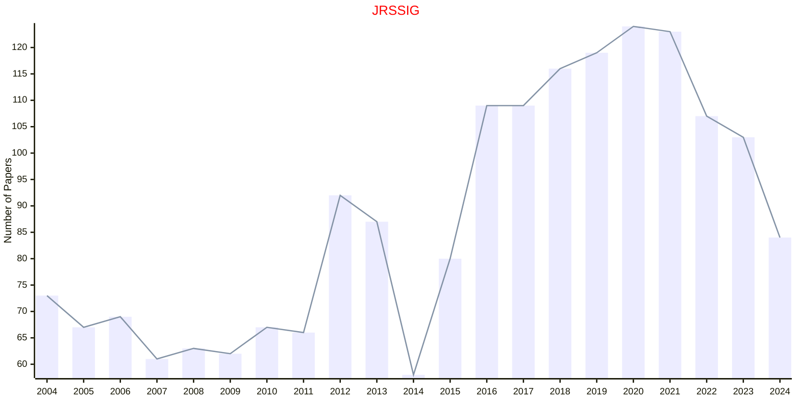
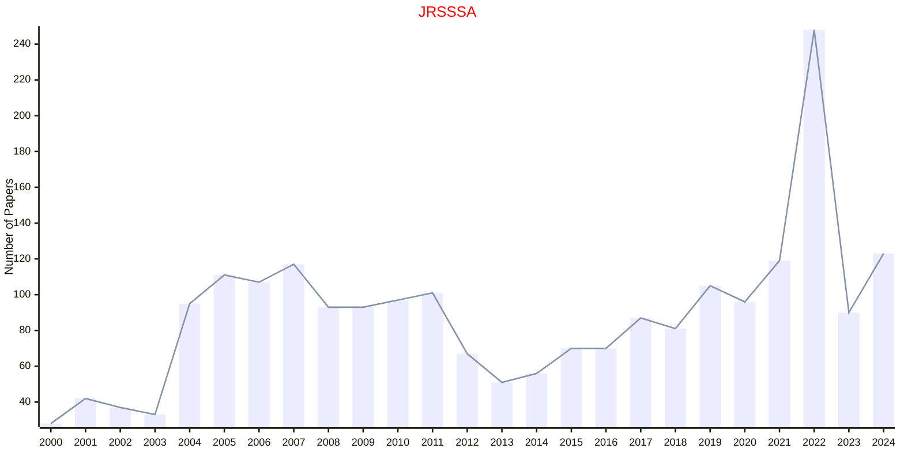
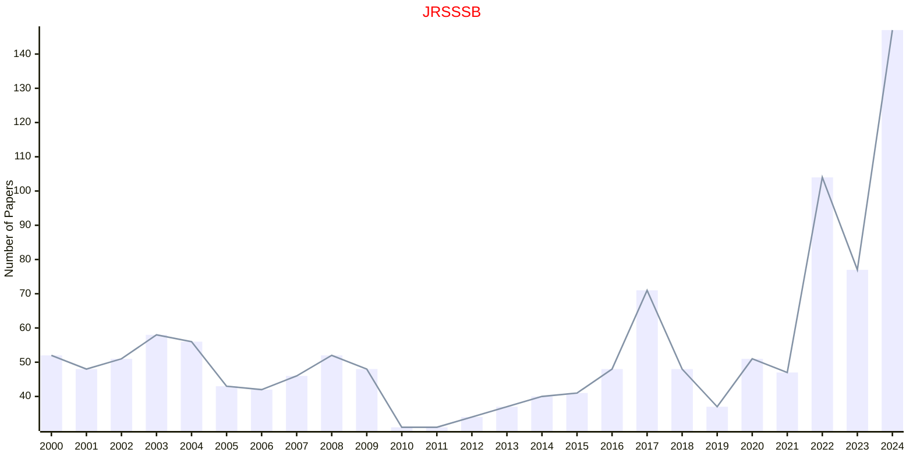
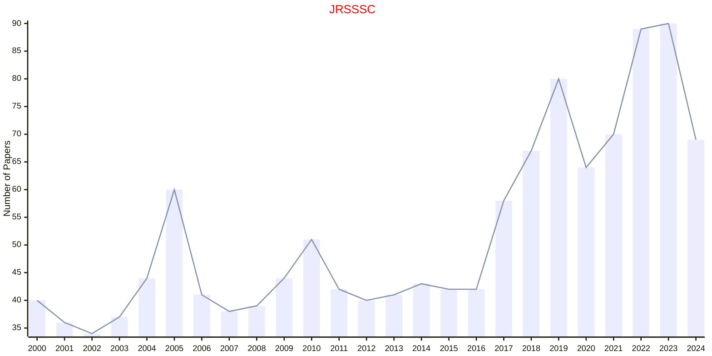
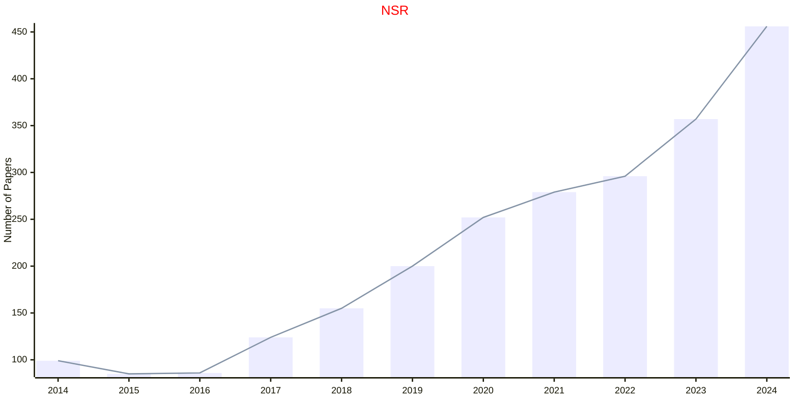

# OXFORD

- The data for TOP, CCF, CAS, JCR, and IF are sourced from [easyScholar](https://www.easyscholar.cc/).

## BIOMET

|Publishers|Full/Homepage|Abbr/About|Acronym/Issues|Period/DBLP|Top/Early|CCF|CAS|JCR|IF|Keywords/Google|
|-         |-            |-         |-             |-          |-        |-  |-  |-  |- |-              |
|[OXFORD](https://academic.oup.com/)|[Biometrika](https://academic.oup.com/biomet)|[Biometrika](https://academic.oup.com/biomet/pages/about)|[BIOMET](https://academic.oup.com/biomet/issue)|1901 -|True||1|Q1|3.9|[Probability and Statistics](https://www.google.com/search?q=Probability+and+Statistics)|

## BIOMTC

|Publishers|Full/Homepage|Abbr/About|Acronym/Issues|Period/DBLP|Top/Early|CCF|CAS|JCR|IF|Keywords/Google|
|-         |-            |-         |-             |-          |-        |-  |-  |-  |- |-              |
|[OXFORD](https://academic.oup.com/)|[Biometrics](https://academic.oup.com/biometrics)|[Biometrics](https://academic.oup.com/biometrics/pages/about)|[BIOMTC](https://academic.oup.com/biometrics/issue)|1999 -|False||3|Q2|2.3|[Statistics in Biosciences](https://www.google.com/search?q=Statistics+in+Biosciences)|

### Remarks

BIOMTC: 2024-Today in OXFORD and BIOMTC: 1999-2023 in WILEY

## BIOSTAT

|Publishers|Full/Homepage|Abbr/About|Acronym/Issues|Period/DBLP|Top/Early|CCF|CAS|JCR|IF|Keywords/Google|
|-         |-            |-         |-             |-          |-        |-  |-  |-  |- |-              |
|[OXFORD](https://academic.oup.com/)|[Biostatistics](https://academic.oup.com/biostatistics)|[Biostatistics](https://academic.oup.com/biostatistics/pages/about)|[BIOSTAT](https://academic.oup.com/biostatistics/issue)|2000 -|False||3|Q1|2.9|[Statistical Reasoning](https://www.google.com/search?q=Statistical+Reasoning)|

## COMJNL

|Publishers|Full/Homepage|Abbr/About|Acronym/Issues|Period/DBLP|Top/Early|CCF|CAS|JCR|IF|Keywords/Google|
|-         |-            |-         |-             |-          |-        |-  |-  |-  |- |-              |
|[OXFORD](https://academic.oup.com/)|[The Computer Journal](https://academic.oup.com/comjnl)|[Comput. J.](https://academic.oup.com/comjnl/pages/about)|[COMJNL](https://academic.oup.com/comjnl/issue)|1958 -|False|B|4|Q3|1.5|[Computing Science](https://www.google.com/search?q=Computing+Science)|

## EVLETT

|Publishers|Full/Homepage|Abbr/About|Acronym/Issues|Period/DBLP|Top/Early|CCF|CAS|JCR|IF|Keywords/Google|
|-         |-            |-         |-             |-          |-        |-  |-  |-  |- |-              |
|[OXFORD](https://academic.oup.com/)|[Evolution Letters](https://academic.oup.com/evlett)|[Evol. Lett.](https://academic.oup.com/evlett/pages/about)|[EVLETT](https://academic.oup.com/evlett/issue)|2017 -|True||1|Q1|4.5|[Evolutionary Biology](https://www.google.com/search?q=Evolutionary+Biology)|

## JRSSIG

|Publishers|Full/Homepage|Abbr/About|Acronym/Issues|Period/DBLP|Top/Early|CCF|CAS|JCR|IF|Keywords/Google|
|-         |-            |-         |-             |-          |-        |-  |-  |-  |- |-              |
|[OXFORD](https://academic.oup.com/)|[Significance](https://academic.oup.com/jrssig)|[Significance](https://academic.oup.com/jrssig/pages/about)|[JRSSIG](https://academic.oup.com/jrssig/issue)|2004 -|False|||||[Data Analysis](https://www.google.com/search?q=Data+Analysis)|

## JRSSSA

|Publishers|Full/Homepage|Abbr/About|Acronym/Issues|Period/DBLP|Top/Early|CCF|CAS|JCR|IF|Keywords/Google|
|-         |-            |-         |-             |-          |-        |-  |-  |-  |- |-              |
|[OXFORD](https://academic.oup.com/)|[Journal of the Royal Statistical Society Series A: Statistics in Society](https://academic.oup.com/jrsssa)|[J. R. Stat. Soc. Ser. A](https://academic.oup.com/jrsssa/pages/about)|[JRSSSA](https://academic.oup.com/jrsssa/issue)|1835 -|False||4|Q2|2.3|[Statistics in Society](https://www.google.com/search?q=Statistics+in+Society)|

## JRSSSB

|Publishers|Full/Homepage|Abbr/About|Acronym/Issues|Period/DBLP|Top/Early|CCF|CAS|JCR|IF|Keywords/Google|
|-         |-            |-         |-             |-          |-        |-  |-  |-  |- |-              |
|[OXFORD](https://academic.oup.com/)|[Journal of the Royal Statistical Society Series B: Statistical Methodology](https://academic.oup.com/jrsssb)|[J. R. Stat. Soc. Ser. B](https://academic.oup.com/jrsssb/pages/about)|[JRSSSB](https://academic.oup.com/jrsssb/issue)|1934 -|True||1|Q1|6.7|[Statistical Methodology](https://www.google.com/search?q=Statistical+Methodology)|

## JRSSSC

|Publishers|Full/Homepage|Abbr/About|Acronym/Issues|Period/DBLP|Top/Early|CCF|CAS|JCR|IF|Keywords/Google|
|-         |-            |-         |-             |-          |-        |-  |-  |-  |- |-              |
|[OXFORD](https://academic.oup.com/)|[Journal of the Royal Statistical Society Series C: Applied Statistics](https://academic.oup.com/jrsssc)|[J. R. Stat. Soc. Ser. C](https://academic.oup.com/jrsssc/pages/about)|[JRSSSC](https://academic.oup.com/jrsssc/issue)|1952 -|False||4|Q2|1.5|[Applied Statistics](https://www.google.com/search?q=Applied+Statistics)|

## NSR

|Publishers|Full/Homepage|Abbr/About|Acronym/Issues|Period/DBLP|Top/Early|CCF|CAS|JCR|IF|Keywords/Google|
|-         |-            |-         |-             |-          |-        |-  |-  |-  |- |-              |
|[OXFORD](https://academic.oup.com/)|[National Science Review](https://academic.oup.com/nsr)|[Nat. Sci. Rev.](https://academic.oup.com/nsr/pages/about)|[NSR](https://academic.oup.com/nsr/issue)|2014 -|True||1|Q1|17.7|[Multidisciplinary](https://www.google.com/search?q=Multidisciplinary)|

