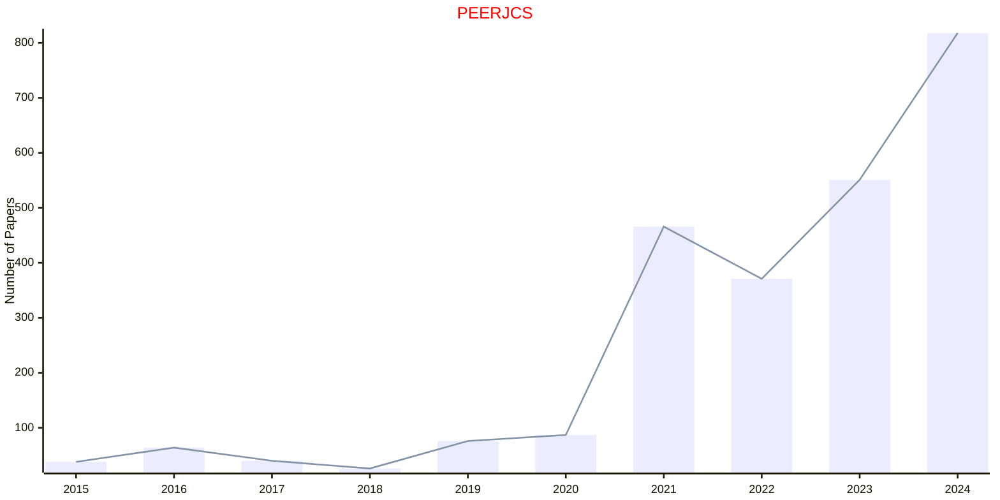

# PEERJ

- The data for TOP, CCF, CAS, JCR, and IF are sourced from [easyScholar](https://www.easyscholar.cc/).

## PEERJCS

|Publishers|Full/Homepage|Abbr/About|Acronym/Issues|Period/DBLP|Top/Early|CCF|CAS|JCR|IF|Keywords/Google|
|-         |-            |-         |-             |-          |-        |-  |-  |-  |- |-              |
|[PEERJ](https://peerj.com/)|[PeerJ Computer Science](https://peerj.com/computer-science/)|[PeerJ Comput. Sci.](https://d2pdyyx74uypu5.cloudfront.net/docs/peerj-cs-journal-factsheet.pdf)|[PEERJCS](https://peerj.com/computer-science/)|[2015 -](https://dblp.org/db/journals/peerj-cs/index.html)|False||4|Q2|3.3|[Computer Science](https://www.google.com/search?q=Computer+Science)|

