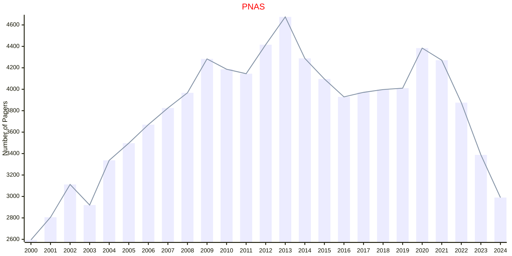

# PNAS

- The data for TOP, CCF, CAS, JCR, and IF are sourced from [easyScholar](https://www.easyscholar.cc/).

## PNAS

|Publishers|Full/Homepage|Abbr/About|Acronym/Issues|Period/DBLP|Top/Early|CCF|CAS|JCR|IF|Keywords/Google|
|-         |-            |-         |-             |-          |-        |-  |-  |-  |- |-              |
|[PNAS](https://www.pnas.org/)|[Proceedings of the National Academy of Sciences of the United States of America](https://www.pnas.org)|[Proc. Natl. Acad. Sci. USA](https://www.pnas.org/)|[PNAS](https://www.pnas.org/loi/pnas)|1915 -|True||1|Q1|10.6|[Multidisciplinary](https://www.google.com/search?q=Multidisciplinary)|

