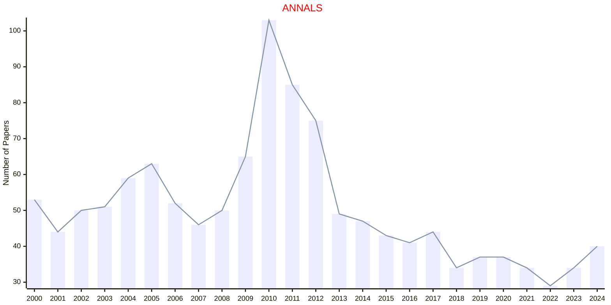

# PRINCETON

- The data for TOP, CCF, CAS, JCR, and IF are sourced from [easyScholar](https://www.easyscholar.cc/).

## ANNALS

|Publishers|Full/Homepage|Abbr/About|Acronym/Issues|Period/DBLP|Top/Early|CCF|CAS|JCR|IF|Keywords/Google|
|-         |-            |-         |-             |-          |-        |-  |-  |-  |- |-              |
|[PRINCETON](https://press.princeton.edu/)|[Annals of Mathematics](https://annals.math.princeton.edu/)|[Ann. Math.](https://annals.math.princeton.edu/about)|[ANNALS](https://annals.math.princeton.edu/)|1966 -|True||1|Q1|6.3|[Mathematics](https://www.google.com/search?q=Mathematics)|

