# SAGE

- The data for TOP, CCF, CAS, JCR, and IF are sourced from [easyScholar](https://www.easyscholar.cc/).

## ADBE

|Publishers|Full/Homepage|Abbr/About|Acronym/Issues|Period/DBLP|Top/Early|CCF|CAS|JCR|IF|Keywords/Google|
|-         |-            |-         |-             |-          |-        |-  |-  |-  |- |-              |
|[SAGE](https://www.sagepub.com/)|[Adaptive Behavior](https://journals.sagepub.com/home/adba)|[Adaptive Behavior](https://journals.sagepub.com/overview-metric/ADB?)|[ADBE](https://journals.sagepub.com/loi/adba)|1992 -|False||4|Q4|1.5|[Artificial Systems](https://www.google.com/search?q=Artificial+Systems)|

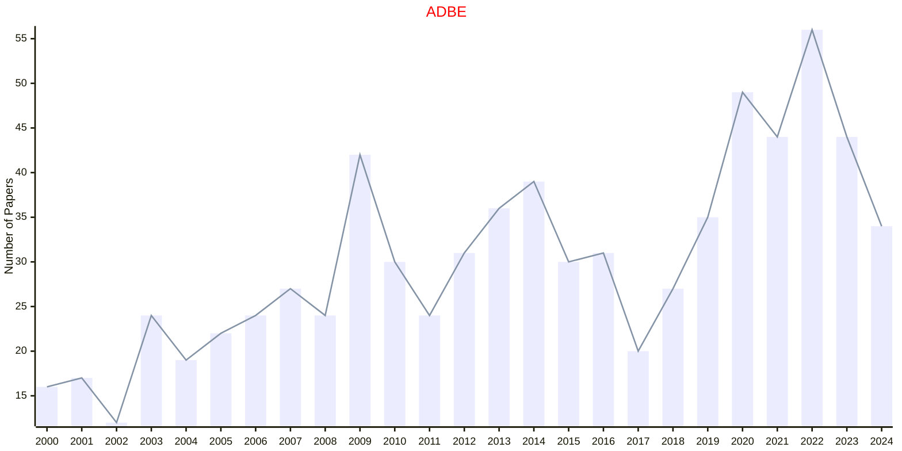

## BECB

|Publishers|Full/Homepage|Abbr/About|Acronym/Issues|Period/DBLP|Top/Early|CCF|CAS|JCR|IF|Keywords/Google|
|-         |-            |-         |-             |-          |-        |-  |-  |-  |- |-              |
|[SAGE](https://www.sagepub.com/)|[Biomedical Engineering and Computational Biology](https://journals.sagepub.com/home/beca)|[Biomed. Eng. Comput. Biol.](https://journals.sagepub.com/overview-metric/BEC?)|[BECB](https://journals.sagepub.com/loi/beca)|2009 -|False||||3.8|[Biomedical Engineering](https://www.google.com/search?q=Biomedical+Engineering); [Computational Biology](https://www.google.com/search?q=Computational+Biology)|

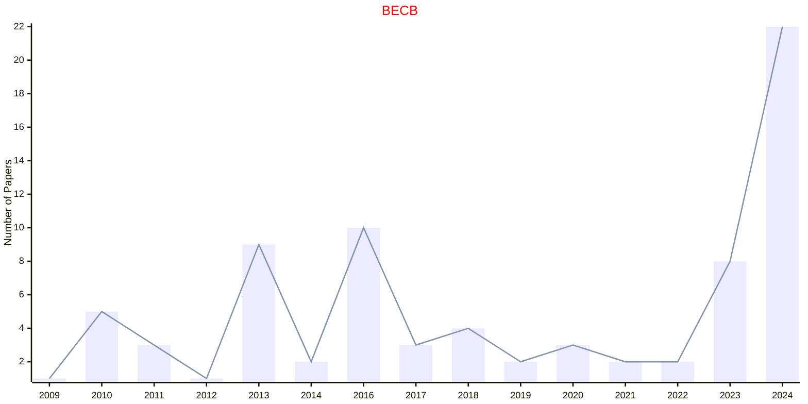

## DSC

|Publishers|Full/Homepage|Abbr/About|Acronym/Issues|Period/DBLP|Top/Early|CCF|CAS|JCR|IF|Keywords/Google|
|-         |-            |-         |-             |-          |-        |-  |-  |-  |- |-              |
|[SAGE](https://www.sagepub.com/)|[Data Science](https://journals.sagepub.com/home/dsca)|[Data Sci.](https://journals.sagepub.com/overview-metric/DSC?)|[DSC](https://journals.sagepub.com/loi/dsca)|2017 -|False|||||[Data Mining](https://www.google.com/search?q=Data+Mining)|

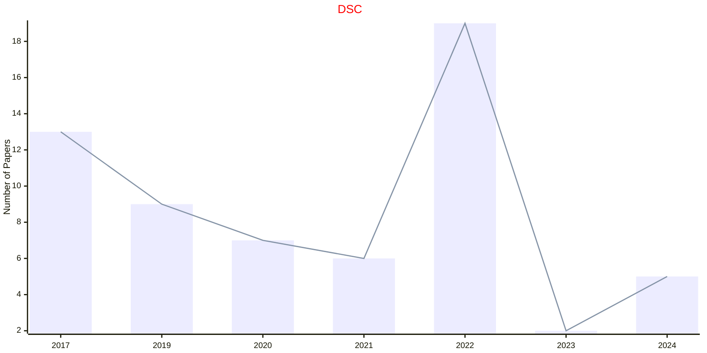

## EAI

|Publishers|Full/Homepage|Abbr/About|Acronym/Issues|Period/DBLP|Top/Early|CCF|CAS|JCR|IF|Keywords/Google|
|-         |-            |-         |-             |-          |-        |-  |-  |-  |- |-              |
|[SAGE](https://www.sagepub.com/)|[European Journal on Artificial Intelligence](https://journals.sagepub.com/home/eai)|[Eur. Artif. Intell.](https://journals.sagepub.com/overview-metric/EAI?)|[EAI](https://journals.sagepub.com/loi/eai)|1987 -|False|||||[Artificial Intelligence](https://www.google.com/search?q=Artificial+Intelligence)|

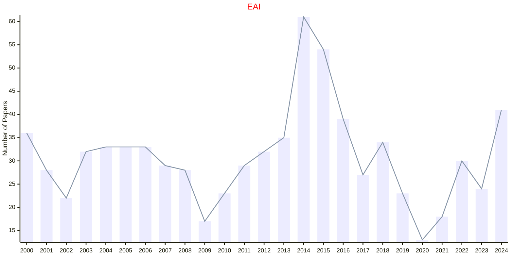

## ICAE

|Publishers|Full/Homepage|Abbr/About|Acronym/Issues|Period/DBLP|Top/Early|CCF|CAS|JCR|IF|Keywords/Google|
|-         |-            |-         |-             |-          |-        |-  |-  |-  |- |-              |
|[SAGE](https://www.sagepub.com/)|[Integrated Computer-Aided Engineering](https://journals.sagepub.com/home/ico)|[Integrated Computer-Aided Engineering](https://journals.sagepub.com/overview-metric/ICO?)|[ICAE](https://journals.sagepub.com/loi/ico)|1993 -|False||2|Q1|3.4|[Evolutionary Computation](https://www.google.com/search?q=Evolutionary+Computation)|

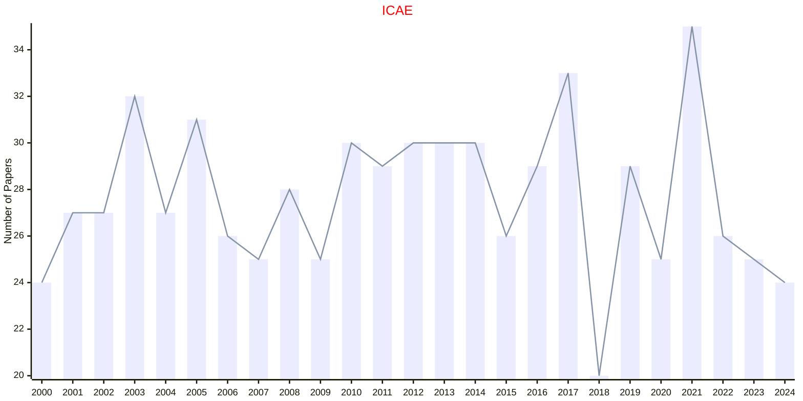

## IDA

|Publishers|Full/Homepage|Abbr/About|Acronym/Issues|Period/DBLP|Top/Early|CCF|CAS|JCR|IF|Keywords/Google|
|-         |-            |-         |-             |-          |-        |-  |-  |-  |- |-              |
|[SAGE](https://www.sagepub.com/)|[Intelligent Data Analysis](https://journals.sagepub.com/home/ida)|[Intell. Data Anal.](https://journals.sagepub.com/overview-metric/IDA?)|[IDA](https://journals.sagepub.com/loi/ida)|1997 -|False|C|4|Q4|0.9|[Artificial Intelligence](https://www.google.com/search?q=Artificial+Intelligence); [Data Mining](https://www.google.com/search?q=Data+Mining); [Evolutionary Computation](https://www.google.com/search?q=Evolutionary+Computation)|

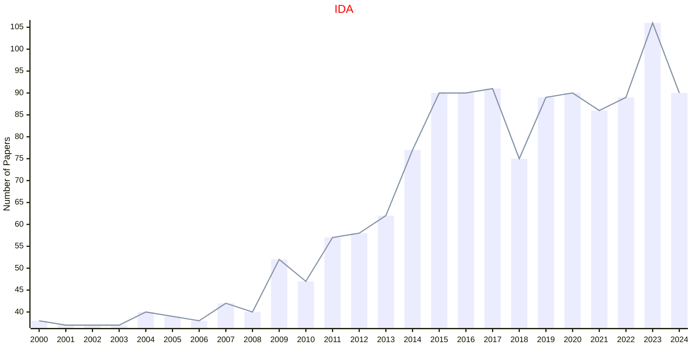

## IJARS

|Publishers|Full/Homepage|Abbr/About|Acronym/Issues|Period/DBLP|Top/Early|CCF|CAS|JCR|IF|Keywords/Google|
|-         |-            |-         |-             |-          |-        |-  |-  |-  |- |-              |
|[SAGE](https://www.sagepub.com/)|[International Journal of Advanced Robotic Systems](https://journals.sagepub.com/home/arxa)|[Int. J. Adv. Robot. Syst.](https://journals.sagepub.com/overview-metric/ARX?)|[IJARS](https://journals.sagepub.com/loi/arxa)|2004 -|False||4|Q3|2.6|[Robotics and UAV](https://www.google.com/search?q=Robotics+and+UAV)|

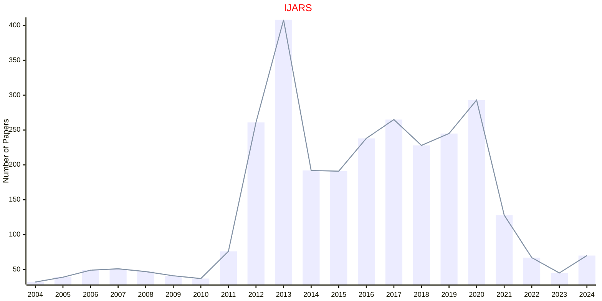

## IJRR

|Publishers|Full/Homepage|Abbr/About|Acronym/Issues|Period/DBLP|Top/Early|CCF|CAS|JCR|IF|Keywords/Google|
|-         |-            |-         |-             |-          |-        |-  |-  |-  |- |-              |
|[SAGE](https://www.sagepub.com/)|[International Journal of Robotics Research](https://journals.sagepub.com/home/ijr)|[Int. J. Robot. Res.](https://journals.sagepub.com/overview-metric/IJR?)|[IJRR](https://journals.sagepub.com/loi/ijr)|1982 -|False||2|Q2|9.3|[Robotics and UAV](https://www.google.com/search?q=Robotics+and+UAV)|

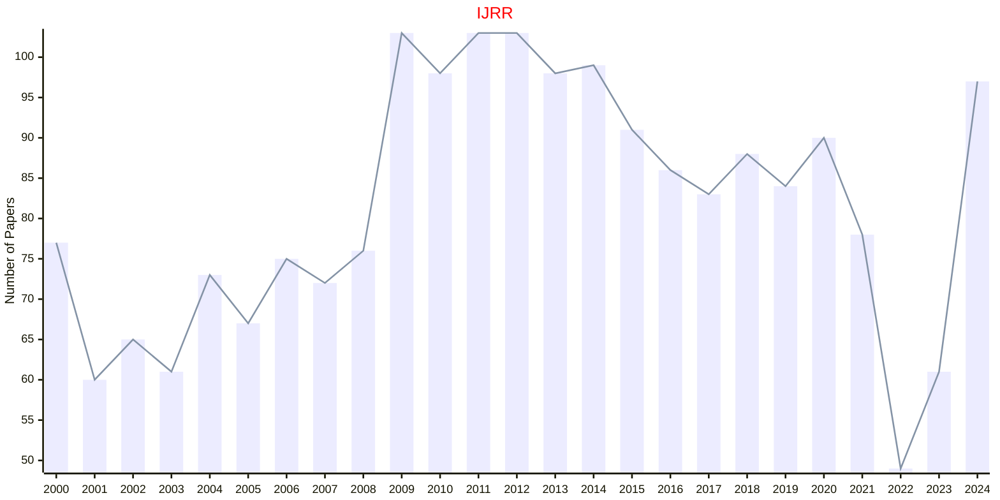

## JACT

|Publishers|Full/Homepage|Abbr/About|Acronym/Issues|Period/DBLP|Top/Early|CCF|CAS|JCR|IF|Keywords/Google|
|-         |-            |-         |-             |-          |-        |-  |-  |-  |- |-              |
|[SAGE](https://www.sagepub.com/)|[Journal of Algorithms & Computational Technology](https://journals.sagepub.com/home/acta)|[J. Algo. Comput. Technol.](https://journals.sagepub.com/overview-metric/ACT?)|[JACT](https://journals.sagepub.com/loi/acta)|2007 -|False||4||1.2|[Computational Technology](https://www.google.com/search?q=Computational+Technology)|

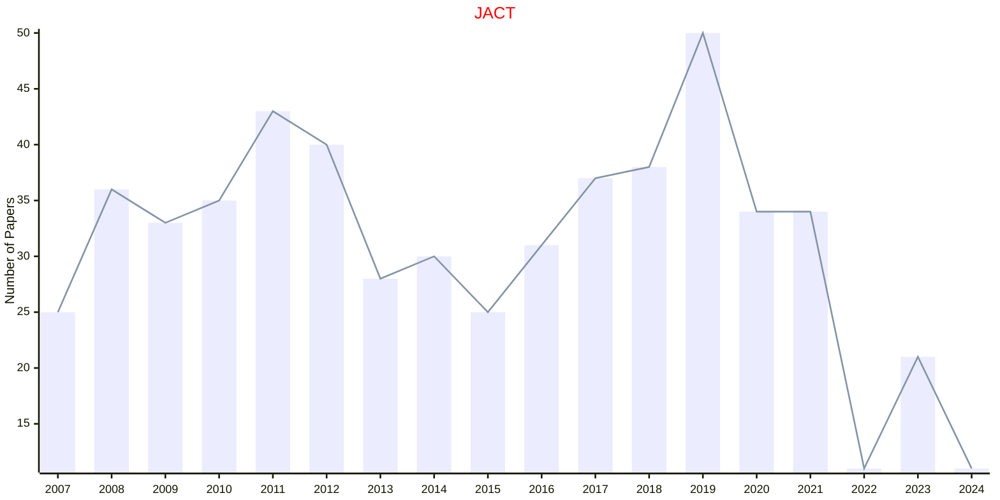

## JAISE

|Publishers|Full/Homepage|Abbr/About|Acronym/Issues|Period/DBLP|Top/Early|CCF|CAS|JCR|IF|Keywords/Google|
|-         |-            |-         |-             |-          |-        |-  |-  |-  |- |-              |
|[SAGE](https://www.sagepub.com/)|[Journal of Ambient Intelligence and Smart Environments](https://journals.sagepub.com/home/ais)|[J. Ambient Intell. Smart Env.](https://journals.sagepub.com/overview-metric/AIS?)|[JAISE](https://journals.sagepub.com/loi/ais)|2009 -|False||4|Q3|1.9|[Ambient Intelligence](https://www.google.com/search?q=Ambient+Intelligence)|

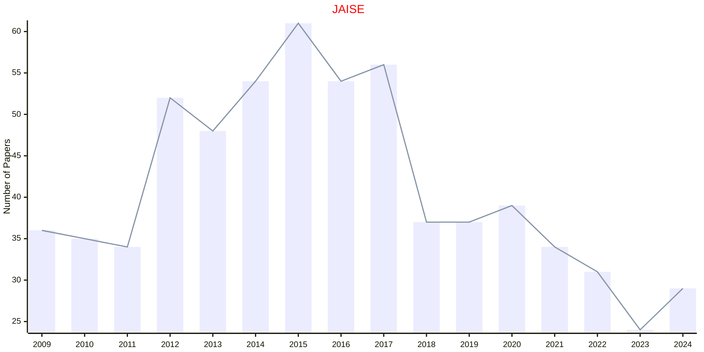

## JIFS

|Publishers|Full/Homepage|Abbr/About|Acronym/Issues|Period/DBLP|Top/Early|CCF|CAS|JCR|IF|Keywords/Google|
|-         |-            |-         |-             |-          |-        |-  |-  |-  |- |-              |
|[SAGE](https://www.sagepub.com/)|[Journal of Intelligent & Fuzzy Systems](https://journals.sagepub.com/home/ifs)|[J. Intell. Fuzzy Syst.](https://journals.sagepub.com/overview-metric/IFS?)|[JIFS](https://journals.sagepub.com/loi/ifs)|1993 -|False||4|Q4|1.2|[Fuzzy Systems](https://www.google.com/search?q=Fuzzy+Systems)|

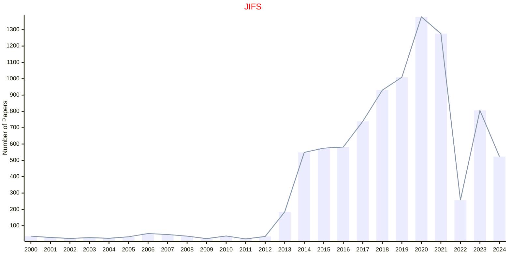

## POM

|Publishers|Full/Homepage|Abbr/About|Acronym/Issues|Period/DBLP|Top/Early|CCF|CAS|JCR|IF|Keywords/Google|
|-         |-            |-         |-             |-          |-        |-  |-  |-  |- |-              |
|[SAGE](https://www.sagepub.com/)|[Production and Operations Management](https://journals.sagepub.com/home/paoa)|[Product. Oper. Manag.](https://journals.sagepub.com/overview-metric/PAO?)|[POM](https://journals.sagepub.com/loi/paoa)|1992 -|False||3|Q1|6.4|[Management](https://www.google.com/search?q=Management); [Operations](https://www.google.com/search?q=Operations)|

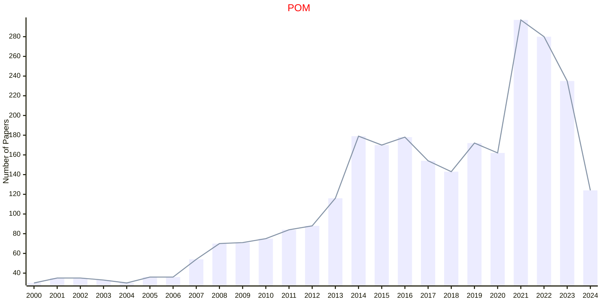

## SW

|Publishers|Full/Homepage|Abbr/About|Acronym/Issues|Period/DBLP|Top/Early|CCF|CAS|JCR|IF|Keywords/Google|
|-         |-            |-         |-             |-          |-        |-  |-  |-  |- |-              |
|[SAGE](https://www.sagepub.com/)|[Semantic Web](https://journals.sagepub.com/home/swj)|[Semantic Web](https://journals.sagepub.com/overview-metric/SWJ?)|[SW](https://journals.sagepub.com/loi/swj)|2010 -|False||3|Q2|3.0|[Semantic Web](https://www.google.com/search?q=Semantic+Web)|

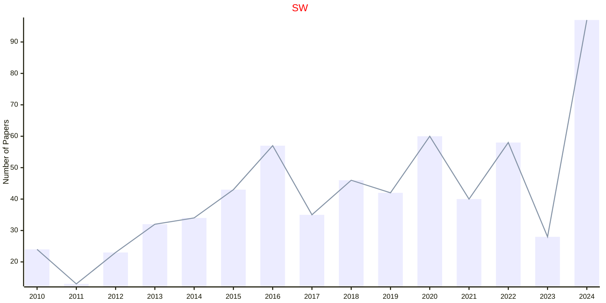

