# SIAM

- The data for TOP, CCF, CAS, JCR, and IF are sourced from [easyScholar](https://www.easyscholar.cc/).

## JUQ

|Publishers|Full/Homepage|Abbr/About|Acronym/Issues|Period/DBLP|Top/Early|CCF|CAS|JCR|IF|Keywords/Google|
|-         |-            |-         |-             |-          |-        |-  |-  |-  |- |-              |
|[SIAM](https://epubs.siam.org)|[SIAM/ASA Journal on Uncertainty Quantification](https://epubs.siam.org/journal/sjuqa3)|[SIAM/ASA J. Uncert. Quantif.](https://epubs.siam.org/journal/juq/about)|[JUQ](https://epubs.siam.org/loi/sjuqa3)|2013 -|False||3|Q2|2.2|[Fuzzy and Uncertainty](https://www.google.com/search?q=Fuzzy+and+Uncertainty)|

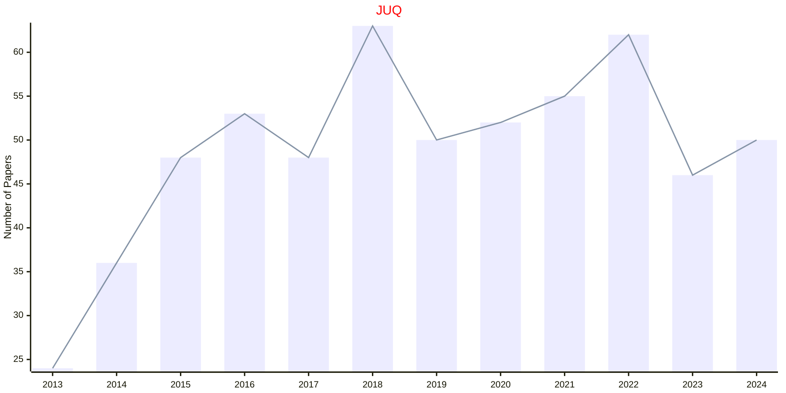

## MMS

|Publishers|Full/Homepage|Abbr/About|Acronym/Issues|Period/DBLP|Top/Early|CCF|CAS|JCR|IF|Keywords/Google|
|-         |-            |-         |-             |-          |-        |-  |-  |-  |- |-              |
|[SIAM](https://epubs.siam.org)|[Multiscale Modeling & Simulation](https://epubs.siam.org/journal/mmsubt)|[Multiscale Model. Simul.](https://epubs.siam.org/journal/mms/about)|[MMS](https://epubs.siam.org/loi/mmsubt)|2003 -|False||3|Q2|1.8|[Interdisciplinary](https://www.google.com/search?q=Interdisciplinary)|

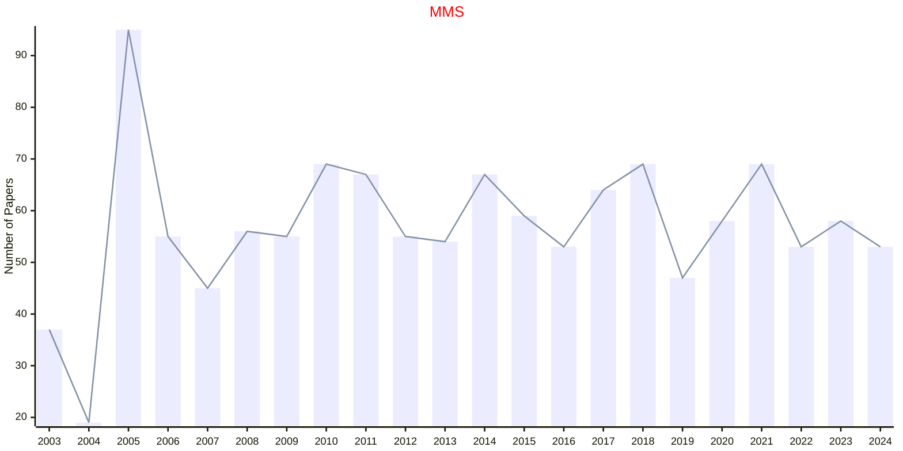

## SIADS

|Publishers|Full/Homepage|Abbr/About|Acronym/Issues|Period/DBLP|Top/Early|CCF|CAS|JCR|IF|Keywords/Google|
|-         |-            |-         |-             |-          |-        |-  |-  |-  |- |-              |
|[SIAM](https://epubs.siam.org)|[SIAM Journal on Applied Dynamical Systems](https://epubs.siam.org/journal/sjaday)|[SIAM J. Appl. Dyn. Syst.](https://epubs.siam.org/journal/siads/about)|[SIADS](https://epubs.siam.org/loi/sjaday)|2002 -|False||4|Q1|2.3|[Mathematics](https://www.google.com/search?q=Mathematics)|

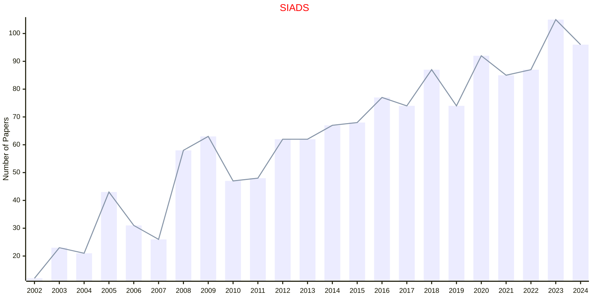

## SIAGA

|Publishers|Full/Homepage|Abbr/About|Acronym/Issues|Period/DBLP|Top/Early|CCF|CAS|JCR|IF|Keywords/Google|
|-         |-            |-         |-             |-          |-        |-  |-  |-  |- |-              |
|[SIAM](https://epubs.siam.org)|[SIAM Journal on Applied Algebra and Geometry](https://epubs.siam.org/journal/siaga)|[SIAM J. Appl. Algebra Geom.](https://epubs.siam.org/journal/siaga/about)|[SIAGA](https://epubs.siam.org/loi/sjaabq)|2017 -|False||2|Q2|1.7|[Applied Algebra](https://www.google.com/search?q=Applied+Algebra); [Applied Geometry](https://www.google.com/search?q=Applied+Geometry)|

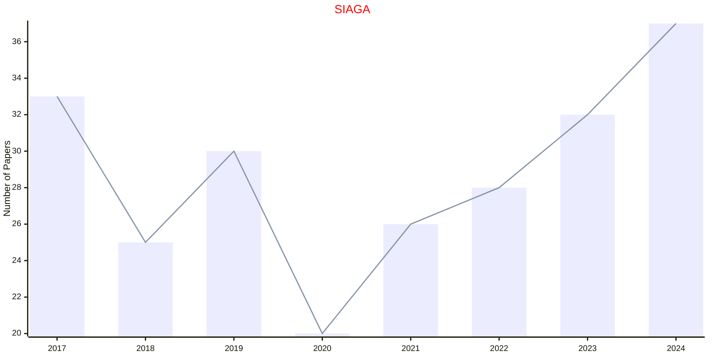

## SIAP

|Publishers|Full/Homepage|Abbr/About|Acronym/Issues|Period/DBLP|Top/Early|CCF|CAS|JCR|IF|Keywords/Google|
|-         |-            |-         |-             |-          |-        |-  |-  |-  |- |-              |
|[SIAM](https://epubs.siam.org)|[SIAM Journal on Applied Mathematics](https://epubs.siam.org/journal/smjmap)|[SIAM J. Appl. Math.](https://epubs.siam.org/journal/siap/about)|[SIAP](https://epubs.siam.org/loi/smjmap)|1953 -|False||4|Q1|2.1|[Applied Mathematics](https://www.google.com/search?q=Applied+Mathematics)|

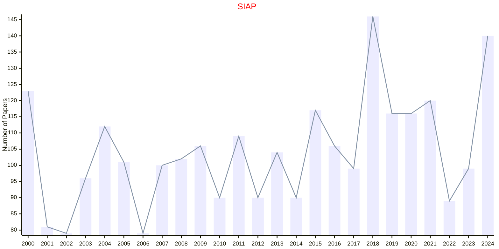

## SICOMP

|Publishers|Full/Homepage|Abbr/About|Acronym/Issues|Period/DBLP|Top/Early|CCF|CAS|JCR|IF|Keywords/Google|
|-         |-            |-         |-             |-          |-        |-  |-  |-  |- |-              |
|[SIAM](https://epubs.siam.org)|[SIAM Journal on Computing](https://epubs.siam.org/journal/smjcat)|[SIAM J. Comput.](https://epubs.siam.org/journal/sicomp/about)|[SICOMP](https://epubs.siam.org/loi/smjcat)|1972 -|False|A|3|Q2|2.1|[Computational Science](https://www.google.com/search?q=Computational+Science); [Mathematics](https://www.google.com/search?q=Mathematics)|

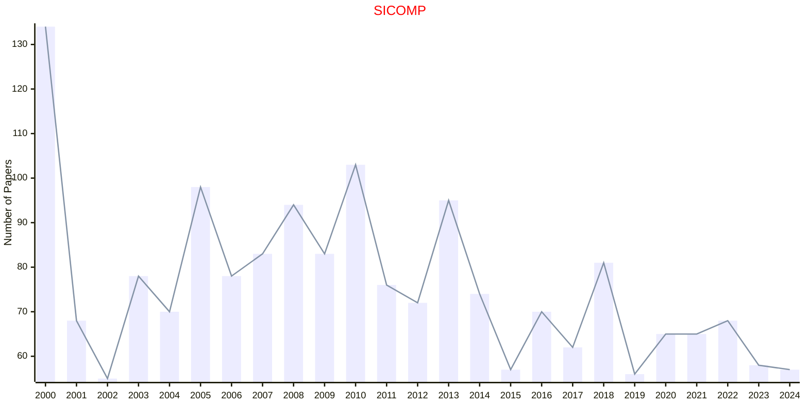

## SICON

|Publishers|Full/Homepage|Abbr/About|Acronym/Issues|Period/DBLP|Top/Early|CCF|CAS|JCR|IF|Keywords/Google|
|-         |-            |-         |-             |-          |-        |-  |-  |-  |- |-              |
|[SIAM](https://epubs.siam.org)|[SIAM Journal on Control and Optimization](https://epubs.siam.org/journal/sjcodc)|[SIAM J. Control Optim.](https://epubs.siam.org/journal/sicon/about)|[SICON](https://epubs.siam.org/loi/sjcodc)|1962 -|False||2|Q1|2.5|[Control and Automation](https://www.google.com/search?q=Control+and+Automation)|

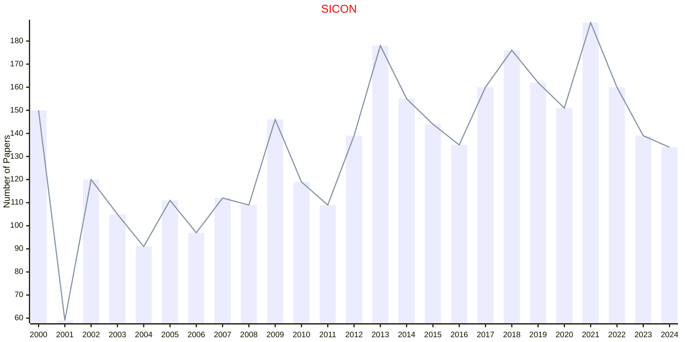

## SIDMA

|Publishers|Full/Homepage|Abbr/About|Acronym/Issues|Period/DBLP|Top/Early|CCF|CAS|JCR|IF|Keywords/Google|
|-         |-            |-         |-             |-          |-        |-  |-  |-  |- |-              |
|[SIAM](https://epubs.siam.org)|[SIAM Journal on Discrete Mathematics](https://epubs.siam.org/journal/sjdmec)|[SIAM J. Discret. Math.](https://epubs.siam.org/journal/sidma/about)|[SIDMA](https://epubs.siam.org/loi/sjdmec)|1988 -|False|C|2|Q2|1.0|[Mathematics](https://www.google.com/search?q=Mathematics)|

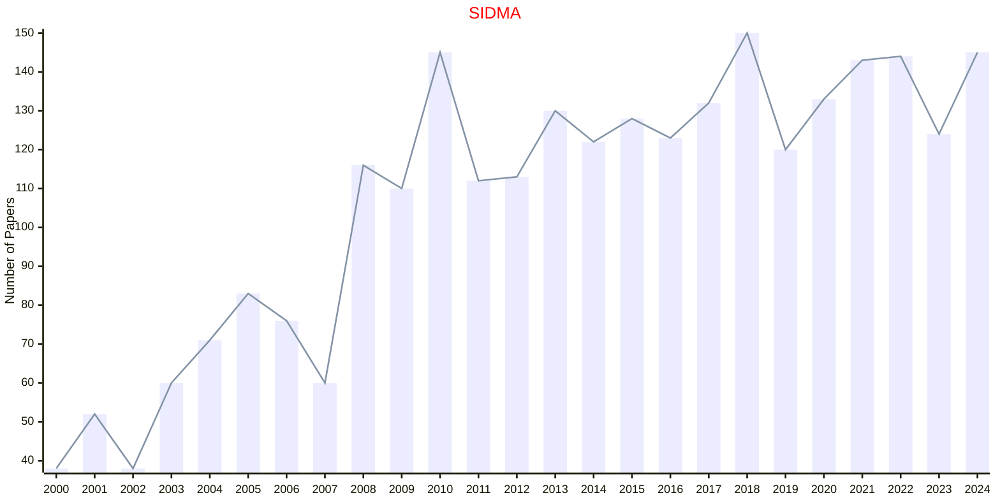

## SIFIN

|Publishers|Full/Homepage|Abbr/About|Acronym/Issues|Period/DBLP|Top/Early|CCF|CAS|JCR|IF|Keywords/Google|
|-         |-            |-         |-             |-          |-        |-  |-  |-  |- |-              |
|[SIAM](https://epubs.siam.org)|[SIAM Journal on Financial Mathematics](https://epubs.siam.org/journal/sjfmbj)|[SIAM J. Financ. Math.](https://epubs.siam.org/journal/sifin/about)|[SIFIN](https://epubs.siam.org/loi/sjfmbj)|2010 -|False||3|Q2|1.7|[Financial Mathematics](https://www.google.com/search?q=Financial+Mathematics)|

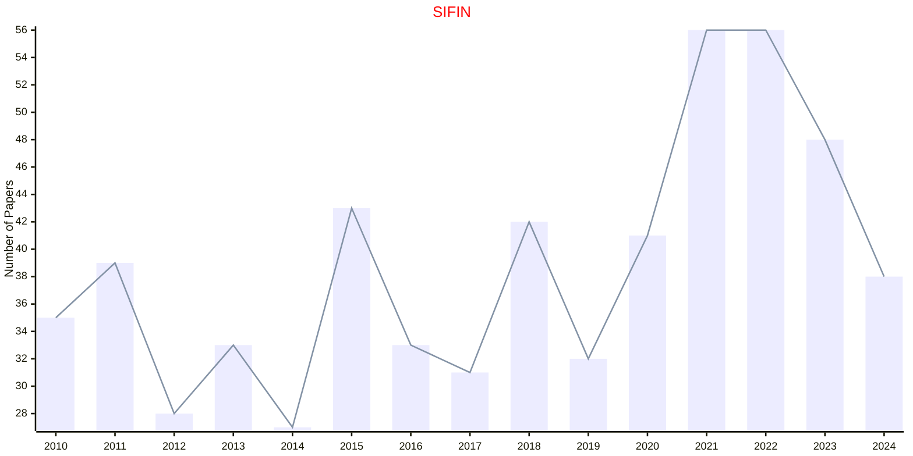

## SIIMS

|Publishers|Full/Homepage|Abbr/About|Acronym/Issues|Period/DBLP|Top/Early|CCF|CAS|JCR|IF|Keywords/Google|
|-         |-            |-         |-             |-          |-        |-  |-  |-  |- |-              |
|[SIAM](https://epubs.siam.org)|[SIAM Journal on Imaging Sciences](https://epubs.siam.org/journal/sjisbi)|[SIAM J. Imaging Sci.](https://epubs.siam.org/journal/siims/about)|[SIIMS](https://epubs.siam.org/loi/sjisbi)|2008 -|False|B|3|Q1|2.8|[Imaging Sciences](https://www.google.com/search?q=Imaging+Sciences)|

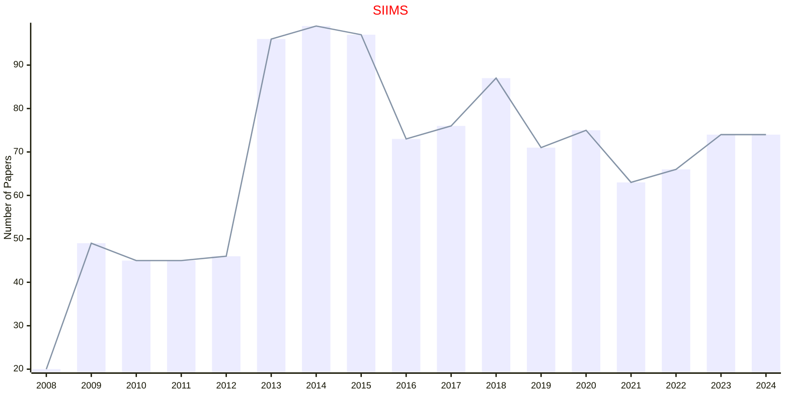

## SIMA

|Publishers|Full/Homepage|Abbr/About|Acronym/Issues|Period/DBLP|Top/Early|CCF|CAS|JCR|IF|Keywords/Google|
|-         |-            |-         |-             |-          |-        |-  |-  |-  |- |-              |
|[SIAM](https://epubs.siam.org)|[SIAM Journal on Mathematical Analysis](https://epubs.siam.org/journal/sjmaah)|[SIAM J. Math. Anal.](https://epubs.siam.org/journal/sima/about)|[SIMA](https://epubs.siam.org/loi/sjmaah)|1970 -|True||1|Q1|2.1|[Mathematical Analysis](https://www.google.com/search?q=Mathematical+Analysis)|

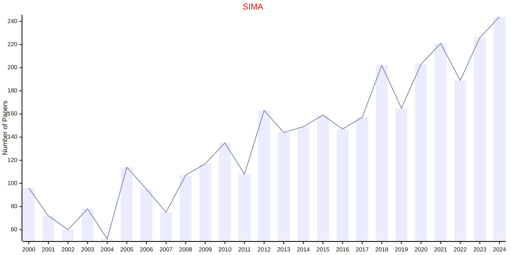

## SIMAX

|Publishers|Full/Homepage|Abbr/About|Acronym/Issues|Period/DBLP|Top/Early|CCF|CAS|JCR|IF|Keywords/Google|
|-         |-            |-         |-             |-          |-        |-  |-  |-  |- |-              |
|[SIAM](https://epubs.siam.org)|[SIAM Journal on Matrix Analysis and Applications](https://epubs.siam.org/journal/sjmael)|[SIAM J. Matrix Anal. Appl.](https://epubs.siam.org/journal/simax/about)|[SIMAX](https://epubs.siam.org/loi/sjmael)|1980 -|False||2|Q2|2.0|[Matrix Analysis](https://www.google.com/search?q=Matrix+Analysis)|

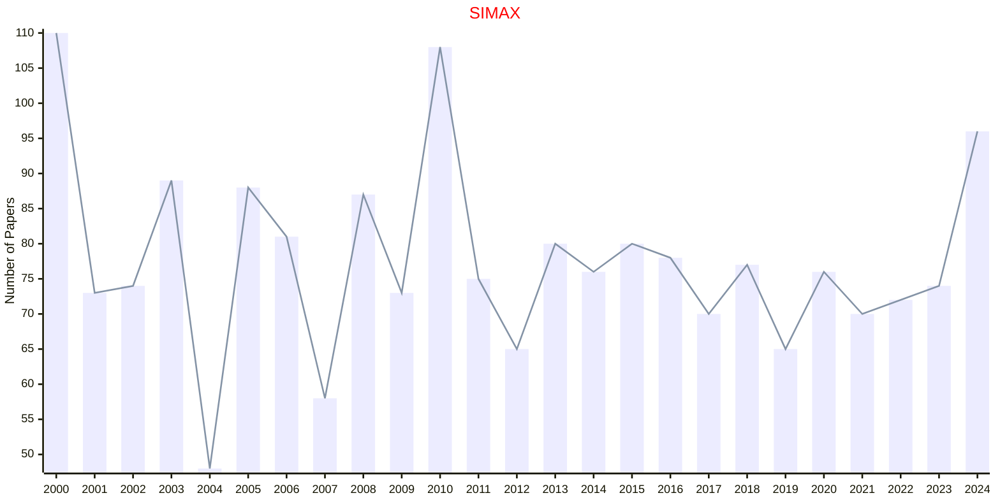

## SIMODS

|Publishers|Full/Homepage|Abbr/About|Acronym/Issues|Period/DBLP|Top/Early|CCF|CAS|JCR|IF|Keywords/Google|
|-         |-            |-         |-             |-          |-        |-  |-  |-  |- |-              |
|[SIAM](https://epubs.siam.org)|[SIAM Journal on Mathematics of Data Science](https://epubs.siam.org/journal/sjmdaq)|[SIAM J. Math. Data Sci.](https://epubs.siam.org/journal/simods/about)|[SIMODS](https://epubs.siam.org/loi/sjmdaq)|2019 -|False||3|Q1|3.5|[Data Science](https://www.google.com/search?q=Data+Science)|

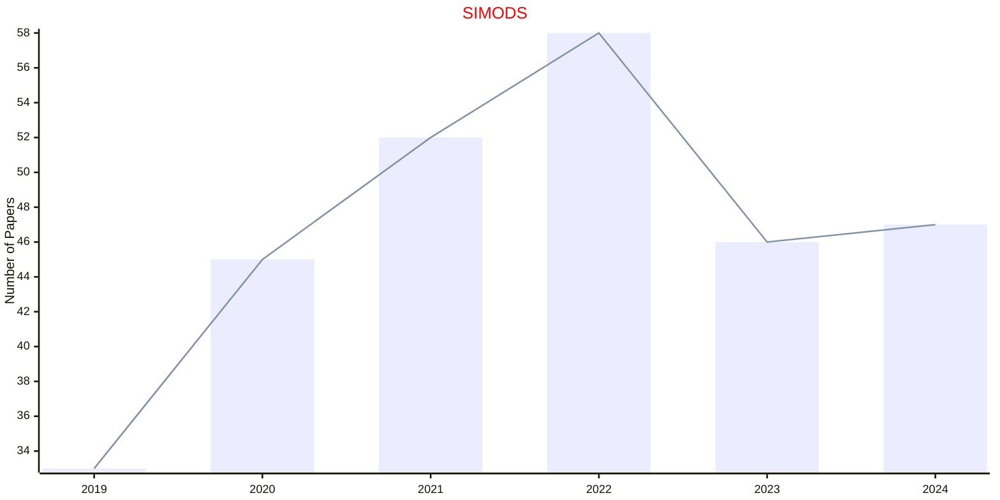

## SINUM

|Publishers|Full/Homepage|Abbr/About|Acronym/Issues|Period/DBLP|Top/Early|CCF|CAS|JCR|IF|Keywords/Google|
|-         |-            |-         |-             |-          |-        |-  |-  |-  |- |-              |
|[SIAM](https://epubs.siam.org)|[SIAM Journal on Numerical Analysis](https://epubs.siam.org/journal/sjnaam)|[SIAM J. Numer. Anal.](https://epubs.siam.org/journal/sinum/about)|[SINUM](https://epubs.siam.org/loi/sjnaam)|1964 -|True||1|Q1|3.4|[Computational Mathematics](https://www.google.com/search?q=Computational+Mathematics)|

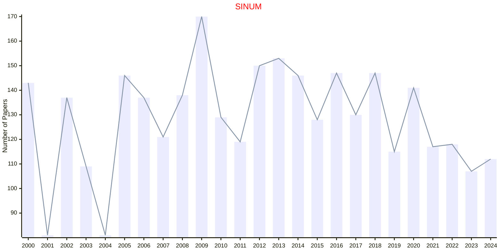

## SIOPT

|Publishers|Full/Homepage|Abbr/About|Acronym/Issues|Period/DBLP|Top/Early|CCF|CAS|JCR|IF|Keywords/Google|
|-         |-            |-         |-             |-          |-        |-  |-  |-  |- |-              |
|[SIAM](https://epubs.siam.org)|[SIAM Journal on Optimization](https://epubs.siam.org/journal/sjope8)|[SIAM J. Optim.](https://epubs.siam.org/journal/siopt/about)|[SIOPT](https://epubs.siam.org/loi/sjope8)|1991 -|True||2|Q1|3.1|[Optimization](https://www.google.com/search?q=Optimization)|

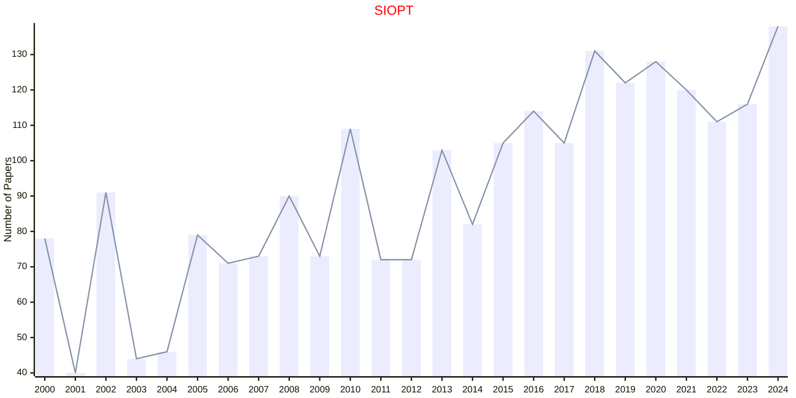

## SIREV

|Publishers|Full/Homepage|Abbr/About|Acronym/Issues|Period/DBLP|Top/Early|CCF|CAS|JCR|IF|Keywords/Google|
|-         |-            |-         |-             |-          |-        |-  |-  |-  |- |-              |
|[SIAM](https://epubs.siam.org)|[SIAM Review](https://epubs.siam.org/journal/siread)|[SIAM Rev.](https://epubs.siam.org/journal/sirev/about)|[SIREV](https://epubs.siam.org/loi/siread)|1959 -|True||1|Q1|11.1|[Mathematics](https://www.google.com/search?q=Mathematics); [Review](https://www.google.com/search?q=Review)|

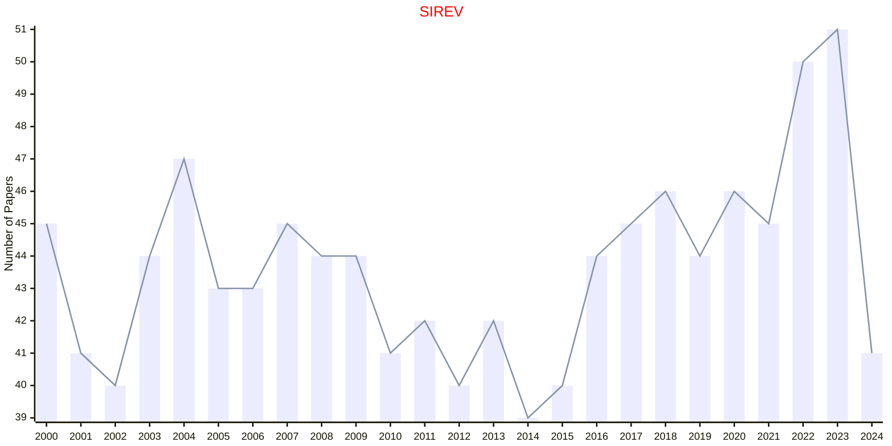

## SISC

|Publishers|Full/Homepage|Abbr/About|Acronym/Issues|Period/DBLP|Top/Early|CCF|CAS|JCR|IF|Keywords/Google|
|-         |-            |-         |-             |-          |-        |-  |-  |-  |- |-              |
|[SIAM](https://epubs.siam.org)|[SIAM Journal on Scientific Computing](https://epubs.siam.org/journal/sjoce3)|[SIAM J. Sci. Comput.](https://epubs.siam.org/journal/sisc/about)|[SISC](https://epubs.siam.org/loi/sjoce3)|1980 -|True||2|Q1|3.7|[Computational Mathematics](https://www.google.com/search?q=Computational+Mathematics)|

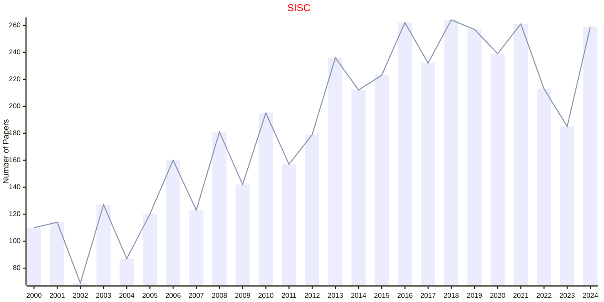

## TVP

|Publishers|Full/Homepage|Abbr/About|Acronym/Issues|Period/DBLP|Top/Early|CCF|CAS|JCR|IF|Keywords/Google|
|-         |-            |-         |-             |-          |-        |-  |-  |-  |- |-              |
|[SIAM](https://epubs.siam.org)|[Theory of Probability and Its Applications](https://epubs.siam.org/journal/tprbau)|[Theory Probab. Appl.](https://epubs.siam.org/journal/tvp/about)|[TVP](https://epubs.siam.org/loi/tprbau)|1956 -|False||4|Q4|0.5|[Applied Probability](https://www.google.com/search?q=Applied+Probability)|

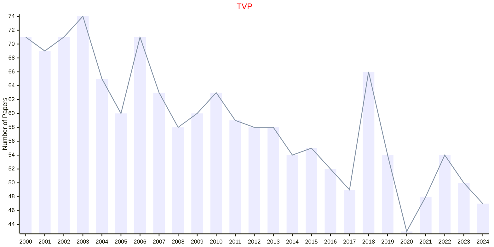

