# SPRINGER

- The data for TOP, CCF, CAS, JCR, and IF are sourced from [easyScholar](https://www.easyscholar.cc/).

## AAMAS

|Publishers|Full/Homepage|Abbr/About|Acronym/Issues|Period/DBLP|Top/Early|CCF|CAS|JCR|IF|Keywords/Google|
|-         |-            |-         |-             |-          |-        |-  |-  |-  |- |-              |
|[SPRINGER](https://www.springer.com/)|[Autonomous Agents and Multi-Agent Systems](https://www.springer.com/journal/10458)|[Auton. Agent. Multi-Agent. Syst.](https://www.springer.com/journal/10458/aims-and-scope)|[AAMAS](https://link.springer.com/journal/10458/volumes-and-issues)|1998 -|False|B|3|Q2|2.6||

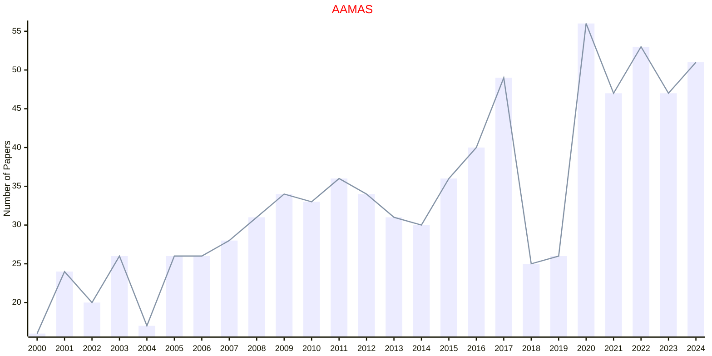

## AIL

|Publishers|Full/Homepage|Abbr/About|Acronym/Issues|Period/DBLP|Top/Early|CCF|CAS|JCR|IF|Keywords/Google|
|-         |-            |-         |-             |-          |-        |-  |-  |-  |- |-              |
|[SPRINGER](https://www.springer.com/)|[Artificial Intelligence and Law](https://www.springer.com/journal/10506)|[Artif. Intell. Law](https://www.springer.com/journal/10506/aims-and-scope)|[AIL](https://link.springer.com/journal/10506/volumes-and-issues)|1992 -|False||2|Q2|3.6|[Law](https://www.google.com/search?q=Law)|

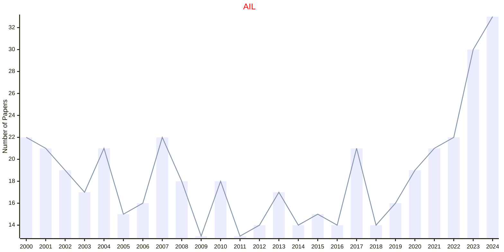

## AIR

|Publishers|Full/Homepage|Abbr/About|Acronym/Issues|Period/DBLP|Top/Early|CCF|CAS|JCR|IF|Keywords/Google|
|-         |-            |-         |-             |-          |-        |-  |-  |-  |- |-              |
|[SPRINGER](https://www.springer.com/)|[Artificial Intelligence Review](https://www.springer.com/journal/10462)|[Artif. Intell. Rev.](https://www.springer.com/journal/10462/aims-and-scope)|[AIR](https://link.springer.com/journal/10462/volumes-and-issues)|1987 -|True||1|Q1|14.9|[Artificial Intelligence](https://www.google.com/search?q=Artificial+Intelligence); [Review](https://www.google.com/search?q=Review)|

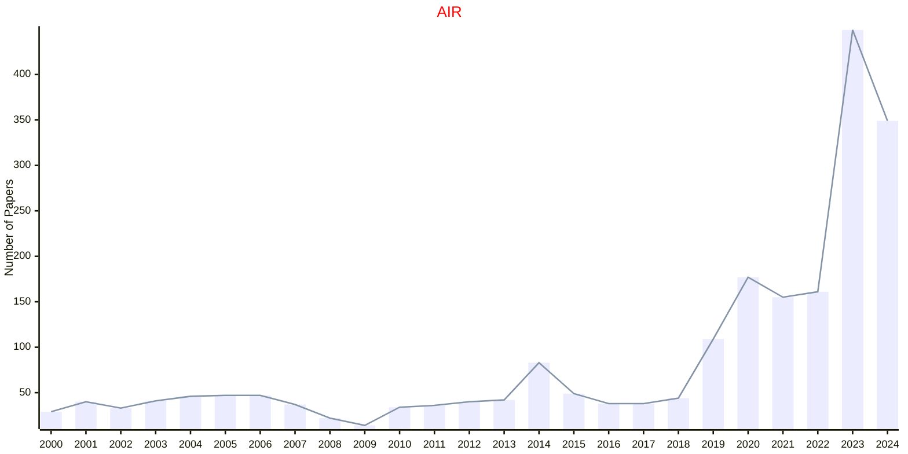

## AISM

|Publishers|Full/Homepage|Abbr/About|Acronym/Issues|Period/DBLP|Top/Early|CCF|CAS|JCR|IF|Keywords/Google|
|-         |-            |-         |-             |-          |-        |-  |-  |-  |- |-              |
|[SPRINGER](https://www.springer.com/)|[Annals of the Institute of Statistical Mathematics](https://www.springer.com/journal/10463)|[Ann. Inst. Stat. Math.](https://www.springer.com/journal/10463/aims-and-scope)|[AISM](https://link.springer.com/journal/10463/volumes-and-issues)|1949 -|False||4|Q4|1.0|[Statistics](https://www.google.com/search?q=Statistics)|

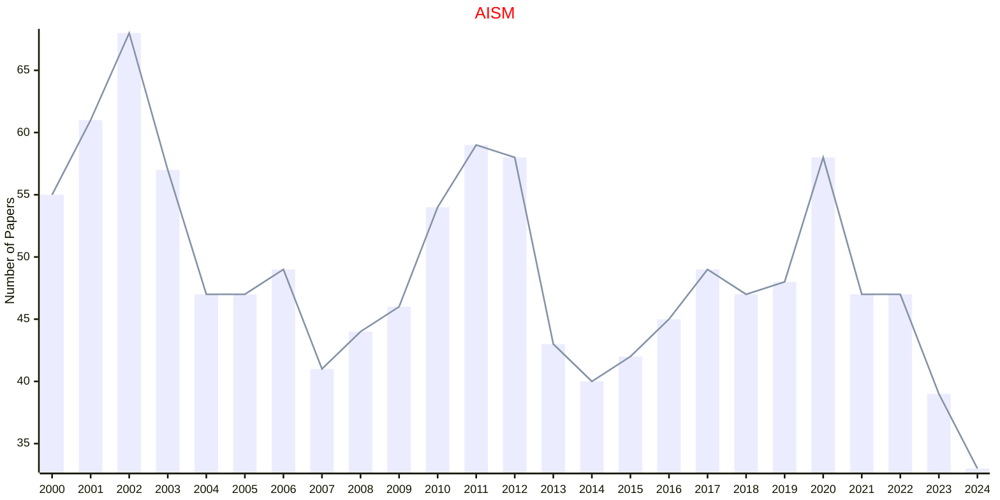

## AMAI

|Publishers|Full/Homepage|Abbr/About|Acronym/Issues|Period/DBLP|Top/Early|CCF|CAS|JCR|IF|Keywords/Google|
|-         |-            |-         |-             |-          |-        |-  |-  |-  |- |-              |
|[SPRINGER](https://www.springer.com/)|[Annals of Mathematics and Artificial Intelligence](https://www.springer.com/journal/10472)|[Ann. Math. Artif. Intell.](https://www.springer.com/journal/10472/aims-and-scope)|[AMAI](https://link.springer.com/journal/10472/volumes-and-issues)|1990 -|False||4|Q3|1.1|[Artificial Intelligence](https://www.google.com/search?q=Artificial+Intelligence)|

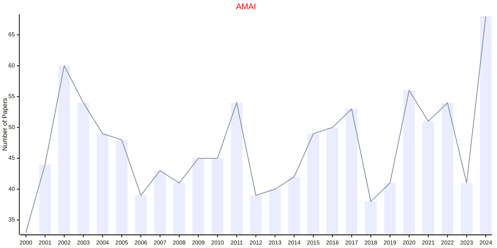

## APIN

|Publishers|Full/Homepage|Abbr/About|Acronym/Issues|Period/DBLP|Top/Early|CCF|CAS|JCR|IF|Keywords/Google|
|-         |-            |-         |-             |-          |-        |-  |-  |-  |- |-              |
|[SPRINGER](https://www.springer.com/)|[Applied Intelligence](https://link.springer.com/journal/10489)|[Appl. Intell.](https://link.springer.com/journal/10489/aims-and-scope)|[APIN](https://link.springer.com/journal/10489/volumes-and-issues)|1991 -|False|C|3|Q2|3.8||

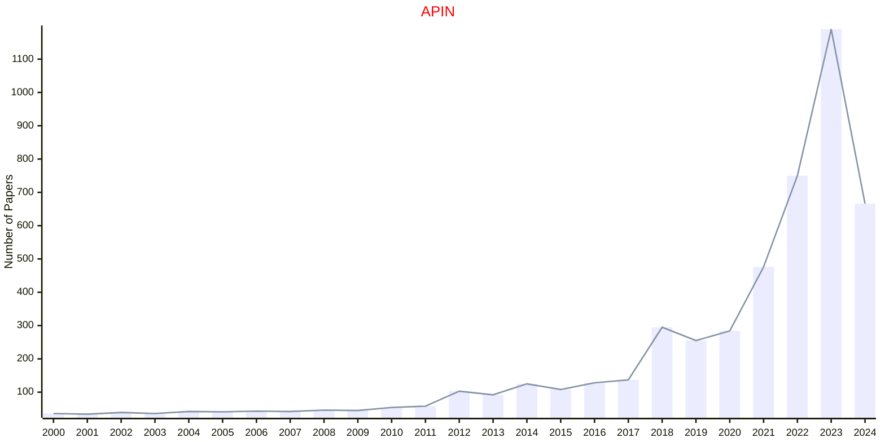

## AR

|Publishers|Full/Homepage|Abbr/About|Acronym/Issues|Period/DBLP|Top/Early|CCF|CAS|JCR|IF|Keywords/Google|
|-         |-            |-         |-             |-          |-        |-  |-  |-  |- |-              |
|[SPRINGER](https://www.springer.com/)|[Autonomous Robots](https://www.springer.com/journal/10514)|[Auton. Robot.](https://www.springer.com/journal/10514/aims-and-scope)|[AR](https://link.springer.com/journal/10514/volumes-and-issues)|1994 -|False||3|Q2|3.9|[Control and Automation](https://www.google.com/search?q=Control+and+Automation); [Robotics and UAV](https://www.google.com/search?q=Robotics+and+UAV)|

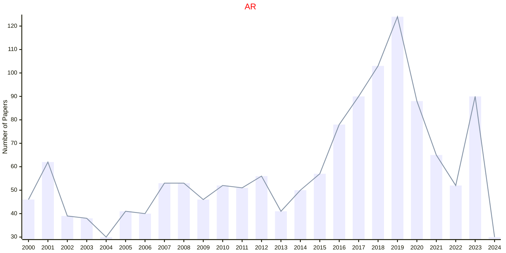

## Alg

|Publishers|Full/Homepage|Abbr/About|Acronym/Issues|Period/DBLP|Top/Early|CCF|CAS|JCR|IF|Keywords/Google|
|-         |-            |-         |-             |-          |-        |-  |-  |-  |- |-              |
|[SPRINGER](https://www.springer.com/)|[Algorithmica](https://www.springer.com/journal/453)|[Algorithmica](https://www.springer.com/journal/453/aims-and-scope)|[Alg](https://link.springer.com/journal/453/volumes-and-issues)|1986 -|False|B|4|Q3|0.9||

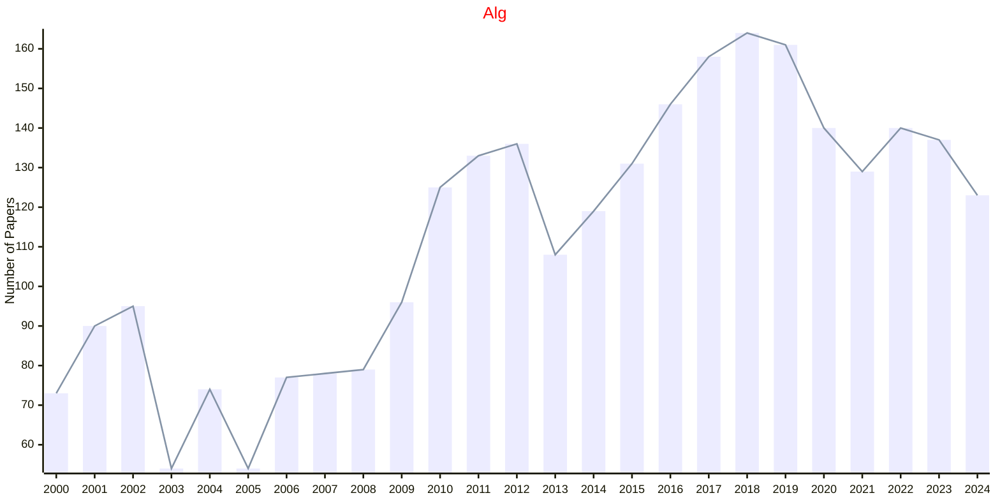

## BCYB

|Publishers|Full/Homepage|Abbr/About|Acronym/Issues|Period/DBLP|Top/Early|CCF|CAS|JCR|IF|Keywords/Google|
|-         |-            |-         |-             |-          |-        |-  |-  |-  |- |-              |
|[SPRINGER](https://www.springer.com/)|[Biological Cybernetics](https://www.springer.com/journal/422)|[Biol. Cybern.](https://www.springer.com/journal/422/aims-and-scope)|[BCYB](https://link.springer.com/journal/422/volumes-and-issues)|1961 -|False||4|Q3|2.1|[Cybernetics](https://www.google.com/search?q=Cybernetics)|

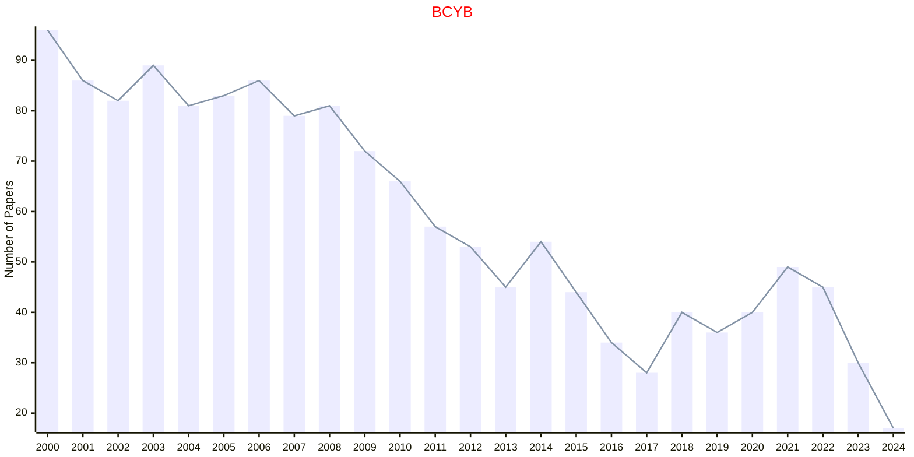

## CC

|Publishers|Full/Homepage|Abbr/About|Acronym/Issues|Period/DBLP|Top/Early|CCF|CAS|JCR|IF|Keywords/Google|
|-         |-            |-         |-             |-          |-        |-  |-  |-  |- |-              |
|[SPRINGER](https://www.springer.com/)|[Cognitive Computation](https://www.springer.com/journal/12559)|[Cogn. Comput.](https://www.springer.com/journal/12559/aims-and-scope)|[CC](https://link.springer.com/journal/12559/volumes-and-issues)|2009 -|False||3|Q1|4.1|[Cognitive Computation](https://www.google.com/search?q=Cognitive+Computation)|

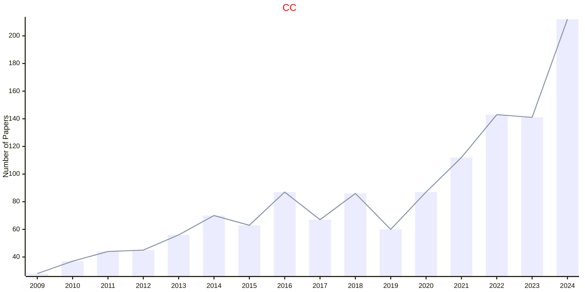

## CIS

|Publishers|Full/Homepage|Abbr/About|Acronym/Issues|Period/DBLP|Top/Early|CCF|CAS|JCR|IF|Keywords/Google|
|-         |-            |-         |-             |-          |-        |-  |-  |-  |- |-              |
|[SPRINGER](https://www.springer.com/)|[Complex & Intelligent Systems](https://www.springer.com/journal/40747)|[Complex Intell. Syst.](https://www.springer.com/journal/40747/aims-and-scope)|[CIS](https://link.springer.com/journal/40747/volumes-and-issues)|2015 -|False||3|Q2|5.1|[Intelligent Systems](https://www.google.com/search?q=Intelligent+Systems)|

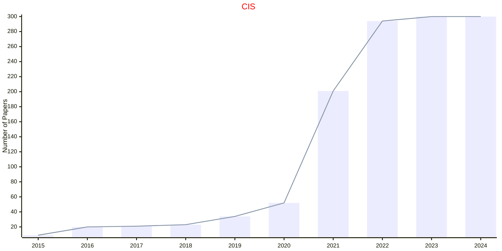

## CMS

|Publishers|Full/Homepage|Abbr/About|Acronym/Issues|Period/DBLP|Top/Early|CCF|CAS|JCR|IF|Keywords/Google|
|-         |-            |-         |-             |-          |-        |-  |-  |-  |- |-              |
|[SPRINGER](https://www.springer.com/)|[Communications in Mathematics and Statistics](https://link.springer.com/journal/40304)|[Commun. Math. Stat.](https://link.springer.com/journal/40304/aims-and-scope)|[CMS](https://link.springer.com/journal/40304/volumes-and-issues)|2013 -|False||3|Q2|1.0|[Statistics](https://www.google.com/search?q=Statistics)|

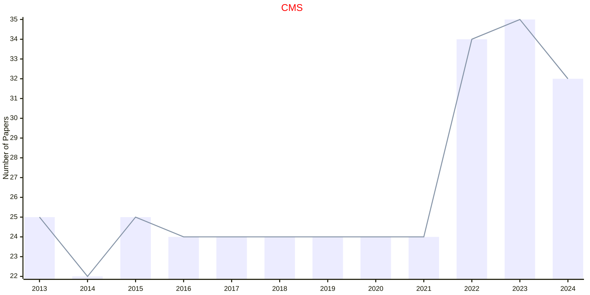

## COAP

|Publishers|Full/Homepage|Abbr/About|Acronym/Issues|Period/DBLP|Top/Early|CCF|CAS|JCR|IF|Keywords/Google|
|-         |-            |-         |-             |-          |-        |-  |-  |-  |- |-              |
|[SPRINGER](https://www.springer.com/)|[Computational Optimization and Applications](https://www.springer.com/journal/10589)|[Comput. Optim. Appl.](https://www.springer.com/journal/10589/aims-and-scope)|[COAP](https://link.springer.com/journal/10589/volumes-and-issues)|1993 -|False||3|Q1|2.2|[Optimization](https://www.google.com/search?q=Optimization)|

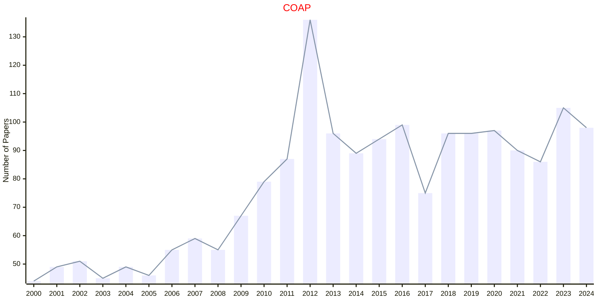

## CSTAT

|Publishers|Full/Homepage|Abbr/About|Acronym/Issues|Period/DBLP|Top/Early|CCF|CAS|JCR|IF|Keywords/Google|
|-         |-            |-         |-             |-          |-        |-  |-  |-  |- |-              |
|[SPRINGER](https://www.springer.com/)|[Computational Statistics](https://link.springer.com/journal/180)|[Comput. Stat.](https://www.springer.com/journal/180/aims-and-scope)|[CSTAT](https://link.springer.com/journal/180/volumes-and-issues)|1999 -|False||4|Q2|1.6|[Computational Statistics](https://www.google.com/search?q=Computational+Statistics)|

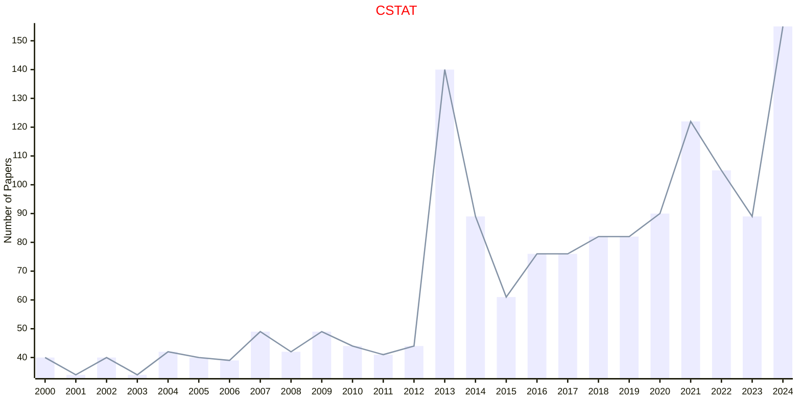

## Constr

|Publishers|Full/Homepage|Abbr/About|Acronym/Issues|Period/DBLP|Top/Early|CCF|CAS|JCR|IF|Keywords/Google|
|-         |-            |-         |-             |-          |-        |-  |-  |-  |- |-              |
|[SPRINGER](https://www.springer.com/)|[Constraints](https://www.springer.com/journal/10601)|[Constraints](https://www.springer.com/journal/10601/aims-and-scope)|[Constr](https://link.springer.com/journal/10601/volumes-and-issues)|1996 -|False||4|Q3|1.3|[Constraint Optimization](https://www.google.com/search?q=Constraint+Optimization); [Constraint Programming](https://www.google.com/search?q=Constraint+Programming)|

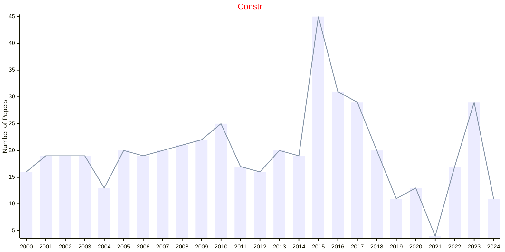

## DMKD

|Publishers|Full/Homepage|Abbr/About|Acronym/Issues|Period/DBLP|Top/Early|CCF|CAS|JCR|IF|Keywords/Google|
|-         |-            |-         |-             |-          |-        |-  |-  |-  |- |-              |
|[SPRINGER](https://www.springer.com/)|[Data Mining and Knowledge Discovery](https://www.springer.com/journal/10618)|[Data Mining Knowl. Discov.](https://www.springer.com/journal/10618/aims-and-scope)|[DMKD](https://link.springer.com/journal/10618/volumes-and-issues)|1997 -|False|B|3|Q2|6.4|[Data and Knowledge](https://www.google.com/search?q=Data+and+Knowledge)|

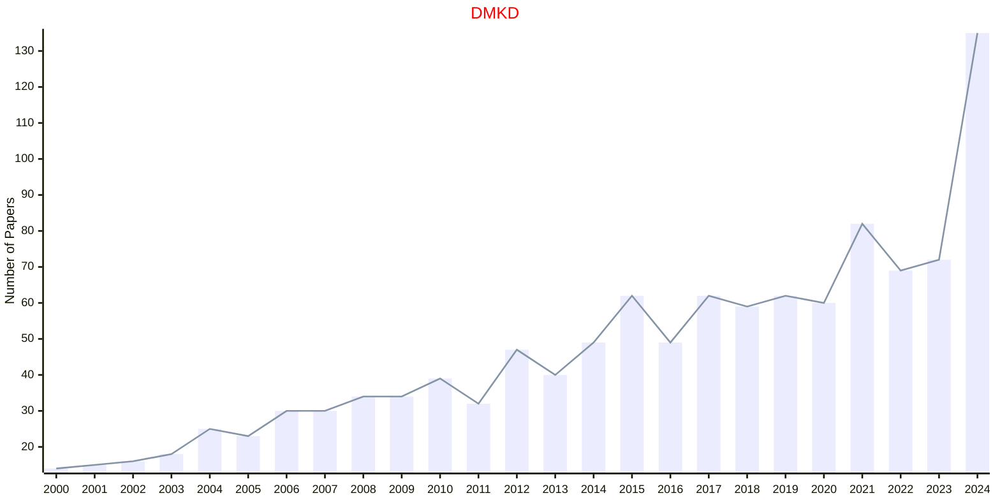

## EI

|Publishers|Full/Homepage|Abbr/About|Acronym/Issues|Period/DBLP|Top/Early|CCF|CAS|JCR|IF|Keywords/Google|
|-         |-            |-         |-             |-          |-        |-  |-  |-  |- |-              |
|[SPRINGER](https://www.springer.com/)|[Evolutionary Intelligence](https://www.springer.com/journal/12065)|[Evol. Intell.](https://www.springer.com/journal/12065/aims-and-scope)|[EI](https://link.springer.com/journal/12065/volumes-and-issues)|2008 -|False||4||2.6|[Evolutionary Computation](https://www.google.com/search?q=Evolutionary+Computation)|

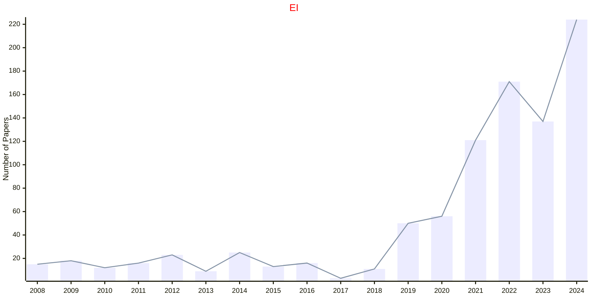

## EVOLS

|Publishers|Full/Homepage|Abbr/About|Acronym/Issues|Period/DBLP|Top/Early|CCF|CAS|JCR|IF|Keywords/Google|
|-         |-            |-         |-             |-          |-        |-  |-  |-  |- |-              |
|[SPRINGER](https://www.springer.com/)|[Evolving Systems](https://link.springer.com/journal/12530)|[Evol. Syst.](https://www.springer.com/journal/12530/aims-and-scope)|[EVOLS](https://link.springer.com/journal/12530/volumes-and-issues)|2010 -|False||4|Q3|2.8||

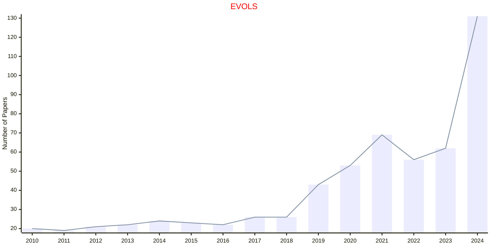

## FODM

|Publishers|Full/Homepage|Abbr/About|Acronym/Issues|Period/DBLP|Top/Early|CCF|CAS|JCR|IF|Keywords/Google|
|-         |-            |-         |-             |-          |-        |-  |-  |-  |- |-              |
|[SPRINGER](https://www.springer.com/)|[Fuzzy Optimization and Decision Making](https://www.springer.com/journal/10700)|[Fuzzy Optim. Decis. Mak.](https://www.springer.com/journal/10700/aims-and-scope)|[FODM](https://link.springer.com/journal/10700/volumes-and-issues)|2002 -|False||3|Q1|4.9|[Fuzzy and Uncertainty](https://www.google.com/search?q=Fuzzy+and+Uncertainty)|

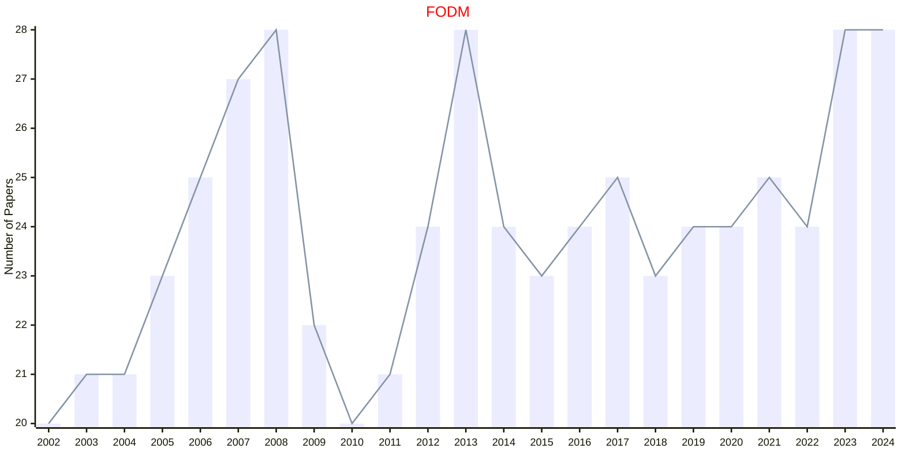

## FoCM

|Publishers|Full/Homepage|Abbr/About|Acronym/Issues|Period/DBLP|Top/Early|CCF|CAS|JCR|IF|Keywords/Google|
|-         |-            |-         |-             |-          |-        |-  |-  |-  |- |-              |
|[SPRINGER](https://www.springer.com/)|[Foundations of Computational Mathematics](https://www.springer.com/journal/10208)|[Found. Comput. Math.](https://www.springer.com/journal/10208/aims-and-scope)|[FoCM](https://link.springer.com/journal/10208/volumes-and-issues)|2001 -|True||1|Q1|3.3|[Computational Mathematics](https://www.google.com/search?q=Computational+Mathematics)|

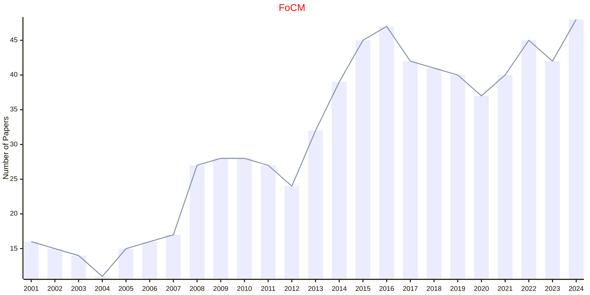

## GPEM

|Publishers|Full/Homepage|Abbr/About|Acronym/Issues|Period/DBLP|Top/Early|CCF|CAS|JCR|IF|Keywords/Google|
|-         |-            |-         |-             |-          |-        |-  |-  |-  |- |-              |
|[SPRINGER](https://www.springer.com/)|[Genetic Programming and Evolvable Machines](https://www.springer.com/journal/10710)|[Genet. Program. Evol. Mach.](https://www.springer.com/journal/10710/aims-and-scope)|[GPEM](https://link.springer.com/journal/10710/volumes-and-issues)|2000 -|False||4|Q3|2.2|[Evolutionary Computation](https://www.google.com/search?q=Evolutionary+Computation)|

```mermaid
---
config:
    xyChart:
        width: 1200
        height: 600
    themeVariables:
        xyChart:
            titleColor: "#ff0000"
---
xychart-beta
    title "GPEM"
    x-axis [2000, 2001, 2002, 2003, 2004, 2005, 2006, 2007, 2008, 2009, 2010, 2011, 2012, 2013, 2014, 2015, 2016, 2017, 2018, 2019, 2020, 2021, 2022, 2023, 2024]
    y-axis "Number of Papers"
    bar [19, 24, 22, 23, 26, 27, 25, 27, 25, 22, 22, 31, 24, 24, 32, 24, 25, 32, 27, 24, 33, 27, 29, 26, 24]
    line [19, 24, 22, 23, 26, 27, 25, 27, 25, 22, 22, 31, 24, 24, 32, 24, 25, 32, 27, 24, 33, 27, 29, 26, 24]
```

## IJCIS

|Publishers|Full/Homepage|Abbr/About|Acronym/Issues|Period/DBLP|Top/Early|CCF|CAS|JCR|IF|Keywords/Google|
|-         |-            |-         |-             |-          |-        |-  |-  |-  |- |-              |
|[SPRINGER](https://www.springer.com/)|[International Journal of Computational Intelligence Systems](https://www.springer.com/journal/44196)|[Int. J. Comput. Intell. Syst.](https://www.springer.com/journal/44196/aims-and-scope)|[IJCIS](https://link.springer.com/journal/44196/volumes-and-issues)|2008 -|False||4|Q2|2.2|[Intelligent Systems](https://www.google.com/search?q=Intelligent+Systems)|

```mermaid
---
config:
    xyChart:
        width: 1200
        height: 600
    themeVariables:
        xyChart:
            titleColor: "#ff0000"
---
xychart-beta
    title "IJCIS"
    x-axis [2008, 2009, 2010, 2011, 2012, 2013, 2014, 2015, 2016, 2017, 2018, 2019, 2020, 2021, 2022, 2023, 2024]
    y-axis "Number of Papers"
    bar [33, 37, 86, 137, 92, 93, 117, 101, 90, 50, 87, 50, 50, 50, 50, 50, 116]
    line [33, 37, 86, 137, 92, 93, 117, 101, 90, 50, 87, 50, 50, 50, 50, 50, 116]
```

## IJCV

|Publishers|Full/Homepage|Abbr/About|Acronym/Issues|Period/DBLP|Top/Early|CCF|CAS|JCR|IF|Keywords/Google|
|-         |-            |-         |-             |-          |-        |-  |-  |-  |- |-              |
|[SPRINGER](https://www.springer.com/)|[International Journal of Computer Vision](https://www.springer.com/journal/11263)|[Int. J. Comput. Vis.](https://www.springer.com/journal/11263/aims-and-scope)|[IJCV](https://link.springer.com/journal/11263/volumes-and-issues)|1988 -|False|A|2|Q1|15.5|[Computer Vision](https://www.google.com/search?q=Computer+Vision)|

```mermaid
---
config:
    xyChart:
        width: 1200
        height: 600
    themeVariables:
        xyChart:
            titleColor: "#ff0000"
---
xychart-beta
    title "IJCV"
    x-axis [2000, 2001, 2002, 2003, 2004, 2005, 2006, 2007, 2008, 2009, 2010, 2011, 2012, 2013, 2014, 2015, 2016, 2017, 2018, 2019, 2020, 2021, 2022, 2023, 2024]
    y-axis "Number of Papers"
    bar [71, 56, 78, 52, 67, 72, 95, 96, 96, 96, 103, 100, 94, 95, 95, 93, 90, 104, 77, 94, 157, 168, 155, 174, 300]
    line [71, 56, 78, 52, 67, 72, 95, 96, 96, 96, 103, 100, 94, 95, 95, 93, 90, 104, 77, 94, 157, 168, 155, 174, 300]
```

## IJDAR

|Publishers|Full/Homepage|Abbr/About|Acronym/Issues|Period/DBLP|Top/Early|CCF|CAS|JCR|IF|Keywords/Google|
|-         |-            |-         |-             |-          |-        |-  |-  |-  |- |-              |
|[SPRINGER](https://www.springer.com/)|[International Journal on Document Analysis and Recognition](https://www.springer.com/journal/10032)|[Int. J. Doc. Anal. Recognit.](https://www.springer.com/journal/10032/aims-and-scope)|[IJDAR](https://link.springer.com/journal/10032/volumes-and-issues)|1998 -|False|C|3|Q3|2.7||

```mermaid
---
config:
    xyChart:
        width: 1200
        height: 600
    themeVariables:
        xyChart:
            titleColor: "#ff0000"
---
xychart-beta
    title "IJDAR"
    x-axis [2000, 2001, 2002, 2003, 2004, 2005, 2006, 2007, 2008, 2009, 2010, 2011, 2012, 2013, 2014, 2015, 2016, 2017, 2018, 2019, 2020, 2021, 2022, 2023, 2024]
    y-axis "Number of Papers"
    bar [21, 26, 19, 38, 6, 16, 21, 40, 12, 23, 22, 32, 20, 26, 27, 25, 23, 16, 20, 29, 18, 25, 29, 29, 44]
    line [21, 26, 19, 38, 6, 16, 21, 40, 12, 23, 22, 32, 20, 26, 27, 25, 23, 16, 20, 29, 18, 25, 29, 29, 44]
```

## IJFS

|Publishers|Full/Homepage|Abbr/About|Acronym/Issues|Period/DBLP|Top/Early|CCF|CAS|JCR|IF|Keywords/Google|
|-         |-            |-         |-             |-          |-        |-  |-  |-  |- |-              |
|[SPRINGER](https://www.springer.com/)|[International Journal of Fuzzy Systems](https://www.springer.com/journal/40815)|[Int. J. Fuzzy Syst.](https://www.springer.com/journal/40815/aims-and-scope)|[IJFS](https://link.springer.com/journal/40815/volumes-and-issues)|2015 -|False||4|Q2|3.1|[Fuzzy and Uncertainty](https://www.google.com/search?q=Fuzzy+and+Uncertainty)|

```mermaid
---
config:
    xyChart:
        width: 1200
        height: 600
    themeVariables:
        xyChart:
            titleColor: "#ff0000"
---
xychart-beta
    title "IJFS"
    x-axis [2015, 2016, 2017, 2018, 2019, 2020, 2021, 2022, 2023, 2024]
    y-axis "Number of Papers"
    bar [58, 100, 152, 194, 197, 190, 169, 234, 205, 168]
    line [58, 100, 152, 194, 197, 190, 169, 234, 205, 168]
```

## IJMIR

|Publishers|Full/Homepage|Abbr/About|Acronym/Issues|Period/DBLP|Top/Early|CCF|CAS|JCR|IF|Keywords/Google|
|-         |-            |-         |-             |-          |-        |-  |-  |-  |- |-              |
|[SPRINGER](https://www.springer.com/)|[International Journal of Multimedia Information Retrieval](https://www.springer.com/journal/13735)|[Int. J. Multimed. Inf. Retr.](https://www.springer.com/journal/13735/aims-and-scope)|[IJMIR](https://link.springer.com/journal/13735/volumes-and-issues)|2012 -|False||4|Q2|4.3||

```mermaid
---
config:
    xyChart:
        width: 1200
        height: 600
    themeVariables:
        xyChart:
            titleColor: "#ff0000"
---
xychart-beta
    title "IJMIR"
    x-axis [2012, 2013, 2014, 2015, 2016, 2017, 2018, 2019, 2020, 2021, 2022, 2023, 2024]
    y-axis "Number of Papers"
    bar [20, 23, 21, 23, 24, 23, 21, 21, 21, 20, 44, 42, 41]
    line [20, 23, 21, 23, 24, 23, 21, 21, 21, 20, 44, 42, 41]
```

## IJMLC

|Publishers|Full/Homepage|Abbr/About|Acronym/Issues|Period/DBLP|Top/Early|CCF|CAS|JCR|IF|Keywords/Google|
|-         |-            |-         |-             |-          |-        |-  |-  |-  |- |-              |
|[SPRINGER](https://www.springer.com/)|[International Journal of Machine Learning and Cybernetics](https://www.springer.com/journal/13042)|[Int. J. Mach. Learn. Cybern.](https://www.springer.com/journal/13042/aims-and-scope)|[IJMLC](https://link.springer.com/journal/13042/volumes-and-issues)|2010 -|False||4|Q3|3.3|[Ambient Intelligence](https://www.google.com/search?q=Ambient+Intelligence); [Cybernetics](https://www.google.com/search?q=Cybernetics)|

```mermaid
---
config:
    xyChart:
        width: 1200
        height: 600
    themeVariables:
        xyChart:
            titleColor: "#ff0000"
---
xychart-beta
    title "IJMLC"
    x-axis [2010, 2011, 2012, 2013, 2014, 2015, 2016, 2017, 2018, 2019, 2020, 2021, 2022, 2023, 2024]
    y-axis "Number of Papers"
    bar [8, 27, 32, 66, 81, 84, 90, 156, 160, 257, 177, 219, 246, 273, 353]
    line [8, 27, 32, 66, 81, 84, 90, 156, 160, 257, 177, 219, 246, 273, 353]
```

## INVENT

|Publishers|Full/Homepage|Abbr/About|Acronym/Issues|Period/DBLP|Top/Early|CCF|CAS|JCR|IF|Keywords/Google|
|-         |-            |-         |-             |-          |-        |-  |-  |-  |- |-              |
|[SPRINGER](https://www.springer.com/)|[Inventiones Mathematicae](https://www.springer.com/journal/222)|[Invent. Math.](https://www.springer.com/journal/222/aims-and-scope)|[INVENT](https://link.springer.com/journal/222/volumes-and-issues)|1966 -|True||1|Q1|3.8||

```mermaid
---
config:
    xyChart:
        width: 1200
        height: 600
    themeVariables:
        xyChart:
            titleColor: "#ff0000"
---
xychart-beta
    title "INVENT"
    x-axis [2000, 2001, 2002, 2003, 2004, 2005, 2006, 2007, 2008, 2009, 2010, 2011, 2012, 2013, 2014, 2015, 2016, 2017, 2018, 2019, 2020, 2021, 2022, 2023, 2024]
    y-axis "Number of Papers"
    bar [75, 74, 70, 67, 70, 71, 70, 67, 71, 66, 63, 53, 64, 62, 57, 80, 76, 76, 74, 78, 76, 74, 78, 74, 79]
    line [75, 74, 70, 67, 70, 71, 70, 67, 71, 66, 63, 53, 64, 62, 57, 80, 76, 76, 74, 78, 76, 74, 78, 74, 79]
```

## JAMC

|Publishers|Full/Homepage|Abbr/About|Acronym/Issues|Period/DBLP|Top/Early|CCF|CAS|JCR|IF|Keywords/Google|
|-         |-            |-         |-             |-          |-        |-  |-  |-  |- |-              |
|[SPRINGER](https://www.springer.com/)|[Journal of Applied Mathematics and Computing](https://www.springer.com/journal/12190)|[J. Appl. Math. Comput.](https://www.springer.com/journal/12190/aims-and-scope)|[JAMC](https://link.springer.com/journal/12190/volumes-and-issues)|1994 -|False||2|Q1|2.5||

```mermaid
---
config:
    xyChart:
        width: 1200
        height: 600
    themeVariables:
        xyChart:
            titleColor: "#ff0000"
---
xychart-beta
    title "JAMC"
    x-axis [2000, 2001, 2002, 2003, 2004, 2005, 2006, 2007, 2008, 2009, 2010, 2011, 2012, 2013, 2014, 2015, 2016, 2017, 2018, 2019, 2020, 2021, 2022, 2023, 2024]
    y-axis "Number of Papers"
    bar [49, 52, 60, 68, 78, 99, 140, 104, 107, 117, 103, 122, 125, 92, 79, 97, 100, 104, 106, 105, 110, 128, 212, 211, 263]
    line [49, 52, 60, 68, 78, 99, 140, 104, 107, 117, 103, 122, 125, 92, 79, 97, 100, 104, 106, 105, 110, 128, 212, 211, 263]
```

## JAR

|Publishers|Full/Homepage|Abbr/About|Acronym/Issues|Period/DBLP|Top/Early|CCF|CAS|JCR|IF|Keywords/Google|
|-         |-            |-         |-             |-          |-        |-  |-  |-  |- |-              |
|[SPRINGER](https://www.springer.com/)|[Journal of Automated Reasoning](https://www.springer.com/journal/10817)|[J. Auto. Reasoning](https://www.springer.com/journal/10817/aims-and-scope)|[JAR](https://link.springer.com/journal/10817/volumes-and-issues)|1985 -|False|B|3|Q4|1.3||

```mermaid
---
config:
    xyChart:
        width: 1200
        height: 600
    themeVariables:
        xyChart:
            titleColor: "#ff0000"
---
xychart-beta
    title "JAR"
    x-axis [2000, 2001, 2002, 2003, 2004, 2005, 2006, 2007, 2008, 2009, 2010, 2011, 2012, 2013, 2014, 2015, 2016, 2017, 2018, 2019, 2020, 2021, 2022, 2023, 2024]
    y-axis "Number of Papers"
    bar [30, 37, 40, 35, 27, 32, 29, 32, 28, 27, 35, 32, 37, 37, 28, 30, 29, 35, 37, 62, 60, 37, 37, 40, 25]
    line [30, 37, 40, 35, 27, 32, 29, 32, 28, 27, 35, 32, 37, 37, 28, 30, 29, 35, 37, 62, 60, 37, 37, 40, 25]
```

## JCO

|Publishers|Full/Homepage|Abbr/About|Acronym/Issues|Period/DBLP|Top/Early|CCF|CAS|JCR|IF|Keywords/Google|
|-         |-            |-         |-             |-          |-        |-  |-  |-  |- |-              |
|[SPRINGER](https://www.springer.com/)|[Journal of Combinatorial Optimization](https://link.springer.com/journal/10878)|[J. Comb. Optim.](https://link.springer.com/journal/10878/aims-and-scope)|[JCO](https://link.springer.com/journal/10878/volumes-and-issues)|1997 -|False||4|Q2|1.1|[Combinatorial Optimization](https://www.google.com/search?q=Combinatorial+Optimization)|

```mermaid
---
config:
    xyChart:
        width: 1200
        height: 600
    themeVariables:
        xyChart:
            titleColor: "#ff0000"
---
xychart-beta
    title "JCO"
    x-axis [2000, 2001, 2002, 2003, 2004, 2005, 2006, 2007, 2008, 2009, 2010, 2011, 2012, 2013, 2014, 2015, 2016, 2017, 2018, 2019, 2020, 2021, 2022, 2023, 2024]
    y-axis "Number of Papers"
    bar [25, 30, 25, 26, 29, 50, 60, 66, 56, 51, 60, 88, 77, 106, 113, 129, 192, 172, 154, 147, 117, 107, 255, 164, 134]
    line [25, 30, 25, 26, 29, 50, 60, 66, 56, 51, 60, 88, 77, 106, 113, 129, 192, 172, 154, 147, 117, 107, 255, 164, 134]
```

## JGO

|Publishers|Full/Homepage|Abbr/About|Acronym/Issues|Period/DBLP|Top/Early|CCF|CAS|JCR|IF|Keywords/Google|
|-         |-            |-         |-             |-          |-        |-  |-  |-  |- |-              |
|[SPRINGER](https://www.springer.com/)|[Journal of Global Optimization](https://www.springer.com/journal/10898)|[J. Glob. Optim.](https://www.springer.com/journal/10898/aims-and-scope)|[JGO](https://link.springer.com/journal/10898/volumes-and-issues)|1991 -|False|B|4|Q2|2.1|[Optimization](https://www.google.com/search?q=Optimization)|

```mermaid
---
config:
    xyChart:
        width: 1200
        height: 600
    themeVariables:
        xyChart:
            titleColor: "#ff0000"
---
xychart-beta
    title "JGO"
    x-axis [2000, 2001, 2002, 2003, 2004, 2005, 2006, 2007, 2008, 2009, 2010, 2011, 2012, 2013, 2014, 2015, 2016, 2017, 2018, 2019, 2020, 2021, 2022, 2023, 2024]
    y-axis "Number of Papers"
    bar [80, 72, 70, 74, 82, 115, 104, 114, 134, 113, 127, 134, 149, 231, 128, 127, 120, 123, 130, 124, 121, 123, 128, 121, 119]
    line [80, 72, 70, 74, 82, 115, 104, 114, 134, 113, 127, 134, 149, 231, 128, 127, 120, 123, 130, 124, 121, 123, 128, 121, 119]
```

## JIIS

|Publishers|Full/Homepage|Abbr/About|Acronym/Issues|Period/DBLP|Top/Early|CCF|CAS|JCR|IF|Keywords/Google|
|-         |-            |-         |-             |-          |-        |-  |-  |-  |- |-              |
|[SPRINGER](https://www.springer.com/)|[Journal of Intelligent Information Systems](https://www.springer.com/journal/10844)|[J. Intell. Inf. Syst.](https://www.springer.com/journal/10844/aims-and-scope)|[JIIS](https://link.springer.com/journal/10844/volumes-and-issues)|1992 -|False|C|3|Q2|3.0|[Intelligent Systems](https://www.google.com/search?q=Intelligent+Systems)|

```mermaid
---
config:
    xyChart:
        width: 1200
        height: 600
    themeVariables:
        xyChart:
            titleColor: "#ff0000"
---
xychart-beta
    title "JIIS"
    x-axis [2000, 2001, 2002, 2003, 2004, 2005, 2006, 2007, 2008, 2009, 2010, 2011, 2012, 2013, 2014, 2015, 2016, 2017, 2018, 2019, 2020, 2021, 2022, 2023, 2024]
    y-axis "Number of Papers"
    bar [26, 26, 30, 27, 25, 23, 30, 26, 25, 26, 32, 37, 60, 48, 52, 38, 52, 48, 51, 50, 54, 52, 61, 77, 78]
    line [26, 26, 30, 27, 25, 23, 30, 26, 25, 26, 32, 37, 60, 48, 52, 38, 52, 48, 51, 50, 54, 52, 61, 77, 78]
```

## JIM

|Publishers|Full/Homepage|Abbr/About|Acronym/Issues|Period/DBLP|Top/Early|CCF|CAS|JCR|IF|Keywords/Google|
|-         |-            |-         |-             |-          |-        |-  |-  |-  |- |-              |
|[SPRINGER](https://www.springer.com/)|[Journal of Intelligent Manufacturing](https://www.springer.com/journal/10845)|[J. Intell. Manuf.](https://www.springer.com/journal/10845/aims-and-scope)|[JIM](https://link.springer.com/journal/10845/volumes-and-issues)|1990 -|False||2|Q1|7.7|[Intelligent Manufacture](https://www.google.com/search?q=Intelligent+Manufacture)|

```mermaid
---
config:
    xyChart:
        width: 1200
        height: 600
    themeVariables:
        xyChart:
            titleColor: "#ff0000"
---
xychart-beta
    title "JIM"
    x-axis [2000, 2001, 2002, 2003, 2004, 2005, 2006, 2007, 2008, 2009, 2010, 2011, 2012, 2013, 2014, 2015, 2016, 2017, 2018, 2019, 2020, 2021, 2022, 2023, 2024]
    y-axis "Number of Papers"
    bar [43, 39, 41, 44, 65, 52, 57, 56, 62, 69, 77, 83, 210, 97, 107, 98, 89, 142, 123, 190, 127, 145, 139, 188, 217]
    line [43, 39, 41, 44, 65, 52, 57, 56, 62, 69, 77, 83, 210, 97, 107, 98, 89, 142, 123, 190, 127, 145, 139, 188, 217]
```

## JIRS

|Publishers|Full/Homepage|Abbr/About|Acronym/Issues|Period/DBLP|Top/Early|CCF|CAS|JCR|IF|Keywords/Google|
|-         |-            |-         |-             |-          |-        |-  |-  |-  |- |-              |
|[SPRINGER](https://www.springer.com/)|[Journal of Intelligent & Robotic Systems](https://www.springer.com/journal/10846)|[J. Intell. Robot. Syst.](https://www.springer.com/journal/10846/aims-and-scope)|[JIRS](https://link.springer.com/journal/10846/volumes-and-issues)|1988 -|False||4|Q3|3.2|[Robotic Systems](https://www.google.com/search?q=Robotic+Systems)|

```mermaid
---
config:
    xyChart:
        width: 1200
        height: 600
    themeVariables:
        xyChart:
            titleColor: "#ff0000"
---
xychart-beta
    title "JIRS"
    x-axis [2000, 2001, 2002, 2003, 2004, 2005, 2006, 2007, 2008, 2009, 2010, 2011, 2012, 2013, 2014, 2015, 2016, 2017, 2018, 2019, 2020, 2021, 2022, 2023, 2024]
    y-axis "Number of Papers"
    bar [78, 79, 80, 75, 51, 62, 61, 81, 73, 92, 94, 126, 122, 142, 184, 181, 158, 165, 167, 220, 251, 248, 255, 241, 170]
    line [78, 79, 80, 75, 51, 62, 61, 81, 73, 92, 94, 126, 122, 142, 184, 181, 158, 165, 167, 220, 251, 248, 255, 241, 170]
```

## JLLI

|Publishers|Full/Homepage|Abbr/About|Acronym/Issues|Period/DBLP|Top/Early|CCF|CAS|JCR|IF|Keywords/Google|
|-         |-            |-         |-             |-          |-        |-  |-  |-  |- |-              |
|[SPRINGER](https://www.springer.com/)|[Journal of Logic, Language and Information](https://www.springer.com/journal/10849)|[J. Log. Lang. Inf.](https://www.springer.com/journal/10849/aims-and-scope)|[JLLI](https://link.springer.com/journal/10849/volumes-and-issues)|1992 -|False||3|Q2|0.6||

```mermaid
---
config:
    xyChart:
        width: 1200
        height: 600
    themeVariables:
        xyChart:
            titleColor: "#ff0000"
---
xychart-beta
    title "JLLI"
    x-axis [2000, 2001, 2002, 2003, 2004, 2005, 2006, 2007, 2008, 2009, 2010, 2011, 2012, 2013, 2014, 2015, 2016, 2017, 2018, 2019, 2020, 2021, 2022, 2023, 2024]
    y-axis "Number of Papers"
    bar [34, 31, 24, 29, 40, 25, 20, 26, 25, 26, 25, 24, 21, 18, 25, 20, 15, 14, 14, 23, 22, 28, 30, 34, 16]
    line [34, 31, 24, 29, 40, 25, 20, 26, 25, 26, 25, 24, 21, 18, 25, 20, 15, 14, 14, 23, 22, 28, 30, 34, 16]
```

## JMIV

|Publishers|Full/Homepage|Abbr/About|Acronym/Issues|Period/DBLP|Top/Early|CCF|CAS|JCR|IF|Keywords/Google|
|-         |-            |-         |-             |-          |-        |-  |-  |-  |- |-              |
|[SPRINGER](https://www.springer.com/)|[Journal of Mathematical Imaging and Vision](https://www.springer.com/journal/10851)|[J. Math. Imaging Vis.](https://www.springer.com/journal/10851/aims-and-scope)|[JMIV](https://link.springer.com/journal/10851/volumes-and-issues)|1992 -|False||4|Q2|1.6||

```mermaid
---
config:
    xyChart:
        width: 1200
        height: 600
    themeVariables:
        xyChart:
            titleColor: "#ff0000"
---
xychart-beta
    title "JMIV"
    x-axis [2000, 2001, 2002, 2003, 2004, 2005, 2006, 2007, 2008, 2009, 2010, 2011, 2012, 2013, 2014, 2015, 2016, 2017, 2018, 2019, 2020, 2021, 2022, 2023, 2024]
    y-axis "Number of Papers"
    bar [26, 30, 36, 32, 33, 43, 68, 58, 63, 63, 54, 51, 64, 67, 97, 81, 78, 76, 88, 75, 76, 66, 59, 49, 55]
    line [26, 30, 36, 32, 33, 43, 68, 58, 63, 63, 54, 51, 64, 67, 97, 81, 78, 76, 88, 75, 76, 66, 59, 49, 55]
```

## JMUI

|Publishers|Full/Homepage|Abbr/About|Acronym/Issues|Period/DBLP|Top/Early|CCF|CAS|JCR|IF|Keywords/Google|
|-         |-            |-         |-             |-          |-        |-  |-  |-  |- |-              |
|[SPRINGER](https://www.springer.com/)|[Journal on Multimodal User Interfaces](https://www.springer.com/journal/12193)|[J. Multimodal User Interfaces](https://www.springer.com/journal/12193/aims-and-scope)|[JMUI](https://link.springer.com/journal/12193/volumes-and-issues)|2007 -|False||3|Q3|2.6||

```mermaid
---
config:
    xyChart:
        width: 1200
        height: 600
    themeVariables:
        xyChart:
            titleColor: "#ff0000"
---
xychart-beta
    title "JMUI"
    x-axis [2007, 2008, 2009, 2010, 2011, 2012, 2013, 2014, 2015, 2016, 2017, 2018, 2019, 2020, 2021, 2022, 2023, 2024]
    y-axis "Number of Papers"
    bar [12, 20, 5, 28, 7, 37, 27, 34, 34, 27, 25, 23, 33, 29, 33, 27, 22, 22]
    line [12, 20, 5, 28, 7, 37, 27, 34, 34, 27, 25, 23, 33, 29, 33, 27, 22, 22]
```

## JOH

|Publishers|Full/Homepage|Abbr/About|Acronym/Issues|Period/DBLP|Top/Early|CCF|CAS|JCR|IF|Keywords/Google|
|-         |-            |-         |-             |-          |-        |-  |-  |-  |- |-              |
|[SPRINGER](https://www.springer.com/)|[Journal of Heuristics](https://www.springer.com/journal/10732)|[J. Heuristics](https://www.springer.com/journal/10732/aims-and-scope)|[JOH](https://link.springer.com/journal/10732/volumes-and-issues)|1995 -|False||4|Q3|1.8||

```mermaid
---
config:
    xyChart:
        width: 1200
        height: 600
    themeVariables:
        xyChart:
            titleColor: "#ff0000"
---
xychart-beta
    title "JOH"
    x-axis [2000, 2001, 2002, 2003, 2004, 2005, 2006, 2007, 2008, 2009, 2010, 2011, 2012, 2013, 2014, 2015, 2016, 2017, 2018, 2019, 2020, 2021, 2022, 2023, 2024]
    y-axis "Number of Papers"
    bar [28, 30, 33, 22, 28, 23, 23, 27, 30, 27, 41, 28, 36, 40, 27, 31, 33, 20, 33, 35, 36, 35, 23, 16, 16]
    line [28, 30, 33, 22, 28, 23, 23, 27, 30, 27, 41, 28, 36, 40, 27, 31, 33, 20, 33, 35, 36, 35, 23, 16, 16]
```

## JOTA

|Publishers|Full/Homepage|Abbr/About|Acronym/Issues|Period/DBLP|Top/Early|CCF|CAS|JCR|IF|Keywords/Google|
|-         |-            |-         |-             |-          |-        |-  |-  |-  |- |-              |
|[SPRINGER](https://www.springer.com/)|[Journal of Optimization Theory and Applications](https://www.springer.com/journal/10957)|[J. Optim. Theory Appl.](https://www.springer.com/journal/10957/aims-and-scope)|[JOTA](https://link.springer.com/journal/10957/volumes-and-issues)|1967 -|False||3|Q2|1.8||

```mermaid
---
config:
    xyChart:
        width: 1200
        height: 600
    themeVariables:
        xyChart:
            titleColor: "#ff0000"
---
xychart-beta
    title "JOTA"
    x-axis [2000, 2001, 2002, 2003, 2004, 2005, 2006, 2007, 2008, 2009, 2010, 2011, 2012, 2013, 2014, 2015, 2016, 2017, 2018, 2019, 2020, 2021, 2022, 2023, 2024]
    y-axis "Number of Papers"
    bar [182, 159, 155, 158, 148, 167, 127, 135, 143, 141, 150, 146, 211, 202, 215, 219, 227, 196, 182, 216, 195, 167, 175, 184, 260]
    line [182, 159, 155, 158, 148, 167, 127, 135, 143, 141, 150, 146, 211, 202, 215, 219, 227, 196, 182, 216, 195, 167, 175, 184, 260]
```

## JRTIP

|Publishers|Full/Homepage|Abbr/About|Acronym/Issues|Period/DBLP|Top/Early|CCF|CAS|JCR|IF|Keywords/Google|
|-         |-            |-         |-             |-          |-        |-  |-  |-  |- |-              |
|[SPRINGER](https://www.springer.com/)|[Journal of Real-Time Image Processing](https://www.springer.com/journal/11554)|[J. Real-Time Image Process.](https://www.springer.com/journal/11554/aims-and-scope)|[JRTIP](https://link.springer.com/journal/11554/volumes-and-issues)|2006 -|False||4|Q2|2.1||

```mermaid
---
config:
    xyChart:
        width: 1200
        height: 600
    themeVariables:
        xyChart:
            titleColor: "#ff0000"
---
xychart-beta
    title "JRTIP"
    x-axis [2006, 2007, 2008, 2009, 2010, 2011, 2012, 2013, 2014, 2015, 2016, 2017, 2018, 2019, 2020, 2021, 2022, 2023, 2024]
    y-axis "Number of Papers"
    bar [20, 40, 28, 32, 25, 28, 25, 35, 53, 56, 127, 57, 115, 163, 148, 188, 93, 123, 192]
    line [20, 40, 28, 32, 25, 28, 25, 35, 53, 56, 127, 57, 115, 163, 148, 188, 93, 123, 192]
```

## KIS

|Publishers|Full/Homepage|Abbr/About|Acronym/Issues|Period/DBLP|Top/Early|CCF|CAS|JCR|IF|Keywords/Google|
|-         |-            |-         |-             |-          |-        |-  |-  |-  |- |-              |
|[SPRINGER](https://www.springer.com/)|[Knowledge and Information Systems](https://www.springer.com/journal/10115)|[Knowl. Inf. Syst.](https://www.springer.com/journal/10115/aims-and-scope)|[KIS](https://link.springer.com/journal/10115/volumes-and-issues)|1999 -|False|B|4|Q2|2.8||

```mermaid
---
config:
    xyChart:
        width: 1200
        height: 600
    themeVariables:
        xyChart:
            titleColor: "#ff0000"
---
xychart-beta
    title "KIS"
    x-axis [2000, 2001, 2002, 2003, 2004, 2005, 2006, 2007, 2008, 2009, 2010, 2011, 2012, 2013, 2014, 2015, 2016, 2017, 2018, 2019, 2020, 2021, 2022, 2023, 2024]
    y-axis "Number of Papers"
    bar [26, 25, 26, 21, 42, 46, 46, 48, 66, 63, 79, 99, 106, 106, 114, 110, 117, 125, 109, 174, 163, 117, 122, 190, 267]
    line [26, 25, 26, 21, 42, 46, 46, 48, 66, 63, 79, 99, 106, 106, 114, 110, 117, 125, 109, 174, 163, 117, 122, 190, 267]
```

## MAM

|Publishers|Full/Homepage|Abbr/About|Acronym/Issues|Period/DBLP|Top/Early|CCF|CAS|JCR|IF|Keywords/Google|
|-         |-            |-         |-             |-          |-        |-  |-  |-  |- |-              |
|[SPRINGER](https://www.springer.com/)|[Minds and Machines](https://www.springer.com/journal/11023)|[Minds Mach.](https://www.springer.com/journal/11023/aims-and-scope)|[MAM](https://link.springer.com/journal/11023/volumes-and-issues)|1991 -|False||2|Q2|9.4||

```mermaid
---
config:
    xyChart:
        width: 1200
        height: 600
    themeVariables:
        xyChart:
            titleColor: "#ff0000"
---
xychart-beta
    title "MAM"
    x-axis [2000, 2001, 2002, 2003, 2004, 2005, 2006, 2007, 2008, 2009, 2010, 2011, 2012, 2013, 2014, 2015, 2016, 2017, 2018, 2019, 2020, 2021, 2022, 2023, 2024]
    y-axis "Number of Papers"
    bar [50, 46, 37, 36, 37, 27, 36, 32, 41, 40, 41, 39, 27, 32, 32, 26, 29, 37, 37, 32, 31, 33, 34, 34, 53]
    line [50, 46, 37, 36, 37, 27, 36, 32, 41, 40, 41, 39, 27, 32, 32, 26, 29, 37, 37, 32, 31, 33, 34, 34, 53]
```

## MCAP

|Publishers|Full/Homepage|Abbr/About|Acronym/Issues|Period/DBLP|Top/Early|CCF|CAS|JCR|IF|Keywords/Google|
|-         |-            |-         |-             |-          |-        |-  |-  |-  |- |-              |
|[SPRINGER](https://www.springer.com/)|[Methodology and Computing in Applied Probability](https://link.springer.com/journal/11009)|[Methodol. Comput. Appl. Probab.](https://www.springer.com/journal/11009/aims-and-scope)|[MCAP](https://link.springer.com/journal/11009/volumes-and-issues)|1999 -|False||4|Q3|0.9|[Applied Probability](https://www.google.com/search?q=Applied+Probability)|

```mermaid
---
config:
    xyChart:
        width: 1200
        height: 600
    themeVariables:
        xyChart:
            titleColor: "#ff0000"
---
xychart-beta
    title "MCAP"
    x-axis [2000, 2001, 2002, 2003, 2004, 2005, 2006, 2007, 2008, 2009, 2010, 2011, 2012, 2013, 2014, 2015, 2016, 2017, 2018, 2019, 2020, 2021, 2022, 2023, 2024]
    y-axis "Number of Papers"
    bar [23, 24, 24, 24, 25, 27, 29, 33, 29, 37, 45, 42, 60, 48, 57, 62, 63, 61, 72, 74, 73, 75, 138, 94, 58]
    line [23, 24, 24, 24, 25, 27, 29, 33, 29, 37, 45, 42, 60, 48, 57, 62, 63, 61, 72, 74, 73, 75, 138, 94, 58]
```

## MECO

|Publishers|Full/Homepage|Abbr/About|Acronym/Issues|Period/DBLP|Top/Early|CCF|CAS|JCR|IF|Keywords/Google|
|-         |-            |-         |-             |-          |-        |-  |-  |-  |- |-              |
|[SPRINGER](https://www.springer.com/)|[Memetic Computing](https://www.springer.com/journal/12293)|[Memet. Comput.](https://www.springer.com/journal/12293/aims-and-scope)|[MECO](https://link.springer.com/journal/12293/volumes-and-issues)|2009 -|False||3|Q2|2.6|[Evolutionary Computation](https://www.google.com/search?q=Evolutionary+Computation)|

```mermaid
---
config:
    xyChart:
        width: 1200
        height: 600
    themeVariables:
        xyChart:
            titleColor: "#ff0000"
---
xychart-beta
    title "MECO"
    x-axis [2009, 2010, 2011, 2012, 2013, 2014, 2015, 2016, 2017, 2018, 2019, 2020, 2021, 2022, 2023, 2024]
    y-axis "Number of Papers"
    bar [23, 23, 24, 25, 25, 24, 23, 25, 29, 36, 33, 25, 28, 30, 23, 33]
    line [23, 23, 24, 25, 25, 24, 23, 25, 29, 36, 33, 25, 28, 30, 23, 33]
```

## MIR

|Publishers|Full/Homepage|Abbr/About|Acronym/Issues|Period/DBLP|Top/Early|CCF|CAS|JCR|IF|Keywords/Google|
|-         |-            |-         |-             |-          |-        |-  |-  |-  |- |-              |
|[SPRINGER](https://www.springer.com/)|[Machine Intelligence Research](https://www.springer.com/journal/11633)|[Mach. Intell. Res.](https://www.springer.com/journal/11633/aims-and-scope)|[MIR](https://link.springer.com/journal/11633/volumes-and-issues)|2004 -|False||2||8.7|[Evolutionary Computation](https://www.google.com/search?q=Evolutionary+Computation); [Swarm Intelligence](https://www.google.com/search?q=Swarm+Intelligence)|

```mermaid
---
config:
    xyChart:
        width: 1200
        height: 600
    themeVariables:
        xyChart:
            titleColor: "#ff0000"
---
xychart-beta
    title "MIR"
    x-axis [2004, 2005, 2006, 2007, 2008, 2009, 2010, 2011, 2012, 2013, 2014, 2015, 2016, 2017, 2018, 2019, 2020, 2021, 2022, 2023, 2024]
    y-axis "Number of Papers"
    bar [10, 27, 54, 55, 51, 58, 80, 62, 81, 69, 80, 72, 62, 64, 63, 63, 63, 76, 35, 59, 76]
    line [10, 27, 54, 55, 51, 58, 80, 62, 81, 69, 80, 72, 62, 64, 63, 63, 63, 76, 35, 59, 76]
```

## ML

|Publishers|Full/Homepage|Abbr/About|Acronym/Issues|Period/DBLP|Top/Early|CCF|CAS|JCR|IF|Keywords/Google|
|-         |-            |-         |-             |-          |-        |-  |-  |-  |- |-              |
|[SPRINGER](https://www.springer.com/)|[Machine Learning](https://www.springer.com/journal/10994)|[Mach. Learn.](https://www.springer.com/journal/10994/aims-and-scope)|[ML](https://link.springer.com/journal/10994/volumes-and-issues)|1986 -|False|B|4|Q2|6.6|[Machine Learning](https://www.google.com/search?q=Machine+Learning)|

```mermaid
---
config:
    xyChart:
        width: 1200
        height: 600
    themeVariables:
        xyChart:
            titleColor: "#ff0000"
---
xychart-beta
    title "ML"
    x-axis [2000, 2001, 2002, 2003, 2004, 2005, 2006, 2007, 2008, 2009, 2010, 2011, 2012, 2013, 2014, 2015, 2016, 2017, 2018, 2019, 2020, 2021, 2022, 2023, 2024]
    y-axis "Number of Papers"
    bar [45, 53, 59, 47, 46, 45, 55, 46, 55, 52, 61, 58, 55, 61, 63, 80, 68, 75, 75, 88, 87, 102, 147, 166, 294]
    line [45, 53, 59, 47, 46, 45, 55, 46, 55, 52, 61, 58, 55, 61, 63, 80, 68, 75, 75, 88, 87, 102, 147, 166, 294]
```

## MP

|Publishers|Full/Homepage|Abbr/About|Acronym/Issues|Period/DBLP|Top/Early|CCF|CAS|JCR|IF|Keywords/Google|
|-         |-            |-         |-             |-          |-        |-  |-  |-  |- |-              |
|[SPRINGER](https://www.springer.com/)|[Mathematical Programming](https://www.springer.com/journal/10107)|[Math. Program.](https://www.springer.com/journal/10107/aims-and-scope)|[MP](https://link.springer.com/journal/10107/volumes-and-issues)|1971 -|True||2|Q1|3.2||

```mermaid
---
config:
    xyChart:
        width: 1200
        height: 600
    themeVariables:
        xyChart:
            titleColor: "#ff0000"
---
xychart-beta
    title "MP"
    x-axis [2000, 2001, 2002, 2003, 2004, 2005, 2006, 2007, 2008, 2009, 2010, 2011, 2012, 2013, 2014, 2015, 2016, 2017, 2018, 2019, 2020, 2021, 2022, 2023, 2024]
    y-axis "Number of Papers"
    bar [69, 56, 77, 116, 78, 89, 112, 55, 76, 101, 92, 82, 110, 127, 104, 137, 120, 106, 130, 101, 103, 123, 175, 172, 144]
    line [69, 56, 77, 116, 78, 89, 112, 55, 76, 101, 92, 82, 110, 127, 104, 137, 120, 106, 130, 101, 103, 123, 175, 172, 144]
```

## MPC

|Publishers|Full/Homepage|Abbr/About|Acronym/Issues|Period/DBLP|Top/Early|CCF|CAS|JCR|IF|Keywords/Google|
|-         |-            |-         |-             |-          |-        |-  |-  |-  |- |-              |
|[SPRINGER](https://www.springer.com/)|[Mathematical Programming Computation](https://www.springer.com/journal/12532)|[Math. Program. Comput.](https://www.springer.com/journal/12532/aims-and-scope)|[MPC](https://link.springer.com/journal/12532/volumes-and-issues)|2009 -|False||2|Q1|10.8||

```mermaid
---
config:
    xyChart:
        width: 1200
        height: 600
    themeVariables:
        xyChart:
            titleColor: "#ff0000"
---
xychart-beta
    title "MPC"
    x-axis [2009, 2010, 2011, 2012, 2013, 2014, 2015, 2016, 2017, 2018, 2019, 2020, 2021, 2022, 2023, 2024]
    y-axis "Number of Papers"
    bar [9, 11, 11, 14, 13, 14, 16, 17, 15, 20, 19, 21, 20, 21, 21, 20]
    line [9, 11, 11, 14, 13, 14, 16, 17, 15, 20, 19, 21, 20, 21, 21, 20]
```

## MVA

|Publishers|Full/Homepage|Abbr/About|Acronym/Issues|Period/DBLP|Top/Early|CCF|CAS|JCR|IF|Keywords/Google|
|-         |-            |-         |-             |-          |-        |-  |-  |-  |- |-              |
|[SPRINGER](https://www.springer.com/)|[Machine Vision and Applications](https://www.springer.com/journal/138)|[Mach. Vis. Appl.](https://www.springer.com/journal/138/aims-and-scope)|[MVA](https://link.springer.com/journal/138/volumes-and-issues)|1998 -|False|C|4|Q3|2.5||

```mermaid
---
config:
    xyChart:
        width: 1200
        height: 600
    themeVariables:
        xyChart:
            titleColor: "#ff0000"
---
xychart-beta
    title "MVA"
    x-axis [2000, 2001, 2002, 2003, 2004, 2005, 2006, 2007, 2008, 2009, 2010, 2011, 2012, 2013, 2014, 2015, 2016, 2017, 2018, 2019, 2020, 2021, 2022, 2023, 2024]
    y-axis "Number of Papers"
    bar [36, 17, 8, 62, 25, 28, 39, 29, 35, 37, 71, 77, 85, 119, 132, 70, 95, 66, 90, 87, 74, 126, 97, 130, 138]
    line [36, 17, 8, 62, 25, 28, 39, 29, 35, 37, 71, 77, 85, 119, 132, 70, 95, 66, 90, 87, 74, 126, 97, 130, 138]
```

## NACO

|Publishers|Full/Homepage|Abbr/About|Acronym/Issues|Period/DBLP|Top/Early|CCF|CAS|JCR|IF|Keywords/Google|
|-         |-            |-         |-             |-          |-        |-  |-  |-  |- |-              |
|[SPRINGER](https://www.springer.com/)|[Natural Computing](https://www.springer.com/journal/11047)|[Nat. Comput.](https://www.springer.com/journal/11047/aims-and-scope)|[NACO](https://link.springer.com/journal/11047/volumes-and-issues)|2002 -|False|C|4|Q3|1.7||

```mermaid
---
config:
    xyChart:
        width: 1200
        height: 600
    themeVariables:
        xyChart:
            titleColor: "#ff0000"
---
xychart-beta
    title "NACO"
    x-axis [2002, 2003, 2004, 2005, 2006, 2007, 2008, 2009, 2010, 2011, 2012, 2013, 2014, 2015, 2016, 2017, 2018, 2019, 2020, 2021, 2022, 2023, 2024]
    y-axis "Number of Papers"
    bar [22, 27, 27, 25, 23, 24, 40, 48, 57, 77, 67, 51, 45, 56, 54, 50, 63, 69, 54, 54, 45, 52, 42]
    line [22, 27, 27, 25, 23, 24, 40, 48, 57, 77, 67, 51, 45, 56, 54, 50, 63, 69, 54, 54, 45, 52, 42]
```

## NCA

|Publishers|Full/Homepage|Abbr/About|Acronym/Issues|Period/DBLP|Top/Early|CCF|CAS|JCR|IF|Keywords/Google|
|-         |-            |-         |-             |-          |-        |-  |-  |-  |- |-              |
|[SPRINGER](https://www.springer.com/)|[Neural Computing and Applications](https://www.springer.com/journal/521)|[Neural Comput. Appl.](https://www.springer.com/journal/521/aims-and-scope)|[NCA](https://link.springer.com/journal/521/volumes-and-issues)|1993 -|False|C|||||

```mermaid
---
config:
    xyChart:
        width: 1200
        height: 600
    themeVariables:
        xyChart:
            titleColor: "#ff0000"
---
xychart-beta
    title "NCA"
    x-axis [2000, 2001, 2002, 2003, 2004, 2005, 2006, 2007, 2008, 2009, 2010, 2011, 2012, 2013, 2014, 2015, 2016, 2017, 2018, 2019, 2020, 2021, 2022, 2023, 2024]
    y-axis "Number of Papers"
    bar [36, 30, 25, 40, 42, 39, 38, 55, 61, 102, 114, 125, 247, 472, 371, 169, 208, 359, 577, 545, 937, 1041, 1200, 1484, 1328]
    line [36, 30, 25, 40, 42, 39, 38, 55, 61, 102, 114, 125, 247, 472, 371, 169, 208, 359, 577, 545, 937, 1041, 1200, 1484, 1328]
```

## NPL

|Publishers|Full/Homepage|Abbr/About|Acronym/Issues|Period/DBLP|Top/Early|CCF|CAS|JCR|IF|Keywords/Google|
|-         |-            |-         |-             |-          |-        |-  |-  |-  |- |-              |
|[SPRINGER](https://www.springer.com/)|[Neural Processing Letters](https://www.springer.com/journal/11063)|[Neural Process. Lett.](https://www.springer.com/journal/11063/aims-and-scope)|[NPL](https://link.springer.com/journal/11063/volumes-and-issues)|1994 -|False|C|4|Q3|2.6||

```mermaid
---
config:
    xyChart:
        width: 1200
        height: 600
    themeVariables:
        xyChart:
            titleColor: "#ff0000"
---
xychart-beta
    title "NPL"
    x-axis [2000, 2001, 2002, 2003, 2004, 2005, 2006, 2007, 2008, 2009, 2010, 2011, 2012, 2013, 2014, 2015, 2016, 2017, 2018, 2019, 2020, 2021, 2022, 2023, 2024]
    y-axis "Number of Papers"
    bar [46, 43, 47, 39, 34, 45, 40, 30, 36, 32, 36, 39, 37, 52, 37, 74, 101, 124, 166, 245, 283, 234, 270, 444, 194]
    line [46, 43, 47, 39, 34, 45, 40, 30, 36, 32, 36, 39, 37, 52, 37, 74, 101, 124, 166, 245, 283, 234, 270, 444, 194]
```

## PAAA

|Publishers|Full/Homepage|Abbr/About|Acronym/Issues|Period/DBLP|Top/Early|CCF|CAS|JCR|IF|Keywords/Google|
|-         |-            |-         |-             |-          |-        |-  |-  |-  |- |-              |
|[SPRINGER](https://www.springer.com/)|[Pattern Analysis and Applications](https://www.springer.com/journal/10044)|[Pattern Anal. Appl.](https://www.springer.com/journal/10044/aims-and-scope)|[PAAA](https://link.springer.com/journal/10044/volumes-and-issues)|1998 -|False|C|4|Q3|2.1||

```mermaid
---
config:
    xyChart:
        width: 1200
        height: 600
    themeVariables:
        xyChart:
            titleColor: "#ff0000"
---
xychart-beta
    title "PAAA"
    x-axis [2000, 2001, 2002, 2003, 2004, 2005, 2006, 2007, 2008, 2009, 2010, 2011, 2012, 2013, 2014, 2015, 2016, 2017, 2018, 2019, 2020, 2021, 2022, 2023, 2024]
    y-axis "Number of Papers"
    bar [30, 29, 37, 24, 57, 26, 34, 28, 32, 32, 38, 33, 33, 46, 60, 65, 81, 85, 80, 110, 112, 125, 70, 115, 155]
    line [30, 29, 37, 24, 57, 26, 34, 28, 32, 32, 38, 33, 33, 46, 60, 65, 81, 85, 80, 110, 112, 125, 70, 115, 155]
```

## PTRF

|Publishers|Full/Homepage|Abbr/About|Acronym/Issues|Period/DBLP|Top/Early|CCF|CAS|JCR|IF|Keywords/Google|
|-         |-            |-         |-             |-          |-        |-  |-  |-  |- |-              |
|[SPRINGER](https://www.springer.com/)|[Probability Theory and Related Fields](https://link.springer.com/journal/440)|[Probab. Theory Relat. Fields](https://link.springer.com/journal/440/aims-and-scope)|[PTRF](https://link.springer.com/journal/440/volumes-and-issues)|1962 -|True||2|Q2|2.1|[Probability Theory](https://www.google.com/search?q=Probability+Theory)|

```mermaid
---
config:
    xyChart:
        width: 1200
        height: 600
    themeVariables:
        xyChart:
            titleColor: "#ff0000"
---
xychart-beta
    title "PTRF"
    x-axis [2000, 2001, 2002, 2003, 2004, 2005, 2006, 2007, 2008, 2009, 2010, 2011, 2012, 2013, 2014, 2015, 2016, 2017, 2018, 2019, 2020, 2021, 2022, 2023, 2024]
    y-axis "Number of Papers"
    bar [81, 64, 66, 70, 67, 68, 66, 61, 62, 65, 63, 68, 75, 87, 66, 61, 74, 74, 72, 86, 82, 73, 75, 75, 72]
    line [81, 64, 66, 70, 67, 68, 66, 61, 62, 65, 63, 68, 75, 87, 66, 61, 74, 74, 72, 86, 82, 73, 75, 75, 72]
```

## SAC

|Publishers|Full/Homepage|Abbr/About|Acronym/Issues|Period/DBLP|Top/Early|CCF|CAS|JCR|IF|Keywords/Google|
|-         |-            |-         |-             |-          |-        |-  |-  |-  |- |-              |
|[SPRINGER](https://www.springer.com/)|[Statistics and Computing](https://www.springer.com/journal/11222)|[Stat. Comput.](https://www.springer.com/journal/11222/aims-and-scope)|[SAC](https://link.springer.com/journal/11222/volumes-and-issues)|1991 -|False||2|Q2|2.2|[Statistics and Computing](https://www.google.com/search?q=Statistics+and+Computing)|

```mermaid
---
config:
    xyChart:
        width: 1200
        height: 600
    themeVariables:
        xyChart:
            titleColor: "#ff0000"
---
xychart-beta
    title "SAC"
    x-axis [2000, 2001, 2002, 2003, 2004, 2005, 2006, 2007, 2008, 2009, 2010, 2011, 2012, 2013, 2014, 2015, 2016, 2017, 2018, 2019, 2020, 2021, 2022, 2023, 2024]
    y-axis "Number of Papers"
    bar [30, 39, 36, 39, 30, 29, 30, 32, 36, 40, 39, 51, 92, 57, 74, 97, 87, 102, 77, 80, 99, 82, 110, 142, 210]
    line [30, 39, 36, 39, 30, 29, 30, 32, 36, 40, 39, 51, 92, 57, 74, 97, 87, 102, 77, 80, 99, 82, 110, 142, 210]
```

## SI

|Publishers|Full/Homepage|Abbr/About|Acronym/Issues|Period/DBLP|Top/Early|CCF|CAS|JCR|IF|Keywords/Google|
|-         |-            |-         |-             |-          |-        |-  |-  |-  |- |-              |
|[SPRINGER](https://www.springer.com/)|[Swarm Intelligence](https://www.springer.com/journal/11721)|[Swarm Intell.](https://www.springer.com/journal/11721/aims-and-scope)|[SI](https://link.springer.com/journal/11721/volumes-and-issues)|2007 -|False||4|Q3|3.0|[Swarm Intelligence](https://www.google.com/search?q=Swarm+Intelligence)|

```mermaid
---
config:
    xyChart:
        width: 1200
        height: 600
    themeVariables:
        xyChart:
            titleColor: "#ff0000"
---
xychart-beta
    title "SI"
    x-axis [2007, 2008, 2009, 2010, 2011, 2012, 2013, 2014, 2015, 2016, 2017, 2018, 2019, 2020, 2021, 2022, 2023, 2024]
    y-axis "Number of Papers"
    bar [8, 12, 14, 14, 14, 12, 14, 13, 14, 13, 13, 17, 14, 12, 17, 12, 12, 13]
    line [8, 12, 14, 14, 14, 12, 14, 13, 14, 13, 13, 17, 14, 12, 17, 12, 12, 13]
```

## SOCO

|Publishers|Full/Homepage|Abbr/About|Acronym/Issues|Period/DBLP|Top/Early|CCF|CAS|JCR|IF|Keywords/Google|
|-         |-            |-         |-             |-          |-        |-  |-  |-  |- |-              |
|[SPRINGER](https://www.springer.com/)|[Soft Computing](https://www.springer.com/journal/500)|[Soft Comput.](https://www.springer.com/journal/500/aims-and-scope)|[SOCO](https://link.springer.com/journal/500/volumes-and-issues)|1997 -|False|C|4|Q3|2.7|[Evolutionary Computation](https://www.google.com/search?q=Evolutionary+Computation); [Swarm Intelligence](https://www.google.com/search?q=Swarm+Intelligence)|

```mermaid
---
config:
    xyChart:
        width: 1200
        height: 600
    themeVariables:
        xyChart:
            titleColor: "#ff0000"
---
xychart-beta
    title "SOCO"
    x-axis [2000, 2001, 2002, 2003, 2004, 2005, 2006, 2007, 2008, 2009, 2010, 2011, 2012, 2013, 2014, 2015, 2016, 2017, 2018, 2019, 2020, 2021, 2022, 2023, 2024]
    y-axis "Number of Papers"
    bar [37, 66, 69, 77, 68, 99, 139, 122, 121, 104, 135, 179, 170, 178, 188, 268, 348, 539, 599, 901, 1200, 950, 882, 1164, 796]
    line [37, 66, 69, 77, 68, 99, 139, 122, 121, 104, 135, 179, 170, 178, 188, 268, 348, 539, 599, 901, 1200, 950, 882, 1164, 796]
```

## SUPERC

|Publishers|Full/Homepage|Abbr/About|Acronym/Issues|Period/DBLP|Top/Early|CCF|CAS|JCR|IF|Keywords/Google|
|-         |-            |-         |-             |-          |-        |-  |-  |-  |- |-              |
|[SPRINGER](https://www.springer.com/)|[The Journal of Supercomputing](https://link.springer.com/journal/11227)|[J. Supercomput.](https://www.springer.com/journal/11227/aims-and-scope)|[SUPERC](https://link.springer.com/journal/11227/volumes-and-issues)|1987 -|False|C|4|Q2|2.6||

```mermaid
---
config:
    xyChart:
        width: 1200
        height: 600
    themeVariables:
        xyChart:
            titleColor: "#ff0000"
---
xychart-beta
    title "SUPERC"
    x-axis [2000, 2001, 2002, 2003, 2004, 2005, 2006, 2007, 2008, 2009, 2010, 2011, 2012, 2013, 2014, 2015, 2016, 2017, 2018, 2019, 2020, 2021, 2022, 2023, 2024]
    y-axis "Number of Papers"
    bar [45, 47, 50, 57, 72, 64, 72, 70, 65, 63, 81, 109, 233, 291, 283, 214, 245, 274, 331, 369, 513, 545, 719, 807, 889]
    line [45, 47, 50, 57, 72, 64, 72, 70, 65, 63, 81, 109, 233, 291, 283, 214, 245, 274, 331, 369, 513, 545, 719, 807, 889]
```

