# TAYLOR

- The data for TOP, CCF, CAS, JCR, and IF are sourced from [easyScholar](https://www.easyscholar.cc/).

## AAI

|Publishers|Full/Homepage|Abbr/About|Acronym/Issues|Period/DBLP|Top/Early|CCF|CAS|JCR|IF|Keywords/Google|
|-         |-            |-         |-             |-          |-        |-  |-  |-  |- |-              |
|[TAYLOR](https://www.tandfonline.com/)|[Applied Artificial Intelligence](https://www.tandfonline.com/journals/uaai20)|[Appl. Artif. Intell.](https://www.tandfonline.com/journals/uaai20/about-this-journal#aims-and-scope)|[AAI](https://www.tandfonline.com/loi/uaai20)|1987 -|False||4|Q2|3.9|[Artificial Intelligence](https://www.google.com/search?q=Artificial+Intelligence)|

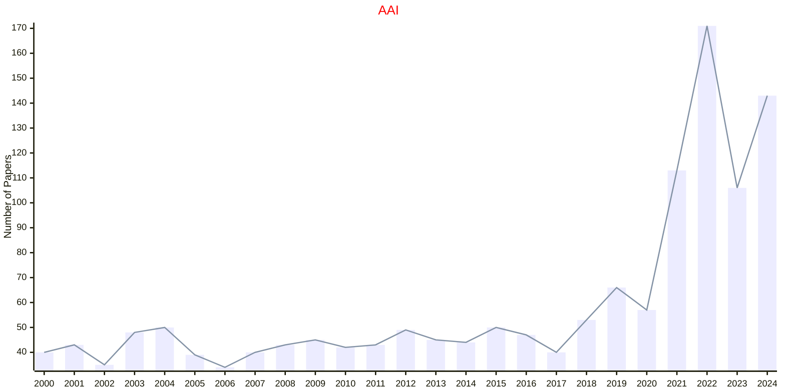

## CSCI

|Publishers|Full/Homepage|Abbr/About|Acronym/Issues|Period/DBLP|Top/Early|CCF|CAS|JCR|IF|Keywords/Google|
|-         |-            |-         |-             |-          |-        |-  |-  |-  |- |-              |
|[TAYLOR](https://www.tandfonline.com/)|[Connection Science](https://www.tandfonline.com/journals/ccos20)|[Connect. Sci.](https://www.tandfonline.com/journals/ccos20/about-this-journal#aims-and-scope)|[CSCI](https://www.tandfonline.com/loi/ccos20)|1989 -|False|C|3|Q2|3.3|[Artificial Intelligence](https://www.google.com/search?q=Artificial+Intelligence); [Evolutionary Computation](https://www.google.com/search?q=Evolutionary+Computation)|

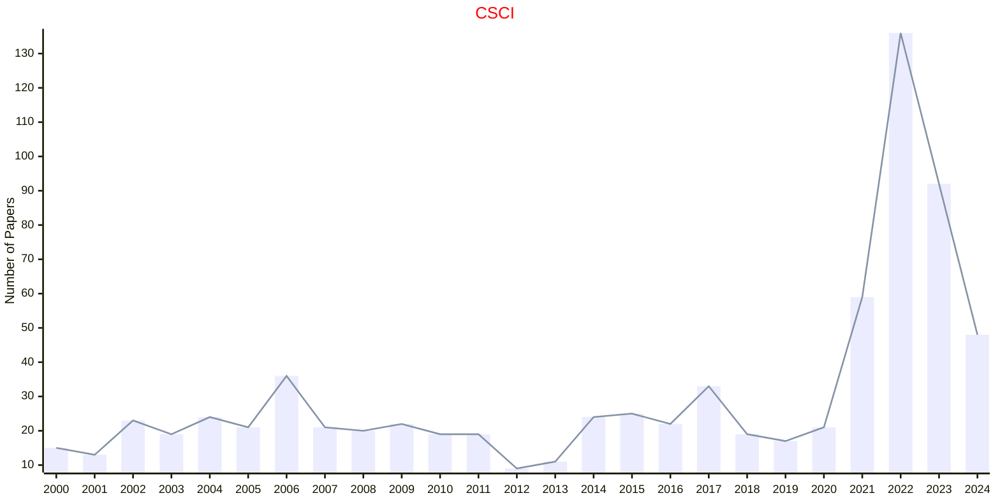

## CYBS

|Publishers|Full/Homepage|Abbr/About|Acronym/Issues|Period/DBLP|Top/Early|CCF|CAS|JCR|IF|Keywords/Google|
|-         |-            |-         |-             |-          |-        |-  |-  |-  |- |-              |
|[TAYLOR](https://www.tandfonline.com/)|[Cybernetics and Systems](https://www.tandfonline.com/journals/ucbs20)|[Cybern. Sci.](https://www.tandfonline.com/journals/ucbs20/about-this-journal#aims-and-scope)|[CYBS](https://www.tandfonline.com/loi/ucbs20)|1971 -|False|C|4|Q3|1.8|[Cybernetics](https://www.google.com/search?q=Cybernetics)|

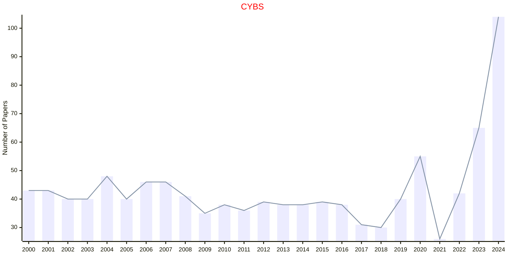

## ENGO

|Publishers|Full/Homepage|Abbr/About|Acronym/Issues|Period/DBLP|Top/Early|CCF|CAS|JCR|IF|Keywords/Google|
|-         |-            |-         |-             |-          |-        |-  |-  |-  |- |-              |
|[TAYLOR](https://www.tandfonline.com/)|[Engineering Optimization](https://www.tandfonline.com/journals/geno20)|[Eng. Optim.](https://www.tandfonline.com/journals/geno20/about-this-journal#aims-and-scope)|[ENGO](https://www.tandfonline.com/loi/geno20)|1974 -|False||4|Q2|2.5|[Quantitative Computational Methods](https://www.google.com/search?q=Quantitative+Computational+Methods)|

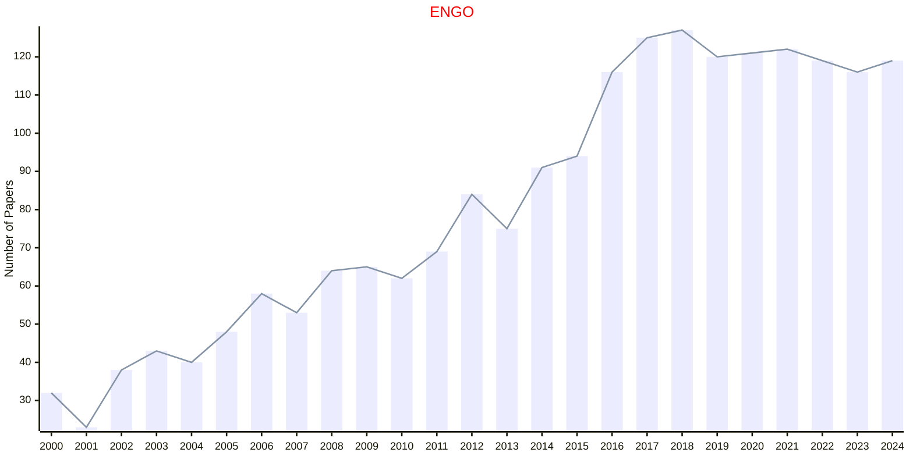

## IJCON

|Publishers|Full/Homepage|Abbr/About|Acronym/Issues|Period/DBLP|Top/Early|CCF|CAS|JCR|IF|Keywords/Google|
|-         |-            |-         |-             |-          |-        |-  |-  |-  |- |-              |
|[TAYLOR](https://www.tandfonline.com/)|[International Journal of Control](https://www.tandfonline.com/journals/tcon20)|[Int. J. Control](https://www.tandfonline.com/journals/tcon20/about-this-journal#aims-and-scope)|[IJCON](https://www.tandfonline.com/loi/tcon20)|1965 -|False||4|Q3|1.9|[Control and Automation](https://www.google.com/search?q=Control+and+Automation)|

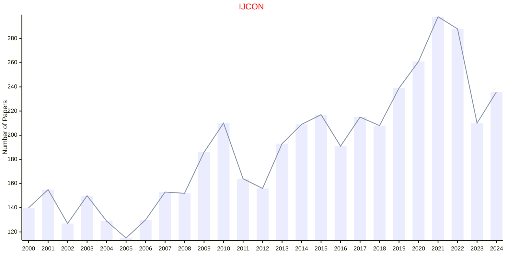

## IJSS

|Publishers|Full/Homepage|Abbr/About|Acronym/Issues|Period/DBLP|Top/Early|CCF|CAS|JCR|IF|Keywords/Google|
|-         |-            |-         |-             |-          |-        |-  |-  |-  |- |-              |
|[TAYLOR](https://www.tandfonline.com/)|[International Journal of Systems Science](https://www.tandfonline.com/journals/tsys20)|[Int. J. Syst. Sci.](https://www.tandfonline.com/journals/tsys20/about-this-journal#aims-and-scope)|[IJSS](https://www.tandfonline.com/loi/tsys20)|1970 -|False||4|Q1|3.6|[Intelligent Systems](https://www.google.com/search?q=Intelligent+Systems)|

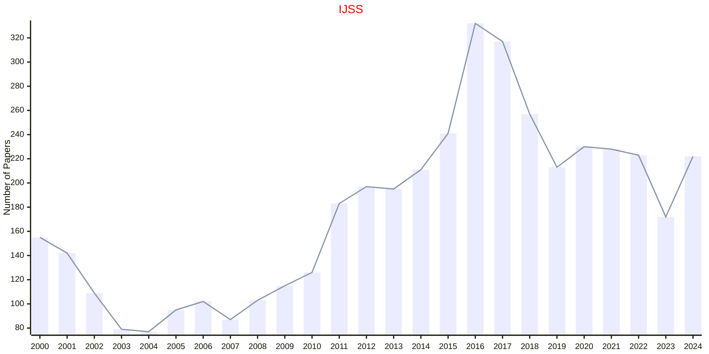

## JASA

|Publishers|Full/Homepage|Abbr/About|Acronym/Issues|Period/DBLP|Top/Early|CCF|CAS|JCR|IF|Keywords/Google|
|-         |-            |-         |-             |-          |-        |-  |-  |-  |- |-              |
|[TAYLOR](https://www.tandfonline.com/)|[Journal of the American Statistical Association](https://www.tandfonline.com/journals/uasa20)|[J. Am. Stat. Assoc.](https://www.tandfonline.com/journals/uasa20/about-this-journal#aims-and-scope)|[JASA](https://www.tandfonline.com/loi/uasa20)|1888 -|True||2|Q1|4.8|[Probability and Statistics](https://www.google.com/search?q=Probability+and+Statistics)|

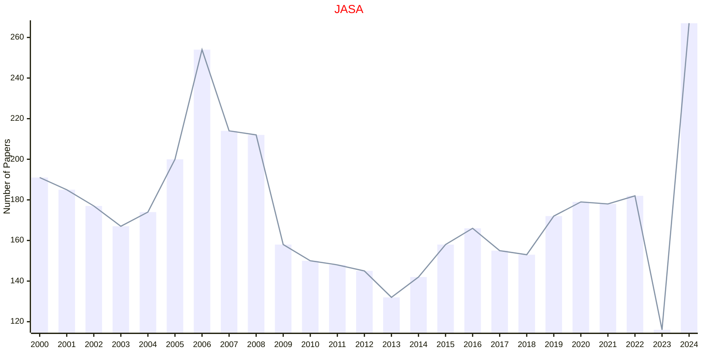

## JBES

|Publishers|Full/Homepage|Abbr/About|Acronym/Issues|Period/DBLP|Top/Early|CCF|CAS|JCR|IF|Keywords/Google|
|-         |-            |-         |-             |-          |-        |-  |-  |-  |- |-              |
|[TAYLOR](https://www.tandfonline.com/)|[Journal of Business & Economic Statistics](https://www.tandfonline.com/journals/ubes20)|[J. Busin. Econ. Stat.](https://www.tandfonline.com/journals/ubes20/about-this-journal#aims-and-scope)|[JBES](https://www.tandfonline.com/loi/ubes20)|1983 -|False||2|Q1|5.1|[Applied Statistics](https://www.google.com/search?q=Applied+Statistics); [Business and Economic](https://www.google.com/search?q=Business+and+Economic)|

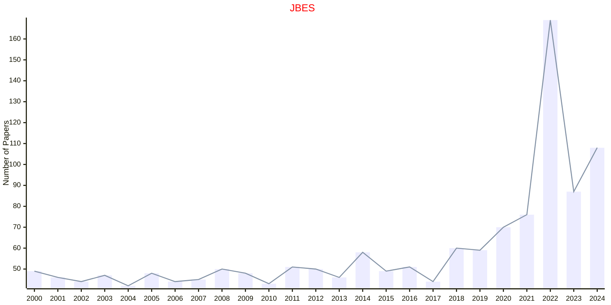

## JCGS

|Publishers|Full/Homepage|Abbr/About|Acronym/Issues|Period/DBLP|Top/Early|CCF|CAS|JCR|IF|Keywords/Google|
|-         |-            |-         |-             |-          |-        |-  |-  |-  |- |-              |
|[TAYLOR](https://www.tandfonline.com/)|[Journal of Computational and Graphical Statistics](https://www.tandfonline.com/journals/ucgs20)|[J. Comput. Graph. Stat.](https://www.tandfonline.com/journals/ucgs20/about-this-journal#aims-and-scope)|[JCGS](https://www.tandfonline.com/loi/ucgs20)|1992 -|False|||||[Applied Statistics](https://www.google.com/search?q=Applied+Statistics); [Computational Statistics](https://www.google.com/search?q=Computational+Statistics); [Graphical Statistics](https://www.google.com/search?q=Graphical+Statistics)|

## JEEE

|Publishers|Full/Homepage|Abbr/About|Acronym/Issues|Period/DBLP|Top/Early|CCF|CAS|JCR|IF|Keywords/Google|
|-         |-            |-         |-             |-          |-        |-  |-  |-  |- |-              |
|[TAYLOR](https://www.tandfonline.com/)|[Ethology Ecology And Evolution](https://www.tandfonline.com/journals/teee20)|[Ethol. Ecol. Evol.](https://www.tandfonline.com/journals/teee20/about-this-journal#aims-and-scope)|[JEEE](https://www.tandfonline.com/loi/teee20)|1967 -|False||4|Q3|1.3|[Animal behaviour](https://www.google.com/search?q=Animal+behaviour)|

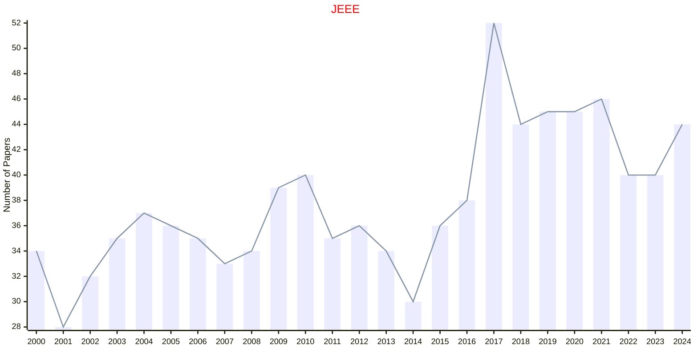

## JETAI

|Publishers|Full/Homepage|Abbr/About|Acronym/Issues|Period/DBLP|Top/Early|CCF|CAS|JCR|IF|Keywords/Google|
|-         |-            |-         |-             |-          |-        |-  |-  |-  |- |-              |
|[TAYLOR](https://www.tandfonline.com/)|[Journal of Experimental and Theoretical Artificial Intelligence](https://www.tandfonline.com/journals/teta20)|[J. Exp. Theor. Artif. Intell.](https://www.tandfonline.com/journals/teta20/about-this-journal#aims-and-scope)|[JETAI](https://www.tandfonline.com/loi/teta20)|1989 -|False|C|4|Q3|1.8|[Artificial Intelligence](https://www.google.com/search?q=Artificial+Intelligence)|

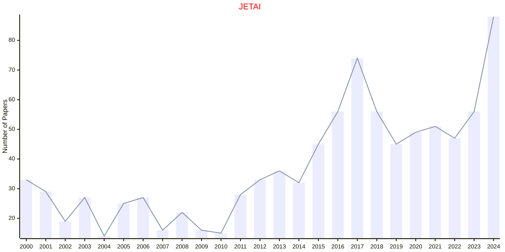

## JOAS

|Publishers|Full/Homepage|Abbr/About|Acronym/Issues|Period/DBLP|Top/Early|CCF|CAS|JCR|IF|Keywords/Google|
|-         |-            |-         |-             |-          |-        |-  |-  |-  |- |-              |
|[TAYLOR](https://www.tandfonline.com/)|[Journal of Applied Statistics](https://www.tandfonline.com/journals/cjas20)|[J. Appl. Stat.](https://www.tandfonline.com/journals/cjas20/about-this-journal#aims-and-scope)|[JOAS](https://www.tandfonline.com/loi/cjas20)|1974 -|False||4|Q3|1.5|[Applied Statistics](https://www.google.com/search?q=Applied+Statistics)|

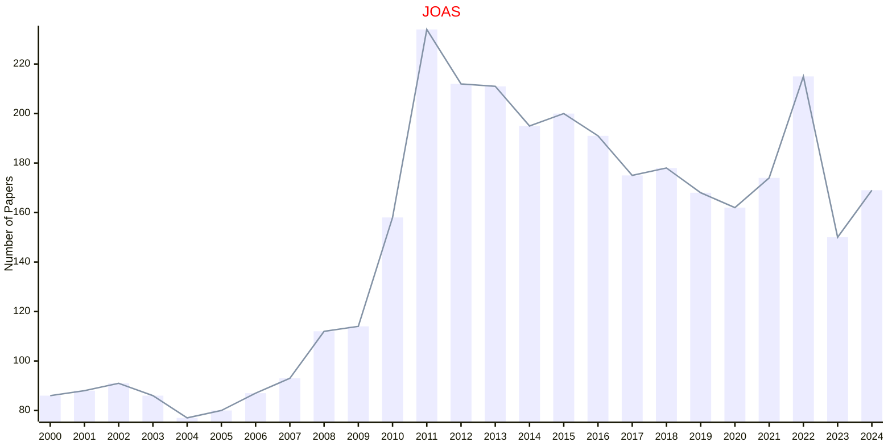

## NCNS

|Publishers|Full/Homepage|Abbr/About|Acronym/Issues|Period/DBLP|Top/Early|CCF|CAS|JCR|IF|Keywords/Google|
|-         |-            |-         |-             |-          |-        |-  |-  |-  |- |-              |
|[TAYLOR](https://www.tandfonline.com/)|[Network: Computation in Neural Systems](https://www.tandfonline.com/journals/inet20)|[Netw. Comput. Neural Syst.](https://www.tandfonline.com/journals/inet20/about-this-journal#aims-and-scope)|NCNS|1990 -|False||4|Q3|1.5|[Theoretical Neuroscience](https://www.google.com/search?q=Theoretical+Neuroscience)|

## OMS

|Publishers|Full/Homepage|Abbr/About|Acronym/Issues|Period/DBLP|Top/Early|CCF|CAS|JCR|IF|Keywords/Google|
|-         |-            |-         |-             |-          |-        |-  |-  |-  |- |-              |
|[TAYLOR](https://www.tandfonline.com/)|[Optimization Methods and Software](https://www.tandfonline.com/journals/goms20)|[Optim. Methods Softw.](https://www.tandfonline.com/journals/goms20/about-this-journal#aims-and-scope)|[OMS](https://www.tandfonline.com/loi/goms20)|1992 -|False||4|Q2|1.8|[Optimization Methods](https://www.google.com/search?q=Optimization+Methods)|

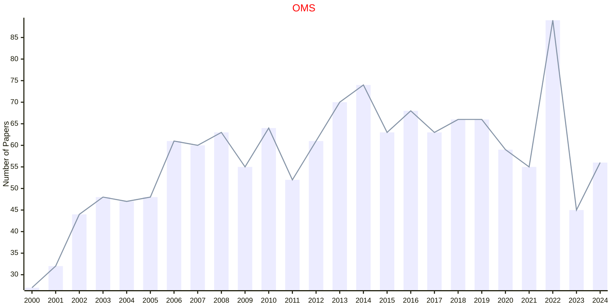

## OPTIM

|Publishers|Full/Homepage|Abbr/About|Acronym/Issues|Period/DBLP|Top/Early|CCF|CAS|JCR|IF|Keywords/Google|
|-         |-            |-         |-             |-          |-        |-  |-  |-  |- |-              |
|[TAYLOR](https://www.tandfonline.com/)|[Optimization](https://www.tandfonline.com/journals/gopt20)|[Optim.](https://www.tandfonline.com/journals/gopt20/about-this-journal#aims-and-scope)|[OPTIM](https://www.tandfonline.com/loi/gopt20)|1977 -|False||3|Q1|2.0|[Mathematical Programming](https://www.google.com/search?q=Mathematical+Programming); [Operations](https://www.google.com/search?q=Operations)|

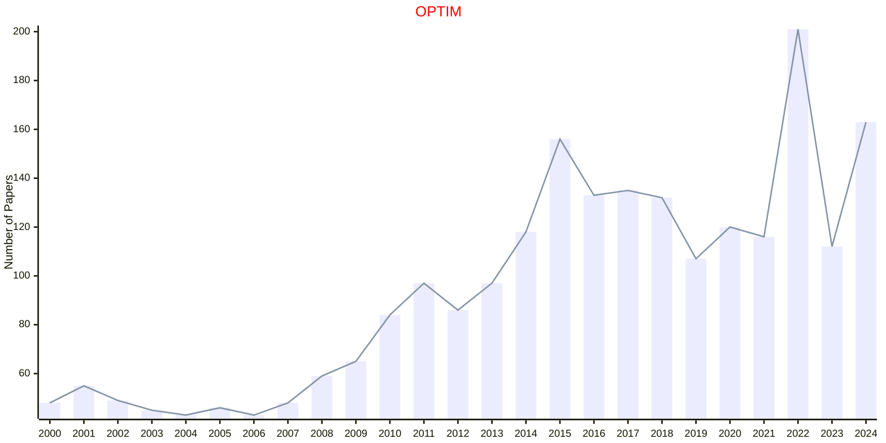

## TAS

|Publishers|Full/Homepage|Abbr/About|Acronym/Issues|Period/DBLP|Top/Early|CCF|CAS|JCR|IF|Keywords/Google|
|-         |-            |-         |-             |-          |-        |-  |-  |-  |- |-              |
|[TAYLOR](https://www.tandfonline.com/)|[The American Statistician](https://www.tandfonline.com/journals/utas20)|[Am. Stat.](https://www.tandfonline.com/journals/utas20/about-this-journal#aims-and-scope)|[TAS](https://www.tandfonline.com/loi/utas20)|1974 -|False|||||[Applied Statistics](https://www.google.com/search?q=Applied+Statistics)|

